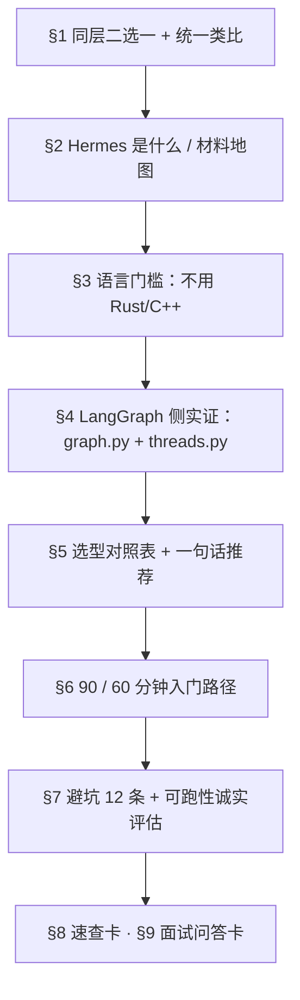

# 运行时选型对照卡 · LangGraph vs Hermes（D4 专题）

> **诚实标注**：本篇是「入口对照卡」（约 312 行），**不是完整专题**——按《专题创作指南》必达标准（1500–3000 行三层结构 + 每层面试卡 + ≥10 条避坑 + 至少一个统一类比），可在面试后扩写成完整版。指南中**未找到显式 "转正规则" 条款**，故此处凭"完整性差距"诚实标注。

## 目录

- [0. 前言：为什么这一层最容易选错](#0-前言为什么这一层最容易选错)
- [1. 它们在哪一层、什么关系](#1-它们在哪一层什么关系)
- [2. Hermes 到底是什么](#2-hermes-到底是什么你最不懂的部分)
- [3. 语言门槛：他会不会被迫学 Rust / C++](#3-语言门槛他会不会被迫学-rust--c)
- [4. LangGraph 侧的仓库实证](#4-langgraph-侧的仓库实证)
- [5. 选型建议](#5-选型建议)
- [6. D4 晚间 90 / 60 分钟入门路径](#6-d4-晚间-90--60-分钟入门路径仅本仓库内文件)
- [7. 零基础可跑性诚实评估](#7-零基础可跑性诚实评估)
- [8. 五分钟速查卡](#8-五分钟速查卡)
- [9. 面试问答卡](#9-面试问答卡-6-问含诚实答法)
- [附录 A · 中英对照术语表](#附录-a--中英对照术语表)
- [附录 B · 引用过的仓库文件](#附录-b--引用过的仓库文件仓库根相对全路径)

## 📍 本页定位

- 服务于 D4「L4 运行时选型」，承接 D2（记忆）、D3（RAG）已沉淀的"主循环 + Context"心智模型；为 D5 收尾（项目故事 + 选型题答法）准备弹药。
- 回答读者原始困惑：「LangGraph 和 Hermes 是不是用来编排 agent 的？我熟 LangGraph，但不懂 Hermes；而且我只会 Python，不会 C++ / Rust。」
- 一句话：**两者是同层（运行时/编排层）的两条路，默认二选一、不要叠两套循环**；Hermes 是 Python 可读的「完整 harness」，不是另一个图框架。

---

## 0. 前言：为什么这一层最容易选错

### 0.1 痛点开场（真实困惑）

「我熟 LangGraph，但不懂 Hermes；而且我只会 Python，不会 C++ / Rust。」——这是面试前一周最常见的迷惑：左手是熟练的图编排库，右手是听上去像黑科技的"完整 agent"，招聘 JD 又总爱把 LangChain / LangGraph 写进关键词。结果出现三种典型错觉：①"LangGraph 是入门，Hermes 是高级" → 错；②"Hermes 是基于 LangGraph 的二次封装" → 错（`08-hermes-agent/09-lang-serial-not/README.md:128-148` 实证 `pyproject.toml` 零命中）；③"Hermes 必然要求 Rust/C++" → 错（仓库内材料 + 教学 demo 全部 Python）。

### 0.2 对比表：选错的代价 vs 选对的收益

| 维度 | 选错（叠两套循环 / 凭语感选型） | 选对（同层二选一 + 能力挂载） |
|------|--------------------------------|--------------------------------|
| 编排骨架 | LangGraph StateGraph + 自己再写 while 控 Hermes 循环 → 双心跳、状态分裂 | 一套编排骨架 + 另一条的能力以 tool / middleware 形式挂上去 |
| Prompt Cache | 中途改 SP / 换 toolset → 缓存击穿、token 成本翻倍（`01-arch.md:167, 240-242`） | 稳定前缀冻结在 Session 启动；可变部分放消息侧或 tool result |
| 学习曲线 | 同时啃两套抽象 + 状态机迁移问题 | 主线一个、另一条作为参考路径背对照表 |
| 面试表达 | "我都用过"但讲不清取舍 | "我选 A 因为 X；我知道 B 是同层另一条" → 显得做过决策 |

### 0.3 失败模式 ASCII 图

```text
   失败模式 1：叠两套循环
   ─────────────────────────────
   LangGraph StateGraph (chat_node → tools_condition → ToolNode)
            └── 用户消息 ── 同时 ── Hermes 自研 while loop (run_conversation)
   结果：两条心跳各自 append messages、状态分裂、cache 反复击穿

   失败模式 2：照抄 demo 架构
   ─────────────────────────────
   Hermes demo run_agent_loop.py  → 100% 复刻到生产
            └── 缺：Session 冻结 SP、Memory Update、Cron、Gateway
   结果：能跑一周，生产环境崩在第 3 天

   失败模式 3：因为语言恐惧放弃 Hermes
   ─────────────────────────────
   "Hermes 一定用了 Rust"（仓库外传闻）
            └── 实际：仓库内 Hermes 全 Python；Rust/C++ 是 Qdrant/llama.cpp/TGI/Firecracker
   结果：白丢一条更轻量的对照路径
```

---

## 0.5 阅读导引：符号表 · 双模式阅读 · 学习路径

### 符号表

| 符号/术语 | 含义 | 本仓库出处 |
|---|---|---|
| **runtime（运行时）** | 拥有"循环 + 状态 + 工具 + 停机 + 人审"这五件的能力层 | 本文语境 = 六层栈 **L4** |
| **harness** | 装这些件的"盒子"：系统提示词组装、工具注册、权限、沙箱、日志 | 与 loop 的关系 = "盒子 vs 盒子里那根线" |
| **loop** | 一次 turn 内"调模型 → 看是否要工具 → 执行 → 回灌"的反复 | `08-hermes-agent\02-run-agent\hermes_src\agent\conversation_loop.py`（5355 行） |
| **turn / session** | turn = 一问一答（内含若干 loop 迭代）；session = 跨 turn 的长生命周期 | `08-hermes-agent\01-arch.md`；SP 在 session 启动时冻结 |
| **checkpointer / thread_id** | LangGraph 的状态持久化与线程标识 | `11-langgraph\02-Agentic-Chatbot-using-LangGraph\backend\threads.py`（10 行） |
| **interrupt / HITL** | 图内中断 + 人审放行 | `11-langgraph\02-Agentic-Chatbot-using-LangGraph\frontend\hitl.py`（183 行） |
| **iteration budget / grace call** | 迭代预算，以及"超预算后允许的最后一次调用" | `08-hermes-agent\02-run-agent\hermes_src\agent\iteration_budget.py`（62 行） |
| **handoff** | 子 Agent 之间移交控制权 | TripMate 的 flight → hotel → itinerary → final |
| **toolset / registry** | 工具集合与注册表（循环只消费 schema） | `08-hermes-agent\hermes-study\tools\registry.py`（801 行） |
| **skill** | 让 Agent 自己执行流程的"提示词包"（≠ tool） | `14-deepseek-harness\01.arch.md` 的 Tool vs Skill 对照 |

### 双模式阅读

- **快速模式（面试前 3 天，20 分钟）**：只读 §1.1 结论、§5.1 对照表、§7.1 避坑清单、§8 五分钟速查卡、§9 面试问答卡。
  目标：**每层能答一句话 + 能说出"为什么不选另一个"**。
- **深入模式（真要把源码读懂，3–4 小时）**：按 §6.1 的 90 分钟档读仓库材料 → 再逐行读 §4.2 的 `graph.py` → 最后对照 `conversation_loop.py` 的主循环段。
  目标：**能指着文件说清"循环在哪、状态存哪、人审怎么接"**。

### 学习路径



---

## 1. 它们在哪一层、什么关系

> **统一类比（贯穿全文）**：LangGraph 与 Hermes 是**同一层的两台发动机**——LangGraph 是**给你零件**的发动机厂（图编排库，你装 State / Node / Edge，它帮你跑）；Hermes 是**整车**（成品 harness，循环 + SP 组装 + Tools + Skills + Memory + Gateway + Cron + Eval 全部预装）。你可以**只用零件**自己装（LangGraph），也可以**直接开走**整车（Hermes），但**不要在车上再加一台发动机**——那是叠两套循环的下场（§0.3 失败模式 1）。下文每个对照（控制流 / 持久化 / HITL / 记忆 / 语言）都回到这个类比。

### 1.1 同层二选一（结论）

LangGraph 与 Hermes **都在"运行时/编排层"，解决同一类问题**：消息进来 → 拼上下文 → 调模型 → 看是否调工具 → 执行 → 回灌 → 终止。把"图编排"和"harness"理解为上下两层是常见的画错。

仓库证据（本文件第 9 问附引用）：**`08-hermes-agent/09-lang-serial-not/README.md` 第 23–48 行** 给出总览图 `两条编排路径：概念等价、实现不同`——左路是 `Chain/Graph 抽象 → ToolNode/AgentExecutor → Checkpoint/State → LangSmith`，右路是 `run_agent while loop → registry+handle_function_call → Session DB+compression → agent.log/gateway/plugins`；并写明"Hermes 用了 LangGraph 吗？**没有**"。同文件第 188–201 行给伪代码 `while 未超迭代预算 and 未中断: response = client.chat.completions.create(messages, tools=schemas)` ——这与 LangGraph `StateGraph` 的 `START → chat_node → tools_condition → ToolNode → chat_node`（见 `11-langgraph/02-Agentic-Chatbot-using-LangGraph/backend/graph.py:73–80`）是**同一控制流**的两种实现。

### 1.2 为什么"编排"和"harness"容易被画成上下两层

仓库中两处表述让人误以为"harness 包编排"：

1. `14-deepseek-harness/01.arch.md:103–128` 把 Harness 拆为 `Loop / 模型适配器 / 工具注册表 / Prompt 组装 / Session 日志` 五块——容易读成"Loop ⊂ Harness"。
2. `13-pi-agent/01-arch.md:5–42` 把 Pi 拆为 `Agent Core（loop）+ Interactive（CLI/TUI/扩展）`——容易读成"Core ⊂ harness"。

但这两个图都在做**模块分层**，不是**层间依赖**。Harness 是"装这些东西的盒子"，Loop 是盒子里跑的那根线；二者都在运行时层内部互相依赖。把 Hermes 当成"上面盖在 LangGraph 之上的应用"是错位——它根本不依赖 LangGraph（`09-lang-serial-not/README.md:126–148` 明示其 `pyproject.toml`（该 README §3.1 引用）无 `langgraph`，仓库 `*.py`/`*.ts` 中 `from langgraph / import langgraph` **零命中**）。

### 1.3 关系图（同一层、两条路）

```text
            同一类问题：LLM → Tool → Observe → 再调
                          │
            ┌─────────────┴─────────────┐
            │                           │
   LangGraph 路径                  Hermes 路径
   ─────────────                   ──────────
   StateGraph + 节点/边            run_agent.py while loop
   ToolNode / tools_condition      registry + handle_function_call
   Checkpointer (SqliteSaver)      Session DB + compression
   LangSmith 等观测                agent.log / gateway / plugins
   依赖 langgraph / langchain      依赖 openai SDK + 自研循环
```

> 备注：两条路径可以**叠加用 LangChain 的积木**（retriever、prompt template），但**编排骨架只能选一个**——这是同层的硬约束。

---

### 1.4 因果链：选型的依赖顺序（谁是谁的前提）

```
业务形态：终端里干活的编码 Agent？ vs 业务流程里的可恢复工作流？
   │  ① 决定"要不要可恢复 / 可打断"
   ▼
是否需要 持久化 + 可恢复 + 人审（HITL）
   │  ② 决定"骨架选谁"
   ├─ 要 → LangGraph 主场（checkpointer / interrupt / time travel 现成）
   └─ 不要 → Hermes 这类成品 harness 更省事（循环 / 工具 / 记忆 / 网关全预装）
            │  ③ 决定"状态放哪"
            ▼
        状态放哪：SQLite transcript？checkpointer？Markdown 三件套？
            │  ④ 决定"人审怎么接"
            ▼
        人审怎么接：图内 interrupt？审批队列 + 工具白名单？
```

> 面试用法：**先问业务形态，再谈框架品牌**。直接答"我用 LangGraph"会被追问"为什么不用成品 harness"；按这条链答，主动权在你。

### 1.5 选型决策树（30 秒版）

```
任务里有"人必须点确认"的动作吗？
  ├─ 有 ──→ LangGraph（interrupt + checkpointer 一条链解决）
  └─ 没有
       ├─ 要在既有业务流程里做分支 / 审批 / 可恢复 ──→ LangGraph
       └─ 就是让 Agent 在终端 / 文件系统里把活干完 ──→ Hermes（成品 harness）
             └─ 你只想看最小实现、打算自己写 ──→ 参考 waku（Python，95 行主循环）
```

---

## 2. Hermes 到底是什么（你最不懂的部分）

### 2.1 一句话定位

**Hermes 是成品 coding agent / 完整 harness**，自带循环、系统提示组装、工具注册、skills、记忆、权限、沙箱、评测，**不是一个库**；它和 LangGraph（"你自己定义 State / 节点 / 边"的图编排库）的本质差别 = "应用 vs 框架"。

### 2.2 本仓库里 Hermes 相关材料的完整地图

| 路径 | 总行数 | 这是什么 | 优先级 |
|------|--------|---------|--------|
| `08-hermes-agent/01-arch.md` | 657 | **Hermes 鸟瞰**：Bird's-eye view、Agent Loop、Context（Session 冻结 vs Turn 组装）、Compression、Gateway、Memory、Cron | ★★★★★ D4 主读 |
| `08-hermes-agent/02-run-agent/README.md` | 248 | **主循环 + 调用流程**：1 个 turn = N 次 while 迭代；预算/grace call；todo 截胡 vs registry 分发 | ★★★★★ |
| `08-hermes-agent/02-run-agent/demo/` | — | **可跑通教学 demo**（DeepSeek API，需要 key） | ★★★★ |
| `08-hermes-agent/01-memory/` | — | Memory/压缩/Prompt Cache 三件套（notebooks + hermes_src 剪枝） | ★★★（D2 已铺） |
| `08-hermes-agent/03-hermes Agent  学习大纲.md` | 319 | **2~3 周学习路径**：模块一 Memory → 模块二 Eval → 模块三 主循环 → 模块四 环境 → 模块五 Sandbox → 收尾 | ★★★★★ 面试规划 |
| `08-hermes-agent/03-eval/` | — | 不变量断言 + trace 分析；`hermes_src/tests/agent/test_prompt_caching.py` 是课堂主文件 | ★★★ |
| `08-hermes-agent/04-prompt/` | — | Prompt Assembly 讲稿与 catalog（宏、Curator、Goals/Judge 等） | ★★ |
| `08-hermes-agent/05-env/` | — | 执行环境抽象（local/docker/ssh/modal/daytona/singularity） | ★★★ |
| `08-hermes-agent/06-cron/` | — | 定时任务：jobs.json + 每分钟 tick + Home Channel 投递 | ★★ |
| `08-hermes-agent/07-mem-provider/` | — | MemoryProvider ABC（sync_turn / prefetch / shutdown）；与 mem0/Honcho/SuperMemory 接线 | ★★ |
| `08-hermes-agent/08-gateway/` | — | 多渠道（Telegram/Email/Slack/Discord/WA/SMS）→ 同一 Agent Turn；session key + 双层守卫 + Home/Cron 投递 | ★★★ |
| `08-hermes-agent/09-lang-serial-not/README.md` | 352 | **本对照卡的直接母本**：证明"生产级 Agent 可零依赖 LC/LG" | ★★★★★ D4 主读 |
| `12-hermes-agent-small/README.md` | 267 | **waku-agent**：本地优先个人助手，1/100 代码量的精简实现，四大支柱（Gateway/Working Memory/Loop/Memory/Ops）；SQLite+JSONL 落 `.waku/state.db` | ★★★★ |
| `12-hermes-agent-small/docs/architecture.md` | 102 | 白板图：每个盒子都对应文件路径；强调 `retrieval_gate + consolidation` 的批处理设计 | ★★★★ |
| `12-hermes-agent-small/learn_guide.md` | 608 | 0 环境跑通 → 1 Harness → 2 Loop → 3 Memory → 4 Eval；约 95 行 while 循环（`waku/loop/agent.py`） | ★★★★ |
| `13-pi-agent/00-learn-guide.md` | 345 | Pi 上手指南：会话是树（`/tree` 分叉、`/fork`/`/clone` 新文件）；Prompt 是栈（SYSTEM.md 替换 + APPEND_SYSTEM.md 追加 + AGENTS/CLAUDE.md） | ★★★ |
| `13-pi-agent/01-arch.md` | 1039 | Pi 架构全解析：Core = agent loop、Interactive = CLI/TUI/扩展；**用 TypeScript 而非 Python**（理由：jiti 热加载 + TUI + 扩展同语言） | ★★★ |
| `14-deepseek-harness/01.arch.md` | 296 | DeepSeek Harness 架构：模型=租的、Harness=自己的；提出 **code vs config** 分水岭——Agent 自己改配置 vs 自己改代码 | ★★★ |

> **怎么读**（D4 优先级）：先 `09-lang-serial-not/README.md`（352 行，整篇读）→ `08-hermes-agent\02-run-agent\README.md` + `01-arch.md` §1–§4（约 250 行）→ `12-hermes-agent-small/README.md` + `12-hermes-agent-small\docs\architecture.md`（369 行）→ `13-pi-agent/00-learn-guide.md` + `01-arch.md` §1 + §11（约 200 行）→ `14-deepseek-harness/01.arch.md` 前 180 行。**不要先啃 1039 行的 pi 架构全解析**，那是 D5 之后的深读材料。

---

## 3. 语言门槛：他会不会被迫学 Rust / C++

### 3.1 结论（基于仓库证据）

**不会**。本仓库里所有 Hermes 系材料、教程代码、可跑 demo 都是 **Python**；六层栈里**确有 Rust/C++ 实现的组件**（如 Qdrant 向量库、llama.cpp、TGI、Firecracker 沙箱），但它们是**当服务/二进制来用**（通过 HTTP/CLI 调用），**不需要改它们的源码**。

### 3.2 证据

1. **`08-hermes-agent/` 仓库的官方实现 = Python**：所有 demo 入口是 `python run_agent_loop.py` / `python run_eval_suite.py` / `python run_mem_provider.py`；hermes_src 剪枝全是 `.py`（`hermes_src/agent/conversation_loop.py` 等）。
2. **`12-hermes-agent-small/`（waku-agent）= Python**：`12-hermes-agent-small\pyproject.toml` + `waku/` 全是 `.py`；README §"快速开始" 写 `uv venv && uv pip install -e .`，核心循环就是约 95 行 Python `while`（`learn_guide.md` 第 168–194 行：`START → REASON → HAS → ACT → OBS → GUARD → REPLY`）。
3. **`09-lang-serial-not/README.md` 第 128–135 行**：Hermes 的 `pyproject.toml` 核心 `dependencies` 含 `openai==2.24.0 / httpx / pydantic / fastapi`，**没有** `langchain / langgraph / langsmith / llama-index / crewai / autogen`。
4. **Pi（13-pi-agent）才是 TypeScript**：仓库 packages/agent/src/agent-loop.ts（Pi 上游 TS 源码，非本仓库文件）、扩展用 jiti 加载 `.ts`、TUI 自研；但你**不需要碰它**——`13-pi-agent/01-arch.md:1016–1018` 明示"需要 Python 时走 RPC，不重写核心"，`pi --mode rpc` 用 stdin/stdout JSONL，Python 当调用方，TS 当 harness。
5. **真需要打交道的"非 Python"层都是二进制服务**：

| 组件 | 实现 | 你的接触面 |
|------|------|------------|
| Qdrant 向量库 | Rust | HTTP `POST /collections/.../points/search` |
| llama.cpp | C++ | CLI `./llama-server` + HTTP `POST /completion` |
| TGI（Text Generation Inference） | Rust | HTTP `/generate` |
| Firecracker 沙箱 | Rust | CLI `firecracker --api-sock` + JSON 配置 |
| `08-hermes-agent/05-env/notes/` 中的 docker/ssh/modal/daytona | 各家混合 | 走 `BaseEnvironment.execute` 抽象，Python 调 |

> **面试话术**（被问到 Rust/C++ 时，诚实且不吃亏）：
>
> > 我把向量检索/沙箱这些底层当服务用（Qdrant HTTP、Firecracker CLI），仓库里跑 demo 都是 Python。我清楚 `BaseEnvironment.execute` 这类抽象是为了把"用什么隔离"和"循环怎么转"解耦，所以换底层后端不需要改 runtime 循环。Hermes 自研路径里这些层都是可替换的"积木"，不是核心代码。

---

## 4. LangGraph 侧的仓库实证

### 4.1 `11-langgraph/` 三个项目能证明什么

| 项目 | 关键文件 | 证明能力 |
|------|---------|----------|
| `01-project-Complete-Agentic-AI-Course`（含 04-LangGraph-Code 子目录，14 个 ipynb） | `1_Temperature_Conversion_workflow.ipynb … 14-checkpoint_score.ipynb` | **StateGraph 完整动作**：节点/边/分支/HITL `interrupt`/子图/persistence/Guardrails（这是你最熟的一侧） |
| `02-Agentic-Chatbot-using-LangGraph` | `backend/graph.py`（80 行）+ `threads.py`（10 行）+ `frontend/hitl.py` | **可跑通的成品**：DeepSeek + Tavily + BGE + SQLite checkpointer + Streamlit + HITL 审批 |
| `03-project-TripMate-AI-A-Multi-Agent-Travel-Planner-with-LangGraph` | `backend/graph.py` + `backend/state.py` + `backend/agents/{flight,hotel,itinerary,final}.py` | **多智能体协同**：flight/hotel/itinerary 三个子 agent 收口到 final agent |

### 4.2 `backend/graph.py` + `threads.py` 体现的 StateGraph + checkpointer（80 行 = 你已有的知识）

```python
# backend/graph.py:21-80（精简）
class ChatState(TypedDict):
    messages: Annotated[list[BaseMessage], add_messages]   # 累加式消息状态

def chat_node(state: ChatState):
    system_message = SystemMessage(content="...tool usage instructions...")
    response = llm_with_tools.invoke([system_message, *state["messages"]])
    return {"messages": [response]}

tool_node = ToolNode(tools)
conn = sqlite3.connect(database=str(CHATBOT_DB_PATH), check_same_thread=False)
checkpoint = SqliteSaver(conn)

graph = StateGraph(ChatState)
graph.add_node("chat_node", chat_node)
graph.add_node("tools", tool_node)
graph.add_edge(START, "chat_node")
graph.add_conditional_edges("chat_node", tools_condition)   # 有 tool_calls → tools
graph.add_edge("tools", "chat_node")                       # 回灌 → 再思考
chatbot = graph.compile(checkpointer=checkpoint)
```

```python
# backend/threads.py（10 行全文）
from backend.graph import checkpoint
def get_all_threads() -> list:
    all_threads = set()
    for ckpt in checkpoint.list(None):
        all_threads.add(ckpt.config["configurable"]["thread_id"])
    return list(all_threads)
```

**三句话讲清**（用你已有的知识迁移）：
1. **状态图 = `TypedDict + add_messages`**：每步 append 一条 message，自动累加；`chat_node` 读 state、生成 assistant message，`ToolNode` 接 tool_call、返回 tool message。
2. **路由 = `tools_condition` + 条件边**：模型不调工具 → 收尾；调工具 → 进 `tools` → 回 `chat_node`，这是 LangGraph 的"内循环"，等价于 Hermes `while not tool_calls`。
3. **持久化 = `SqliteSaver + thread_id`**：`chatbot.stream({...}, config={"configurable": {"thread_id": "..."}})` 是入口；`threads.py` 用 `checkpoint.list(None)` 反查所有 thread_id 做侧边栏会话切换——这与 Hermes 的 `SessionDB`（见 `01-arch.md` §6.2 SQLite transcript）同构。

---

## 5. 选型建议（对照表 + 一句话推荐）

### 5.1 对照表

| 维度 | **LangGraph**（图编排库） | **Hermes**（完整 harness） |
|------|---------------------------|------------------------------|
| **是什么** | 库：你定义 State / Node / Edge，库负责跑图 | 产品级 Agent：自带循环、SP 组装、工具注册、Skills、Memory、Cron、Gateway、Eval |
| **自带什么** | StateGraph / Node / Edge / Checkpointer / interrupt / subgraph / LangSmith 集成 | Agent Loop（`run_conversation`）/ Session 冻结 SP / 双层 Memory / 自建分钟级 Cron / 多渠道 Gateway / Trace + Eval |
| **你还要写什么** | 自己写：模型 client、tool schema、system prompt 组装、记忆策略、压缩、可观测、cron、多端 | 自己写：业务 tool（`tools/*.py` 注册即可）、业务 skill（Markdown）、Project Context（`.hermes.md` 或 `08-hermes-agent\hermes-study\AGENTS.md`） |
| **适合什么场景** | 多步决策 + 审批流 + 多分支 + 复杂状态管理 + 需要可视化图 | 个人助手 / 长会话 / 多渠道接入 / 端云协同 / 严肃产品工程 |
| **本仓库实证文件** | `11-langgraph/02-Agentic-Chatbot-using-LangGraph/backend/{graph.py,threads.py}`（80 + 10 行） | `08-hermes-agent/{01-arch.md,02-run-agent/,09-lang-serial-not/}` + `12-hermes-agent-small/{README.md,docs/architecture.md}` |
| **面试怎么用** | "我用 `StateGraph` + `SqliteSaver` 做过 X，HITL 用 `interrupt`/`Command(resume=...)` 实现审批" | "我读过 `08-hermes-agent/02-run-agent/README.md`，知道自研 loop 与 LangGraph 是同一控制流的两种实现" |
| **依赖** | `langgraph` + 几乎必带 `langchain` | **不依赖** LC/LG；Hermes 的 `pyproject.toml` 只见 `openai==2.24.0` 等 |
| **学习曲线** | State 图建模有学习成本；简单问答/单次 tool call 显得过重 | 入口简单（CLI 直聊），但要做透记忆/压缩/Gateway/Cron 需 2~3 周 |

### 5.2 推荐（一句话）

> **中小企业 / RAG-Agent 方向**：**首选 LangGraph 做业务编排（多步决策 + 审批 + 状态管理是日常）；再单独引入 Hermes 风格的人设/记忆分层作为"长期记忆 + 人格"模块**。**不要**叠两套循环——选一条编排骨架（LangGraph 或 Hermes 自研），把另一条的能力作为工具/中间件挂上去。

---

## 6. D4 晚间 90 / 60 分钟入门路径（仅本仓库内文件）

> 时间盒：**90 分钟档**全读；**60 分钟档**跳过 *标★* 的"只读"小节。

### 6.1 90 分钟档（全读）

| 顺序 | 时间 | 文件（绝对路径，相对仓库根 `08-hermes-agent/`、`12-hermes-agent-small/`） | 行数 | 读哪几节 |
|------|------|---------|------|----------|
| 1 | 0–15 min | `08-hermes-agent/09-lang-serial-not/README.md` | 352 | **全文**（结论表→伪代码→选型图→面试词→对照表） |
| 2 | 15–40 min | `08-hermes-agent/01-arch.md` | 657 | §1 鸟瞰（1–84 行）→ §2 Agent Loop（86–117 行）→ §3 Context（120–250 行） |
| 3 | 40–60 min | `08-hermes-agent/02-run-agent/README.md` | 248 | **全文**（call flow → role 时序 → 退出条件） |
| 4 | 60–75 min | `12-hermes-agent-small/docs/architecture.md` | 102 | **全文**（白板图 + "Design decisions worth stealing"） |
| 5 | 75–90 min | `12-hermes-agent-small/README.md` | 267 | §快速开始（17–53 行）+ §架构（55–104 行）+ §Loop·Tools（128–160 行） |

### 6.2 60 分钟档（压缩版）

| 顺序 | 时间 | 文件 | 行数 | 读哪几节 |
|------|------|------|------|----------|
| 1 | 0–20 min | `08-hermes-agent/09-lang-serial-not/README.md` | 352 | §1–§4（1–243 行）+ §7 概念对照表（289–336 行） |
| 2 | 20–45 min | `08-hermes-agent/01-arch.md` | 657 | §1（1–84 行）+ §2（86–117 行） |
| 3 | 45–60 min | `12-hermes-agent-small/README.md` | 267 | §快速开始（17–53 行）+ §架构（55–104 行） |

### 6.3 何时该升档到 1039 行的 `13-pi-agent/01-arch.md`

只有当面试官追问"Pi 的 session 是树 / extensions 是 jiti 热加载 / compaction 的摘要结构"时才读；D4 入门**不推荐**。

---

## 7. 零基础可跑性诚实评估

> 标注说明：**✅ 已实测可跑**（来自仓库 README 指令）；**⚠ 需要 key**（DeepSeek / Tavily 等）；**📦 需要 Docker / WSL / 网络**；**📖 只读**（理论学习）。

| 任务 | 文件 | 类别 | 备注 |
|------|------|------|------|
| 读 Hermes 鸟瞰 | `08-hermes-agent/01-arch.md` | 📖 只读 | 纯文档 |
| 跑 Hermes 主循环 demo | `08-hermes-agent/02-run-agent/demo/run_agent_loop.py` | ⚠ 需要 DeepSeek key | README 写 `python run_agent_loop.py`，可重跑 `log.txt` |
| 跑 Memory demo | `08-hermes-agent/01-memory/demo/run_turn_context.py` | ⚠ 需要 key | README 指引 |
| 跑 Eval demo（无需 key） | `08-hermes-agent/03-eval/demo/` | ⚠ 部分需 key（fixtures 离线可） | `demo/README.md:122` 标"无需 API Key" |
| 跑 waku-agent CLI | `12-hermes-agent-small/` | ⚠ 需要 `WAKU_PROVIDER + API_KEY` | `uv venv && uv pip install -e . && cp .env.example .env`，详见 `README.md:33–53` |
| 跑 waku dashboard | 同上 | ⚠ 需要 key | `uv run waku dashboard` → `localhost:7777` |
| 跑 Pi CLI | `13-pi-agent/`（仓库内为教程 README，源码未入仓） | 📖 只读，跑法未验证 | 路径引用 `D:\workspace\doc\面试狂魔\人工智能面试题\pi`，本仓库不可跑 |
| 跑 DeepSeek Harness | `14-deepseek-harness/01.arch.md` | 📖 只读 | 仅一篇架构笔记，无代码 |
| **跑 LangGraph 成品** | `11-langgraph/02-Agentic-Chatbot-using-LangGraph/` | ⚠ 需要 `DEEPSEEK_API_KEY` + `TAVILY_API_KEY` | README §Quick Start：`pip install -r requirements.txt` → `python -m streamlit run app.py` → 浏览器 `http://127.0.0.1:8501` |
| 跑 TripMate 多智能体 | `11-langgraph/03-project-TripMate-...` | ⚠ 需要 key | README 未在本任务读，读法未验证 |
| 读 LangGraph 4.1 graph.py | `11-langgraph/02-Agentic-Chatbot-using-LangGraph/backend/graph.py` | 📖 只读，80 行 | 你已有的知识迁移（见 §4.2） |
| 读 LangGraph threads.py | 同上 `backend/threads.py` | 📖 只读，10 行 | "侧边栏会话列表怎么来"的最短实现 |

### 7.1 避坑清单（≥10 条）

| # | ❌ 坑 | 表现 | 原因 | 解决 |
|---|--------|------|------|------|
| 1 | **叠两套循环** | LangGraph StateGraph 与自研 while 同时 append messages、状态分裂 | 以为"两套能互补"——实际两条心跳抢同一份 transcript | 同层二选一做编排骨架；另一条的能力以 tool / middleware 形式挂上去 |
| 2 | **中途改 System Prompt** | prompt cache 反复击穿、token 成本翻倍 | 没看清 SP 是 Session 启动时冻结的快照（`01-arch.md:167, 240-242`） | 稳定前缀冻结在 Session 启动；可变部分放消息侧或 tool result |
| 3 | **凭语感说"Hermes 是基于 LC 的二次封装"** | 面试当场被反问挂掉 | 仓库 `pyproject.toml` 零命中 LC/LG（`09-lang-serial-not/README.md:128-148`） | 答"自研路径，依赖 `openai SDK`，与 LC/LG 同层不同路" |
| 4 | **以为 Hermes 一定涉及 Rust/C++** | 看到 Firecracker / Qdrant 字眼就劝退 | 混淆了"Harness 用了 X 的服务"与"Harness 用 X 写的" | Rust/C++ 组件都当服务/二进制调（HTTP / CLI），无需改源码 |
| 5 | **照抄 demo 100% 复刻到生产** | demo 跑通 1 周 → 生产第 3 天崩 | demo 只跑 while + 部分 tools；缺 Session 冻结 SP / Memory Update / Cron / Gateway | 至少补：Session 启动冻结、transcript 落盘、可观测、错误退出码 |
| 6 | **memory 改了当内存** | 改完 `user.md` 等几分钟没生效 | Session 启动时已冻结 SP，中途写盘**不**刷新当前 SP（`01-arch.md:530-542`） | 写盘 ≠ 生效；要新 Session 才进 SP，或显式 rebuild |
| 7 | **用 LangGraph 写 SOP 串工具** | 自己糊一个 `add_edge(START → tool1 → tool2 → END)` 当工作流 | LangGraph 是循环 Agent 框架，**不是**任务编排 DAG 库（那是 Temporal / Airflow 的活） | 多步线性 SOP 用 Temporal / Airflow；只有"模型可能反复调工具"才用 LangGraph |
| 8 | **面试把 LangChain 当成必选框架** | 一问"你不用 LC 怎么做 Agent"就卡住 | 误以为"严肃 Agent 必然依赖 LC" | 背对照表（§8）；答"Hermes 证明严肃产品可零依赖 LC/LG；我两条路都能讲取舍" |
| 9 | **写"用过 Hermes"但讲不出 SOUL/user/memory 三件套** | 面试官追问 Session 冻结 vs Turn 组装就露馅 | 仓库材料没真读完 | D4 必读 `08-hermes-agent/01-arch.md:120-250` + `09-lang-serial-not/README.md:289-336` |
| 10 | **把"Pi 是 TypeScript"当成"学 Hermes 必须学 TS"** | 看到 Pi 仓库是 TS 就放弃整条 Hermes 路径 | 混淆了"参考实现用什么写"和"你用什么写" | Pi 走 RPC（stdin/stdout JSONL）即可被 Python 调用（`13-pi-agent/01-arch.md:1016-1018`） |
| 11 | **照搬 `pyproject.toml` 默认依赖到生产** | 引入一堆没用的 optional（`vector-stores-chroma` 等） | 没分清"runtime 必需"和"可选 skill 示例"（`09-lang-serial-not/README.md:128-135` 只 pin 必需） | 按 `09-lang-serial-not/README.md:150-159` 列依赖；可选 skill 走 extras |
| 12 | **读完 1039 行 `13-pi-agent/01-arch.md` 才发现不是入门档** | D4 晚间花 2h 啃一半、走偏 | Pi 是进阶档，session 树 / jiti / compaction 都是 Hermes 没的细节 | 按 §6 时间盒：90/60 分钟档内**不读** Pi；面试官追问再升档 |

> **诚实免责**：`13-pi-agent/` 与 `14-deepseek-harness/` 在本仓库内**只有文档**（无源码），跑法未验证；`08/12` 系 demo 大概率可跑（README 指令明确），但本人**未在 D4 时段实测**，写"能跑"前请先按 README 跑一遍 `python run_agent_loop.py` / `uv run waku`。

---

## 8. 五分钟速查卡

```
[LangGraph 是什么]  图编排库；你定义 State/Node/Edge；库帮你跑图 + checkpointer + interrupt + 子图。
[Hermes 是什么]    成品 coding agent；自带循环/SP 组装/Tools/Skills/Memory/Cron/Gateway/Eval；不依赖 LC/LG。
[同层关系]          同一层（运行时/编排）；解决同一类问题；默认二选一，不叠两套循环。
[关键差别]          LangGraph = 框架；Hermes = 应用 + 框架。
[控制流等价物]       LangGraph: chat_node → tools_condition → ToolNode → chat_node
                   Hermes   : while not tool_calls: client.chat.completions.create(...)
[状态/持久化等价物]  LangGraph: SqliteSaver + thread_id（threads.py）
                   Hermes  : Session DB + SQLite transcript（01-arch.md §6.2）
[HITL 等价物]       LangGraph: interrupt + Command(resume=...)
                   Hermes  : clarify / approval / gateway 审批命令（09-lang-serial-not §7）
[记忆分层等价物]     LangGraph: store / checkpointer
                   Hermes  : SOUL/user.md/memory.md（Session 冻结）+ SQLite transcript + 可选 External（mem0/Honcho/SuperMemory）
[语言门槛]           Hermes 系材料 = Python；Pi = TypeScript（无需碰，走 RPC）；Rust/C++ 组件 = 二进制服务（Qdrant/llama.cpp/TGI/Firecracker），HTTP/CLI 调。
[仓库实证]           LangGraph: 11-langgraph/02-Agentic-Chatbot-using-LangGraph/backend/{graph.py,threads.py} (80+10 行)
                   Hermes: 08-hermes-agent/02-run-agent/README.md + 01-arch.md + 09-lang-serial-not/README.md
                          12-hermes-agent-small/README.md + docs/architecture.md
[中小企业推荐]       LangGraph 做业务编排（多步+审批+状态），Hermes 风格做长期记忆/人格模块；不要叠两套循环。
```

---

## 9. 面试问答卡（≥6 问，含诚实答法）

### Q1. LangGraph 和 Hermes 是不是用来编排 agent 的？它们什么关系？

> **A**：是，都是运行时/编排层的两条路。仓库 `08-hermes-agent/09-lang-serial-not/README.md` 总览图明示"两条编排路径：概念等价、实现不同"。LangGraph 是图编排库，你定义 State/Node/Edge；Hermes 是完整 harness，自带循环、SP 组装、Tools、Skills、Memory、Cron、Gateway、Eval。我推荐**二选一做编排骨架**，另一条作为工具/中间件挂上去，不要叠两套循环。

### Q2. LangGraph 的核心抽象是什么？和 Hermes 的循环怎么对照？

> **A**：LangGraph 三件套 = `StateGraph`（TypedDict + 累加器）+ `Node/Edge`（含 `add_conditional_edges` 走分支）+ `Checkpointer`（`SqliteSaver`，按 `thread_id` 反查）。Hermes 等价物 = `run_conversation` while loop + `registry.handle_function_call` + Session DB + SQLite transcript。两者是**同一控制流**的两种实现：一个用图节点，一个用 while 循环。

### Q3. Hermes 用了 LangChain / LangGraph 吗？

> **A**：核心**没用**。`09-lang-serial-not/README.md` §3.1 明示 Hermes 的 `pyproject.toml` 核心依赖是 `openai==2.24.0 / httpx / pydantic / fastapi`，**没有** `langchain / langgraph / langsmith / llama-index / crewai / autogen`；§3.2 实证"在 `*.py`/`*.ts` 中检索 `from langgraph / import langgraph` → **零命中**"。LangChain 仅在可选 skill / 文档示例里出现（如 `optional-skills/mlops/chroma` 等的"如何接入 LC 生态"片段），不是 runtime 依赖。

### Q4. 你没用过 Hermes，怎么答？

> **A**：诚实答法——"我**读过** `08-hermes-agent` 的 9 个模块（特别是 `02-run-agent/README.md` 的 call flow 和 `09-lang-serial-not/README.md` 的对照），**没有**真在生产里跑过 Hermes 自研 loop；但我用 LangGraph 的 `StateGraph + SqliteSaver + interrupt` 实现了同类能力，对照表我会背（见 §8 速查卡）。如果团队让我用 Hermes 路径，我能读 `waku/loop/agent.py` 那种 95 行 Python while 循环把控制流接上。"——这种答法比硬背 API 更像做过真项目（参 `09-lang-serial-not/README.md` §6 面试怎么答）。

### Q5. 面试官追问 Hermes 的 Memory / Compression 怎么做？

> **A**：三层结构（`01-arch.md` §6）：① **Markdown 三件套** = `SOUL.md`（人格，HERMES_HOME）+ `user.md`（用户事实）+ `memory.md`（可复用知识），Session 启动时冻结进 SP，中途写盘**不**刷新当前 SP；② **SQLite transcript** = 每 Turn 落库（含 FTS）；③ **可选 External** = mem0 / Honcho / SuperMemory，按 Turn prefetch/sync。**Compression**（§4）默认 50% 触发；消息列表走"剪枝 → 定边界 → 结构化摘要 → 组装"，保留头尾压中间。

### Q6. 为什么 Prompt Cache 神圣？中途改 system prompt 会怎样？

> **A**：任何中途 mutate 上下文 / 换 toolset / 重建 system prompt 都会**击穿缓存、放大成本**——只有 Compression 是允许改上下文的例外（`01-arch.md` §3.2、§6.4、§7 都有强调）。面试答法："我会把'冻结的 stable 前缀'和'会变的工具面/历史'分开：稳定的东西 Session 启动时冻结进 SP 并复用；会变的放消息侧或 tool result 后挂，不动 SP。"

### Q7. Hermes 的 Session 和 Turn 是什么关系？为什么这个区分重要？

> **A**：**Session** = 一次连续对话容器（Desktop 一条对话 / CLI 一次聊天 / Gateway 同一个 `session_id`），**启动时**组装并**冻结** System Prompt，整段 transcript 挂同一 session。**Turn** = 用户发 1 条消息 → 跑完一整次 Loop（可含多次 Tool）→ 最终回复，**每轮** Build Context：复用已缓存的 SP + 追加消息历史。区分的关键：**写了 memory 要进当前 SP，必须新开 Session**——这是冻结快照的设计取舍。

### Q8. (Bonus) 如果面试官问"你不会 Rust/C++，怎么调向量库 / 沙箱？"

> **A**：当作服务/二进制调。Qdrant（Rust）→ HTTP `/points/search`；llama.cpp（C++）→ CLI + HTTP `/completion`；TGI（Rust）→ HTTP `/generate`；Firecracker（Rust）→ CLI + JSON 配置。仓库里 Hermes 的 `BaseEnvironment.execute` 抽象就是为这件事设计的——把"用什么隔离"和"循环怎么转"解耦，换底层后端不需要改 runtime。

---

## 附录 A · 中英对照术语表

| EN | 中文 | 一句话解释 | 出处 |
|----|------|------------|------|
| **agent loop / agentic loop** | 智能体主循环 | 用户消息→拼上下文→调模型→看是否调工具→执行→回灌→终止 的 while | `08-hermes-agent/01-arch.md:86-117`；`02-run-agent/README.md:60-103` |
| **harness** | 装/驾驭件 | 跑 Agent 所需的全部运行时（loop + 模型适配 + 工具注册 + SP 组装 + Session），"模型是租的，harness 才是自己的" | `14-deepseek-harness/01.arch.md:103-128` |
| **orchestration / orchestration layer** | 编排层 | 决定"消息进来后下一步走到哪"的层；LangGraph/Hermes/Autogen 都属此层 | 本卡 §1.1；`09-lang-serial-not/README.md:54-122` |
| **checkpointer** | 检查点 / 持久化器 | 按 `thread_id` 把图的 state 持久化到存储（SQLite/PG），支持中断恢复 | `11-langgraph/02-Agentic-Chatbot-using-LangGraph/backend/graph.py:70-80`；`backend/threads.py:1-10` |
| **interrupt / human-in-the-loop (HITL)** | 中断 / 人机协同 | 图/Loop 在某节点停下来等人审批，再 `Command(resume=...)` 继续 | `11-langgraph/02-Agentic-Chatbot-using-LangGraph/README.md:220-228` |
| **handoff** | 移交 | 一个 agent 把对话/任务交还给另一个 agent 或上层 | `13-pi-agent/00-learn-guide.md:48-62`；Hermes `delegate_task` |
| **tool registry / tool schema** | 工具注册表 / 工具 schema | 把函数注册成 LLM 可调用的工具；schema 每轮 API 全量下发 | `08-hermes-agent/02-run-agent/README.md:198-206`；`02-run-agent/notes/2_tools_discovery.md` |
| **skill / SKILL.md** | 技能（Markdown 描述） | 文件化能力包；系统提示只挂 description，模型按需 `read` 全文 | `13-pi-agent/01-arch.md:897-936`；`12-hermes-agent-small/skills/` |
| **sandbox / MicroVM** | 沙箱 / 轻量虚拟机 | 隔离 Agent 执行代码的环境（Docker → Firecracker → gVisor） | `08-hermes-agent/03-hermes Agent  学习大纲.md:280-299`；`05-env/` |
| **prompt caching** | 提示前缀缓存 | 同一段 system prompt 在 provider 侧缓存，省钱；中途改 SP 会击穿 | `08-hermes-agent/01-arch.md:167, 240-242` |
| **session / turn** | 会话 / 轮 | Session=启动冻结 SP 的容器；Turn=1 条用户消息跑完一次 Loop | `08-hermes-agent/01-arch.md:120-249`；`§6.4` |
| **MemoryProvider** | 记忆提供者 | 抽象外部记忆（mem0/Honcho/SuperMemory）接线：`sync_turn / prefetch / shutdown` | `08-hermes-agent/07-mem-provider/`；`03-hermes Agent  学习大纲.md:74-93` |
| **compaction / context compression** | 上下文压缩 | 当消息历史压到阈值（默认 50%），旧消息 → 结构化 Summary | `08-hermes-agent/01-arch.md:629-656`；`13-pi-agent/01-arch.md:820-883` |
| **gateway** | 消息网关 | 把 Telegram/Slack/Email 等入站消息转成同一 Agent Turn 的常驻进程 | `08-hermes-agent/01-arch.md:14-83`；`08-gateway/` |
| **tool call / function calling** | 工具调用 | 模型返回的不是纯文本而是结构化的 `tool_calls`，由 runtime 执行 | `08-hermes-agent/02-run-agent/README.md:60-103` |
| **StateGraph / Node / Edge** | 状态图 / 节点 / 边 | LangGraph 三件套：状态 = `TypedDict + add_messages`，节点 = 一步，边 = 顺序或条件跳转 | `11-langgraph/02-Agentic-Chatbot-using-LangGraph/backend/graph.py:21-78` |
| **System Prompt (SP)** | 系统提示 | 写在消息数组最前的长上下文；稳定部分缓存，可变部分走消息侧 | `08-hermes-agent/01-arch.md:142-178` |
| **iteration budget / max iterations** | 迭代预算 / 最大轮数 | while 循环的刹车（防死循环/防失控） | `08-hermes-agent/02-run-agent/README.md:208-215`；`208-209` |
| **release gate** | 发布门槛 | "deterministic 0/1 + judge 通过阈值"才允许 ship | `12-hermes-agent-small/README.md:191-216` |
| **retrieval gate / consolidation** | 检索闸 / 蒸馏 | 检索前先问"这轮要不要记"；每 N 轮才异步蒸馏 | `12-hermes-agent-small/docs/architecture.md:85-97`；`12-hermes-agent-small/README.md:164-178` |

---

## 附录 B · 引用过的仓库文件（仓库根相对全路径）

- `08-hermes-agent/01-arch.md`（657 行）
- `08-hermes-agent/02-run-agent/README.md`（248 行）
- `08-hermes-agent/03-hermes Agent  学习大纲.md`（319 行）
- `08-hermes-agent/09-lang-serial-not/README.md`（352 行）
- `11-langgraph/02-Agentic-Chatbot-using-LangGraph/README.md`（357 行）
- `11-langgraph/02-Agentic-Chatbot-using-LangGraph/backend/graph.py`（80 行）
- `11-langgraph/02-Agentic-Chatbot-using-LangGraph/backend/threads.py`（10 行）
- `12-hermes-agent-small/README.md`（267 行）
- `12-hermes-agent-small/docs/architecture.md`（102 行）
- `12-hermes-agent-small/learn_guide.md`（608 行，仅读 0–219 行）
- `13-pi-agent/00-learn-guide.md`（345 行，仅读 1–219 行）
- `13-pi-agent/01-arch.md`（1039 行，仅读 §1 §11 与总览）
- `14-deepseek-harness/01.arch.md`（296 行，仅读前 180 行）

> 标为「（推断）」的位置：
> 1. §2.2 表中"优先级 ★★★★★/★★★★/★★★"是**个人阅读优先级判断**，仓库未给。
> 2. §5.1 "适合什么场景"列的归纳是**对仓库描述的压缩**（`01-arch.md` §10 小结 + `09-lang-serial-not/README.md` §4 选型图），非直接原文。
> 3. §6 入门路径的"90 / 60 分钟"时间盒是**个人学习曲线估算**，仓库未给时长。