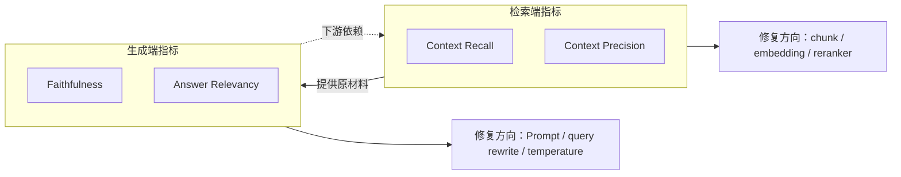

# RAG 评估深度解析：从概念到生产

> 基于 [B站 AI 模型开发教程](https://www.bilibili.com/) Phase 3 RAG Evaluation 模块整理
> 整合 lesson1（入门）与 lesson2（进阶）内容，按 **概念层 → 计算层 → 工程层** 三层次递进
> 每章末附面试卡片，可直接用于面试备战

---

## 目录

- [0. 前言：为什么 RAG 评估是&#34;缺失的一环&#34;](#0-前言为什么-rag-评估是缺失的一环)
- [第一层 · 概念层：建立心智模型](#第一层--概念层建立心智模型)
  - [1.1 RAG 评估全景：四象限框架](#11-rag-评估全景四象限框架)
  - [1.2 四大指标直觉理解](#12-四大指标直觉理解)
  - [1.3 检索端 vs 生成端：职责分工与依赖](#13-检索端-vs-生成端职责分工与依赖)
  - [1.4 指标间因果链分析](#14-指标间因果链分析)
  - [📋 面试卡片：概念层](#-面试卡片概念层)
- [第二层 · 计算层：公式、实现与 RAGAS](#第二层--计算层公式实现与-ragas)
  - [2.0 本章导引：符号表 · 双模式阅读指南 · 学习路径](#20-本章导引符号表--双模式阅读指南)
    - [2.0.3a ⏱️ 各节预估耗时](#203a-️-各节预估耗时)
    - [2.0.3b 🎯 按目标选择阅读路径](#203b--按目标选择阅读路径)
    - [2.0.6 前置概念：标准答案（GT）到底是什么、从哪来](#206-前置概念标准答案gt到底是什么从哪来)
  - [2.1 Context Recall：三种计算方式对照](#21-context-recall三种计算方式对照)
  - [2.2 Context Precision：Binary vs Weighted](#22-context-precisionbinary-vs-weighted)
  - [2.3 Ranking Metrics：五类排序指标](#23-ranking-metrics五类排序指标)
  - [2.4 Faithfulness：LLM-as-Judge 完整流程](#24-faithfulnessllm-as-judge-完整流程)
  - [2.5 Answer Relevancy：从 Jaccard 到语义相似度](#25-answer-relevancy从-jaccard-到语义相似度)
  - [2.6 RAGAS 框架：Agent 执行视角汇总](#26-ragas-框架agent-执行视角汇总)
  - [📋 面试卡片：计算层](#-面试卡片计算层)
- [第三层 · 工程层：诊断、优化与生产化](#第三层--工程层诊断优化与生产化)
  - [3.1 四象限诊断框架](#31-四象限诊断框架)
  - [3.2 诊断决策树](#32-诊断决策树)
  - [3.3 优化策略速查表](#33-优化策略速查表)
  - [3.4 评估数据集构建](#34-评估数据集构建)
  - [3.5 持续评估：三层架构与 CI/CD](#35-持续评估三层架构与-cicd)
  - [3.6 框架选型](#36-框架选型)
  - [3.7 常见错误与避坑清单](#37-常见错误与避坑清单)
  - [3.8 优化优先级总结](#38-优化优先级总结)
  - [3.9 评估结果的对外呈现](#39-评估结果的对外呈现)
  - [📋 面试卡片：工程层](#-面试卡片工程层)
- [附录](#附录)
  - [A. 指标阈值速查表](#a-指标阈值速查表)
  - [B. 优化策略代码片段速查](#b-优化策略代码片段速查)
  - [C. 关键词中英对照表](#c-关键词中英对照表)
  - [D. 一键评估脚本（完整可执行版）](#d-一键评估脚本完整可执行版)
  - [E. 四指标超精炼速查卡（面试前 5 分钟版）](#e-四指标超精炼速查卡面试前-5-分钟版)

---

## 0. 前言：为什么 RAG 评估是"缺失的一环"

### "靠感觉" vs "靠数据"

大多数 RAG 项目在开发阶段投入了大量精力调优检索器和生成器，但到了评估环节却变成了"目测一下答案对不对"。

| 靠感觉的后果                        | 数据驱动的能力                                     |
| ----------------------------------- | -------------------------------------------------- |
| "感觉这次答得不错" — 这不是工程    | **向老板汇报**：Faithfulness 从 0.61 → 0.84 |
| 换了 chunk size，效果变好了？不确定 | **迭代方向明确**：Recall 低 → 加大 top_k    |
| 上了 reranker，效果提升了？说不清楚 | **版本对比量化**：v2 比 v1 Precision 高 12%  |
| A/B 测试两个版本选哪个？无法决策    | **CI 中自动回归**：防止新版本悄悄变差        |

> **没有指标，优化 RAG 全是感觉游戏。**

### RAG 管道的三大失败模式

```
用户提问
  │
  ├── ❌ 失败模式 1：检索失败（Recall 低 / Precision 低）
  │     └── 找不到相关信息，或找到的全是噪声
  │
  ├── ❌ 失败模式 2：生成幻觉（Faithfulness 低）
  │     └── 找到了信息但 LLM 不按文档回答，自己瞎编
  │
  └── ❌ 失败模式 3：答非所问（Answer Relevancy 低）
        └── 答案内容正确但没回答用户的实际问题
```

**四大指标正好覆盖这三大失败模式，缺一不可。**

---

## 第一层 · 概念层：建立心智模型

### 1.1 RAG 评估全景：四象限框架

RAG 系统由两个组件构成——**检索器（Retriever）** 和 **生成器（Generator）**。评估需要同时覆盖两个组件在两个维度上的表现。

```
                 ┌─────────────────┬──────────────────┐
                 │    完整性        │      精准性       │
       ┌─────────┼─────────────────┼──────────────────┤
       │ 检索端  │ Context Recall  │ Context Precision│
       │ (找)    │ "该找的都找到了吗"│ "找的都相关吗"    │
       ├─────────┼─────────────────┼──────────────────┤
       │ 生成端  │       —         │ Answer Relevancy │
       │ (答)    │ (生成端没有"完整性 │ "答的切题吗"      │
       │         │  指标"——信息完整  ├──────────────────┤
       │         │  性靠 Recall 保证)│  Faithfulness    │
       │         │                 │ "有没有瞎编"      │
       └─────────┴─────────────────┴──────────────────┘
```

**为什么生成端没有"完整性"指标？** 因为答案的完整性由检索端决定——Recall 低意味着关键信息没找到，Generator 拿不到原材料自然无法给出完整答案。这是 RAG 架构的核心因果链。

### 1.2 四大指标直觉理解

#### Context Recall & Context Precision — 同一个比喻，两个角度

> **统一类比：撒网捕鱼。**
>
> 池塘里一共有 10 条鱼（GT，你真正想要的），你撒了一网下去，捞上来 8 样东西（Retrieved，检索器返回的）。捞上来的东西里——6 条是鱼 ✅，1 只破靴子 🥾，1 把水草 🌿。
>
> - **Recall = 6/10 = 0.60** → 还有 4 条鱼漏网了。中文里"漏网之鱼"说的就是这个——**该捞的没捞全**
> - **Precision = 6/8 = 0.75** → 捞上来的有 2 样是垃圾。**捞上来的不干净，混了噪声**

```
同一个撒网动作：
  撒了 8 样东西上来（Retrieved）
  ├── 6 条鱼 ✅（命中）
  ├── 1 只靴子 ❌（噪声）
  └── 1 把水草 ❌（噪声）

  池塘里还有 4 条鱼没捞到（漏召回）

  分母不同 → 回答不同问题：
  Recall = 6/10    分母是池塘里所有的鱼（GT）
  Precision = 6/8  分母是捞上来的所有东西（Retrieved）
```

| 指标                   | 低分含义                                 | 典型原因                              | 对下游影响                                   |
| ---------------------- | ---------------------------------------- | ------------------------------------- | -------------------------------------------- |
| **Recall 低**    | 关键文档没找到——"漏网之鱼"             | top_k 太小、chunk 太大、embedding 差  | Generator 缺原材料 → 答案不完整             |
| **Precision 低** | 检索结果里混入大量噪声——"捞了一堆垃圾" | 缺 Reranker、相似度阈值低、文档质量差 | 噪声干扰 Generator → 答案跑偏、幻觉风险增加 |

> **同一个动作（一次检索），同时回答两个问题：该捞的都捞到了吗（Recall）？捞上来的干净吗（Precision）？** 缺一不可。

#### Answer Relevancy & Faithfulness — 同一个比喻，两把尺子

> **统一类比：餐厅点餐。**
>
> 顾客问服务员："今天有什么招牌菜？"
>
> 菜单上实际写的是（这相当于检索到的上下文 / Ground Truth）：**红烧肉饭，配例汤，38 元**。

| 服务员           | 回答                                                         | Relevancy | Faithfulness | 解读                                                   |
| ---------------- | ------------------------------------------------------------ | :-------: | :----------: | ------------------------------------------------------ |
| ✅**靠谱** | "招牌菜是红烧肉饭，配例汤，38 元一份"                        |   ✅ 高   |    ✅ 高    | 答了问题，全都有上下文支撑——理想状态                 |
| 🤡**跑题** | "我们餐厅成立于 1985 年，有 30 年历史，多次获得卫生标兵……" |   ❌ 低   |    ✅ 高    | 说的都是真事，但**没回答顾客问的问题**           |
| 🤥**吹牛** | "招牌菜是红烧肉饭，用的是日本神户和牛，由米其林三星主厨掌勺" |   ✅ 高   |    ❌ 低    | 回答了问题，但**神户和牛、米其林是编的**——幻觉 |
| 💀**离谱** | "今天天气很好，适合散步，明天可能会下雨记得带伞"             |   ❌ 低   |    ❌ 低    | 既没回答问题，也全是废话——最差情况                   |

```
同一个场景，两个维度：
  顾客问"今天有什么招牌菜？"

  Relevancy 问：你回答的是"招牌菜"吗？还是扯别的去了？
  ├── 高 Relevancy → 答案围绕着招牌菜在说
  └── 低 Relevancy → 答非所问（哪怕内容全是对的也没用）

  Faithfulness 问：你说的这些，菜单上真有吗？
  ├── 高 Faithfulness → 每个说法都能在菜单上找到依据
  └── 低 Faithfulness → 你编了菜单上没有的东西（神户和牛、米其林）
```

**关键区分**：

| 指标                       | 核心问题     | 低分表现           | 低分原因                                  | 对用户的伤害                             |
| -------------------------- | ------------ | ------------------ | ----------------------------------------- | ---------------------------------------- |
| **Answer Relevancy** | 答的切题吗？ | 答非所问、绕弯太多 | Prompt 没引导直接回答、问题模糊           | 浪费时间——"你到底在说啥？"             |
| **Faithfulness**     | 有没有瞎编？ | 编造不存在的事实   | System Prompt 约束弱、Recall 低→LLM 补全 | 误导信任——"假的看起来像真的"（更危险） |

> **同一个答案，两把尺子同时量：Relevancy 管"方向对不对"，Faithfulness 管"内容真不真"。** 方向对但内容假 = 吹牛服务员。方向错但内容真 = 跑题服务员。两者都错 = 灾难。

#### 补充：Relevancy ≠ Correctness（退款场景）

这是一个更精炼的边界说明：

- 问："退款要多久？"
- 差答案："我们提供优质的售后服务，请放心购物。" → **Relevancy 低**（没回答问题），但 Faithfulness 可能没问题（售后服务的说法本身是真实的）
- 好答案："退款需要 5-7 个工作日。" → **Relevancy 高**，如果上下文确实写了 5-7 个工作日则 Faithfulness 也高

### 1.3 检索端 vs 生成端：职责分工与依赖



**关键认知**：生成端的 Faithfulness 是检索端的**下游指标**。如果 Recall 低（材料不全），LLM 必然用训练知识补全 → Faithfulness 也低。因此 **优化顺序一定是先检索、后生成**。

### 1.4 指标间因果链分析

四个指标不是孤立的——检索端的问题会向下游传导到生成端。下面用刚才的两个类比来把每条因果链讲清楚。

#### 因果链 ①：Recall 低 → Faithfulness 低（最常见的连锁反应）

> **🎣 捕鱼视角**：你一网只捞到 3 条鱼（但其实池塘里有 10 条），厨师拿到这 3 条鱼要做一桌菜不够用。于是他用自己的"经验"脑补了另外 7 条鱼的味道——**编了一道菜**。顾客吃到的，一部分是真正捞上来的鱼，一部分是厨师想象的鱼。
>
> **🍽️ 餐厅视角**：菜单上写了红烧肉饭 38 元 + 配送时间 30 分钟，但检索只把"红烧肉饭 38 元"传给了服务员，漏了配送时间。顾客追问"多久能送到？"，服务员没有这个信息，只好用自己的经验猜："大概 15 分钟吧"——**瞎编了一个数字**。

```
Recall 低
  → LLM 缺材料（关键文档没检索到）
    → 用自己的训练知识"补全"空缺
      → Faithfulness 低（编造了上下文里没有的内容）
```

> **核心认知：RAG 幻觉的第一因往往不是 LLM 不听话，而是检索没给够材料。先修 Recall，Faithfulness 会自然回升。**

#### 因果链 ②：Precision 低 → Answer Relevancy 低（被噪声带偏）

> **🎣 捕鱼视角**：你撒网下去，捞上来 3 条鱼，但也捞了 5 只破靴子。厨师一看——"哦，靴子！那我来做一道靴子炖汤"。他花了大量精力处理噪声，最后端上来的菜和鱼完全无关。
>
> **🍽️ 餐厅视角**：顾客问招牌菜，检索除了返回"红烧肉饭 38 元"，还返回了一大段"餐厅历史：1985 年成立，创始人师从某某大师……"。服务员被这段历史吸引了注意力，回答："我们餐厅有 30 年历史了，创始人是……"——**Retrieval 噪声 → Generator 跑题**。

```
Precision 低
  → 检索结果混入大量噪声文档
    → LLM 被噪声内容吸引/误导
      → 回答偏向噪声文档的内容而非用户问题
        → Answer Relevancy 低（答非所问）
```

> **核心认知：LLM 倾向于回答它"看到"的内容。如果上下文里噪声比信号多，它自然会跑题。加 Reranker 让信号排前面，噪声排后面，LLM 就不容易被带偏。**

#### 因果链 ③：Recall 高 + Precision 高 + Faithfulness 低（材料齐全但 LLM 自己加戏）

> **🎣 捕鱼视角**：鱼全部捞上来了，没有垃圾——完美。但厨师拿到了所有鱼之后，对自己厨艺太自信，在菜里加了菜单上没有的"秘制酱料"。顾客问"你这酱料哪来的？"厨师说"我觉得加了更好吃"——**材料充足，但他非要自己发挥**。
>
> **🍽️ 餐厅视角**：服务员拿到了完整菜单，但他觉得"红烧肉饭 38 元"不够吸引人，自己加上了"由米其林三星主厨掌勺"。顾客一问厨师，厨师说"没这回事"——**信息全在手里，非要编**。

```
Recall 高 + Precision 高 + Faithfulness 低
  → 检索没问题，材料给够了
    → 问题出在 Generator 自身
      → 修的方向：不是检索，是 Prompt 约束 + temperature
```

> **核心认知：这种情况才说明问题在 LLM。强化 System Prompt（"只使用参考文档中的信息"）+ 降低 temperature = 解决。**

#### 因果链 ④：Recall 高 + Faithfulness 高 + Relevancy 低（答的内容都对，但"偏科"了）

> **🍽️ 餐厅视角**：服务员拿到了完整菜单，老老实实照念不误。但他念的是"我们餐厅成立于 1985 年，有 30 年历史……"。每句话都是菜单上的真实内容，Faithfulness 满分——但顾客问的是"招牌菜是什么"，你念的这段跟招牌菜毫无关系。**Relevancy 低**。

```
Recall 高 + Faithfulness 高 + Relevancy 低
  → 检索全 + 不瞎编
    → 但答案方向偏了，没对准用户的真实问题
      → 修的方向：Query 重写 / HyDE / 优化 Response Prompt
```

#### 一张图总结四条因果链

```
检索端                              生成端
──────                              ──────
Recall 低  ────────────────────→  Faithfulness 低
  "鱼没捞够"                         "厨师补全编造"

Precision 低 ──────────────────→  Answer Relevancy 低
  "捞了一堆靴子"                     "被噪声带偏跑题"

Recall ✓ Precision ✓ ─────X───→  Faithfulness 低
  "材料齐全"                         "LLM 自己加戏 → 修 Prompt"

Recall ✓ Faithfulness ✓ ──X──→  Answer Relevancy 低
  "内容对也不编造"                    "方向偏了 → 修 Query"
```

---

### 📋 面试卡片：概念层

**Q1：RAG 评估为什么需要四个指标，一个 Faithfulness 不够吗？**

A：不够。Faithfulness 只告诉你"答案有没有编造"，但不告诉你：

- 信息是否找全了（Recall）—— 答得很诚实但只覆盖了 30% 的信息
- 检索是否有噪声（Precision）—— 噪声多了 LLM 容易被带偏
- 是否回答了用户的问题（Relevancy）—— 答的内容都对但完全跑题

四个指标是从两个维度（检索 vs 生成）× 两个角度（完整 vs 精准）构成的最小完备集合。

**Q2：Context Recall 和传统 IR 的 Recall 有什么区别？**

A：传统 IR 的 Recall 需要提前标注"哪些文档是相关的"（GT 文档 ID 集合）。RAGAS 的 Context Recall 只需要一条 GT 答案文本——LLM 会判断 GT 答案中的每个句子是否能从检索上下文中找到支撑。RAGAS 的做法更实操，因为标注文档 ID 的成本远高于写一条标准答案。

**Q3：为什么生成端没有"完整性"指标？**

A：因为答案完整性的瓶颈在检索端。如果 Context Recall 高（该找的都找到了），Generator 理论上就有足够原材料生成完整答案。完整性问题的根因是检索遗漏，应该在检索端修复，而不是在生成端打补丁。

**Q4：Faithfulness 高但 Recall 低，这个 RAG 系统有什么问题？**

A：这是"诚实的半吊子"——LLM 老老实实只用检索到的内容回答，不瞎编，但检索漏了一半的关键信息。用户会觉得"答案没毛病但是不够"——没有把该说的都说了。这种系统用户满意度反而可能低于"信息全但偶尔瞎编"的系统，因为不完整的信息可能比没有信息更危险。

**Q5：RAG 评估中最容易被忽视的指标是哪个？为什么？**

A：Answer Relevancy。因为大家本能地以为"答对了就行"，但其实"答对了但没回答问题"的情况非常常见。比如用户问"退款要多久"，系统回答"退款政策是 30 天内可申请，审核通过后 5-7 个工作日到账"——Faithfulness 没问题（都是文档里的），但其实用户只想知道"几天能到账"，后面的补充信息对这个问题来说是噪声。Relevancy 低意味着系统在浪费用户的时间。

---

## 第二层 · 计算层：公式、实现与 RAGAS

### 2.0 本章导引：符号表 · 双模式阅读指南

在深入每个指标之前，先用 5 分钟建立本章的"共同语言"和"阅读地图"。这一节是你后续所有内容的基础参考，遇到看不懂的符号或不确定该读哪个部分时，回这里查。

---

#### 2.0.1 本章符号约定

本章用到以下符号，此后不再每次说明。如果你在公式中看到它们，回这里查就行。

| 符号                      | 全称                       | 中文                    | 大白话解释                                                                                                |
| ------------------------- | -------------------------- | ----------------------- | --------------------------------------------------------------------------------------------------------- |
| **GT**              | Ground Truth               | 标准答案 / 参考答案     | 你提前准备好的"正确答案"，用来跟系统输出做对比。本文统一叫"标准答案（GT）"                                |
| **TP**              | True Positive              | 正确命中                | 检索结果里确实有用的那些——既在标准答案里又在检索结果里                                                  |
| **K** / **k** | top_k                      | 检索返回数量            | 检索器返回前 K 个结果。K=5 就是看排名前 5 的结果                                                          |
| **P@i**             | Precision at position i    | 第 i 位截断精确率       | 只看前 i 个检索结果，其中相关的比例是多少。比如前 3 个里有 2 个相关 → P@3 = 2/3                          |
| **rel(C_i)**        | relevance of chunk i       | 第 i 个结果的相关性标签 | 第 i 个检索结果是否跟问题相关：相关 = 1，不相关 = 0。NDCG 中可以是多级（0/1/2/3）                         |
| **NLI**             | Natural Language Inference | 自然语言推理            | 给定"前提"和"假设"，判断前提在逻辑上是否支持假设。Faithfulness 中用于验证"这条声明能否从上下文中推理出来" |
| **gain_i**          | gain at position i         | 第 i 位的相关性增益     | NDCG 专用：第 i 个结果有多相关（0/1/2/3 级标注）。不同于 rel 的二值判断，gain 允许多级                    |
| **E(q)**            | embedding of q             | 问题 q 的向量表示       | 把文字转换成一串数字（向量），语义相似的句子向量方向也相似                                                |
| **cos(A, B)**       | cosine similarity          | 余弦相似度              | 衡量两个向量"方向一致性"的指标：1.0 = 方向完全一样，0 = 垂直（无关），-1 = 方向相反                       |
| **N**               | —                         | 反向问题数量            | Answer Relevancy 中 LLM 从答案生成的反向问题个数，RAGAS 默认 N=3                                          |

> **重要约定**：本文统一使用 **"标准答案（GT）"** 指代参考答案/ground truth/reference。RAGAS 代码中 `reference` 字段名保留不变（那是 API 要求的），但叙述中不再混用。

---

#### 2.0.2 双模式阅读指南

本章采用两种视角来讲解每个指标。你可以根据自己当前的需求选择阅读模式：

```
┌──────────────────────────────────────────────────────────────┐
│  🏫 医生模式（学习视角） —— "这个指标是什么，为什么需要它"     │
│                                                              │
│  需（Need）    → 当前 RAG 有什么问题，需要这个指标来发现？      │
│  根（Root）    → 这个问题为什么会出现？根因是什么？             │
│  解（Solution）→ 这个指标如何计算？公式 + 手算一步步来          │
│  损（Damage）  → 和其他变体相比什么时候选 A 什么时候选 B？       │
│                                                              │
│  适合：第一次学 / 复习公式 / 准备面试                          │
├──────────────────────────────────────────────────────────────┤
│  🏭 营销模式（执行视角） —— "解已确定，我该怎么落地执行？"      │
│                                                              │
│  解（Solution）已确定 → "我要算 Faithfulness，具体怎么做？"     │
│  需（Need-Data）     → 需要哪些输入？从 RAG 管线哪个环节取？     │
│  根（Root-Source）   → 每个数据从哪来？人工标注还是自动生成？    │
│  损（Damage-Choice） → LLM 判还是规则判？全自动还是人工抽检？    │
│                                                              │
│  适合：搭建评估管线 / 写生产代码 / Agent 需要执行评估任务        │
└──────────────────────────────────────────────────────────────┘
```

**阅读建议**：

- **第一次学** → 每个 2.x 节只读 🏫 学习视角，建立公式直觉（约 30 分钟）
- **要动手做** → 加上 🏭 生产视角，搞清楚数据从哪来、谁执行哪一步（约 60 分钟）
- **Agent 执行** → 直接跳到每节的 🏭 生产视角中的"Agent 可执行摘要"，再配合 2.6 节的执行 Checklist

---

#### 2.0.3 学习路径图：三条线，逐渐深入

本章内容按 **lesson1（入门手算）→ lesson2（公式深入）→ RAGAS（自动化）** 三条线递进：

| 指标                        | 🟢 lesson1 入门（手算+直觉）   | 🔵 lesson2 进阶（完整公式+代码）             | 🟣 RAGAS 自动化（一行 evaluate）                           |
| --------------------------- | ------------------------------ | -------------------------------------------- | ---------------------------------------------------------- |
| **Context Recall**    | 文档ID集合交集 `               | GT ∩ R                                      | /                                                          |
| **Context Precision** | Binary Precision`TP / K`     | Weighted Precision，引入 P@i 加权 + rel(C_i) | `ContextPrecision(llm=...)`，逐 chunk LLM 相关性判定     |
| **排序质量**          | *(lesson1 未涉及)*           | MRR / NDCG / HitRate，手写 Python 实现       | *(RAGAS 不直接提供，需手动或用其他库)*                   |
| **Faithfulness**      | 单场景判断"答得对不对"         | Claim 提取 + NLI 三分类 + A/B/C 三场景实验   | `Faithfulness(llm=...)`，内部两步 LLM 调用               |
| **Answer Relevancy**  | Jaccard 关键词重叠*(仅供演示)* | 反向问题生成 + cos 语义相似度 + A/B/C 场景   | `AnswerRelevancy(llm=..., embeddings=...)`，需要两个参数 |

---

#### 2.0.3a ⏱️ 各节预估耗时

此表帮助你规划学习节奏。时间按"只读🏫学习视角 / 加上🏭生产视角"两档给出。

| 章节                                 | 只读学习视角 | 加上生产视角 | 备注                                      |
| ------------------------------------ | :----------: | :----------: | ----------------------------------------- |
| 0. 前言                              |   10 分钟   |      —      | 建立问题意识                              |
| 1.1-1.2 四象限 + 四大指标直觉        |   20 分钟   |      —      | 最重要的概念基础，不要跳过                |
| 1.3-1.4 职责分工 + 因果链            |   15 分钟   |      —      | 理解"为什么先修 Recall 再修 Faithfulness" |
| 2.0 阅读指南（本节）                 |   10 分钟   |      —      | 建立全局坐标系，以后可回查                |
| 2.1 Context Recall                   |   25 分钟   |   +15 分钟   | 三种方式对比是重点                        |
| 2.2 Context Precision                |   20 分钟   |   +10 分钟   | 手算逐格演示建议跟着算一遍                |
| 2.3 Ranking Metrics                  |   15 分钟   |   +10 分钟   | NDCG 手算较耗时，可先跳过                 |
| 2.4 Faithfulness                     |   30 分钟   |   +15 分钟   | 最复杂的指标，Claim 提取/NLI值得精读      |
| 2.5 Answer Relevancy                 |   15 分钟   |   +10 分钟   | 相对简单                                  |
| 2.6 RAGAS 框架汇总 + Agent Checklist |   15 分钟   |      —      | 全局视角，建议学完 2.1-2.5 后再看         |
| 概念层面试卡片                       |   10 分钟   |      —      |                                           |
| 计算层面试卡片（14题）               |   20 分钟   |      —      | 可以分两次看                              |
| 3.1-3.3 诊断 + 决策树 + 优化速查     |   20 分钟   |      —      | 实操最常用的章节                          |
| 3.4-3.5 评估数据集 + 持续评估        |   20 分钟   |      —      | 生产落地必读                              |
| 3.6 框架选型                         |   10 分钟   |      —      |                                           |
| 3.7-3.8 常见错误 + 优化优先级        |   10 分钟   |      —      | 面试高频                                  |
| 工程层面试卡片（10题）               |   15 分钟   |      —      |                                           |

> **总计**：学习视角约 **4.5 小时**，加上生产视角约 **5.5 小时**。建议分 2-3 次阅读，每次不超过 2 小时。

---

#### 2.0.3b 🎯 按目标选择阅读路径

不需要从头读到尾。根据你当前的目标，选择对应的路径：

**🏃 路径一：2 小时快速跑通（"我只要把 RAGAS 用起来"）**

```
0. 前言（10 分钟）
  → 1.1 + 1.2 概念层核心（20 分钟）
    → 2.6.5 Agent 执行 Checklist（5 分钟）
      → 附录 D 一键评估脚本（30 分钟，拿来即跑）
        → 3.7 常见错误与避坑清单（10 分钟）
          → 3.8 优化优先级（5 分钟）
```

> 跳过所有公式推导和手算演示。目标是**跑通评估管线 + 看懂四个数字**。

**📖 路径二：1 天系统学习（"我要理解每个指标并在项目中使用"）**

```
0. 前言 → 第一层全部（概念层，含面试卡片）
  → 2.0 阅读指南 → 2.1-2.6 计算层（只读🏫学习视角，跳过🏭生产视角）
    → 3.1-3.5 工程层（诊断→数据集→持续评估）
      → 3.7-3.8 常见错误 + 优化优先级
```

> 约 3.5-4 小时。跳过每节的生产视角细节（Agent可执行摘要、执行者分配等），工程层跳过 Langfuse 集成和框架选型对比。

**🎓 路径三：深度掌握 / 面试备战（"我要成为 RAG 评估专家"）**

```
全文通读（含所有🏭生产视角 + 面试卡片 + 附录）
```

> 约 5.5 小时。建议分3次：第一次概念层+计算层学习视角，第二次计算层生产视角+面试卡片，第三次工程层。

---

#### 2.0.4 数据全景图：四个输入字段，各自从哪来、被谁用

RAG 评估的所有指标，归根结底只需要四个输入字段。理解它们的来源和去向，是生产落地最关键的一步。

```
输入字段                来源（从 RAG 管线的哪个环节取）           被哪些指标消费
─────────────────────────────────────────────────────────────────────────────
user_input              用户请求日志 / 前端输入                    Context Precision
（用户原始问题）                                                   Answer Relevancy

response                RAG 管线 → 生成步骤的输出                  Faithfulness
（系统生成的答案）      (LangChain callback / Langfuse trace)      Answer Relevancy

retrieved_contexts      RAG 管线 → 检索步骤的输出                  Context Recall
（检索返回的上下文列表） (FAISS/向量库返回的文档列表)               Context Precision
                                                                    Faithfulness

reference (GT)          ⚠ 人工标注（10% 覆盖）                      Context Recall
（标准答案）             或 LLM 自动生成（90% 覆盖，需人工抽样验证）
```

> **关键认知**：四个指标中，**只有 Context Recall 需要标准答案（GT）**——这是唯一需要"提前准备正确答案"的指标。Faithfulness 只判断答案有没有依据（不判断对不对），Answer Relevancy 只判断是否切题（不判断对不对），Context Precision 只判断检索回来的东西是否相关。

---

#### 2.0.5 执行者速查表：每一步谁来做？

一个生产级的 RAG 评估管线中，不同步骤需要分配给不同的"执行者"——不是所有事情都适合让 LLM 做，也不是所有事情都能自动化。

| 指标                        | Step 1                                      | Step 2                                        | Step 3                                  | 人工必须介入的点                                              |
| --------------------------- | ------------------------------------------- | --------------------------------------------- | --------------------------------------- | ------------------------------------------------------------- |
| **Context Recall**    | 拆解 GT 为原子句子 →**LLM**          | 逐句判断 context 中是否有支撑 →**LLM** | 计数 supported/total →**纯计算** | GT 标注（必须人工 or 人工抽样验证 LLM 生成的 GT）             |
| **Context Precision** | 逐 chunk 判断是否与问题相关 →**LLM** | 加权公式求和 →**纯计算**               | —                                      | LLM 相关性判断结果抽样验证                                    |
| **Ranking Metrics**   | *(全部纯计算)*                            | —                                            | —                                      | 相关性多级标注（0/1/2/3）必须人工，这是所有排序指标的前置依赖 |
| **Faithfulness**      | 从答案提取原子 Claim →**LLM**        | 逐 Claim NLI 验证 →**LLM**             | 计数 supported/total →**纯计算** | Claim 提取粒度抽检 + NLI 边界 case 标注                       |
| **Answer Relevancy**  | 从答案反向生成 N 个问题 →**LLM**     | 计算 embedding 相似度均值 →**纯计算**  | —                                      | 反向生成的问题质量检查（问题本身是否合理）                    |

---

#### 2.0.6 前置概念：标准答案（GT）到底是什么、从哪来

在进入具体指标之前，有一个概念贯穿整个计算层但从来没被单独拉出来讲过——**标准答案（GT，Ground Truth）**。它在符号表里只有一行缩写定义，但实际学习和生产中，你需要知道的不只是一个缩写。

##### 🏫 学习视角：GT 是什么，为什么需要它

**GT 就是你提前准备好的"正确答案"，用来跟 RAG 系统的输出做对比。** 没有它，你就没法知道检索器"该找的有没有找到"、生成器"该答的有没有答对"。

GT 在 RAG 评估中有三种形态，粒度从粗到细：

| 形态                      | 是什么                                | 例子                                                                                                                |                     用在哪个指标                     |
| ------------------------- | ------------------------------------- | ------------------------------------------------------------------------------------------------------------------- | :--------------------------------------------------: |
| **文档 ID 集合**    | 标注"哪些文档跟这个问题相关"          | `{doc_002, doc_004}`                                                                                              |               Context Recall（方式一）               |
| **参考答案文本**    | 写一条"理想中 RAG 应该给出的完美答案" | "RAG 是检索增强生成技术，在生成前先从知识库检索相关文档，将检索结果注入 LLM 上下文，从而减少幻觉、提升事实准确性。" |             Context Recall（方式二/三）             |
| **原子 Claim 列表** | 把参考答案拆成一条一条的独立事实      | ["RAG 在生成前先检索文档", "检索结果注入 LLM 上下文", "RAG 能减少幻觉", "RAG 能提升事实准确性"]                     | Context Recall（方式二，RAGAS 内部拆句后的中间形态） |

**一个关键认知**：四个指标中，**只有 Context Recall 需要 GT**。Faithfulness 只判断"答案有没有依据"（不需要标准答案），Precision 只判断"检索回来的东西跟问题有关吗"（不需要标准答案），Relevancy 只判断"答的切题吗"（也不需要标准答案）。

> **为什么 GT 只服务 Recall？** 因为 Recall 回答的是"该检索到的都检索到了吗？"——这个"该检索到"的基准，就是 GT。其他三个指标从不同角度衡量系统输出质量，不需要一个"正确答案"做对标。

##### 🏭 生产视角：GT 怎么造出来

知道 GT 是什么之后，真正头疼的是——**这东西怎么搞到？** 没有 GT，Context Recall 就没法算。而 GT 的获取是整个 RAG 评估管线中**最依赖人工**的环节。

**三种生产方式**：

| 方式                                  | 怎么做                                    |   可靠性   | 成本 | 适用阶段              |
| ------------------------------------- | ----------------------------------------- | :--------: | :--: | --------------------- |
| **纯人工标注**                  | 人读文档 → 写参考答案 → 标注相关文档 ID | ⭐⭐⭐⭐⭐ | 最高 | MVP 验证（20-50 条）  |
| **LLM 自动生成 + 人工全量验证** | LLM 生成 → 人逐一核对修改                |  ⭐⭐⭐⭐  | 中高 | 迭代优化（50-100 条） |
| **LLM 自动生成 + 人工抽样验证** | LLM 生成 → 人抽 20% 验证质量             |   ⭐⭐⭐   |  中  | 生产监控（100+ 条）   |

**纯人工标注的标准流程**（适用于核心评估集）：

```
Step 1: 读文档
  通读知识库中与问题相关的文档（通常 2-5 篇）

Step 2: 确定"该检索到哪些文档"
  问题："什么是 RAG？它如何减少幻觉？"
  → 文档 doc_002 定义了 RAG 并解释了检索机制 → 标注为相关
  → 文档 doc_004 专门讨论了 LLM 幻觉和缓解方法 → 标注为相关
  → 文档 doc_006 讲的是 Prompt Engineering → 不相关
  → GT_doc_ids = {doc_002, doc_004}

Step 3: 写参考答案（用于 RAGAS 的 Sentence-Level Recall）
  基于 doc_002 和 doc_004 的内容，写一条"理想答案"：
  "RAG（检索增强生成）是一种将信息检索与大语言模型结合的技术。
   在生成答案之前，RAG 先从知识库中检索相关文档，将检索到的内容
   注入 LLM 的上下文窗口，从而为模型提供外部知识支撑。这种机制
   有效减少了 LLM 的幻觉问题——因为模型不再仅依赖训练时的参数化
   知识，而是基于检索到的真实文档生成回答。研究表明，RAG 可以将
   事实准确性提升 30-40%。"
```

**LLM 自动生成 GT 的 Prompt 模板**：

```
你是一位 RAG 评估专家。请根据以下文档集合，为给定问题生成一条标准参考答案。

要求：
1. 答案必须完全基于提供的文档内容，不要引入外部知识
2. 答案应覆盖文档中所有与问题相关的要点
3. 答案应简洁、准确、信息完整

文档集合：
{all_relevant_documents}

问题：{question}

请生成标准答案，并用 JSON 数组列出所有相关文档的 ID：
{
  "reference": "标准答案文本...",
  "relevant_doc_ids": ["doc_002", "doc_004"]
}
```

**GT 质量验证清单**（人工抽检时逐项核对）：

```
☐ 参考答案是否完全基于文档内容（无外部知识混入）？
☐ 是否覆盖了所有相关文档的核心要点？
☐ 是否有遗漏的关键信息？
☐ 相关文档 ID 列表是否准确（无漏标、无多标）？
☐ 参考答案的语言是否自然、流畅（不是从文档机械拼凑）？
```

> **实操建议**：不要试图一次性为 200 条问题标注完美 GT。先从 20 条核心问题开始纯人工标注，验证评估管线跑通后，再用 LLM 辅助生成扩展到 50-100 条，人工抽样验证。

---

### 2.1 Context Recall：三种计算方式对照

#### 方式一：文档 ID 集合交集（lesson1 简化版）

这是最直观也最原始的计算方式——提前为每个问题标注好"应该检索到哪些文档 ID"，然后看检索结果覆盖了多少。

$$
\text{Context Recall}_{doc} = \frac{|GT_{doc\_ids} \cap Retrieved_{doc\_ids}|}{|GT_{doc\_ids}|}
$$

**示例**：

```
问题："什么是 RAG？它如何减少幻觉？"
GT 文档 ID：{doc_002, doc_004}  （RAG 定义 + LLM 幻觉文档）
检索结果：  [doc_002, doc_006]   （RAG 定义 + 提示工程文档）
Recall = 1/2 = 0.50  （只找到了 doc_002，doc_004 漏了）
```

**优点**：公式简单，计算快，不需要 LLM

**缺点**：

- 标注成本极高——你需要为每个问题逐一标记"应该检索到哪些文档"
- 粒度粗糙——一个文档整体标记为"相关"，但可能只有其中一段话是真正有用的
- 实际生产环境中几乎不可行

#### 方式二：Sentence-Level LLM Judge（RAGAS 标准版）

RAGAS 的 `LLMContextRecall` 不要求标注文档 ID，只需要一条 **Ground Truth 参考答案**（`reference` 字段）。

**计算流程**：

```
GT 参考答案："RAG 是检索增强生成技术，将检索与 LLM 结合，主要作用是减少幻觉、提升答案准确性。"
  │
  ▼
Step 1: LLM 将 GT 答案拆解为原子级句子
  ├── S1: "RAG 是检索增强生成技术"
  ├── S2: "RAG 将检索与 LLM 结合"
  └── S3: "RAG 主要作用是减少幻觉、提升答案准确性"
  │
  ▼
Step 2: 逐一判断每个句子是否能从 retrieved_contexts 中找到支撑
  ├── S1 → ✅ 在上下文 1 中找到
  ├── S2 → ✅ 在上下文 1 中找到
  └── S3 → ✅ 在上下文 2 中找到
  │
  ▼
Context Recall = 3/3 = 1.00
```

$$
\text{Context Recall}_{ragas} = \frac{\text{GT答案中能从检索上下文找到支撑的句子数}}{\text{GT答案总句子数}}
$$

**关键差异**：

| 维度        | 集合交集版           | RAGAS 标准版                |
| ----------- | -------------------- | --------------------------- |
| GT 标注内容 | 文档 ID 集合         | 一条参考答案文本            |
| 判断方式    | 字符串 ID 匹配       | LLM 语义判断                |
| 粒度        | 文档级（粗）         | 句子级（细）                |
| 标注成本    | 高（需了解所有文档） | 中（写一条答案即可）        |
| 计算成本    | 低（无 LLM 调用）    | 高（每条样本一次 LLM 调用） |

#### 方式三：Ground Truth 自动生成

对于知识库规模较大的场景，人工为每个问题标注 GT 文档 ID 不现实。可以用 LLM 自动判断「哪些文档与给定问题相关」。

**Prompt 模板**：

```
你是一位 RAG 评估专家。请判断以下文档中哪些与给定问题相关。

问题：{query}

文档列表：
[doc1] 文档1内容...
[doc2] 文档2内容...
...

请返回相关文档的 ID 列表，格式如下（仅返回 JSON 数组）：
["doc1", "doc3", ...]
```

**推荐策略**：LLM 生成初稿 + 人工抽样 20% 验证，兼顾效率和质量。

#### 🏭 生产视角

##### 数据从哪来

| 数据字段           | 来源                                                                              | 获取方式                             |
| ------------------ | --------------------------------------------------------------------------------- | ------------------------------------ |
| reference (GT)     | **人工标注**（核心集 10%）或 **LLM 自动生成**（剩余 90%，需抽样验证） | 写一条"理想中的完美答案"作为标准答案 |
| retrieved_contexts | RAG 管线 → 检索步骤的输出                                                        | FAISS/向量库返回的文档列表           |

> ⚠ **Context Recall 是四个指标中唯一需要标准答案（GT）的**。其他三个指标（Precision、Faithfulness、Relevancy）都不需要提前准备正确答案。

##### 执行者分配

```
reference (GT) ──────────→ [LLM: 拆解为原子句子] ──→ S₁, S₂, ..., Sₙ
                                                          │
retrieved_contexts ───────────────────────────────────────┼──→ [LLM: 逐句判断是否有支撑] ──→ 结果[]
                                                          │
                                                          └──→ [纯计算: 计数/总数] ──→ 0~1
```

| 步骤                          | 谁执行                                         | 为什么                                           |
| ----------------------------- | ---------------------------------------------- | ------------------------------------------------ |
| 标准答案（GT）的编写          | **人工**（核心）或 **LLM**（辅助） | 需要领域知识判断"什么是好答案"                   |
| GT 拆解为原子句子             | **LLM**                                  | 语义层面的句子分割，需要理解句子边界             |
| 逐句判断 context 中是否有支撑 | **LLM**                                  | 语义比对——"这句话跟上下文里哪些内容对应？"     |
| 计数 supported / total        | **纯计算**                               | 简单除法                                         |
| GT 质量验证（LLM 生成时）     | **人工**                                 | 抽样 20% 验证 LLM 生成的 GT 是否合理             |
| 拆句粒度抽检                  | **人工**                                 | LLM 可能把两个事实拆成一句，或把一个事实拆成两句 |

##### 执行步骤详解

**Step 1：确保有 GT（人工 or LLM 生成）**

```python
# 方式一：人工写 GT（最可靠）
reference = "RAG 是检索增强生成技术，在生成答案前先从知识库中检索相关文档，将检索结果注入 LLM 的上下文，从而减少幻觉、提升事实准确性。"

# 方式二：LLM 自动生成 GT（需抽样验证）
prompt = f"""
根据以下文档集合，为问题生成一条标准参考答案。答案应忠实于文档内容。

文档集合：
{all_documents}

问题：{question}

标准答案：
"""
reference = judge_llm.invoke(prompt)
```

**Step 2：LLM 拆解 GT 为原子句子**

```
Prompt 模板：

将以下标准答案拆解为原子级句子。每个句子应只包含一个独立的事实主张。

标准答案：{reference}

以 JSON 字符串数组返回：["句子1", "句子2", ...]
```

**Step 3：LLM 逐句验证**

```
Prompt 模板：

给定检索到的上下文，判断以下陈述是否能从中找到支撑。

检索上下文：
{retrieved_contexts}

陈述：{sentence_i}

请回答：是（有支撑）/ 否（无支撑）
```

**Step 4：计数（纯计算）**

```python
def compute_context_recall_ragas(supported_count, total_sentences):
    return supported_count / total_sentences if total_sentences > 0 else 0.0
```

##### 人工介入点

| 环节             | 频率           | 方法                                                           |
| ---------------- | -------------- | -------------------------------------------------------------- |
| GT 编写          | 每条测试问题   | 人工写核心集（覆盖 10% 的问题），LLM 生成剩余 90% 后抽样验证   |
| GT 拆句粒度抽检  | 每周抽 5 条    | 人工对比"原始 GT"和"LLM 拆出的句子列表"，判断粒度是否合理      |
| LLM 逐句验证抽检 | 每批次抽 10 条 | 人工对比"GT 句子"+"检索上下文"，验证 LLM 的"有支撑/无支撑"判断 |

##### Agent 可执行摘要

> 要计算 Context Recall（RAGAS 标准版），你需要：**reference**（标准答案，人工编写 10% + LLM 生成 90%）和 **retrieved_contexts**（检索结果列表）。
>
> **第一步**：准备好 reference——要么人工写一条"理想中的完美答案"，要么让 LLM 基于文档集合自动生成（之后人工抽 20% 验证）。
>
> **第二步**：调用 LLM 把 reference 拆成原子句子列表。
>
> **第三步**：对每个原子句子，调用 LLM 判断它能否从 retrieved_contexts 中找到支撑。
>
> **第四步**：数"有支撑"的句子数除以总句子数，得到 0~1 的分数。
>
> **人工只需**：编写核心 GT（覆盖 10% 问题）、验证 LLM 生成的 GT 质量、抽检拆句粒度和验证判断。

---

### 2.2 Context Precision：Binary vs Weighted

#### Binary Precision（简单版，lesson1 使用）

$$
\text{Context Precision}_{binary} = \frac{|GT \cap Retrieved|}{|Retrieved|} = \frac{TP}{K}
$$

每个检索到的文档只有"相关/不相关"两种状态，排名位置不影响权重。

**沿用上节 Recall 的同一事例，并排对比：**

```
问题："什么是 RAG？它如何减少幻觉？"
GT 文档 ID：{doc_002, doc_004}  （RAG 定义 + LLM 幻觉文档）
检索结果：  [doc_002, doc_006]   （RAG 定义 + 提示工程文档）
```

| 集合                              | 内容                |    大小    |
| --------------------------------- | ------------------- | :---------: |
| GT（该找的全部）                  | {doc_002, doc_004}  |      2      |
| Retrieved（实际找的）             | [doc_002, doc_006]  |      2      |
| **GT ∩ Retrieved（命中）** | **{doc_002}** | **1** |

| 指标                | 公式              | 计算  |      分数      | 解读                                       |
| ------------------- | ----------------- | ----- | :------------: | ------------------------------------------ |
| **Recall**    | TP /\|GT\|        | 1 / 2 | **0.50** | 该找 2 篇，只找到 1 篇 → 漏了 doc_004     |
| **Precision** | TP /\|Retrieved\| | 1 / 2 | **0.50** | 找了 2 篇，只有 1 篇相关 → doc_006 是噪声 |

**核心洞察**：Recall 和 Precision **分子相同（TP=1），分母不同**。

- Recall 的分母是 `|GT|`——「回答问题需要几篇文档」，由需求决定
- Precision 的分母是 `|Retrieved|`——「检索器实际返回了几篇」，由检索器决定
- 本例中 Recall = Precision = 0.50 是**巧合**（因为正好 \|GT\| = \|Retrieved\| = 2）。现实中两者通常不同——检索器返回 10 篇但只有 3 篇相关，则 Recall 看 3/|GT|、Precision 看 3/10。

**问题**：Binary 版排名第 1 位和第 5 位的权重相同——但这不符合用户的真实体验。用户更关心前几个结果的质量。

#### Weighted Precision（RAGAS 默认）← lesson2 进阶

##### Step 1: 直觉理解

Binary Precision 有一个盲区：**它把排名第 1 位的错误和排名第 100 位的错误看成一样严重**。但在 RAG 场景中，LLM 更关注靠前的上下文（"Lost in the Middle"效应）——第 1 位混入噪声比第 5 位混入噪声危害大得多。

Weighted Precision 就是给靠前的排名更高权重：**相关文档排越前，分数越高；相关文档被压在后面，就要扣分。**

##### Step 2: 公式逐项拆解

$$
\text{Weighted Precision@K} = \frac{\sum_{i=1}^{K} {\color{blue}P@i} \times {\color{red}rel(C_i)}}{\sum_{i=1}^{K} {\color{red}rel(C_i)}}
$$

逐项解释，从上到下、从左到右：

| 符号                         | 大白话                                                               | 在这个例子中                                             |
| ---------------------------- | -------------------------------------------------------------------- | -------------------------------------------------------- |
| **K**                  | 检索返回的总数（比如 K=5）                                           | 5                                                        |
| **i**                  | 排名位置（第 1 位、第 2 位...）                                      | 从 1 到 5                                                |
| **P@i**                | 只看前 i 个结果时，相关文档的占比。**对每个 i 都要重新算一遍** | 比如 i=3 时，前 3 个里有 2 个相关 → P@3 = 2/3           |
| **rel(C_i)**           | 第 i 个结果是否相关。**是二值判断：相关=1，不相关=0**          | 当第 i 个结果不相关时，整个 P@i × 0 = 0，这个位置没贡献 |
| **分子 Σ P@i × rel** | 把每个位置的"该位精确率 × 是否相关"累加起来                         | 所有相关位置的 P@i 之和                                  |
| **分母 Σ rel**        | 一共有几个相关文档（归一化用）                                       | 3                                                        |

##### Step 3: 手算逐格演示

假设 K=5，检索列表从头到尾是：**[相关, 不相关, 相关, 不相关, 相关]**。

现在逐格计算每一列的来源：

| 排名 i | 内容    |  rel(C_i)  | 为什么？    | 前 i 个中相关数 | P@i                   | 为什么？         |   P@i × rel   | 为什么？               |
| :----: | ------- | :---------: | ----------- | :-------------: | --------------------- | ---------------- | :------------: | ---------------------- |
|   1   | ✓ 相关 | **1** | 第1位命中   |       1个       | **1/1 = 1.00**  | 1个相关÷1个总数 | **1.00** | 1.00×1=该位有效贡献   |
|   2   | ✗ 噪声 | **0** | 第2位是噪声 |     还是1个     | **1/2 = 0.50**  | 1÷2=50%         |  **0**  | 0.50×0=噪声位贡献归零 |
|   3   | ✓ 相关 | **1** | 第3位命中   |     累计2个     | **2/3 ≈ 0.67** | 2÷3≈67%        | **0.67** | 0.67×1=该位有效贡献   |
|   4   | ✗ 噪声 | **0** | 第4位是噪声 |     还是2个     | **2/4 = 0.50**  | 2÷4=50%         |  **0**  | 0.50×0=噪声位贡献归零 |
|   5   | ✓ 相关 | **1** | 第5位命中   |     累计3个     | **3/5 = 0.60**  | 3÷5=60%         | **0.60** | 0.60×1=该位有效贡献   |

现在算分子和分母：

```
分子 = 1.00 + 0 + 0.67 + 0 + 0.60 = 2.27
分母 = 1 + 0 + 1 + 0 + 1 = 3  （一共 3 个相关文档）
```

$$
\text{Weighted Precision = 2.27 / 3 ≈ 0.76}
$$

##### Step 4: 三种排名布局对比——同一个 3/5，三种命运

核心问题：**同样的"5 个里有 3 个相关"，不同的排序会导致多大的分数差异？**

| 排名布局      | 第 1 位 | 第 2 位 | 第 3 位 | 第 4 位 | 第 5 位 | Binary | **Weighted** | 解读                                     |
| ------------- | :-----: | :-----: | :-----: | :-----: | :-----: | :----: | :----------------: | ---------------------------------------- |
| 🟢 相关全在前 |   ✓   |   ✓   |   ✓   |   ✗   |   ✗   |  0.60  | **≈ 1.00** | 完美排序——用户前三个就看到全部相关结果 |
| 🟡 均匀分布   |   ✓   |   ✗   |   ✓   |   ✗   |   ✓   |  0.60  | **≈ 0.76** | 有噪声混入但分布还行                     |
| 🔴 相关全在后 |   ✗   |   ✗   |   ✓   |   ✓   |   ✓   |  0.60  | **≈ 0.47** | 糟糕排序——用户翻到第三页才找到答案     |

> **关键洞察**：Binary Precision 在三行里全是 0.60，完全看不出排序质量的差异。Weighted Precision 从 1.00 掉到 0.47，清晰地量化了"好排序 vs 烂排序"的差距。

**手算验证 🟢 场景（相关全在前：[✓, ✓, ✓, ✗, ✗]）**：

| i | rel | P@i      | P@i×rel |
| :-: | :-: | -------- | :------: |
| 1 |  1  | 1/1=1.00 |   1.00   |
| 2 |  1  | 2/2=1.00 |   1.00   |
| 3 |  1  | 3/3=1.00 |   1.00   |
| 4 |  0  | 3/4=0.75 |    0    |
| 5 |  0  | 3/5=0.60 |    0    |

**Weighted = (1.00+1.00+1.00+0+0) / 3 = 3.00/3 = 1.00** ✓

**手算验证 🔴 场景（相关全在后：[✗, ✗, ✓, ✓, ✓]）**：

| i | rel | P@i      | P@i×rel |
| :-: | :-: | -------- | :------: |
| 1 |  0  | 0/1=0.00 |    0    |
| 2 |  0  | 0/2=0.00 |    0    |
| 3 |  1  | 1/3=0.33 |   0.33   |
| 4 |  1  | 2/4=0.50 |   0.50   |
| 5 |  1  | 3/5=0.60 |   0.60   |

**Weighted = (0+0+0.33+0.50+0.60) / 3 = 1.43/3 ≈ 0.48** ✓（与表中约0.47一致，四舍五入差异）

##### 🏭 生产视角

**数据从哪来**：

| 数据字段           | 来源                     | 获取方式                       |
| ------------------ | ------------------------ | ------------------------------ |
| user_input         | RAG 管线 → 用户请求入口 | 从 Langfuse trace / 日志中提取 |
| retrieved_contexts | RAG 管线 → 检索步骤输出 | FAISS/向量库返回的文档列表     |

> ⚠ Context Precision **不需要** reference（GT）和 response。它只关心"检索回来的东西跟问题有关吗？"

**执行者分配**：

```
user_input ────────────────┐
                            ├──→ [LLM: 逐chunk判相关] ──→ rel(C_i) 标签列表
retrieved_contexts ────────┘                                  │
                                                              ▼
                                                    [纯计算: Weighted公式] ──→ 0~1
```

| 步骤                        | 谁执行           | 为什么                   |
| --------------------------- | ---------------- | ------------------------ |
| 逐 chunk 判断是否与问题相关 | **LLM**    | 需要语义理解，规则做不到 |
| Weighted 公式求和 + 归一化  | **纯计算** | 数学运算                 |
| LLM 判断结果抽样验证        | **人工**   | LLM 可能误判边缘 case    |

**执行步骤详解**：

**Step 1: LLM 逐 chunk 相关性判定**

对检索列表中的每个 chunk 独立调用 LLM：

```
Prompt 模板：

判断以下文本片段是否与用户问题相关。
只回答一个词："相关" 或 "不相关"。

用户问题：{user_input}

文本片段：{chunk_i}
```

**Step 2: 加权公式计算（纯 Python，不需要 LLM）**

```python
def compute_weighted_precision(retrieved_chunks, relevance_labels):
    """
    relevance_labels: LLM 判定结果列表，['相关', '不相关', '相关', ...]
    返回 0~1 的 Weighted Precision
    """
    total_weighted = 0.0
    total_rel = 0
    hits_so_far = 0

    for i, label in enumerate(relevance_labels, start=1):
        rel = 1 if label == '相关' else 0
        if rel:
            hits_so_far += 1
            total_weighted += (hits_so_far / i)
            total_rel += 1

    return total_weighted / total_rel if total_rel > 0 else 0.0
```

**人工介入点**：

| 环节               | 频率           | 方法                                                     |
| ------------------ | -------------- | -------------------------------------------------------- |
| LLM 相关性判断抽样 | 每批次抽 10 条 | 人工对比问题+chunk，验证 LLM 的"相关/不相关"标签是否正确 |

**Agent 可执行摘要**：

> 要计算 Context Precision，你需要：user_input（原始问题）和 retrieved_contexts（检索结果列表）。第一步，对每个 chunk 调用 LLM 判断它是否与问题相关（返回"相关/不相关"）。第二步，按 Weighted Precision 公式：对每个相关位置 i，计算 P@i（前 i 个结果中相关的比例），乘以 1（相关），再除以相关文档总数。人工只需每批次抽检 10 条判断结果的准确性。

> **RAGAS 用 Weighted 版本的原因**：鼓励把高质量相关文档排在靠前位置，这更符合 RAG 的实际使用场景（LLM 更关注靠前的上下文）。

> **需要注意**：如果你用手动 Binary 版与 RAGAS 结果对比，会有 10-15% 的偏差——这不是计算错误，是公式不同导致的。

---

### 2.3 Ranking Metrics：五类排序指标

除了 Precision 和 Recall，还有五个专用于评估**排序质量**的指标。它们在 lesson2 中被系统化介绍。

#### 总览

| 指标                  | 公式（简化）                                                  | 回答的问题                 |
| --------------------- | ------------------------------------------------------------- | -------------------------- |
| **HitRate@k**   | $\frac{1}{|Q|}\sum\mathbb{1}[\text{top-k 中至少有1个相关}]$ | top-k 里至少找到一个了吗？ |
| **Precision@k** | $\frac{\text{top-k 中相关文档数}}{k}$                       | top-k 里相关比例多少？     |
| **Recall@k**    | $\frac{\text{top-k 中相关文档数}}{\text{全部相关文档数}}$   | 找出全部相关文档的几成？   |
| **MRR@k**       | $\frac{1}{|Q|}\sum\frac{1}{\text{rank}_i}$                  | 第一个相关文档排第几？     |
| **NDCG@k**      | $\frac{\text{DCG}}{\text{IDCG}}$                            | 高相关文档是否排在前面？   |

#### HitRate@k — 最宽松的指标

> 只关心"有没有"，不关心"有几个"、"排第几"

```
检索结果：[✗, ✗, ✓, ✗, ✗]  → HitRate@5 = 1.0
检索结果：[✓, ✓, ✓, ✓, ✓]   → HitRate@5 = 1.0
检索结果：[✗, ✗, ✗, ✗, ✗]  → HitRate@5 = 0.0
```

适合**快速判断**检索器是否"至少能找回答案线索"，但不适合精细对比。

#### MRR@k — 用户只看第一个结果

> 搜索引擎最常见的用户行为：只看第一个结果

$$
\text{MRR} = \frac{1}{|Q|} \sum_{i=1}^{|Q|} \frac{1}{\text{rank}_i}
$$

| 第一个相关文档的排名 | Reciprocal Rank (RR) |
| -------------------- | -------------------- |
| 第 1 名              | 1/1 = 1.00（满分）   |
| 第 2 名              | 1/2 = 0.50           |
| 第 3 名              | 1/3 = 0.33           |
| 第 5 名              | 1/5 = 0.20（很差）   |
| 没找到               | 0                    |

> 经验阈值：MRR > 0.7 良好；MRR < 0.5 需要改进排序策略

**适用场景**：RAG 问答系统（用户期望第一个检索结果就是最相关的）

#### NDCG@k — 最精细的排序指标

##### Step 1: 直觉理解

MRR 只看"第一个相关结果排第几"，粒度很粗。NDCG 更进一步：它不仅考虑"是否相关"，还考虑"有多相关"（3 分高度相关 vs 1 分弱相关），并且对排名靠后的结果做对数折损——排名越靠后，贡献衰减越快。

用大白话说：**NDCG 把你的排序跟"上帝视角下的完美排序"做对比，看你能达到完美排序的百分之多少。**

##### Step 2: 先搞清楚 gain_i 是什么——最关键的一步

**gain_i 是第 i 位结果的相关性分数，来自多级人工标注**。跟 Weighted Precision 中的 `rel(C_i)`（只有 0 或 1）不同，gain_i 允许多级：

|   gain 值   | 含义                                   | 例子                                                               |
| :---------: | -------------------------------------- | ------------------------------------------------------------------ |
| **3** | 高度相关——直接回答问题               | "RAG 是检索增强生成技术，通过先检索后生成来减少幻觉"               |
| **2** | 部分相关——提供重要背景但不是直接答案 | "大语言模型存在幻觉问题，需要外部知识来约束"                       |
| **1** | 弱相关——仅仅提到了相关关键词         | "Transformer 架构是当前主流的大模型架构"（提到了模型，但不是重点） |
| **0** | 不相关——完全无关                     | "今天北京的天气很好"                                               |

> **关键认知**：gain_i 不是算出来的，是**人工标注出来的**。这是 NDCG 最大的成本来源——你需要为每个测试问题的每个检索结果标注 0/1/2/3 级相关性。与 rel(C_i)（二值标注，快但粗糙）相比，gain_i 标注成本更高但信息量更大。

##### Step 3: 公式拆解（三步走）

NDCG 的计算分三步：先算 DCG（实际累积增益），再算 IDCG（理想累积增益），最后归一化。

**第一步：DCG（Discounted Cumulative Gain，折损累积增益）**

$$
DCG_k = \sum_{i=1}^{k} \frac{gain_i}{\log_2(i+1)}
$$

- **gain_i**：第 i 位人工标注的相关性分数（0/1/2/3）
- **log₂(i+1)**：排名折损因子。排名越靠后，对数越大，折损越狠
- **gain_i / log₂(i+1)**：第 i 位的"打折后贡献"

**第二步：IDCG（Ideal DCG，理想折损累积增益）**

把 gain_i 从高到低排序（3, 3, 2, 1, 0...），再算一遍 DCG。这就是"上帝视角下最好的排序能达到的分数"。

**第三步：归一化**

$$
NDCG_k = \frac{DCG_k}{IDCG_k}
$$

- NDCG = 1.0 → 你的排序和完美排序一样好
- NDCG = 0.5 → 你只达到了完美排序 50% 的质量
- NDCG = 0.0 → 全是噪声

##### Step 4: 逐格手算演示

假设 K=5，gains 标注为 [3, 2, 0, 1, 3]。**注意**：标注和检索结果一一对应——第 1 位 gain=3（高度相关），第 3 位 gain=0（不相关），等等。

**计算 DCG——按实际排序逐个折损：**

| 排名 i | gain_i |    log₂(i+1)    | 折损计算 |    该位贡献    |
| :----: | :----: | :--------------: | -------- | :------------: |
|   1   |   3   | log₂(2) = 1.00 | 3 / 1.00 | **3.00** |
|   2   |   2   | log₂(3) ≈ 1.58 | 2 / 1.58 | **1.26** |
|   3   |   0   | log₂(4) = 2.00 | 0 / 2.00 | **0.00** |
|   4   |   1   | log₂(5) ≈ 2.32 | 1 / 2.32 | **0.43** |
|   5   |   3   | log₂(6) ≈ 2.58 | 3 / 2.58 | **1.16** |

$$
DCG_5 = 3.00 + 1.26 + 0.00 + 0.43 + 1.16 = \mathbf{5.85}
$$

**计算 IDCG——gains 按理想排序 [3, 3, 2, 1, 0]：**

| 排名 i | ideal_gain_i | log₂(i+1) | 折损计算 |    该位贡献    |
| :----: | :----------: | :--------: | -------- | :------------: |
|   1   |      3      |    1.00    | 3 / 1.00 | **3.00** |
|   2   |      3      |    1.58    | 3 / 1.58 | **1.89** |
|   3   |      2      |    2.00    | 2 / 2.00 | **1.00** |
|   4   |      1      |    2.32    | 1 / 2.32 | **0.43** |
|   5   |      0      |    2.58    | 0 / 2.58 | **0.00** |

$$
IDCG_5 = 3.00 + 1.89 + 1.00 + 0.43 + 0.00 = \mathbf{6.32}
$$

**最终 NDCG：**

$$
NDCG_5 = \frac{5.85}{6.32} \approx \mathbf{0.93}
$$

**解读**：你的排序质量达到了理想排序的 93%。丢的 7% 是因为第 5 位的高度相关结果（gain=3）被对数折损压得太狠了——如果它排在第 2 位，NDCG 会更接近 1.0。

##### 🏭 生产视角

**数据从哪来**：

| 数据字段                  | 来源                     | 获取方式                                  |
| ------------------------- | ------------------------ | ----------------------------------------- |
| retrieved_contexts 的排序 | RAG 管线 → 检索步骤输出 | FAISS/向量库返回的排序列表                |
| 每个结果的多级 gain 标注  | **人工标注**       | 对每个测试问题的每个检索结果打 0/1/2/3 分 |

> ⚠ NDCG 的最大成本不在计算，在**标注**。二值标注（相关/不相关）已经很累，多级标注（0/1/2/3）更甚。

**执行者分配**：

| 步骤                     | 谁执行           | 为什么                                         |
| ------------------------ | ---------------- | ---------------------------------------------- |
| 多级相关性标注（gain_i） | **人工**   | 需要人类判断"多相关"，LLM 可辅助但不可完全替代 |
| DCG 折损求和             | **纯计算** | 数学运算                                       |
| IDCG 理想排序求值        | **纯计算** | 把 gains 降序排列后重算 DCG                    |
| NDCG 归一化              | **纯计算** | 简单除法                                       |

> 🎉 **NDCG 是唯一一个从头到尾不需要 LLM 的排序指标**——前提是你有 gain_i 标注数据。计算全是纯数学。

**替代 gain 标注的方式**（降低人工成本）：

| 方式                                   |   可靠性   | 成本 |
| -------------------------------------- | :--------: | :--: |
| 人工标注 0/1/2/3                       | ⭐⭐⭐⭐⭐ |  高  |
| 用户点击日志（点击=2, 停留=3, 跳过=0） |   ⭐⭐⭐   |  中  |
| LLM 自动标注（需抽样验证）             |   ⭐⭐⭐   |  低  |
| 二值标注（只有 0/1，退化为特殊的 DCG） |  ⭐⭐⭐⭐  |  低  |

**Agent 可执行摘要**：

> 要计算 NDCG@k，你需要：每个查询的检索结果排序列表 + 每个结果的多级相关性标注 gain_i（0/1/2/3，需人工标注）。计算分三步：（1）DCG = Σ gain_i / log₂(i+1)——每个位置的 gain 除以排名对数折损；（2）IDCG = 同样的公式但 gains 按降序排列——模拟完美排序；（3）NDCG = DCG / IDCG。全程不需要 LLM，纯 Python 数学运算。

#### Top-k 变化对各指标的影响

增大 k 时各指标的典型变化趋势：

| k 变化  | Recall        | Precision         | HitRate     | MRR         | NDCG        |
| ------- | ------------- | ----------------- | ----------- | ----------- | ----------- |
| k: 1→5 | ↑↑ 明显提升 | → 可能停滞或略降 | ↑ 明显提升 | ↑ 缓慢上升 | ↑ 缓慢上升 |

**诊断**：Recall 随 k 增大明显提升 → 说明 top_k 太小导致漏召回。Precision 不升反降 → 扩大 k 引入了更多噪声。

---

### 2.4 Faithfulness：LLM-as-Judge 完整流程

Faithfulness 是四个指标中计算最复杂、也最关键的。其核心流程分为两步：

#### 完整流水线

```
RAG 答案
  │
  ▼
┌─────────────────────────────────────────┐
│  Step 1: Claim 提取（Statement Extraction）│
│  LLM 将答案拆解为原子级独立声明           │
│  每条声明只包含一个可验证的事实            │
└─────────────┬───────────────────────────┘
              │
              ▼
  ├── Claim 1: "退款申请期限为 30 天"
  ├── Claim 2: "退款 5-7 个工作日到账"
  └── Claim 3: "退款不支持部分退款"
              │
              ▼
┌──────────────────────────────────────────┐
│  Step 2: NLI 验证（Entailment Check）      │
│  每个 Claim 逐一与检索上下文比对            │
│  判断：是否有支撑 / 矛盾 / 无信息           │
└─────────────┬────────────────────────────┘
              │
              ▼
  ├── Claim 1: ✅ 支撑（上下文第 2 段明确写了"30 天"）
  ├── Claim 2: ✅ 支撑（上下文第 3 段写了"5-7 个工作日"）
  └── Claim 3: ❌ 无支撑（上下文完全没有提到"部分退款"）
              │
              ▼
      Faithfulness = 2/3 ≈ 0.67
```

$$
\text{Faithfulness} = \frac{\text{被上下文支撑的 Claim 数量}}{\text{全部 Claim 数量}}
$$

#### Judge LLM 的选择

**核心原则：评估 LLM 必须独立于生成 LLM。**

| 做法                           | 后果                                            |
| ------------------------------ | ----------------------------------------------- |
| 同一个模型既生成又评估         | 自评偏差，Faithfulness 虚高 10-20%              |
| 评估模型比生成模型弱           | 漏判幻觉，质量判断不准                          |
| 评估模型与生成模型同级但不相同 | ✅ 推荐——平衡成本与质量                       |
| 评估模型比生成模型更强         | ✅✅ 最佳——如用 GPT-4 评估 GPT-3.5 生成的答案 |

#### 常见陷阱

1. **Claim 粒度过粗**："RAG 能减少幻觉并提升答案准确性"应拆为两条 Claim，否则部分支撑和完全支撑无法区分
2. **NLI 判断过于宽松**：LLM 倾向于给"看起来有点像"的 Claim 判支撑，需在 Prompt 中强调严格性
3. **上下文太长**：超过 judge LLM 的上下文窗口时，需要分段验证

#### 进阶：NLI 三分类模型（Natural Language Inference）

除了 LLM-as-Judge，还有一种更经典的方案——用 NLI 模型做 Faithfulness 验证。这是学术界和 RAGAS 内部都在使用的方法，面试中展示你对这个概念的了解能体现理论深度。

**NLI 三分类**：给定前提（Premise）和假设（Hypothesis），判断两者之间的关系：

| 关系                            | 含义               | 在 Faithfulness 中的角色              |
| ------------------------------- | ------------------ | ------------------------------------- |
| **Entailment（蕴含）**    | 前提逻辑上支持假设 | ✅ Claim 被验证——上下文中有明确依据 |
| **Contradiction（矛盾）** | 前提反驳假设       | ❌ 幻觉——上下文说了相反的内容       |
| **Neutral（中立）**       | 前提不支持也不反驳 | ❌ 无法验证——上下文没提到这个信息   |

在 Faithfulness 计算中：`Premise = 检索上下文`，`Hypothesis = 答案中提取的 Claim`。只有 **Entailment** 算作 supported。

```
                 ┌─────────────────────────┐
  Premise        │  NLI 模型 / LLM-Judge    │
  (Context)  ──► │                           │ ──► Entailment    ✅
  Hypothesis     │                           │ ──► Contradiction ❌
  (Claim)    ──► │                           │ ──► Neutral       ❌
                 └─────────────────────────┘
```

| 方案                                    | 优点                                  | 缺点                                 |
| --------------------------------------- | ------------------------------------- | ------------------------------------ |
| **专用 NLI 模型**（如 BART-MNLI） | 速度快、无 API 成本、结果可复现       | 中文支持弱、对复杂推理判断差         |
| **LLM-as-Judge**                  | 语义理解强、支持中文、可自定义 Prompt | 成本高、有自评偏差风险、需要独立模型 |

> 生产环境推荐：**英文场景用 NLI 模型作初筛 + 低分样本用 LLM-Judge 复审**；中文场景以 LLM-Judge 为主。

#### 进阶：三分法判断标准（SUPPORTED / NOT_SUPPORTED / PARTIALLY_SUPPORTED）

lesson2 引入了比二分类（支持/不支持）更精细的三分法，在实际评估中非常实用：

| 判断                          | 标准                                                     | 示例                                                                           |
| ----------------------------- | -------------------------------------------------------- | ------------------------------------------------------------------------------ |
| **SUPPORTED**           | 上下文中有**明确的文字或等价表述**支持该 Claim     | 上下文写"30天内可退款"，Claim 说"退款期限为30天"                               |
| **NOT_SUPPORTED**       | 上下文**完全找不到**支持证据，或**明确矛盾** | 上下文没提过任何退款政策，Claim 却说"支持部分退款"                             |
| **PARTIALLY_SUPPORTED** | 上下文**部分支持**，但 Claim 超出上下文范围        | 上下文写"RAG 减少幻觉"，Claim 说"RAG 减少幻觉且提升时效性"——时效性部分无依据 |

**为什么需要 PARTIALLY_SUPPORTED？** 避免非黑即白的误判。比如上面"时效性"的例子，如果只有 SUPPORTED/NOT_SUPPORTED 二分，要么整条 Claim 被误判为完全支持（漏掉幻觉），要么被误判为完全不支持（误杀正确内容）。

> 在 Prompt 中要求 LLM-Judge 引用 `evidence`（具体支撑原文），能有效减少"脑补"式误判。

#### 进阶：Claim 提取五大原则（lesson2）

| 原则                             | 说明                                                        | 反面示例                                                   |
| -------------------------------- | ----------------------------------------------------------- | ---------------------------------------------------------- |
| **单事实原则**             | 每条 Claim 只包含一个可验证的事实                           | ❌ "Transformer 在 2017 年由 Vaswani 提出并采用注意力机制" |
| **数字/时间单独提取**      | 涉及数字、年份、百分比的信息独立成条                        | ❌ "训练速度提升约 3 倍，于 2015 年发布"（两个事实混一起） |
| **人名/机构名单独提取**    | 每个命名实体独立成条                                        | ❌ "由 OpenAI 和 Google 联合开发"（两个机构混一起）        |
| **评价性陈述跳过**         | "改变了 NLP 领域"是价值判断，无法从上下文"验证"             | ✅ 跳过评价性陈述，只提取可验证的事实                      |
| **推断性陈述标记为高风险** | "A导致B，B导致C" → LLM说"A直接导致C"，这种推理跳跃单独标记 | 此类 Claim 即使判 SUPPORTED 也应标注"推理链不完整"         |

#### A/B/C 三场景实验（lesson2 实战）

lesson2 用一个经典的三场景实验来展示 Faithfulness 评估的区分能力：

| 场景                    | 答案特征                                                                            | 预期 Faithfulness | 说明               |
| ----------------------- | ----------------------------------------------------------------------------------- | :---------------: | ------------------ |
| **A · 忠实答案** | 答案完全来自上下文，无外部信息                                                      |   ≥ 0.90（高）   | 理想状态           |
| **B · 幻觉答案** | 包含大量上下文中不存在的事实（如"2015年由OpenAI发明"、"量子计算加速"）              |   ≤ 0.30（低）   | 典型幻觉案例       |
| **C · 部分忠实** | 一半有依据、一半无依据（如"Reranker可以提升精度"✅ + "Reranker能自动扩充知识库"❌） |  0.40-0.70（中）  | 生产中最常见的情况 |

> **面试展示**：如果你能说出"我的 Faithfulness 评估系统针对 A/B/C 三类场景做了区分验证，场景 A 得分 0.95，场景 B 得分 0.20，场景 C 得分 0.55"，面试官会知道你真正跑过评估而不仅仅是看过理论。

#### 完整手算示例：从一段答案到 Faithfulness 分数

下面用一个具体示例串起整个计算过程，让你看到每一个中间数字是怎么来的。

**上下文（retrieved_contexts）**：

> "RAG 技术通过在生成前先检索相关文档，将外部知识注入大语言模型的上下文中，从而减少幻觉现象。研究表明，相比纯生成模型，RAG 在事实准确性上有 30-40% 的提升。"

**生成的答案（response）**：

> "RAG 技术首先检索相关文档，然后将文档内容注入模型上下文。通过引入外部知识，RAG 能有效减少 LLM 的幻觉，并且将事实准确性提升了 30-40%，同时还能降低训练成本。"

**Step 1：Claim 提取（LLM 执行）**

LLM 将答案拆分为 5 条原子声明：

| #       | Claim                       | 拆分原因                             |
| ------- | --------------------------- | ------------------------------------ |
| Claim₁ | "RAG 技术首先检索相关文档"  | 单个动作事实                         |
| Claim₂ | "将文档内容注入模型上下文"  | 单个动作事实（与 Claim₁ 不同动作）  |
| Claim₃ | "RAG 能有效减少 LLM 的幻觉" | 单个效果声明                         |
| Claim₄ | "事实准确性提升了 30-40%"   | 含数字，单独提取                     |
| Claim₅ | "能降低训练成本"            | 独立声明——与前面的效果不是同一件事 |

**Step 2：逐 Claim NLI 验证（LLM 执行）**

每条 Claim 作为 Hypothesis，上下文作为 Premise，判断三分类：

| #       | Claim               | 上下文中有对应证据？            |          判断          | 推理过程                 |
| ------- | ------------------- | ------------------------------- | :---------------------: | ------------------------ |
| Claim₁ | "先检索相关文档"    | ✅ "在生成前先检索相关文档"     |   **SUPPORTED**   | 上下文中明确写了检索动作 |
| Claim₂ | "注入模型上下文"    | ✅ "注入大语言模型的上下文中"   |   **SUPPORTED**   | 上下文用词完全一致       |
| Claim₃ | "减少 LLM 幻觉"     | ✅ "减少幻觉现象"               |   **SUPPORTED**   | 上下文有等效表述         |
| Claim₄ | "准确性提升 30-40%" | ✅ "30-40% 的提升"              |   **SUPPORTED**   | 数字吻合，表述一致       |
| Claim₅ | "降低训练成本"      | ❌ 上下文完全没有提到"训练成本" | **NOT_SUPPORTED** | 这是 LLM 自己脑补的信息  |

**Step 3：计数（纯计算）**

```python
# 严格模式：PARTIALLY_SUPPORTED 算 NOT_SUPPORTED
supported = 4  # Claim₁~₄
total = 5      # Claim₁~₅
faithfulness = supported / total = 4/5 = 0.80
```

> **为什么 Claim₅ 是幻觉？** 上下文说的是 RAG 提升"推理时"的事实准确性，而不是降低"训练时"的成本。LLM 把"推理优化"脑补成了"训练优化"——这是生产中最常见的幻觉类型之一。

#### 🏭 生产视角

##### 数据从哪来

| 数据字段           | 来源                       | 获取方式                                            |
| ------------------ | -------------------------- | --------------------------------------------------- |
| response           | RAG 管线 → 生成步骤的输出 | 从 LangChain callback / Langfuse trace / 日志中提取 |
| retrieved_contexts | RAG 管线 → 检索步骤的输出 | FAISS/向量库返回的文档列表                          |

> ⚠ **Faithfulness 不需要 user_input，也不需要 reference（GT）！** 它只判断"答案有没有依据"，不判断"答案对不对"。这是 Faithfulness 和 Context Recall 最大的区别——Context Recall 需要 GT 来对比"该检索的有没有检索到"，Faithfulness 只需要答案和上下文。

##### 执行者分配

```
response ──────────────→ [LLM: Claim提取] ──→ claims[]
                                                    │
retrieved_contexts ─────────────────────────────────┼──→ [LLM: 逐条NLI验证] ──→ 结果[]
                                                    │
                                                    └──→ [纯计算: 计数/总数] ──→ 0~1
```

| 步骤                          | 谁执行           | 为什么                                                       | 注意事项                           |
| ----------------------------- | ---------------- | ------------------------------------------------------------ | ---------------------------------- |
| 从答案提取原子 Claim          | **LLM**    | 需要语义理解，基于规则/正则做不到                            | temperature=0 保证稳定性           |
| 逐 Claim 验证是否有上下文支撑 | **LLM**    | NLI 推理任务，需要理解语义蕴含关系                           | 每个 Claim 独立调用，互不干扰      |
| 计数 supported / total        | **纯计算** | 简单除法                                                     | 严格模式：PARTIALLY_SUPPORTED 算 0 |
| Claim 提取粒度抽检            | **人工**   | LLM 可能拆得太粗（多条事实混一起）或太细（把修饰语也拆出来） | 每周抽 5-10 条检查                 |
| NLI 边界 case 标注            | **人工**   | PARTIALLY_SUPPORTED 的灰色地带需要人类判断                   | 出现时抽查                         |

##### 执行步骤详解

**Step 1：Claim 提取 —— LLM 调用**

```
Prompt 模板：

将以下答案拆解为原子性声明（Atomic Claims）。

拆解规则：
1. 每条声明只包含一个可验证的事实
2. 包含数字、百分比、年份、人名的信息单独提取为一条
3. 评价性陈述（如"改变了行业"、"非常重要"）可以跳过——它们无法从上下文中"验证"
4. 以 JSON 字符串数组返回

答案：{response}

返回格式：["声明1", "声明2", ...]
```

**Step 2：逐 Claim NLI 验证 —— 对每个 Claim 独立调用 LLM**

```
Prompt 模板：

你是一个严格的 NLI（自然语言推理）裁判。给定"前提"（检索到的上下文）和"假设"（从答案中提取的声明），判断前提是否支持假设。

前提（检索上下文）：
{retrieved_contexts}

假设（待验证声明）：
{claim}

判断标准：
- SUPPORTED：前提中有明确的等效表述或直接证据支持假设
- NOT_SUPPORTED：前提中完全找不到支持假设的证据，或明确矛盾
- PARTIALLY_SUPPORTED：前提部分支持假设，但假设超出了前提的范围

请先引用前提中的相关证据（如果有），再给出判断。最终只输出一个词：SUPPORTED / NOT_SUPPORTED / PARTIALLY_SUPPORTED
```

**Step 3：计数（纯 Python 计算）**

```python
def compute_faithfulness(verification_results):
    """
    verification_results: ['SUPPORTED', 'SUPPORTED', 'NOT_SUPPORTED', ...]
    返回 0~1 的 Faithfulness 分数
    """
    supported = sum(1 for r in verification_results if r == 'SUPPORTED')
    # 严格模式：PARTIALLY_SUPPORTED 算 NOT_SUPPORTED
    # 宽松模式：PARTIALLY_SUPPORTED 算 0.5（需额外加权逻辑）
    return supported / len(verification_results)
```

##### 人工介入点

| 环节               | 频率                            | 方法                                                                                                    |
| ------------------ | ------------------------------- | ------------------------------------------------------------------------------------------------------- |
| Claim 提取粒度检查 | 每周抽 5 条                     | 人工对比"原始答案"和"拆出的 Claim 列表"，判断粒度是否合理（是否有多事实合一的 Claim？是否有过度拆分？） |
| NLI 边界 case 标注 | 出现 PARTIALLY_SUPPORTED 时抽查 | 人工判断这个 Claim 到底算 0（严格）还是 0.5（宽松），建立团队的判断标准文档                             |
| Judge LLM 偏差监控 | 每月一次                        | 用 10 条人工标注的标准样本跑一遍，对比 LLM 判断和人工判断的一致性                                       |

##### ⚠ Judge LLM 选择铁律

**不能和被评估系统用同一个模型。** 用同一个模型评估自己的输出，就像让学生自己批自己的卷子——Faithfulness 会虚高 10-20%。

| 做法                           | 后果                                             |
| ------------------------------ | ------------------------------------------------ |
| 同一模型既生成又评估           | 自评偏差，Faithfulness 虚高 10-20%               |
| 评估模型比生成模型弱           | 漏判幻觉，质量判断不准                           |
| 评估模型与生成模型同级但不相同 | ✅ 推荐——平衡成本与质量                        |
| 评估模型比生成模型更强         | ✅✅ 最佳——如用 GPT-4 评估 DeepSeek 生成的答案 |

##### Agent 可执行摘要

> 要计算 Faithfulness，你需要：**response**（RAG 系统生成的答案文本）和 **retrieved_contexts**（检索到的上下文列表）。不需要 user_input，不需要 reference。
>
> **第一步**：调用 LLM（temperature=0）将 response 拆成原子 Claim 列表（每条一个可验证事实，含数字/人名的单独提取，评价性陈述跳过）。
>
> **第二步**：对每条 Claim，独立调用 LLM 判断是否被 retrieved_contexts 支持——返回 SUPPORTED / NOT_SUPPORTED / PARTIALLY_SUPPORTED 三选一。在 Prompt 中要求 LLM 先引用证据再判断，减少脑补。
>
> **第三步**：数 SUPPORTED 的个数除以总 Claim 数。严格模式下 PARTIALLY_SUPPORTED 算 0。
>
> **人工只需**：每周抽查 5 条的 Claim 拆分粒度，边界 case（PARTIALLY_SUPPORTED）抽查判断标准是否合理，每月用人工标注的标准样本校准 Judge LLM 偏差。

---

### 2.5 Answer Relevancy：从 Jaccard 到语义相似度

#### 方式一：Jaccard 关键词重叠（lesson1 简化版，不推荐）

```python
def compute_answer_relevancy_proxy(query: str, answer: str) -> float:
    """Jaccard 相似度：仅作演示，生产环境不可用"""
    query_tokens = set(tokenize(query))
    answer_tokens = set(tokenize(answer))
    return len(query_tokens & answer_tokens) / len(query_tokens | answer_tokens)
```

**严重局限**：

- 问题："什么是 RAG？" 答案："RAG 是检索增强生成" → 0.08（极低！）
- 原因：问题中的"是"、"什么"等停用词拉高了分母，真正重合的关键词只有"RAG"
- 换一种说法就完全失配——"LLM 幻觉怎么缓解" → "RAG 通过检索真实文档减少虚假信息"

> **Jaccard 代理只适合演示"有 Relevancy 这个概念"，生产环境完全不能用。**

#### 方式二：反向问题生成 + 语义相似度（RAGAS 标准版，推荐）

这是 RAGAS `AnswerRelevancy` 的实际实现方式：

```
Step 1：LLM 根据答案反向生成 N 个问题
  答案："RAG 通过检索真实文档减少幻觉"
    → Q1': "RAG 如何减少幻觉？"
    → Q2': "RAG 检索什么来减少幻觉？"
    → Q3': "RAG 通过什么方式减少幻觉？"

Step 2：计算原始问题与每个反向问题的嵌入余弦相似度
  cos(embed(Q_original), embed(Q1')) = 0.92
  cos(embed(Q_original), embed(Q2')) = 0.85
  cos(embed(Q_original), embed(Q3')) = 0.78

Step 3：取均值
  Answer Relevancy = (0.92 + 0.85 + 0.78) / 3 = 0.85
```

**为什么需要 embedding 模型？** 因为问题和反向生成的问题措辞不同但语义相同，需要用语义嵌入计算相似度——纯关键词匹配无法处理这种语义等价。

$$
\text{Answer Relevancy} = \frac{1}{N} \sum_{i=1}^{N} \cos\left(E(q), E(q'_i)\right)
$$

逐项解释这个公式的每个符号——因为这里最容易"符号天降"：

| 符号                | 全称 / 大白话                     | 具体在这个场景里                                                                    |
| ------------------- | --------------------------------- | ----------------------------------------------------------------------------------- |
| **N**         | 反向问题的个数                    | RAGAS 默认 N=3，即让 LLM 从答案生成 3 个不同的反向问题                              |
| **q**         | 原始问题（user_input）            | 用户真正问的问题，比如"什么是 RAG？"                                                |
| **q'ᵢ**      | 第 i 个反向生成的问题             | LLM 看了答案后"逆向猜"的第 i 个可能问题                                             |
| **E(x)**      | embeddings(x) —— 把文字变成向量 | 把"什么是 RAG？"变成 768 维（或 1536 维）的数字数组。语义相似的句子，向量方向也相似 |
| **cos(A, B)** | 余弦相似度                        | 两个向量"方向一致性"的度量：1.0 = 方向完全一样，0 = 垂直（无关），-1 = 完全相反     |

##### 通俗理解 E(q) 和 cos

把每句话想象成高维空间中的一个箭头：

```
        E("什么是RAG？")  ← 原始问题的箭头，指向"RAG定义"的方向
              ↗ 夹角很小（约23°）
        E("RAG技术是什么？")  ← 反向生成的问题，指向几乎同一个方向

        cos(23°) ≈ 0.92  → "这两个问题说的是同一件事"
```

```
        E("什么是RAG？")  ← 指向"RAG定义"方向
              ↗ 夹角很大（约90°）
        E("今天天气如何？")  ← 指向"天气"方向，完全不搭

        cos(90°) ≈ 0  → "这俩根本不是一回事"
```

> **一句话**：`cos(E(q), E(q'_i))` 就是在问——**"原始问题"和"从答案反推出来的问题"在语义空间里是不是指向同一个方向？** 是 → 说明答案切题；不是 → 说明答案跑偏了。取 N 个反向问题的均值，是为了避免单次生成的随机波动。

##### 为什么是 N=3 个反向问题？

**单次生成的随机性太大**——LLM 这次可能生成一个非常匹配的问题（相似度 0.95），下次可能生成一个偏差较大的（相似度 0.60）。取 3 个问题的均值能够平滑这种波动，让 Relevancy 评分更稳定。

> ⚠ **DeepSeek Chat 已知问题**：RAGAS 内部要求 LLM 生成 3 个独立问题，但 DeepSeek 某些版本可能将 3 个请求合并为一个回复（输出格式问题），导致实际只生成 1 个反向问题。这不影响可用性——方向性判断（高/中/低）仍然有效，但随机波动会比 3 个问题时大。建议：（1）如果此 warning 频繁出现，考虑换 Judge LLM；（2）需稳定 Relevancy 分数的场景，手动在 Prompt 中强调"请生成恰好 3 个问题"。

> 这就是为什么 RAGAS 的 `AnswerRelevancy` 同时需要 `llm` 和 `embeddings` 两个参数——LLM 负责反向生成问题，embedding 负责计算语义相似度。

#### 实战：三场景 Answer Relevancy 区分实验（lesson2）

lesson2 用了一个经典的 A/B/C 三场景实验来展示反向问题生成法的区分能力：

| 场景                    | 问题                | 答案                                                                                     | 逆向生成的问题                                        | Relevancy | 解读                                 |
| ----------------------- | ------------------- | ---------------------------------------------------------------------------------------- | ----------------------------------------------------- | :-------: | ------------------------------------ |
| **A · 高相关**   | "什么是 RAG 技术？" | "RAG 是将检索系统与大语言模型结合的技术，通过检索相关文档并注入上下文来提升回答质量。"   | Q1': "RAG 技术是什么？" Q2': "RAG 如何提升回答质量？" |  ≥ 0.85  | 答案直接命中问题核心                 |
| **B · 中等相关** | "什么是 RAG 技术？" | "大语言模型有很多应用场景，包括文本生成、代码补全等。检索系统在信息获取中发挥重要作用。" | Q1': "LLM 有哪些应用？" Q2': "检索系统的作用？"       | 0.40-0.60 | 讲了相关领域但没直接回答"什么是 RAG" |
| **C · 低相关**   | "什么是 RAG 技术？" | "今天天气不错，非常适合出门散步。明天可能会下雨，记得带伞。"                             | Q1': "今天天气如何？" Q2': "明天会下雨吗？"           |  ≤ 0.20  | 完全答非所问                         |

**关键洞察**：场景 B 在 Faithfulness 评估中可能得分不低（答案内容本身可能是正确的），但 Relevancy 低——这恰恰说明**为什么需要两个独立的生成端指标**。Faithfulness 管"对不对"，Relevancy 管"切不切题"。

#### 🏭 生产视角

##### 数据从哪来

| 数据字段   | 来源                       | 获取方式                       |
| ---------- | -------------------------- | ------------------------------ |
| user_input | RAG 管线 → 用户请求入口   | 从 Langfuse trace / 日志中提取 |
| response   | RAG 管线 → 生成步骤的输出 | 同上                           |

> ⚠ **Answer Relevancy 不需要 retrieved_contexts，也不需要 reference（GT）！** 它只判断"答案跟问题有关吗"，不判断"答案内容对吗"（那是 Faithfulness 的事），也不判断"检索结果全不全"（那是 Recall 的事）。这是四个指标中唯一一个既不需要上下文也不需要标准答案的。

##### 执行者分配

```
user_input ──────────────┐
                          ├──→ [LLM: 反向生成N个问题] ──→ q'₁, q'₂, q'₃
response ────────────────┘                                    │
                                                              ▼
user_input ──→ [Embedding: E(q)] ────────────────────────────┼──→ [纯计算: cos均值] ──→ 0~1
                                                              │
q'₁, q'₂, q'₃ ──→ [Embedding: E(q'ᵢ)] ──────────────────────┘
```

| 步骤                    | 谁执行                   | 为什么                                               |
| ----------------------- | ------------------------ | ---------------------------------------------------- |
| 从答案反向生成 N 个问题 | **LLM**            | 需要创造性——"如果答案是 X，那原始问题可能是什么？" |
| 计算 E(q) 和 E(q'ᵢ)    | **Embedding 模型** | 文本→向量的数学转换，不需要推理                     |
| 计算 cos 相似度均值     | **纯计算**         | 向量点积 + 求均值                                    |
| 反向问题质量检查        | **人工**           | LLM 可能生成不合理的问题（如跟答案完全无关）         |

##### 为什么需要两个参数（llm + embeddings）

RAGAS 的 `AnswerRelevancy` 同时需要 `llm` 和 `embeddings`：

- **llm**：负责"创造性"的部分——看了答案，猜用户可能问了什么问题。这需要语义理解和生成能力。
- **embeddings**：负责"精确性"的部分——把问题和反向问题都转成向量，精确计算它们方向有多接近。这需要数值稳定性，LLM 做不好。

##### 执行步骤详解

**Step 1：LLM 反向生成问题**

```
Prompt 模板：

根据以下答案，生成恰好 3 个用户可能提出的原始问题。
这 3 个问题应该从不同角度对答案进行提问。

答案：{response}

只返回 3 个问题，每行一个，不要编号：
```

**Step 2：embedding 相似度计算（纯 Python，不调用 LLM）**

```python
import numpy as np

def compute_answer_relevancy(original_q, reverse_qs, embedding_model):
    """
    original_q: 用户原始问题（str）
    reverse_qs: LLM 反向生成的问题列表（list[str]）
    embedding_model: 用于把文本转成向量的模型
    """
    q_vec = embedding_model.embed(original_q)        # E(q)
    similarities = []
    for rq in reverse_qs:
        rq_vec = embedding_model.embed(rq)            # E(q'_i)
        # cos(A, B) = A·B / (|A| × |B|)
        sim = np.dot(q_vec, rq_vec) / (np.linalg.norm(q_vec) * np.linalg.norm(rq_vec))
        similarities.append(sim)
    return np.mean(similarities)
```

##### 人工介入点

| 环节                   | 频率          | 方法                                                                                         |
| ---------------------- | ------------- | -------------------------------------------------------------------------------------------- |
| 反向问题质量检查       | 每批次抽 5 条 | 人工对比"原始问题"和"LLM 生成的反向问题"，判断生成的问题是否合理（是否真的能从答案推导出来） |
| Embedding 模型偏差检查 | 每月一次      | 用同义词对（如"RAG是什么" vs "检索增强生成的定义是什么"）验证 cos 相似度是否接近 1.0         |

##### Agent 可执行摘要

> 要计算 Answer Relevancy，你需要：**user_input**（用户原始问题）和 **response**（RAG 生成的答案）。不需要 retrieved_contexts，不需要 reference。
>
> **第一步**：调用 LLM 从 response 反向生成恰好 3 个可能的问题（"如果答案长这样，用户可能问了什么？"）。
>
> **第二步**：用 embedding 模型把 user_input 和 3 个反向问题都转成向量。
>
> **第三步**：计算 user_input 向量和每个反向问题向量的余弦相似度，取 3 个值的均值，得到 0~1 的分数。
>
> **人工只需**：每批次抽 5 条检查反向问题的质量，以及每月用同义词对校准 embedding 模型偏差。

---

### 2.6 RAGAS 框架：Agent 执行视角汇总

前面 2.1-2.5 每个指标都拆开讲了一遍——公式怎么算、数据从哪来、谁执行哪一步。这一节把四个指标拉到一个平面上做**统一对比**，让你（以及要执行评估任务的 Agent）一眼看清全局。

#### 2.6.1 计算依赖全景图：谁需要什么数据

```
                       ┌──────────────────┐
                       │   user_input     │ ← 用户原始问题（RAG 请求日志）
                       └──────┬───────────┘
                              │
              ┌───────────────┼───────────────┐
              │               │               │
              ▼               ▼               ▼
     Context Precision   Answer Relevancy    (无)
     ("检索回来的跟问     ("答的跟问的有
       题有关吗？")        关吗？")
              │               │
              │               │
              └───────┬───────┘
                      │  都不需要 GT！
                      │
                      ▼

                       ┌──────────────────┐
                       │    response      │ ← RAG 生成的答案（生成步骤输出）
                       └──────┬───────────┘
                              │
              ┌───────────────┼───────────────┐
              │               │               │
              ▼               ▼               ▼
        Faithfulness    Answer Relevancy    (无)
        ("答的有依据     ("答的切题吗？")
         吗？")
              │               │
              │               │
              └───────┬───────┘
                      │
                      ▼

                       ┌──────────────────────┐
                       │  retrieved_contexts  │ ← 检索结果列表（检索步骤输出）
                       └──────┬───────────────┘
                              │
          ┌───────────────────┼───────────────────┐
          │                   │                   │
          ▼                   ▼                   ▼
    Context Recall      Context Precision    Faithfulness
    ("GT的内容检索        ("检索回来的跟问     ("Claim能从
     到了吗？")           题有关吗？")         context找到吗？")
          │
          │ ← 唯一需要 GT 的指标！
          ▼

                       ┌──────────────────┐
                       │ reference (GT)   │ ← 标准答案（人工标注 or LLM生成）
                       └──────────────────┘
                              │
                              ▼
                       Context Recall
                       ("理想答案的内容检索到了多少？")
```

> **核心记忆**：四个指标中，**只有 Context Recall 需要标准答案（GT）**。Faithfulness 只看答案有没有依据（不需要 GT），Precision 只看检索结果相不相关（不需要 GT），Relevancy 只看答案切不切题（不需要 GT 也不看检索结果）。

#### 2.6.2 LLM 调用次数与成本估算

生产环境中最大的成本是 LLM API 调用。下面是每个指标每次评估的 LLM 调用次数：

| 指标                        | LLM 调用模式                                 | 公式  | 成本特征                                                   |
| --------------------------- | -------------------------------------------- | ----- | ---------------------------------------------------------- |
| **Context Recall**    | 1（拆 GT）+ N × 1（N 个句子逐句验证）       | 1 + N | 随 GT 句子数线性增长，GT 越长越贵                          |
| **Context Precision** | K × 1（K 个 chunk 逐一判相关）              | K     | 随检索数量线性增长，top_k 越大越贵                         |
| **Faithfulness**      | 1（拆 Claim）+ M × 1（M 个 Claim 逐条 NLI） | 1 + M | 随答案 Claim 数线性增长，长答案越贵                        |
| **Answer Relevancy**  | 1（反向生成 N 个问题）                       | 1     | **固定 1 次 LLM 调用**（+ embedding 计算，几乎免费） |
| **Ranking Metrics**   | 0                                            | 0     | 纯数学计算，不需要 LLM。但需要人工标注 gain_i              |

**典型场景的估算**（以 DeepSeek Chat 为例，每百万 token 约 ¥1）：

- 一条评估样本（GT 3 句、chunk 5 个、答案 Claims 4 条）：约 1+3+5+1+4+1 ≈ 15 次 LLM 调用
- 50 条评估数据集：约 750 次 LLM 调用，成本约 ¥0.5-2
- 100 条评估数据集：约 1500 次 LLM 调用，成本约 ¥1-4

#### 2.6.3 生产环境的执行者分配总览

把前面每节分散的"谁做什么"汇总到一张大表：

| 指标                   | Step 1            | 执行者 | Step 2         | 执行者 | Step 3               |    执行者    | 人工必须介入               |
| ---------------------- | ----------------- | :----: | -------------- | :----: | -------------------- | :----------: | -------------------------- |
| **Recall**       | 编写 GT 标准答案  | 🧑/🤖 | 拆 GT 为原子句 |   🤖   | 逐句验证             | 🤖 → 🧑抽检 | GT 编写 + 拆句粒度         |
| **Precision**    | 逐 chunk 判相关   |   🤖   | 加权公式求和   |   💻   | —                   |      —      | LLM 相关性判断抽检         |
| **Faithfulness** | 从答案提取 Claim  |   🤖   | 逐 Claim NLI   |   🤖   | 计数 supported/total |      💻      | Claim 粒度 + NLI 边界 case |
| **Relevancy**    | 反向生成 N 个问题 |   🤖   | cos 相似度均值 |   💻   | —                   |      —      | 反向问题质量               |
| **NDCG/MRR/...** | 多级相关性标注    |   🧑   | DCG 折损求和   |   💻   | NDCG 归一化          |      💻      | gain_i 标注全部人工        |

> 🧑 = 人工　　🤖 = LLM　　💻 = 纯计算

#### 2.6.4 RAGAS 新旧 API 对照与迁移

课程 notebook 使用当前可用 API。实际运行时你会看到 deprecation warning，以下是对照：

| 旧版 API（`from ragas.metrics import ...`）    | 新版 API（`from ragas.metrics.collections import ...`） | 迁移说明                   |
| ------------------------------------------------ | --------------------------------------------------------- | -------------------------- |
| `LLMContextRecall(llm=...)`                    | `context_recall`                                        | 新版函数名小写，用法类似   |
| `LLMContextPrecisionWithoutReference(llm=...)` | `ContextPrecision`                                      | 去掉 WithoutReference 后缀 |
| `Faithfulness(llm=...)`                        | `faithfulness`                                          | 新版函数名小写             |
| `AnswerRelevancy(llm=..., embeddings=...)`     | `answer_relevancy`                                      | 新版函数名小写             |

新版用法（从 lesson2 `05.RAG_Evaluation_pipeline.ipynb` 简化）：

```python
from ragas.metrics.collections import ContextPrecision, context_recall, faithfulness, answer_relevancy
from ragas import EvaluationDataset, evaluate

metrics = [ContextPrecision(), context_recall, faithfulness, answer_relevancy]
results = evaluate(dataset=eval_dataset, metrics=metrics)
```

#### 2.6.5 Agent 执行 Checklist

如果你是一个需要自动执行 RAG 评估的 Agent，按以下清单逐项完成即可：

```
☐ 1. 数据准备
   ☐ 从 RAG pipeline trace 中提取每条样本的 {user_input, response, retrieved_contexts}
   ☐ 为每条样本编写 reference (GT)：人工标注核心 10%，LLM 自动生成剩余 90%
   ☐ 配置 Judge LLM（⚠ 不能用被评估的模型！）
   ☐ 配置 Embedding 模型（用于 Answer Relevancy）

☐ 2. 按顺序执行评估（建议顺序：Recall → Precision → Faithfulness → Relevancy）
   ☐ Context Recall：    LLM 拆 GT → 逐句验 → 计数/总数
   ☐ Context Precision： LLM 逐 chunk 判相关 → Weighted 公式求和
   ☐ Faithfulness：      LLM 拆 Claim → 逐 Claim NLI → 计数/总数
   ☐ Answer Relevancy：  LLM 反向生成 3 个问题 → cos 均值
   ☐ (可选) Ranking Metrics：人工标注 gain_i → 纯计算 MRR/NDCG

☐ 3. 质量保证
   ☐ 每批次抽取 10% 样本，人工复核 LLM 的判断结果
   ☐ 出现 PARTIALLY_SUPPORTED 时，记录人工判断作为校准依据
   ☐ 每月用 10 条人工标注的标准样本校准 Judge LLM 偏差
   ☐ GT 自动生成部分：抽样 20% 验证质量

☐ 4. 结果写入
   ☐ 逐样本得分 → 日志/数据库
   ☐ 均值趋势 → 监控 Dashboard
   ☐ 低于阈值触发告警（建议：Faithfulness < 0.70，Recall < 0.60）
```

#### 结果解读：不只看均值

```
逐样本得分：
   context_recall  context_precision  answer_relevancy  faithfulness
0        0.833333           0.666667          0.921345      0.750000  ← 第 1 条 Faithfulness 偏低
1        1.000000           0.750000          0.876543      1.000000  ← 第 2 条完美
2        0.666667           0.500000          0.812341      0.666667  ← 第 3 条全面拉胯
3        1.000000           1.000000          0.507000      1.000000  ← 第 4 条 Relevancy 异常低
```

**分析第 3 条**：Recall 0.67 + Precision 0.50 → 检索漏了内容且噪声多 → Faithfulness 0.67 是连锁反应。

**分析第 4 条**：Recall + Precision + Faithfulness 都是满分，但 Relevancy 只有 0.507。可能是答案虽然忠实完整，但没有直接回答用户的问题（比如用户问"嵌入模型有哪些"，答案详细解释了嵌入是什么但产品名只是一笔带过）。

> **黄金法则**：看均值判断整体趋势，看逐样本得分定位具体问题。均值 0.80 可能藏着 30% 的样本 Faithfulness = 0.0。

#### 版本对比：让优化有据可依

| 指标              | RAG v1（基础版） | RAG v2（优化版） | 提升   |
| ----------------- | ---------------- | ---------------- | ------ |
| Context Recall    | 0.64             | **0.83**   | +29.7% |
| Context Precision | 0.52             | **0.76**   | +46.2% |
| Answer Relevancy  | 0.79             | **0.88**   | +11.4% |
| Faithfulness      | 0.61             | **0.84**   | +37.7% |

**v1 → v2 做了什么**：

- `chunk_size`: 1000 → 512，`chunk_overlap`: 0 → 128
- `top_k`: 3 → 6，加了 BGE Reranker 二次排序
- System Prompt 增加了「只使用提供的上下文回答」约束

> **能摆出这种表，你就不再是"感觉"优化有效，而是"证明"优化有效。**

---

### 📋 面试卡片：计算层

**Q1：手动实现的 Context Recall 和 RAGAS 的 LLMContextRecall 有什么区别？**

A：手动版用文档 ID 集合交集（`|GT_ids ∩ Ret_ids| / |GT_ids|`），需要提前标注每个问题对应哪些文档 ID。RAGAS 版只需要一条 GT 参考答案文本——LLM 会拆解 GT 答案中的每个句子，逐句判断是否能从检索上下文中找到支撑。RAGAS 版本更贴近实际使用，因为"写一条参考答案"比"标出一堆文档 ID"容易得多。

**Q2：为什么 RAGAS 的 Context Precision 用加权版而非简单二值版？**

A：加权版会惩罚"相关文档排在后面"的情况——这对 RAG 很重要，因为 LLM 处理长上下文时有"Lost in the Middle"效应，排在后面的文档可能被忽略。加权版更能反映真实的检索质量。如果用手动 Binary 版对比 RAGAS 结果，预期会有 10-15% 偏差。

**Q3：MRR 和 NDCG 什么时候用哪个？**

A：MRR 适合二值相关性标注（相关/不相关），只关心"第一个相关文档排第几"——适合问答系统/搜索场景。NDCG 需要多级相关性标注（0/1/2/3），评估所有 K 个结果的排序质量——适合推荐系统或需要精细排序评估的场景。RAG 评估中 MRR 更常用，因为标注成本低。

**Q4：Faithfulness 计算中，为什么要拆解为原子级 Claim？**

A：如果不拆解，LLM 很难对一整段答案给出精确的支撑判断。一条长答案可能部分有支撑、部分没有。拆解为原子 Claim 后，每条只包含一个可验证的事实，判断结果更精确。比如"RAG 能减少幻觉并提升答案时效性"——前半句可能上下文里有，后半句没有，不拆解就无法区分。

**Q5：为什么 judge LLM 不能和生成 LLM 是同一个模型？**

A：同一个模型评估自己的输出会产生自评偏差——模型倾向于认为自己生成的答案是正确的，Faithfulness 会虚高 10-20%。这是 LLM-as-Judge 模式中已经被大量研究证实的结论。生产环境推荐评估模型至少与生成模型同级但不相同，或更强。

**Q6：RAGAS 的 AnswerRelevancy 为什么同时需要 LLM 和 embedding？**

A：各司其职。LLM 负责从答案反向生成 N 个变体问题——这需要语言理解和生成能力。Embedding 负责计算原始问题与反向生成问题之间的语义相似度——这需要将文本映射到向量空间。两者缺一不可。

**Q7：RAGAS 评估中为什么有时看到 "LLM returned 1 generations instead of requested 3" 的警告？**

A：AnswerRelevancy 需要 LLM 从答案反向生成 3 个问题用于相似度计算。有些模型（如 DeepSeek Chat）可能只返回 1 个问题而非请求的 3 个。这不影响评估的可用性，但会降低 Relevancy 分数的稳定性——3 个问题的均值比 1 个问题更能平滑随机波动。

**Q8：Faithfulness 计算的 NLI 验证步骤中，LLM 常见的判断偏差有哪些？**

A：主要有三种：① "看起来像"偏误——LLM 看到答案中出现与上下文类似的词，就判支撑，即使语义不同；② 补全偏误——LLM 用自己的知识判断"这个说法是对的"而非"这个说法在上下文中有依据"；③ 长度偏误——长的 Claim 更容易被判为无支撑（因为更难完全匹配）。缓解方式：Prompt 中强调"只根据上下文判断，忽略你自己的知识"。

**Q9：Context Precision without reference 为什么不需要 reference？**

A：RAGAS 的 `LLMContextPrecisionWithoutReference` 直接用 LLM 判断每个检索到的文档片段是否与问题相关，不需要参考答案。这是因为它评估的是"检索到的文档是否与用户问题相关"——LLM 可以直接判断这一语义关系，不需要 GT 参考。

**Q10：如果只能选一个指标来评估 RAG 系统，你会选哪个？**

A：Faithfulness。因为幻觉是 RAG 最大的生产风险——一个 Faithfulness 高的系统至少不会对用户说谎（虽然可能信息不全），但一个 Faithfulness 低的系统可能给出看起来很对但其实完全编造的答案，这种错误代价最高。不过这只适用于"只能选一个"的场景，实际项目中四个指标缺一不可。

**Q11：NLI 模型和 LLM-as-Judge 在做 Faithfulness 验证时各有什么优劣？实际怎么选？**

A：NLI 模型（如 BART-MNLI）的优势是速度快、无 API 成本、结果可复现；劣势是中文支持弱、对复杂推理判断差。LLM-as-Judge 的优势是语义理解强、支持中文、可自定义 Prompt；劣势是成本高、有自评偏差风险。实际策略：英文场景用 NLI 模型初筛 + 低分样本 LLM-Judge 复审；中文场景以 LLM-Judge 为主，但必须确保 judge LLM 独立于生成 LLM。

**Q12：Faithfulness 验证中，为什么需要 PARTIALLY_SUPPORTED 这个中间状态？直接用二分类不行吗？**

A：二分类（SUPPORTED/NOT_SUPPORTED）会导致两类误判：① 把"部分有依据但超出范围"的 Claim 判为完全支持 → 漏掉幻觉；② 判为完全不支持 → 误杀正确内容。PARTIALLY_SUPPORTED 把灰色地带显式化——比如"RAG 减少幻觉且提升时效性"，前半句有依据但后半句无依据。三分法让评估结果更精确，也更容易定位问题所在。

**Q13：NDCG 的 gain_i 和 Weighted Precision 的 rel(C_i) 都是"相关性标注"，它们有什么区别？**

A：两者都标注"这个结果跟问题有多相关"，但粒度和用途不同：

- **rel(C_i)** 是**二值标注**（相关=1，不相关=0），用在 Weighted Precision 中，只需要判断"有关还是无关"。
- **gain_i** 是**多级标注**（0/1/2/3），用在 NDCG 中，需要判断"有多相关"——3 分（直接回答）vs 1 分（仅仅提到关键词）。
- **成本差异**：二值标注一个标注者就能做，多级标注通常需要标注指南和多人校验。
- **使用建议**：RAG 评估中，如果只是判断"检索行不行"，二值 rel 足够了；如果要做精细化排序对比（比如对比两个 reranker 的效果），才需要投入 gain_i 多级标注。

**Q14：RAGAS 旧版 API（`from ragas.metrics`）和新版 API（`from ragas.metrics.collections`）有什么区别？迁移时需要注意什么？**

A：

- **导入路径**：旧版 `from ragas.metrics import LLMContextRecall`，新版 `from ragas.metrics.collections import context_recall`（函数名小写、路径不同）
- **类 vs 函数**：旧版以类为主（`LLMContextRecall(llm=...)` 需传参），新版以函数为主（`context_recall` 不传参，LLM 配置在全局或 evaluate 层面）
- **evaluate() 调用**：旧版 `evaluate(dataset, metrics, llm=..., embeddings=...)`，新版 `evaluate(dataset, metrics)`（LLM/embeddings 配置已内聚到运行时）
- **迁移步骤**：① 检查当前项目的 ragas 版本（`pip show ragas`）；② 查看官方 Migration Guide 确认目标版本的新 API 签名；③ 逐步替换——建议先在一个小测试集上验证新 API 的分数与旧 API 一致（允许 ~5% 偏差，因内部实现可能有微调）；④ 旧版仍可用但会显示 deprecation warning，不影响计算结果。
- **实际建议**：课程 notebook 使用旧版 API 是合理的（确保代码稳定运行）。新项目建议直接用新版 API。

---

> ### 📍 第二层 → 第三层 过渡说明
>
> 到这里，你已经知道每个指标**怎么算**了——公式长什么样、数据从 RAG 管线的哪个环节取、哪步调用 LLM 哪步纯计算、甚至 Agent 看完就能直接执行。
>
> 但**算出分数只是手段，不是目的**。真正的价值在于：
>
> ```
> 第二层（你刚学完的）                第三层（正要开始的）
> ─────────────────────       ──────────────────────────
>  "怎么算出 Faithfulness = 0.61"  →  "为什么只有 0.61？"
>                                   →  "是检索没给够材料，还是 LLM 自己瞎编？"
>                                   →  "怎么修？修完怎么验证真的变好了？"
>                                   →  "这套评估多久跑一次？怎么做成自动化的？"
> ```
>
> **一句话**：第二层管 **"算分"**（compute），第三层管 **"用分"**（decide）。前者是称重，后者是开药方。下面进入第三层。

---

## 第三层 · 工程层：诊断、优化与生产化

### 3.1 四象限诊断框架

当拿到四个指标的分值后，如何快速定位问题？将 Precision 和 Recall 画在二维平面上：

```
                    Precision 高
                         │
         左上              │              右上
    Recall 低 Precision 高 │ Recall 高 Precision 高
    ──────────────────────┼─────────────────────
         左下              │              右下
    Recall 低 Precision 低 │ Recall 高 Precision 低
                         │
                    Precision 低
```

| 象限 | Precision | Recall | 状态              | 首要行动                                                                |
| ---- | --------- | ------ | ----------------- | ----------------------------------------------------------------------- |
| 右上 | 高        | 高     | ✅ 检索器健康     | 检查 Generator：Faithfulness + Relevancy                                |
| 左上 | 高        | 低     | ⚠️ 精密但不全   | 增大 top_k、调小 chunk_size、换更强 embedding                           |
| 右下 | 低        | 高     | ⚠️ 完整但噪声多 | 加 Reranker、提高相似度阈值、减小 top_k                                 |
| 左下 | 低        | 低     | 🔴 最危险         | **优先修 embedding + chunking**，两者同时低说明基础检索能力有问题 |

> **掉进左下角 = 你的 embedding 模型或分块策略根本没学到东西，换模型优先级最高。**

### 3.2 诊断决策树

从低分指标出发，按优先级排查：

```
评估完成，按指标最低分排序
  │
  ├── Context Recall 最低（< 0.75）
  │     ├── 增大 top_k（3 → 6 或更大）
  │     ├── 缩小 chunk_size（1000 → 512）
  │     ├── 增加 chunk_overlap（0 → 128）
  │     └── 换更强的 Embedding 模型
  │
  ├── Context Precision 最低（< 0.65）
  │     ├── 加 Reranker（如 BGE-Reranker）
  │     ├── 提高相似度阈值（score_threshold: 0.7+）
  │     ├── 减小 top_k（减少噪声引入）
  │     └── 检查知识库文档质量
  │
  ├── Faithfulness 最低（< 0.75）
  │     ├── 先查 Recall（Recall 低 → 先修 Recall）
  │     ├── 强化 System Prompt（"只使用提供的上下文"）
  │     ├── 降低 temperature（减少创造性编造）
  │     └── 考虑换更强的 Judge LLM 重新评估
  │
  └── Answer Relevancy 最低（< 0.80）
        ├── Query 重写（让用户问题更精确）
        ├── HyDE（先生成假设答案再检索）
        └── 优化 Response Prompt（要求首句直接回答）
```

### 3.3 优化策略速查表

#### Context Recall 低 → 怎么修

| 策略              | 代码/操作                                          | 效果   | 代价              |
| ----------------- | -------------------------------------------------- | ------ | ----------------- |
| 增大 top_k        | `search_kwargs={"k": 6}`                         | ↑↑   | 检索时间增加      |
| 缩小 chunk_size   | `RecursiveCharacterTextSplitter(chunk_size=512)` | ↑↑   | 检索数量增大      |
| 增加 overlap      | `chunk_overlap=128`                              | ↑     | 存储增大          |
| 混合检索          | `EnsembleRetriever([bm25, vector])`              | ↑↑↑ | 复杂度增加        |
| 换 embedding 模型 | `text-embedding-3-large` / `bge-large-zh-v1.5` | ↑↑↑ | API 费用/计算资源 |

#### Context Precision 低 → 怎么修

| 策略           | 代码/操作                                          | 效果   | 代价            |
| -------------- | -------------------------------------------------- | ------ | --------------- |
| 加 Reranker    | `CohereRerank(model="rerank-multilingual-v3.0")` | ↑↑↑ | 额外 API 调用   |
| 提高相似度阈值 | `score_threshold=0.75`                           | ↑↑   | 可能降低 Recall |
| 改善文档质量   | 清洗知识库、去重、去除低质量内容                   | ↑     | 人工成本        |

#### Faithfulness 低 → 怎么修

| 策略               | 说明                                                                     |
| ------------------ | ------------------------------------------------------------------------ |
| 强化 System Prompt | 添加"只使用【参考文档】中的信息""如果文档中没有，回答'无法回答'"等硬约束 |
| 先修 Recall        | Recall 低是 Faithfulness 低的常见根因——LLM 没材料只好自己编            |
| 降低 temperature   | `temperature=0.0` 减少随机性，降低幻觉概率                             |
| 引用强制           | Prompt 中要求 LLM 在每句话后标注来源片段编号                             |

#### Answer Relevancy 低 → 怎么修

| 策略                 | 说明                                                                                |
| -------------------- | ----------------------------------------------------------------------------------- |
| Query 重写           | 将模糊的原始问题改写为更清晰的检索查询                                              |
| HyDE（假设文档嵌入） | 先让 LLM 生成假设答案，用答案的 embedding 去检索——比问题 embedding 更靠近答案空间 |
| 多查询检索           | 生成多个变体 query 并行检索，合并去重                                               |
| 优化 Response Prompt | 要求"第一句话必须直接给出答案，不要铺垫"                                            |

### 3.4 评估数据集构建

#### 规模规划

| 阶段         | 样本数     | 用途                           |
| ------------ | ---------- | ------------------------------ |
| MVP 快速验证 | 20-50 条   | 方向是否正确，指标框架是否跑通 |
| 迭代优化     | 50-100 条  | 调参和版本对比                 |
| 生产验收     | 100-200 条 | 上线前评估，需要统计显著性     |
| 持续监控     | 200+ 条    | 多维度覆盖，检测退化           |

#### 构成建议

| 问题类型  | 占比 | 说明                                   |
| --------- | :--: | -------------------------------------- |
| 事实类    | 40% | 单文档即可回答的简单事实问题           |
| 多跳推理  | 20% | 需要综合多个文档的信息                 |
| 边界 Case | 20% | 知识库外的问题、模糊问题、有歧义的问题 |
| 推理分析  | 20% | 需要上下文推理而非简单提取             |

> 不要全部是事实类问题——那样评估出来的分数没有代表性。多跳和边界 case 才是真正考验 RAG 系统能力的地方。

#### 三种生成方法

| 方法                               |    质量    | 速度 | 成本 | 推荐场景         |
| ---------------------------------- | :--------: | :--: | :--: | ---------------- |
| RAGAS`TestsetGenerator` 自动生成 |   ⭐⭐⭐   |  快  |  低  | 快速启动         |
| 领域专家手工标注                   | ⭐⭐⭐⭐⭐ |  慢  |  高  | 高质量验收       |
| 从真实用户日志抽取                 |  ⭐⭐⭐⭐  |  中  |  低  | 最能代表真实分布 |

> **推荐：LLM 生成初稿 + 人工抽样 20% 验证 + 补充真实用户日志**

#### RAGAS TestsetGenerator 全流程（lesson2 实战）

lesson2 的 `05.RAG_Evaluation_pipeline.ipynb` 演示了从原始文档到评估分数的完整管线：

```
原始文档 → Chunk 切分 → TestsetGenerator 自动生成 QA → 构建 RAG → Ragas 评估
```

**具体步骤**：

```python
# Step 1: 加载文档 + 切分
from langchain_text_splitters import RecursiveCharacterTextSplitter
splitter = RecursiveCharacterTextSplitter(
    chunk_size=350, chunk_overlap=70,
    separators=["\n\n", "\n", ".", "!", "?"]
)
chunks = splitter.split_documents(docs)

# Step 2: 用 RAGAS TestsetGenerator 自动生成测试集
from ragas.testset import TestsetGenerator
from ragas.testset.synthesizers import SingleHopSpecificQuerySynthesizer

generator = TestsetGenerator(llm=generator_llm, embedding_model=generator_embeddings)
testset = generator.generate_with_langchain_docs(
    chunks,
    testset_size=50,
    query_distribution=[
        (SingleHopSpecificQuerySynthesizer(), 0.5),   # 50% 单跳具体问题
        (MultiHopSpecificQuerySynthesizer(), 0.25),    # 25% 多跳推理
        (MultiHopAbstractQuerySynthesizer(), 0.25),    # 25% 多跳抽象问题
    ]
)

# Step 3: 构建 RAG + 逐条评估
responses = [qa_chain.invoke(sample.user_input) for sample in testset.samples]
eval_results = evaluate(dataset=eval_dataset, metrics=metrics)
```

**TestsetGenerator 内部流程**（简化）：

1. 对 chunk 做摘要、主题/实体抽取
2. 构建 chunk 间相似度图
3. 生成 Persona（提问者画像）→ 生成查询场景 → 合成 QA 对
4. 每条样本自动附带 `user_input`、`reference`、`reference_contexts`

#### 自定义 QA 生成 vs RAGAS 官方生成对比（lesson2 实战）

lesson2 同时演示了两种测试集生成方案并做了对比：

| 维度                         | RAGAS TestsetGenerator                    | 自定义 LLM 逐 Chunk 生成             |
| ---------------------------- | ----------------------------------------- | ------------------------------------ |
| **原理**               | 全自动：Node + Graph + Persona → Query   | 手动控制：每个 Chunk 独立生成 QA     |
| **reference_contexts** | 多个 chunk（自动关联图）                  | 通常 1 个 chunk（精确绑定）          |
| **Context Recall**     | 中等（问题可能跨多个 chunk）              | 偏高（reference 精确匹配单个 chunk） |
| **问题多样性**         | 高（自动生成 Persona + 演变更复杂的问题） | 取决于 Prompt 设计                   |
| **逻辑透明度**         | 低（黑盒流程）                            | 高（每步可控）                       |
| **适合场景**           | 快速原型、无标注预算                      | 需要精确控制、逻辑可解释             |

> **推荐策略**：先用 RAGAS 官方生成快速跑通基线分数，再根据业务特点用自定义方案补充特定类型的 QA（如领域专用术语、公司内部流程等），两者结合使用。

### 3.5 持续评估：三层架构与 CI/CD

评估不是一次性任务，是持续工程。

```
Layer 1：实时监控
  ├── 每 N 次查询抽样评估
  ├── 检测指标异常漂移（如 Faithfulness 突然下降 10%）
  └── 触发告警 → 通知 on-call

Layer 2：定期评估
  ├── 每周/每日对固定评估集跑全量指标
  ├── 生成趋势报告（Recall 从 0.82 → 0.78 → 0.75 持续下降）
  └── 标记退化版本

Layer 3：发布门禁
  ├── 每次上线前对评估集跑评估
  ├── 低于阈值 → 阻止发布
  └── 全部通过 → 自动放行
```

#### CI/CD 集成示例

```python
def run_weekly_evaluation(rag_pipeline, eval_dataset):
    """每周跑一次，检测 RAG 质量是否退化"""
    results = evaluate(dataset=eval_dataset, metrics=metrics)
    scores = results.to_pandas().mean()

    thresholds = {
        "context_recall": 0.80,
        "faithfulness": 0.80,
        "answer_relevancy": 0.85,
    }
    for metric, threshold in thresholds.items():
        if scores[metric] < threshold:
            alert(f"[RAG 质量告警] {metric} = {scores[metric]:.3f} < {threshold}")
```

#### Langfuse 可观测性集成（lesson2 实战）

lesson2 的 `06.langfuse_eval.ipynb` 介绍了生产环境中 RAG 的**可观测性（Observability）**方案。

**核心概念**：

| 概念                  | 作用                       | RAG 中的应用                                       |
| --------------------- | -------------------------- | -------------------------------------------------- |
| **Trace**       | 记录一次完整的用户请求链路 | 用户提问 → 检索 → 重排序 → LLM 生成 → 返回答案 |
| **Span**        | Trace 中的子步骤           | 单次向量检索、单次 LLM 调用、单次 Rerank           |
| **Session**     | 多轮对话或同一用户会话     | 追踪用户的连续提问，分析上下文关联                 |
| **Prompt 管理** | 版本化存储和拉取 Prompt    | Prompt 与代码解耦，运营可独立迭代，支持 A/B 对比   |

**接入方式（LangChain 集成）**：

```python
from langfuse.langchain import CallbackHandler

# 一行接入，自动追踪所有 LangChain 调用
langfuse_handler = CallbackHandler()
llm = ChatOpenAI(model="gpt-4o", callbacks=[langfuse_handler])

# 每次 chain.invoke 都会自动上报 Trace
chain = prompt | llm
response = chain.invoke({"topic": "RAG"}, config={"callbacks": [langfuse_handler]})
```

**进阶用法**：

```python
from langfuse import Langfuse, get_client, propagate_attributes

# 1. 业务 ID 关联（可复现 trace_id）
trace_id = Langfuse.create_trace_id(seed=order_id)

# 2. 属性传播 — 所有子 Span 自动继承
with propagate_attributes(
    session_id="session_001",
    user_id="user_abc",
    tags=["production", "rag-v2"],
    metadata={"customer_level": "premium"}
):
    response = chain.invoke(input_data)

# 3. @observe 装饰器 — 包装非 LangChain 逻辑（如自研检索器）
from langfuse import observe

@observe()
def my_custom_retriever(query):
    # 自定义检索逻辑，自动纳入 Trace 树
    return search(query)
```

**Metrics 查询**：Langfuse 支持对 Trace 做聚合分析（类似简易 OLAP），可按 `name`、用户、标签等维度分组，查询指定时间窗口内的调用次数、延迟 p50/p90/p99 等。

**三层可观测性整合**：

```
Layer 1（实时监控）    → Langfuse Trace + Dashboard 实时看板
Layer 2（定期评估）    → 每周 RAGAS 评估结果写入 Langfuse Metrics
Layer 3（发布门禁）    → CI 中调用 RAGAS evaluate()，低于阈值阻止发布
```

> Langfuse 和 RAGAS 是互补关系：**RAGAS 负责算分（离线），Langfuse 负责看全链路（在线）**。两者结合使用才能覆盖评估 + 可观测性的完整需求。

### 3.6 框架选型

| 维度          | **RAGAS**       | **TruLens**       | **DeepEval**       |
| ------------- | --------------------- | ----------------------- | ------------------------ |
| 定位          | RAG 专用评估          | LLM App 全链路追踪      | 通用 LLM 测试框架        |
| 安装          | `pip install ragas` | `pip install trulens` | `pip install deepeval` |
| 四大 RAG 指标 | ✅ 原生支持           | 部分支持                | ✅ 支持                  |
| 无监督评估    | ✅ 支持               | ❌ 需要 GT              | ✅ 支持                  |
| UI Dashboard  | ❌（用 DataFrame）    | ✅ 内置 UI              | ✅ 内置 UI               |
| CI 集成       | ✅ 简单               | 中等                    | ✅ 简单                  |
| 社区活跃度    | ⭐⭐⭐⭐⭐            | ⭐⭐⭐                  | ⭐⭐⭐⭐                 |

**推荐策略**：

- 快速原型 + LangChain 生态 → **RAGAS**
- 企业级可观测 + trace 追踪 → **TruLens**
- RAG + Agent 统一评估 + CI 集成 → **DeepEval**

常见组合：**RAGAS 算分 + LangSmith/TruLens 做 trace 看板 + 自建诊断决策树做 remediation**。

### 3.7 常见错误与避坑清单

以下错误按项目阶段分为三类：准备阶段（评估前）、执行阶段（评估中）、呈现阶段（评估后）。每个错误标注了在本文中对应的详细讲解章节，方便回查。

---

#### 🔧 准备阶段（评估前）

**No.1 没有 Ground Truth 就跑评估**

> Recall 必须有标注的参考答案（至少 `reference` 文本）。没有 GT 的 Context Recall 分数没有意义。至少准备 20-50 条核心标注数据（详见 2.0.6 节 GT 的三种生产方式）。

**No.2 Judge LLM 和被评估系统用同一个模型**

> 自评偏差已被大量研究证实——Faithfulness 虚高 10-20%。评估 LLM 应比生成 LLM 更强，或至少使用不同提供商的模型（详见 2.4 节 Judge LLM 选择铁律）。

**No.3 评估集太小（< 20 条）且类型单一**

> 样本不足时指标波动极大——换几条样本分数可能差 0.2+。统计上无法区分"真实改进"和"随机波动"。生产系统最少 100 条。此外，全是事实类问题的评估集无法暴露多跳推理和边界 case 的薄弱点——建议构成：事实类 40% + 多跳 20% + 边界 case 20% + 推理类 20%（详见 3.4 节）。

**No.4 没有为 GT 质量做验证**

> 用 LLM 自动生成 GT 时（尤其是覆盖 90% 样本的批量生成），不抽样验证质量会导致评估基准本身就不可靠。核心集（10%）必须人工标注，剩余 90% LLM 生成的 GT 至少抽样 20% 验证（详见 2.0.6 GT 质量验证清单）。

**No.5 忽略 RAGAS 版本差异**

> RAGAS 的 API 在不同大版本之间有 breaking changes（如 `from ragas.metrics` → `from ragas.metrics.collections`）。跑通前先 `pip show ragas` 确认版本，对照 2.6.4 节的 API 迁移表。遇到 deprecation warning 不要无视——下个大版本可能直接移除旧 API。

---

#### ⚡ 执行阶段（评估中）

**No.6 只看 Faithfulness，忽略 Recall**

> Faithfulness 高 + Recall 低 = 答案很诚实但信息不全。用户会觉得"答得不够"。这是 RAG 评估中最常见的盲区。按本文 1.4 节的因果链分析，Recall 低往往也是 Faithfulness 低的根因——LLM 没材料只能自己编。

**No.7 只看平均分，不看样本分布**

> 均值 0.80 可能藏着 30% 的样本 Faithfulness = 0.0（完全幻觉）。务必看 min、p10、p50、p90 分位数。生产环境至少要关注 p10（最差 10% 的表现），并逐条排查 p10 以下的样本——这些就是用户的"最差体验"。详见 2.6.6 节的"逐样本得分"分析示例。

**No.8 用 Binary Precision 替代 Weighted Precision，然后跟 RAGAS 结果比**

> 手动 Binary 版和 RAGAS Weighted 版有 10-15% 的偏差——这不是计算错误，是公式不同。用哪个版本都可以，但要统一。如果跟 RAGAS 结果做对比，用 Weighted 版（详见 2.2 节三种排名布局对比）。

**No.9 不控制 LLM 调用成本**

> 一条评估样本的四个指标约需要 15 次 LLM 调用（含 Claim 提取、NLI 验证、反向问题生成等）。50 条样本就是约 750 次调用。在跑全量评估前，先用 5-10 条样本验证数据格式和指标合理性，降低试错成本。详见 2.6.2 节 LLM 调用成本估算。

---

#### 📣 呈现阶段（评估后）

**No.10 面试/汇报中夸大指标值**

> 如果你说"Faithfulness = 0.95"，面试官追问"测试集多大？标注怎么做的？用了哪个 Judge LLM？"——这些追问会迅速暴露数据是否真实。诚实说"在我的 40 条人工标注测试集上，用 DeepSeek 做 Judge，Faithfulness 约 0.82"，比一个虚假的 0.95 更可信。面试官更怕"编"，不怕项目小。

**No.11 汇报时只抛数字，没有解读和行动建议**

> 光说"Recall 0.72"毫无意义。有效的汇报格式：**数字 + 变化趋势 + 根因分析 + 下一步行动**。例如："本周 Context Recall 从 0.78 降到 0.72，排查发现是新增的一批文档 chunk_size 过大导致检索粒度变粗，建议将这 15 个文档重新按 512 token 切分。预计修复后 Recall 可恢复到 0.78+。"（详见 3.9 节评估结果的对外呈现）

**No.12 版本对比时只对比单指标，忽略指标间 trade-off**

> "v2 的 Precision 从 0.52 升到 0.76"看起来很漂亮——但如果 Recall 同期从 0.83 降到 0.61，那就是用"漏掉关键信息"换来的"检索更干净"。这在用户体验上是倒退。版本对比必须四个指标一起看（详见 2.6.6 节的版本对比表示例）。

### 3.8 优化优先级总结

```
┌──────────────────────────────────────────────┐
│  RAG 评估优化黄金顺序                          │
│                                              │
│  1️⃣ Recall     没材料什么都做不了              │
│       ↓                                      │
│  2️⃣ Faithfulness  材料足了再防幻觉              │
│       ↓                                      │
│  3️⃣ Precision  噪声少了才值得精排               │
│       ↓                                      │
│  4️⃣ Relevancy  前三者稳了再追求切题              │
│                                              │
│  违反这个顺序 = 在沙子地基上盖房子               │
└──────────────────────────────────────────────┘
```

**具体步骤**：

1. 先保证 Recall ≥ 0.80（加大 top_k、调 chunk、换 embedding）
2. 再修 Faithfulness ≥ 0.80（严格 System Prompt、降低 temperature）
3. 再提 Precision ≥ 0.75（加 Reranker、提相似度阈值）
4. 最后追 Relevancy ≥ 0.85（Query 重写、HyDE、优化 prompt）

---

### 3.9 评估结果的对外呈现

评估的价值不只是"知道系统好不好"——更在于**让其他人（面试官、老板、同事）也相信你的系统好**。这一节把评估分数转化为三种场景下的有效表达。

#### 3.9.1 📝 写进简历：一句话 Bullet

简历空间极其有限，RAGAS 评估通常不作为独立项目出现，而是作为 RAG 项目的一个技术亮点嵌入。以下提供两种粒度的写法：

**简洁版（适用于简历 bullet 末尾补充）**：

> "通过 RAGAS 框架对流水线进行 Faithfulness / Answer Relevancy / Context Recall 三指标评估，验证了渐进式策略对回答忠实度和检索召回率的提升效果。"

**数据版（适用于项目详情页/GitHub README）**：

> "构建 40 条人工标注评估集，基于 RAGAS 四指标 + NDCG@10 建立自动化评估流水线。v2 优化后 Faithfulness 从 0.61 提升至 0.84（+37.7%），Context Recall 从 0.61 提升至 0.83（+29.7%）。"

**写法要点**：

- 必须包含**至少一个具体指标名**（否则面试官会认为你只是"用过 RAGAS"而没有真正理解）
- 如果有前后版本对比数据，**必须有数字**（说明你真的跑过、比较过）
- 不要写"大幅提升"这种模糊表述——面试官默认这意味着你没有数据

#### 3.9.2 📊 向老板汇报：一个表 + 一句话

非技术决策者不关心 Faithfulness 的定义，他们关心的是**风险有没有降低、用户体验有没有变好**。

**推荐的汇报结构**：

```
一句话结论：「优化后，系统输出中编造内容的比例降低了超过三分之一，
             用户遇到"答非所问"的概率下降了 11%。」

一个对比表：
| 指标              | v1（优化前） | v2（优化后） | 变化    | 用人话解释                     |
| ----------------- | :----------: | :----------: | ------- | ------------------------------ |
| Faithfulness      |    0.61     |    0.84     | +37.7% | 答案更少"瞎编"了               |
| Context Recall    |    0.64     |    0.83     | +29.7% | 需要的信息更多被找到了         |
| Context Precision |    0.52     |    0.76     | +46.2% | 检索结果更干净，噪声大幅减少   |
| Answer Relevancy  |    0.79     |    0.88     | +11.4% | 回答更直接命中用户想问的问题   |

技术动作：「这些提升来自三个改动——文档切得更细（512 token）、
          一次检索返回更多候选（top_k=6）、加了 BGE Reranker 把最相关的排前面。」
```

> **关键原则**：先给结论再给数据，先讲"对用户意味着什么"再讲"我们做了什么"。老板不需要技术细节，但需要在 30 秒内理解价值。

#### 3.9.3 🎤 面试口述：三层应答框架

面试中关于 RAGAS 评估的回答，应根据面试官的追问深度逐层展开。以下是三层框架：

---

**第一层：30 秒总览（面试官问"你怎么评估 RAG 质量？"时用）**

> "我用 RAGAS 框架做系统化评估，覆盖四个核心维度。检索端看两个——Context Recall 衡量关键信息有没有漏掉，Context Precision 衡量检索结果里噪声多不多。生成端也看两个——Faithfulness 衡量答案有没有脱离文档瞎编，Answer Relevancy 衡量答案是不是真正回答了用户的问题。四个指标缺一不可，因为 Recall 低会导致 Faithfulness 低——检索没给够材料，LLM 只能自己脑补。"

---

**第二层：2 分钟展开（面试官追问"具体怎么做的？"时用）**

> "评估分三步。第一是数据准备——我手工标注了约 40 条 Q&A 作为 Ground Truth，覆盖数值提取、概念对比、推理分析三类问题。第二是执行评估——每次架构改动后跑一遍 RAGAS，用 DeepSeek 做 Judge LLM（注意不能用生成模型自评，Faithfulness 会虚高 10-20%）。第三是诊断闭环——根据四个指标定位问题，比如 Recall 低先修 embedding 和 chunk 策略，Precision 低加 Reranker，Faithfulness 低先看 Recall 是否正常再决定修 System Prompt 还是修检索。
>
> 实际效果——我们的 v2 加了 BGE Reranker + 调整 chunk_size 后，Faithfulness 从 0.61 升到 0.84，Precision 从 0.52 升到 0.76。每次改动都有数据对比，而不是感觉'好像变好了'。"

---

**第三层：追问深挖（面试官追问"这个指标怎么算的？"或"NDCG 和 MRR 的区别？"时用）**

> 此时进入技术细节，可引用本文对应的计算层章节内容。关键信号：当面试官追问到这一层，说明他对你的基础已经认可，是在验证**你是否真的理解而非背概念**。回答要点：
>
> - Faithfulness：先说 Claim 提取 + NLI 验证两步流程，再说 PARTIALLY_SUPPORTED 三分法的必要性
> - Context Precision：先说 Binary vs Weighted 的区别，再说为什么 RAGAS 用 Weighted（Lost in the Middle 效应）
> - NDCG vs MRR：先说 gain_i 多级标注和 rel 二值标注的成本差异，再说适用场景（MRR 适合问答、NDCG 适合推荐）
> - 如果被问到具体数字：诚实说"在我的 X 条测试集上约是 Y"，不要夸大

---

> **面试黄金法则**：第一层决定面试官有没有兴趣继续听，第二层决定他认不认为你"做过"，第三层决定他认不认为你"理解深"。大多数人止步于第二层，能进第三层的候选人已经很稀缺。

---

### 📋 面试卡片：工程层

**Q1：你的 RAG 系统 Faithfulness 只有 0.65，你怎么排查？**

A：按顺序排查：① 先看 Context Recall——如果 Recall 也低（< 0.75），根因是检索端没给够材料，LLM 在用自己的知识补全，应先修 Recall；② 如果 Recall 正常但 Faithfulness 低，问题在 System Prompt 约束太弱，需要强化"只使用提供的上下文"约束并降低 temperature；③ 如果两者都正常但个别样本 Faithfulness = 0，检查这些样本的 retrieved_contexts 是否真的有足够信息可以回答。

**Q2：为什么优化顺序是 Recall → Faithfulness → Precision → Relevancy？**

A：因为有因果依赖链。Recall 影响 Faithfulness（没材料就瞎编）→ Faithfulness 是生产中最致命的指标（给用户错误信息比不完整信息更危险）→ Precision 在 Faithfulness 可控后才有意义（噪声多了 LLM 容易被带偏）→ Relevancy 是锦上添花（切不切题不影响安全性）。违反这个顺序等于在沙子地基上盖房子。

**Q3：评估数据集至少需要多少条？怎么构建？**

A：MVP 阶段 20-50 条验证方向，迭代阶段 50-100 条，生产验收 100-200 条，持续监控 200+ 条。构成：事实类 40% + 多跳 20% + 边界 case 20% + 推理类 20%。生成方式：RAGAS TestsetGenerator 自动生成初稿 + 人工抽样 20% 验证 + 从真实用户日志补充。

**Q4：RAGAS、TruLens、DeepEval 怎么选？**

A：快速原型用 RAGAS（指标最全、社区最活跃、API 最简单）；需要全链路 trace 和可视化用 TruLens；需要 RAG + Agent 统一评估 + 强 CI 集成用 DeepEval。常见组合是 RAGAS 算分 + TruLens/LangSmith 做看板。

**Q5：版本 A 的 Context Recall 0.78，版本 B 的 0.82，能说 B 更好吗？**

A：不能，除非评估集够大。在 50 条样本上，0.04 的差异可能在统计误差范围内。需要看：① 样本量是否足以支撑统计显著性检验；② 逐条对比看差异是否集中在特定类型问题；③ 其他指标是否也同步改善。不要只看一个指标的一个数字就下结论。

**Q6：RAG 评估中最常见的坑是什么？**

A：用同一个 LLM 既生成答案又当 judge 评估——自评偏差导致 Faithfulness 虚高 10-20%，给你一种"系统很安全"的错觉。其次是只看均值不看分位数——均值 0.80 可能意味着 30% 的用户收到了完全幻觉的答案。

**Q7：怎么在 CI/CD 中接入 RAG 评估？**

A：三步走。① 固定评估集（100+ 条），存入 Git 或数据库；② 每次 PR 触发评估脚本，对比当前版本与基准版本的四个指标；③ 设置阈值门禁——任一核心指标（Faithfulness、Context Recall）低于阈值，阻止合并。同时保留历史趋势图，防止渐进式退化。

**Q8：评估集的 Ground Truth 应该标注什么粒度的信息？**

A：取决于你用哪种指标计算方式。如果用 RAGAS `LLMContextRecall`，只需要一条 `reference` 答案文本（内容完整、表述清晰即可）。如果用文档 ID 集合交集法，需要标注每个问题的 `relevant_doc_ids`——但这在生产环境中几乎不可行。推荐使用 RAGAS 方案，只维护 reference 答案，成本低且可持续更新。

**Q9：RAGAS TestsetGenerator 自动生成的测试集和手动标注的测试集，各有什么优劣？**

A：TestsetGenerator 的优势是全自动、速度快、成本低——从文档直接生成包含 user_input/reference/reference_contexts 的 QA 对，适合快速启动。劣势是生成的问题可能不够贴合真实用户场景，reference_contexts 的粒度控制不够精确。手动标注的优势是质量最高、最能代表真实分布；劣势是成本高、速度慢。推荐策略：官方生成跑基线 + 自定义 LLM 逐 Chunk 生成补充领域特定 QA + 真实用户日志验证分布。

**Q10：Langfuse 和 RAGAS 分别解决什么问题？为什么需要两个都用？**

A：RAGAS 解决的是"离线评估"——在评估集上跑四个指标，判断 RAG 系统的质量基线。Langfuse 解决的是"在线可观测"——追踪每次用户请求的完整链路（检索 → 生成），监控延迟、token 用量、错误率。两者互补：RAGAS 告诉你"系统整体好不好"，Langfuse 告诉你"这次请求哪里出问题了"。生产环境同时需要两者：用 RAGAS 做发布门禁（离线），用 Langfuse 做实时监控和问题定位（在线）。

---

## 附录

### A. 指标阈值速查表

| 指标              |  优秀  |  及格  |  需关注  |  严重  |
| ----------------- | :-----: | :-----: | :-------: | :----: |
| Context Recall    | ≥ 0.85 | ≥ 0.75 | 0.60-0.75 | < 0.60 |
| Context Precision | ≥ 0.85 | ≥ 0.65 | 0.50-0.65 | < 0.50 |
| Faithfulness      | ≥ 0.90 | ≥ 0.80 | 0.65-0.80 | < 0.65 |
| Answer Relevancy  | ≥ 0.90 | ≥ 0.80 | 0.65-0.80 | < 0.65 |
| MRR               | ≥ 0.80 | ≥ 0.60 | 0.40-0.60 | < 0.40 |

> 注意：阈值因场景而异。医疗/法律/金融等高风险场景需要在上述阈值基础上上浮 0.10-0.15。

### B. 优化策略代码片段速查

```python
# === Recall 低 → 这些操作 ===

# 1. 增大 top_k
retriever = vectorstore.as_retriever(search_kwargs={"k": 6})

# 2. 缩小 chunk_size + 增加 overlap
from langchain.text_splitter import RecursiveCharacterTextSplitter
splitter = RecursiveCharacterTextSplitter(chunk_size=512, chunk_overlap=128)

# 3. 混合检索（向量 + BM25）
from langchain.retrievers import EnsembleRetriever
ensemble = EnsembleRetriever(
    retrievers=[bm25_retriever, vector_retriever],
    weights=[0.4, 0.6]
)

# === Precision 低 → 这些操作 ===

# 1. 加 Reranker
from langchain_cohere import CohereRerank
compressor = CohereRerank(model="rerank-multilingual-v3.0", top_n=3)

# 2. 提高相似度阈值
retriever = vectorstore.as_retriever(
    search_type="similarity_score_threshold",
    search_kwargs={"score_threshold": 0.75, "k": 6}
)

# === Faithfulness 低 → 这个 Prompt 模板 ===

SYSTEM_PROMPT = """你是一个严格基于文档的问答助手。
规则：
1. 只使用【参考文档】中的信息来回答问题
2. 如果文档中没有相关信息，回答"根据现有文档，无法回答此问题"
3. 不要添加文档中没有的任何信息
4. 引用原文时保持准确，不要改写核心事实

【参考文档】
{context}

用户问题：{question}"""

# === Relevancy 低 → 这些操作 ===

# 1. Query 重写
# "将以下用户问题改写为更清晰、更具体的检索查询：

# 2. HyDE（假设文档嵌入）
# "请为以下问题写一个假设性的简短答案（50字以内）：
# 用假设答案的 embedding 去检索
```

### C. 关键词中英对照表

| 中文               | English                                      |
| ------------------ | -------------------------------------------- |
| 上下文召回率       | Context Recall                               |
| 上下文精确率       | Context Precision                            |
| 答案相关性         | Answer Relevancy                             |
| 忠实度             | Faithfulness                                 |
| 幻觉               | Hallucination                                |
| 原子声明           | Atomic Claim / Statement                     |
| 自然语言推理       | Natural Language Inference (NLI)             |
| 裁判模型           | Judge LLM                                    |
| 评估数据集         | Evaluation Dataset                           |
| 标准答案           | Ground Truth / Reference                     |
| 假设文档嵌入       | Hypothetical Document Embedding (HyDE)       |
| 平均倒数排名       | Mean Reciprocal Rank (MRR)                   |
| 归一化折损累积增益 | Normalized Discounted Cumulative Gain (NDCG) |
| 重排序器           | Reranker / Cross-Encoder                     |
| 混合检索           | Hybrid Search                                |
| 分块大小           | Chunk Size                                   |
| 重叠量             | Chunk Overlap                                |

---

### D. 一键评估脚本（完整可执行版）

> 此脚本整合了 2.1-2.5 各节中分散的代码片段，构成一条"加载数据 → 构建评估集 → 运行四指标评估 → 输出报告"的完整管线。复制到项目根目录，修改配置区后直接 `python eval_ragas.py` 即可运行。

**前置条件**：`pip install ragas pandas datasets langchain-openai`

```python
"""
RAGAS 一键评估脚本
===================
用法：
  1. 修改下方「配置区」的参数（LLM/Embedding/数据路径）
  2. 确保 eval_data.json 存在（格式见脚本底部说明）
  3. python eval_ragas.py

输出：
  - 终端打印四指标分数 + 逐样本明细
  - ragas_eval_report.json（完整评估报告）
"""

import json
import numpy as np
from pathlib import Path
from datasets import Dataset
from ragas import evaluate
from ragas.metrics import (
    faithfulness,
    answer_relevancy,
    context_recall,
    context_precision,
)
from langchain_openai import ChatOpenAI, OpenAIEmbeddings

# ============================================================
# 配置区 —— 按你的环境修改这里
# ============================================================
CONFIG = {
    # --- LLM 配置（用作 Judge，⚠ 不要和被评估的 RAG 系统用同一个模型）---
    "judge_llm": {
        "model": "gpt-4o-mini",            # 评估裁判模型（便宜、够用）
        "api_key": "your-api-key-here",    # 或用环境变量 os.environ["OPENAI_API_KEY"]
        "base_url": None,                  # 如果用中转 API，填这里；否则 None
        "temperature": 0.0,                # 评估任务必须确定性输出
    },
    # --- Embedding 配置（仅 Answer Relevancy 需要）---
    "embeddings": {
        "model": "text-embedding-3-small",
        "api_key": "your-api-key-here",
    },
    # --- 数据路径 ---
    "data_path": "eval_data.json",         # 评估数据文件（格式见脚本底部）
    "output_path": "ragas_eval_report.json",
}

# ============================================================
# 1. 加载评估数据
# ============================================================
def load_eval_data(data_path: str) -> list[dict]:
    """从 JSON 文件加载评估样本。
  
    期望格式：JSON 数组，每个元素包含：
      - question: 用户问题
      - answer: RAG 系统生成的回答
      - contexts: 检索到的文档列表 (list[str])
      - ground_truth: 参考答案（可选，用于 Context Recall；无则填空字符串）
    """
    with open(data_path, "r", encoding="utf-8") as f:
        data = json.load(f)
  
    if not isinstance(data, list):
        raise ValueError("eval_data.json 必须是 JSON 数组")
  
    required = ["question", "answer", "contexts"]
    for i, sample in enumerate(data):
        for key in required:
            if key not in sample:
                raise ValueError(f"第 {i} 条样本缺少必需字段 '{key}'")
        # 补全可选字段
        sample.setdefault("ground_truth", "")
  
    print(f"✅ 加载 {len(data)} 条评估样本")
    return data

# ============================================================
# 2. 转换为 RAGAS Dataset 格式
# ============================================================
def build_ragas_dataset(samples: list[dict]) -> Dataset:
    """将评估样本列表转换为 RAGAS 期望的 HuggingFace Dataset 格式。"""
    return Dataset.from_dict({
        "question": [s["question"] for s in samples],
        "answer": [s["answer"] for s in samples],
        "contexts": [s["contexts"] for s in samples],
        "ground_truth": [s["ground_truth"] for s in samples],
    })

# ============================================================
# 3. 运行四指标评估
# ============================================================
def run_evaluation(dataset: Dataset, config: dict) -> dict:
    """执行 RAGAS 四指标评估并返回结果。"""
    # 构建 Judge LLM
    llm_kwargs = {"model": config["judge_llm"]["model"]}
    if config["judge_llm"].get("api_key"):
        llm_kwargs["api_key"] = config["judge_llm"]["api_key"]
    if config["judge_llm"].get("base_url"):
        llm_kwargs["base_url"] = config["judge_llm"]["base_url"]
    judge_llm = ChatOpenAI(
        temperature=config["judge_llm"]["temperature"],
        **llm_kwargs,
    )
  
    # 构建 Embedding 模型
    emb_kwargs = {"model": config["embeddings"]["model"]}
    if config["embeddings"].get("api_key"):
        emb_kwargs["api_key"] = config["embeddings"]["api_key"]
    embeddings = OpenAIEmbeddings(**emb_kwargs)
  
    # 四指标一次性评估
    print("🔄 正在运行 RAGAS 评估...")
    result = evaluate(
        dataset,
        metrics=[faithfulness, answer_relevancy, context_recall, context_precision],
        llm=judge_llm,
        embeddings=embeddings,
    )
    print("✅ 评估完成\n")
    return result

# ============================================================
# 4. 输出评估报告
# ============================================================
THRESHOLDS = {
    "faithfulness":       {"优秀": 0.90, "及格": 0.80, "需关注": 0.65},
    "answer_relevancy":   {"优秀": 0.90, "及格": 0.80, "需关注": 0.65},
    "context_recall":     {"优秀": 0.85, "及格": 0.75, "需关注": 0.60},
    "context_precision":  {"优秀": 0.85, "及格": 0.65, "需关注": 0.50},
}

def classify_score(metric_name: str, score: float) -> str:
    """根据阈值将分数分为优秀/及格/需关注/严重四档。"""
    t = THRESHOLDS.get(metric_name, {})
    if score >= t.get("优秀", 0.85):
        return "🟢 优秀"
    elif score >= t.get("及格", 0.65):
        return "🟡 及格"
    elif score >= t.get("需关注", 0.50):
        return "🟠 需关注"
    else:
        return "🔴 严重"

def print_report(result, samples: list[dict]):
    """打印评估报告到终端。"""
    print("=" * 60)
    print("  RAGAS 评估报告")
    print("=" * 60)
    print(f"  样本数量: {len(samples)}")
    print(f"  Judge LLM: {CONFIG['judge_llm']['model']}")
    print()
  
    # 均值汇总
    print("  📊 指标均值：")
    for metric_name, score in result.items():
        level = classify_score(metric_name, score)
        print(f"    {metric_name:<22s}: {score:.4f} ({score*100:5.1f}%)  {level}")
  
    # 逐样本明细
    if len(samples) <= 10:
        print("\n  📋 逐样本明细：")
        df = result.to_pandas()
        for i, row in df.iterrows():
            print(f"    ── 样本 {i+1}: {samples[i]['question'][:50]}...")
            for col in df.columns:
                score = float(row[col])
                level = classify_score(col, score)
                print(f"       {col:<20s}: {score:.3f}  {level}")
    else:
        # 样本超过 10 条时只显示汇总和异常样本
        df = result.to_pandas()
        print(f"\n  📋 统计摘要（{len(samples)} 条样本）：")
        for col in df.columns:
            vals = df[col].dropna()
            print(f"    {col:<22s}: mean={vals.mean():.3f}  "
                  f"min={vals.min():.3f}  p10={vals.quantile(0.1):.3f}  "
                  f"p50={vals.median():.3f}  p90={vals.quantile(0.9):.3f}")
      
        # 标记异常样本
        print("\n  ⚠️ 异常样本（任一指标低于需关注线）：")
        flagged = 0
        for i, row in df.iterrows():
            low_metrics = []
            for col in df.columns:
                score = float(row[col])
                t = THRESHOLDS.get(col, {})
                if score < t.get("需关注", 0.50):
                    low_metrics.append(f"{col}={score:.3f}")
            if low_metrics:
                flagged += 1
                if flagged <= 5:  # 最多显示 5 条
                    print(f"    样本 {i+1}: {samples[i]['question'][:40]}... → {', '.join(low_metrics)}")
        if flagged > 5:
            print(f"    ... 还有 {flagged - 5} 条异常样本，详见输出文件")
        if flagged == 0:
            print("    ✅ 无异常样本")

def save_report(result, samples: list[dict], output_path: str):
    """保存完整评估报告为 JSON 文件。"""
    df = result.to_pandas()
  
    report = {
        "sample_count": len(samples),
        "judge_llm": CONFIG["judge_llm"]["model"],
        "scores": {k: float(v) for k, v in result.items()},
        "per_sample": [],
    }
  
    for i, row in df.iterrows():
        entry = {
            "index": i,
            "question": samples[i]["question"][:100],
            "scores": {col: float(row[col]) for col in df.columns},
        }
        report["per_sample"].append(entry)
  
    with open(output_path, "w", encoding="utf-8") as f:
        json.dump(report, f, ensure_ascii=False, indent=2)
  
    print(f"\n  📁 完整报告已保存到: {output_path}")

# ============================================================
# 主流程
# ============================================================
def main():
    # Step 1: 加载数据
    samples = load_eval_data(CONFIG["data_path"])
  
    # Step 2: 转换为 RAGAS Dataset
    dataset = build_ragas_dataset(samples)
  
    # Step 3: 运行评估
    result = run_evaluation(dataset, CONFIG)
  
    # Step 4: 输出报告
    print_report(result, samples)
    save_report(result, samples, CONFIG["output_path"])
  
    # 速查建议
    print("\n" + "=" * 60)
    print("  📌 快速诊断建议（详见正文 3.1-3.2 节）：")
    scores = {k: float(v) for k, v in result.items()}
    recall = scores.get("context_recall", 0)
    precision = scores.get("context_precision", 0)
    faith = scores.get("faithfulness", 0)
  
    if recall < 0.75:
        print("    ⚠️  Context Recall < 0.75 → 增大 top_k / 缩小 chunk_size / 换 embedding")
    if precision < 0.65:
        print("    ⚠️  Context Precision < 0.65 → 加 Reranker / 提高相似度阈值")
    if faith < 0.80:
        if recall < 0.75:
            print("    ⚠️  Faithfulness < 0.80 且 Recall 也低 → 先修 Recall（缺材料→LLM瞎编）")
        else:
            print("    ⚠️  Faithfulness < 0.80 但 Recall 正常 → 强化 System Prompt / 降低 temperature")
    if all(s >= 0.75 for s in [recall, precision, faith]) and scores.get("answer_relevancy", 0) < 0.80:
        print("    ⚠️  Answer Relevancy < 0.80 但其他正常 → Query 重写 / HyDE / 优化 Response Prompt")
    if all(s >= 0.80 for s in [recall, precision, faith]) and scores.get("answer_relevancy", 0) >= 0.80:
        print("    ✅ 所有指标健康！")

if __name__ == "__main__":
    main()
```

**配套数据文件 `eval_data.json` 格式示例**：

```json
[
  {
    "question": "什么是 RAG？它如何减少大语言模型的幻觉？",
    "answer": "RAG 是检索增强生成技术，在生成答案前先从知识库检索相关文档...",
    "contexts": [
      "RAG（Retrieval-Augmented Generation）是一种将信息检索与生成模型结合的技术...",
      "大语言模型存在幻觉问题，即生成看似合理但不符合事实的内容..."
    ],
    "ground_truth": "RAG 通过在生成前检索相关文档并将其注入 LLM 上下文，从而减少幻觉。"
  }
]
```

> **使用建议**：先用 5-10 条样本验证格式和指标合理性，确认跑通后再扩展到全量评估集。Judge LLM 推荐用 `gpt-4o-mini`（成本低且语义判断能力足够），不要和被评估的 RAG 系统用同一个模型。

---

### E. 四指标超精炼速查卡（面试前 5 分钟版）

> 面试前扫一眼这张表。四行涵盖指标名、中文、一句话解释、核心公式、阈值。

| 指标                        | 中文         | 一句话解释                                           | 核心公式                                        |   优秀 / 及格   |
| --------------------------- | ------------ | ---------------------------------------------------- | ----------------------------------------------- | :-------------: |
| **Faithfulness**      | 忠实度       | 答案有没有脱离上下文**瞎编**？                 | `supported_claims / total_claims`             | ≥0.90 / ≥0.80 |
| **Answer Relevancy**  | 答案相关性   | 答案有没有**跑题**？是不是在回答用户问的问题？ | `(1/N) Σ cos(E(q), E(q'ᵢ))`                 | ≥0.90 / ≥0.80 |
| **Context Recall**    | 上下文召回率 | 该检索到的信息有没有**漏掉**？                 | `supported_GT_sentences / total_GT_sentences` | ≥0.85 / ≥0.75 |
| **Context Precision** | 上下文精确率 | 检索回来的东西**干净吗**？噪声多不多？         | `Σ(P@i × rel) / Σ(rel)`（Weighted）        | ≥0.85 / ≥0.65 |

**记忆口诀**：**Faithfulness 管"真不真"，Relevancy 管"偏没偏"，Recall 管"全不全"，Precision 管"干不干净"。**

**面试一句话总结**：

> "RAGAS 四指标从两个维度评估 RAG——检索端看 Recall（漏没漏）和 Precision（噪声多不多），生成端看 Faithfulness（瞎编没瞎编）和 Relevancy（跑题没跑题）。四个指标之间存在因果链：Recall 低会导致 Faithfulness 低（没材料只能编），Precision 低会导致 Relevancy 低（噪声带偏 LLM）。所以优化顺序一定是先检索后生成。"

---

> **一句话总结：这四个数字是你优化 RAG 的指南针——没有它们，你在黑暗中摸索。**

> 配套代码见 `RAG_Evaluation_Cheatsheet.ipynb`
