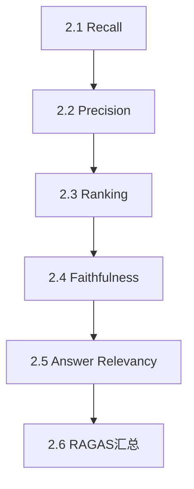
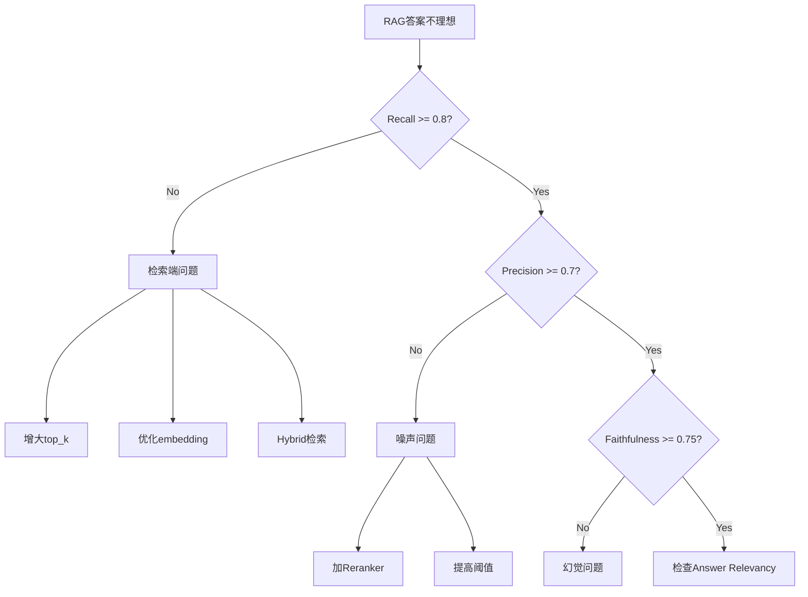

# 深度整合专题创作指南

> **目标**：基于原始课程内容，创作"概念层→计算层→工程层"三层递进的深度解析文档
> **适用场景**：Agent、RAG、Multi-Agent、Model Route、Harness等各个模块的深度整合

---

## 🎯 专题定位

### 与原课程的区别

| 对比维度 | 原课程 | 深度整合专题 |
|---------|--------|--------------|
| **核心目标** | 快速上手，代码实战 | 系统化理解，建立完整心智模型 |
| **内容组织** | 多个独立 notebook，按功能分散 | 统一视角，按理解深度递进 |
| **解释深度** | 知道怎么做 | 知道为什么，理解因果链 |
| **面向场景** | 学习与原型开发 | 面试准备、生产实践、架构设计 |

### 输出形式

- **核心文档**：一份 `{主题}_Deep_Dive.md`（1,500-3,000行）
- **配套文件**：无（原课程notebooks单独保留）
- **索引入口**：专题目录的 README.md

---

## 📋 标准结构模板

### 文档头部
```markdown
# {主题} 深度解析：从概念到生产

> 基于 {原始课程/模块} 整理
> 整合 {列举整合了哪些内容}，按 **概念层 → 计算层 → 工程层** 三层次递进
> 每章末附面试卡片，可直接用于面试备战

---

## 目录

- [0. 前言：为什么 {主题} 是"{定位/痛点}"](#0-前言)
- [第一层 · 概念层：建立心智模型](#第一层--概念层)
  - [1.1 {核心问题1}](#11-)
  - [1.2 {核心问题2}](#12-)
  - [1.3 {核心问题3}](#13-)
  - [1.4 {因果链分析}](#14-)
  - [📋 面试卡片：概念层](#-面试卡片概念层)
- [第二层 · 计算/实现层：{核心技术}](#第二层--计算实现层)
  - [2.0 本章导引：符号表 · 阅读指南](#20-本章导引)
  - [2.1 {技术点1}](#21-)
  - [2.2 {技术点2}](#22-)
  - [2.3 {技术点3}](#23-)
  - [2.4 {技术点4}](#24-)
  - [2.5 {框架实现}](#25-)
  - [2.6 {全景汇总}](#26-)
  - [📋 面试卡片：计算层](#-面试卡片计算层)
- [第三层 · 工程层：{实践要点}](#第三层--工程层)
  - [3.1 {工程问题1}](#31-)
  - [3.2 {工程问题2}](#32-)
  - [3.3 {工程问题3}](#33-)
  - [3.4 {常见错误与避坑清单}](#34-)
  - [3.5 {评测/监控}](#35-)
  - [3.6 {对外呈现}](#36-)
  - [📋 面试卡片：工程层](#-面试卡片工程层)
- [附录](#附录)

---
```

### 0. 前言（200-300行）

**目标**：用痛点开场，建立问题意识

**必备要素**：
1. **痛点描述**：当前实践中的常见问题
2. **对比表格**："靠感觉" vs "数据驱动" / "没有X" vs "有X"
3. **失败模式图**：用ASCII流程图展示典型失败场景
4. **指标/架构总览**：一图建立全局观

**写作技巧**：
- ❌ 避免："本文将介绍XXX"（学术腔）
- ✅ 使用："为什么XXX是缺失的一环"（问题导向）
- ✅ 使用对比表格 + ASCII图 + 真实场景

**示例开头**：
```markdown
### "每次对话都是一张白纸"

大语言模型有一个根本性的设计约束：**每次 API 调用都是无状态的**。
不管你上一轮跟它聊了什么、三小时前告诉过它什么偏好、
上周一起解决了什么问题——下一次 `chat.completions.create()` 调用时，它全部不记得。

这不是 bug，是架构决定的...
```

---

### 第一层 · 概念层（400-600行）

**目标**：建立心智模型，回答"是什么"和"为什么"

**核心原则**：
1. **统一类比**：用同一个比喻贯穿多个概念（如"撒网捕鱼"贯穿Recall/Precision）
2. **对比学习**：并排对比相似概念的异同
3. **因果链分析**：用流程图展示概念间的依赖关系
4. **避免公式**：这一层只讲直觉，不讲计算

**必备小节**：
- **XX 全景**：四象限/架构图/分类体系
- **核心概念直觉理解**：用类比、表格、对比
- **概念间关系**：因果链、互补关系、依赖关系
- **面试卡片**：5-10个快问快答

**写作技巧**：
- ✅ 统一类比法：
  ```markdown
  #### Context Recall & Context Precision — 同一个比喻，两个角度
  
  > **统一类比：撒网捕鱼。**
  > 
  > 池塘里一共有 10 条鱼（GT），你撒了一网捞上来 8 样东西（Retrieved）。
  > 捞上来的东西里——6 条是鱼 ✅，1 只破靴子 🥾，1 把水草 🌿。
  >
  > - **Recall = 6/10 = 0.60** → 还有 4 条鱼漏网了
  > - **Precision = 6/8 = 0.75** → 捞上来的不干净
  ```

- ✅ ASCII流程图：
  ```
  用户提问
    │
    ├── ❌ 失败模式 1：检索失败
    │     └── 找不到相关信息
    │
    ├── ❌ 失败模式 2：生成幻觉
    └── ❌ 失败模式 3：答非所问
  ```

- ✅ 对比表格：
  | 指标 | 低分含义 | 典型原因 | 对下游影响 |
  |------|----------|----------|-----------|

**面试卡片格式**：
```markdown
#### 📋 面试卡片：概念层

**Q1**: Recall 和 Precision 的分母分别是什么？
**A1**: Recall 分母是 GT（该找的），Precision 分母是 Retrieved（找到的）

**Q2**: 为什么生成端没有"完整性"指标？
**A2**: 答案完整性由检索端的 Recall 决定，Generator 拿不到原材料自然无法完整
```

---

### 第二层 · 计算/实现层（600-1000行）

**目标**：搞清楚"怎么算"和"怎么实现"

**核心原则**：
1. **公式演进**：从最简单的版本到完整版本，逐步推导
2. **Binary vs Weighted对照**：并排展示不同计算方式
3. **伪代码 + 真实代码**：先理解逻辑，再看实现
4. **框架汇总**：整合到主流框架（RAGAS/LangChain等）

**必备小节**：
- **2.0 本章导引**：符号表、阅读指南、学习路径
- **各技术点**：
  - 公式推导（3个版本：最简、Binary、Weighted）
  - 伪代码逻辑
  - Python实现片段
  - 陷阱与边界case
- **框架实现**：RAGAS/LangChain等的实现方式
- **全景汇总**：执行流程图 + 参数速查表

**本章导引模板**：
```markdown
### 2.0 本章导引：符号表 · 阅读指南

#### 2.0.1 符号表

| 符号 | 含义 | 备注 |
|------|------|------|
| `GT` | Ground Truth | 标准答案/相关文档集 |
| `R` | Retrieved | 检索结果集 |
| `k` | top_k | 返回文档数 |

#### 2.0.2 双模式阅读

- **快速模式**（面试前3天）：只读公式 + 结论
- **深入模式**（真正要用）：跟着代码手推一遍

#### 2.0.3 学习路径


```

**公式演进示例**：
```markdown
### 2.1 Context Recall：三种计算方式对照

#### 版本1：最简Binary版（教学用）

$$Recall = \frac{|GT \cap R|}{|GT|}$$

- 分子：GT和R的交集（命中了多少个真正相关的）
- 分母：GT的总数（一共有多少个相关的）

**示例**：
- GT = {doc1, doc2, doc3} → 3个相关文档
- R = {doc1, doc4, doc5} → 检索返回3个
- 命中 = {doc1} → 只有1个
- Recall = 1/3 = 0.33

---

#### 版本2：考虑排序（Weighted）

$$Recall_{weighted} = \frac{\sum_{i=1}^{|GT|} rel(C_i) \cdot rank\_weight(i)}{|GT|}$$

**为什么要加权？** Binary版把所有GT视为同等重要，
但实际中doc1可能是核心文档，doc3只是辅助信息。

---

#### 版本3：RAGAS实现（含LLM判断）

1. **输入**：`question`, `contexts`, `answer`
2. **LLM提取答案句子**：
   ```python
   sentences = llm.parse(answer)  # ["句子1", "句子2", ...]
   ```
3. **逐句判断可归因性**：
   ```python
   for sent in sentences:
       verdict = llm.judge(sent, contexts)  # 1或0
   ```
4. **计算**：
   $$Recall = \frac{\sum verdict}{len(sentences)}$$

**与Binary版区别**：
- Binary: 文档级匹配（精确但人工标注成本高）
- RAGAS: 句子级+LLM判断（自动但依赖LLM质量）
```

---

### 第三层 · 工程层（400-600行）

**目标**：回答"怎么用到生产"

**核心原则**：
1. **决策树**：遇到XX问题，按流程图决策
2. **避坑清单**：12条具体的坑 + 如何避免
3. **优化策略**：问题→诊断→方案，结构化呈现
4. **监控/评测**：持续运行的最佳实践

**必备小节**：
- **诊断框架**：四象限/决策树/症状-原因-方案表
- **优化策略速查表**
- **数据集构建/持续评估**
- **常见错误与避坑清单**（至少10-15条）
- **框架选型/对外呈现**

**避坑清单格式**：
```markdown
### 3.5 常见错误与避坑清单

#### ❌ 坑1：用训练集评估（数据泄露）
- **表现**：Recall/Precision 都是 0.95+ 但线上崩盘
- **原因**：评估集和 embedding 训练集重叠
- **解决**：时间切分（训练用1-6月数据，评估用7月）

#### ❌ 坑2：忽略 top_k 对 Recall 的上限约束
- **表现**：怎么调 Recall 都上不去
- **原因**：GT 有 10 个相关文档但 top_k=5
- **解决**：先看 Recall@20 是否达标，再调 top_k
```

**诊断决策树示例**：
```markdown
### 3.2 诊断决策树


```

---

## 🎨 写作风格指南

### 语言风格

#### ✅ 推荐

1. **用真实场景开场**：
   ```markdown
   大多数RAG项目在开发阶段投入了大量精力，
   但到了评估环节却变成了"目测一下答案对不对"。
   ```

2. **用类比解释抽象概念**：
   - "撒网捕鱼"（Recall/Precision）
   - "餐厅点餐"（Faithfulness/Relevancy）
   - "金鱼记忆" vs "持久智能"（Agent Memory）

3. **用对比表格强化理解**：
   | 靠感觉的后果 | 数据驱动的能力 |
   |-------------|---------------|

4. **用ASCII图展示流程**：
   ```
   检索 → 重排 → 生成
     ↓      ↓      ↓
   Recall Precision Faithfulness
   ```

#### ❌ 避免

1. **学术腔**：
   - ❌ "本文将介绍"
   - ✅ "为什么XXX是缺失的一环"

2. **堆砌概念**：
   - ❌ 直接列公式
   - ✅ 先讲直觉 → 再给公式 → 最后代码

3. **单纯罗列**：
   - ❌ "方法1、方法2、方法3..."
   - ✅ "场景A用方法1因为X，场景B用方法2因为Y"

### 排版规范

1. **标题层级**：
   ```
   # 主标题（文档名）
   ## 0. 前言 / 第X层
   ### X.1 小节
   #### 子主题/示例
   ```

2. **代码块**：
   - Python代码用 ```python
   - 伪代码用 ```text
   - Mermaid图用 ```mermaid

3. **强调**：
   - **加粗**：核心概念、关键结论
   - `代码`：变量名、函数名
   - > 引用：重要观点/警告

4. **表格对齐**：
   - 左对齐：文字内容
   - 居中：数值、符号
   - 右对齐：数字统计

---

## 🔄 创作流程

### Phase 1: 资料收集（1-2小时）

1. **读遍原课程内容**：
   - 所有notebooks
   - README文档
   - 代码实现

2. **提取关键信息**：
   - 核心概念列表
   - 公式/算法
   - 代码片段
   - 典型示例

3. **识别痛点**：
   - 课程中哪些概念理解困难？
   - 哪些地方缺少整体视角？
   - 面试会问什么？

### Phase 2: 结构设计（30分钟）

1. **确定三层划分**：
   - 概念层回答什么问题？
   - 计算层的核心技术点有哪些？
   - 工程层的实践要点是什么？

2. **设计统一类比**：
   - 找一个贯穿全文的比喻
   - 确保类比能解释多个概念

3. **绘制思维导图**：
   ```
   主题
   ├── 概念层
   │   ├── 全景框架
   │   ├── 核心概念1
   │   ├── 核心概念2
   │   └── 因果链
   ├── 计算层
   │   ├── 技术点1
   │   ├── 技术点2
   │   └── 框架汇总
   └── 工程层
       ├── 诊断框架
       ├── 优化策略
       └── 避坑清单
   ```

### Phase 3: 初稿撰写（3-5小时）

**按顺序写，不要跳跃**：

1. **0. 前言**（30分钟）
   - 痛点场景
   - 对比表格
   - 失败模式图

2. **第一层**（1小时）
   - 全景图/架构图
   - 核心概念（用类比）
   - 因果链分析
   - 面试卡片

3. **第二层**（1.5小时）
   - 符号表 + 阅读指南
   - 每个技术点：公式演进 → 伪代码 → 真实代码
   - 框架汇总
   - 面试卡片

4. **第三层**（1小时）
   - 诊断决策树
   - 优化策略表
   - 避坑清单（至少10条）
   - 面试卡片

5. **附录**（30分钟）
   - 速查表
   - 代码片段
   - 中英对照

### Phase 4: 校对优化（1小时）

1. **结构检查**：
   - 三层是否均衡？（不要某层特别长/短）
   - 递进关系是否清晰？
   - 目录是否完整？

2. **内容检查**：
   - 类比是否一致？
   - 公式是否有误？
   - 代码是否可运行？
   - 表格是否对齐？

3. **面试卡片检查**：
   - 每层至少5-10个问答
   - 覆盖该层所有核心知识点
   - 答案简洁（1-2句话）

4. **最终通读**：
   - 从头到尾读一遍
   - 确保逻辑连贯
   - 删除冗余内容

---

## 📏 质量标准

### 必达标准（⭐ 基础）

- ✅ 三层结构完整
- ✅ 每层有面试卡片
- ✅ 至少一个统一类比贯穿全文
- ✅ 至少一个ASCII流程图
- ✅ 至少10条避坑清单
- ✅ 文档长度1500-3000行

### 优秀标准（⭐⭐ 进阶）

- ✅ 类比生动易懂，初学者能秒懂
- ✅ 对比表格丰富，横向对比清晰
- ✅ 公式有3个版本（简单→Binary→Weighted/RAGAS）
- ✅ 决策树/诊断框架实用
- ✅ 避坑清单覆盖真实生产场景

### 卓越标准（⭐⭐⭐ 专家）

- ✅ 独创的视角/框架（如四象限）
- ✅ 因果链分析深刻
- ✅ 面试卡片可直接用于面试
- ✅ 附录的速查表可打印随身带
- ✅ 读完能从"会用"到"会讲"的水平

---

## 🎯 后续专题建议

基于当前仓库，建议按优先级创作：

### P0 - 核心模块（必做）

1. **Multi-Agent 深度解析**
   - 原始内容：`04-multiagent/`
   - 三层划分：
     - 概念：架构模式（Pipeline/Hub-Spoke/Blackboard）
     - 计算：协作机制、消息传递
     - 工程：LangGraph/AutoGen/CrewAI实践

2. **Agentic RAG 深度解析**
   - 原始内容：`02-RAG/06 Agentic RAG/`
   - 三层划分：
     - 概念：从简单RAG到Agentic RAG的演进
     - 计算：ReAct在RAG中的应用
     - 工程：路由、自适应检索

### P1 - 进阶模块（推荐）

3. **Model Route 深度解析**
   - 原始内容：`05-model-route/`
   - 三层划分：
     - 概念：路由策略、负载均衡
     - 计算：路由算法、成本优化
     - 工程：动态路由、故障转移

4. **Harness Engineering 深度解析**
   - 原始内容：`06-harnes/`
   - 三层划分：
     - 概念：Agent工程化框架
     - 计算：Tool注册、Session管理
     - 工程：Hook系统、Permission模式

### P2 - 扩展模块（可选）

5. **LLM from Scratch 深度解析**
   - 原始内容：`07-llm_from_scrach/`
   - 三层划分：
     - 概念：Transformer架构
     - 计算：注意力机制、训练流程
     - 工程：分布式训练、模型量化

---

## 💡 快速启动清单

当你准备创作新专题时，按这个清单执行：

### 准备阶段（第1天）

- [ ] 确定专题主题
- [ ] 读完所有原始课程内容
- [ ] 列出核心概念清单（10-20个）
- [ ] 找到统一类比（至少1个）
- [ ] 画出思维导图

### 创作阶段（第2-3天）

- [ ] 写完0.前言（痛点+对比+流程图）
- [ ] 写完第一层（全景+概念+因果链+卡片）
- [ ] 写完第二层（公式演进+代码+汇总+卡片）
- [ ] 写完第三层（诊断+优化+避坑+卡片）
- [ ] 补充附录（速查表+代码+对照表）

### 校对阶段（第4天）

- [ ] 通读全文，检查逻辑
- [ ] 验证所有公式/代码
- [ ] 对齐所有表格
- [ ] 补充遗漏的面试卡片
- [ ] 更新专题README

---

## 🤝 协作约定

如果你希望我帮你创作专题，请提供：

1. **指定主题**：例如"Multi-Agent"
2. **原始内容路径**：例如 `04-multiagent/`
3. **特殊要求**：
   - 是否有特定的痛点要强调？
   - 是否有特定的框架要重点讲？
   - 预期篇幅（默认1500-3000行）

我会：
1. ✅ 完整阅读原始内容
2. ✅ 按三层结构组织
3. ✅ 提供统一类比和ASCII图
4. ✅ 包含面试卡片和避坑清单
5. ✅ 一次性完成，减少来回修改

---

**最后提醒**：创作专题不是重复课程内容，而是**建立理解的脚手架**。你的目标读者是：

- 🎯 学完课程但还没建立完整心智模型的人
- 🎯 准备面试需要系统化复习的人
- 🎯 要在生产环境部署需要避坑指南的人

**Keep it structured, keep it practical, keep it interview-ready!** 🚀
