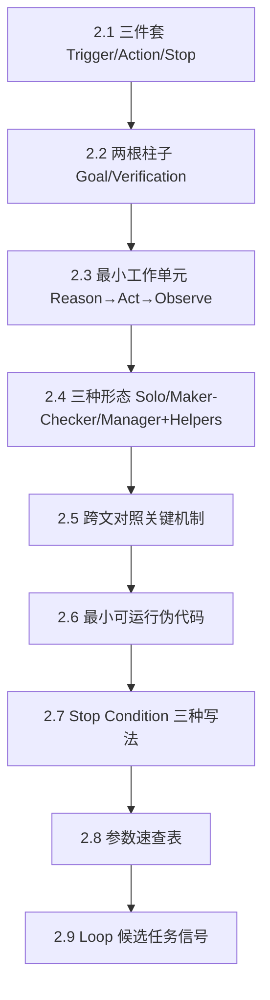

# Loop Engineering 深度解析：从四层演进到可落地的 loop 设计

> 把 `09-loop-engineering/` 三文蒸馏成一份面试向专题：概念层 → 实现层 → 工程层
> 每层末尾附面试卡片；末尾附 5 分钟速查卡。
>
> **目标读者**：会 Python、求职 AI 应用开发（RAG/Agent）、要把三文压成"面试能讲出来的架构语言"的人。
> **范围红线**：只写三文里真实存在的内容，不引入外部框架细节补全。
>
> > 本篇为冲刺压缩版（约 540 行）；按《专题创作指南》§转正规则，面试后可扩写至 1500+ 行完整版。

---

## 目录

> **本文结构：总 → 分 → 查。** 【总】= 先读的全局地图｜【分】= 三层递进正文｜【查】= 随时查阅
> 地图里讲的每个概念，都能在"分"的三层里找到展开；三层的每一节，也都标明它承接地图的哪一条。

- 【总】[0. 前言：为什么 Loop Engineering 是"缺失的一环"](#0-前言为什么-loop-engineering-是缺失的一环)
- 【总】[📍 本页定位与蒸馏溯源](#-本页定位与蒸馏溯源)
- 【总】[🔗 全文地图（先读这节）：Loop 是什么 · 三篇在干嘛 · 怎么看下去](#-全文地图先读这节loop-是什么--三篇在干嘛--怎么看下去)
  - [地图 §1 · Loop 一句话说清](#1-先把loop用一句人话说清楚)
  - [地图 §2 · 三篇 = 一件事的三个阶段](#2-三篇其实是一件事的三个阶段不是三个并列的观点)
  - [地图 §3 · 三篇的逻辑关系（主线）](#3-三篇的逻辑关系这就是那条主线)
  - [地图 §4 · 术语人话对照表](#4-术语人话对照表看不懂就回来查这里)
  - [地图 §5 · 面试 30 秒答法（总纲版）](#5-面试怎么说30-秒可直接背)
  - [地图 附 · Loop 演进时间线（附人话）](#附loop-的演进时间线来自-02-2附人话)
- 【分·概念层】[第一层 · 概念层：四层演进与 Loop 的位置](#第一层--概念层四层演进与-loop-的位置)
  - [1.1 四层"叠环"模型（承接地图 §1）](#11-四层叠环模型来自-09-loop-engineering01context-looop-engineeringmd5-12)
  - [1.2 上下文膨胀与泄漏](#12-上下文膨胀与泄漏来自-01-3)
  - [1.3 同一个 NASA 故事](#13-同一个-nasa-故事来自-01-5)
  - [1.4 Loop 的核心定义（三文原话，补充地图 §1）](#14-loop-的核心定义综合三文)
  - [1.5 地图 §2 的展开：三篇对同一问题的口径对照](#15-地图-2-的展开三篇对同一问题的口径对照)
  - [1.6 反思：Loop 不是万能药](#16-反思loop-不是万能药)
  - [1.7 六大组件（地图 §2"零件清单"的展开）](#17-六大组件来自-01-9addy-osmani)
  - [1.8 因果链：概念之间的前提关系（区别于地图 §3）](#18-因果链四层--三件套-谁是谁的前提)
  - [📋 面试卡片：概念层](#-面试卡片概念层)
- 【分·实现层】[第二层 · 实现层：关键机制、跨文对照与最小工程](#第二层--实现层关键机制跨文对照与最小工程)
  - [2.0 本章导引：符号表 · 双模式阅读 · 学习路径](#20-本章导引符号表--双模式阅读--学习路径)
  - [2.1 三件套：Trigger · Action · Stop（地图 §2 提到过，这里是机制）](#21-三件套trigger--action--stop来自-09-loop-engineering03loop-engineeringmd11-18)
  - [2.2 两根柱子：Goal + Verification](#22-两根柱子goal--verification来自-09-loop-engineering03loop-engineeringmd21-50)
  - [2.3 最小工作单元：Reason → Act → Observe（即地图 §1 的实习生比喻）](#23-最小工作单元reason--act--observe来自-09-loop-engineering03loop-engineeringmd147-187)
  - [2.4 形态选择：Solo / Maker-Checker / Manager+Helpers（地图 §2 三个阵型）](#24-形态选择solo--maker-checker--managerhelpers来自-09-loop-engineering03loop-engineeringmd189-225)
  - [2.5 跨文对照：关键机制的统一表](#25-跨文对照关键机制的统一表)
  - [2.6 最小可运行示意（综合 02 + 03 的伪代码）](#26-最小可运行示意综合-02--03-的伪代码)
  - [2.7 Stop Condition 三种写法](#27-stop-condition-三种写法来自-09-loop-engineering03loop-engineeringmd229-303)
  - [2.8 参数速查表（综合三文的经验区间）](#28-参数速查表综合三文的经验区间)
  - [2.9 三文都强调的"Loop 候选任务"信号清单](#29-三文都强调的loop-候选任务信号清单)
  - [📋 面试卡片：实现层](#-面试卡片实现层)
- 【分·工程层】[第三层 · 工程层：决策、避坑与场景](#第三层--工程层决策避坑与场景)
  - [3.1 决策树：什么时候该上 Loop？（地图 §3 的"缺了它会怎样"落地版）](#31-决策树什么时候该上-loop)
  - [3.2 形态选型建议（4 类场景）](#32-形态选型建议4-类场景)
  - [3.3 常见错误与避坑清单（≥10 条）](#33-常见错误与避坑清单-10-条)
  - [3.4 Loop 跑能上限](#34-loop-跑能上限来自-09-loop-engineering03loop-engineeringmd350-358)
  - [3.5 何时不上 Loop](#35-何时不上-loop来自-09-loop-engineering03loop-engineeringmd53-97)
  - [3.6 三文共同的"上 Loop 清单"汇总](#36-三文共同的上-loop-清单汇总)
  - [📋 面试卡片：工程层](#-面试卡片工程层)
- 【查】[三文冲突与我的判断](#三文冲突与我的判断)
- 【查】[📇 5 分钟速查卡（可打印）](#-5-分钟速查卡可打印)
- 【查】[参考与后续动作](#参考与后续动作)
- 【查】[附录 A：面试常见追问 5 题](#附录-a面试常见追问-5-题综合三文答法)
- 【查】[附录 B：诚实清单](#附录-b诚实清单仅来自三文未引入外部细节)
- 【查】[附录 C：中英对照术语表](#附录-c中英对照术语表)

---

## 0. 前言：为什么 Loop Engineering 是"缺失的一环"

### 痛点：人成了自己系统的瓶颈

跑过几次 Agent 项目你就会发现：**真正慢的不是模型，是人。** 模型推理几秒出结果，devoting 重启、回滚、debug、按 prometheus 查指标、逐行 review——**人**才是串行回路里最慢的一节。当项目从"一次性 demo"进入"持续维护"阶段，每天凌晨 3 点的 bug 工单、每小时刷新的比分数据，**让人来当 cron** 这件事本身就是系统性的失败。

`09-loop-engineering/01.context-looop-engineering.md:7` 把这层"缺失的一环"挑明：**下层不消失，上层叠加上去。** Loop 之所以独立成层，不是因为它时髦，而是因为"人在充当 cron"这件事已经成了能力边界外扩时的结构性瓶颈。

| 没有 Loop 的后果 | 有 Loop 的能力 |
|------------------|----------------|
| 比赛数据每小时过期，靠人手动 prompt 更新 | Trigger 定时拉取 + Solo Loop 自动同步 |
| Bug 工单凌晨涌入，靠人醒着盯 | 事件触发 + Maker–Checker 自动排查修复 |
| 几百 commit 后跟不上自己系统在做什么 | Skills 沉淀 + Logging 审计 |
| Loop 跑了几小时却没进展，靠人肉重启 | Hard Stop + 进度停滞判断自动停 |
| 自评自嗨、自评偏差没人发现 | Independent Verifier / Separate Checker |
| 跨 run 记忆丢光，每轮从零学 | Memory / State 落磁盘（Markdown/Linear/Board） |

> **没有 Loop 这一层，前面所有层（Prompt / Context / Harness）再好也只能解决"一次性交付"——"持续运转"必须把"下一轮谁来开启"工程化。**

### Loop 没装护栏的典型翻车场景

```
Loop 启动
  │
  ├── ❌ 翻车 1：种子 Prompt 模糊
  │     └── "做一个好看的页面" → 自信地朝错误方向反复猜测
  │
  ├── ❌ 翻车 2：没有 Hard Stop
  │     └── 迭代 200 轮还在改，烧光预算，token 钱包出洞
  │
  ├── ❌ 翻车 3：自评自嗨（写 ≠ 验）
  │     └── Maker 自己给自己的代码打分，永远 100 分
  │
  ├── ❌ 翻车 4：跨 run 记忆丢光
  │     └── 每轮从零学项目约定，Skill 无法复利
  │
  └── ❌ 翻车 5：Orchestration Tax 失守
        └── 几百个 Agent 并行，你跟不上自己在做什么
```

### 本篇能给你什么

按「**概念层 → 实现层 → 工程层**」三层递进，把三文压缩成面试能讲出来的架构语言——

- **概念层**：四层演进（Prompt→Context→Harness→Loop）+ Loop 的合法性 + 六大组件
- **实现层**：三件套 / 两根柱子 / 最小工作单元 / 三种形态 / 跨文对照
- **工程层**：决策树 / 避坑清单 / 形态选型 / 何时不上

每层末尾 5–10 张面试卡片，末尾 5 分钟速查卡可打印带去面试。

> **读法**：先读下一节 **🔗 全文地图**（那里用最白的话讲清"Loop 是什么 + 三篇在干嘛"，并给出"总→分"对照），再按 概念层 → 实现层 → 工程层 往下。地图里每个概念都能在分层里找到展开，反之亦然。

---

## 📍 本页定位与蒸馏溯源

### a) 在计划中的位置

本页服务于 **5 日冲刺 D1** 的 **「09:00–11:00 概念 M」** 时间盒，对应**六层栈的 L4 运行时（loop / harness 内核）**。在 D4 会与 LangGraph（确定性图编排）/ Hermes（记忆持久化）做对照收口，在 D5 与 CI/CD / 评测闭环。

### b) 被蒸馏源明细

| # | 源文件 | 行数 | 主旨（真读后概括） |
|---|--------|------|--------------------|
| 01 | `09-loop-engineering/01.context-looop-engineering.md`（注意文件名是 looop 三个 o，原样保留） | 484 | **四层演进**：Prompt → Context → Harness → Loop；每一层补上一层的缺口；提出 Addy Osmani 的六大组件（Automations · Worktrees · Skills · Plugins · Sub-agents · Memory）作为配方 |
| 02 | `09-loop-engineering/02.loop-engineering.md` | 445 | **Loop 的定义、护栏与陷阱**：Loop = Cron + decision maker in the body；强调 Verification、Orchestration Tax、种子 Prompt、硬停与花费上限、Skill 复利 |
| 03 | `09-loop-engineering/03.loop-engineering.md` | 424 | **澄清与落地形态**：Trigger + Action + Stop Condition 三件套；Goal + Verification 两根柱子；Reason → Act → Observe 最小工作单元；Solo/Maker-Checker/Manager+Helpers 三种形态；按场景判断，不跟风上舰队 |

### c) 蒸馏理由与方法

三文是同一主题的三次递进：01 把 Loop 放进「为什么需要新一层」的大图（概念合法性），02 给 Loop 的工程护栏与成本真相（工程护栏），03 把模糊叙事压到「Trigger/Action/Stop + Goal/Verification + 形态选择」（落地形态）。合并理由：单看任一篇都会被另两篇补上的关键护栏漏掉；分开看又会重复同一概念（如 Verification、Stop Condition）。方法：**按"命题 → 机制 → 工程后果"重排，跨文对齐同一概念、显式化冲突点**。所有内容均来自上述三文，未引入外部框架细节。

---

## 🔗 全文地图（先读这节）：Loop 是什么 · 三篇在干嘛 · 怎么看下去

> **这一节是"总"，后面三层是"分"。** 第一次接触 loop 就只读这节——这里把三篇的行话全部翻成普通话，读完再进三层，术语不会再卡。
> 读法：**§1→§2→§3 建概念（15 分钟）→ §4 术语当字典（随时回查）→ §5 背一段面试答法**；然后按下面这张"总→分"对照进入正文。

| 地图里的哪一条 | 会在下面哪一节展开 |
|---|---|
| §1 Loop 是什么（含实习生比喻） | 1.1 四层叠环（Prompt→Context→Harness→Loop）、1.4 三文原话定义、2.3 最小工作单元 Reason→Act→Observe |
| §2 三篇分工 + 零件/刹车/阵型 | 1.5 三篇对同一问题的口径对照、1.7 六大组件、2.1 三件套、2.4 三种阵型 |
| §3 三篇的接力关系 | 1.8 概念之间的前提关系、3.1 决策树 |
| §4 术语人话表 | 2.0 符号表（实现层专用符号，通用术语不重复）、附录 C 中英对照 |
| §5 面试 30 秒答法 | 各层末尾 📋 面试卡片（分层版）、📇 5 分钟速查卡（压缩版） |

### 1. 先把"Loop"用一句人话说清楚

**Loop（循环）= 让 AI 自己一轮一轮地干下去，直到满足事先定好的"完成条件"才停——而不是你每走一步都要再催它一次。**

| 对比 | 你现在的做法（人肉循环） | 有 Loop 之后（循环交给系统） |
|---|---|---|
| 谁决定下一步 | 你读它的输出 → 你想 → 你再写提示词 | Agent 自己读结果 → 自己决定下一步 |
| 什么时候结束 | 你觉得差不多了，说"就这样吧" | 事先定死的完成条件达标，它才停 |
| 你的角色 | **你是瓶颈**（你不发话它就停） | 你是**验收人**（只在它说"做完了"时检查）|

源文 `09-loop-engineering\03.loop-engineering.md` §4 的原话类比：**像一个不用你盯着的聪明实习生**——你交目标，它自己决定下一步、自己检查、再来一轮，确认过几次之后才回来跟你说"做完了"。

配套的关键预期（03 §3 原话精神）：**Loop 不是为了 100% 完美交付，而是让你"第一次就离目标近得多"。**

### 2. 三篇其实是一件事的三个阶段（不是三个并列的观点）

| # | 这篇在回答什么问题（人话） | 它反复强调的那个词 → 一句人话 | 你能直接拿走的东西 | 它的语气 |
|---|---|---|---|---|
| **01** | **为什么需要 loop 这一层？** 从"会写提示词"到"会管循环"，中间补了几层？ | **四层叠环**：Prompt（会说话）→ Context（会自己找资料）→ Harness（会拆活、会管运行环境）→ Loop（连"何时再跑一轮"也自动化）；**每加一层，都是因为上一层留了坑** | **一份零件清单**：六大组件 = Automations（定时触发）/ Worktrees（隔离工作区）/ Skills（知识写进 SKILL.md）/ Plugins & Connectors（MCP / API）/ Sub-agents（干的人 ≠ 验的人）/ Memory & State（磁盘上的进度） | 讲"为什么" |
| **02** | **真跑起来会怎么亏、怎么失控？** | **Orchestration Tax（编排税）**：你能同时管几个 agent，不由工具决定，**由你 review 的精力决定**；真吞吐 ≈ min(工具能并行几个，你能看几个)。另附标志性定义：**Loop = Cron + 决策体** | **四个刹车**：独立验收 Verification / 硬停机 Hard Stop / 花费上限 / Memory 落盘（跨次运行不丢）；外加外围零件（Worktrees、Skills、Connectors、动态扩缩） | 讲"代价" |
| **03** | **我到底该用哪种？大多数任务需要多复杂？** | **Trigger + Action + Stop（触发器 + 动作 + 停机条件）**：一个 loop 就这三件；外面再加两根柱子 Goal（目标）+ Verification（验收）| **三种阵型 + 各自风险**：Solo（单 agent，默认首选；风险 = 自评偏差）/ Maker-Checker（一个做、一个打分；风险 = 协调成本上升）/ Manager+Helpers（主 agent 派活给多个帮手；风险 = 成本与理解鸿沟放大） | 讲"怎么做" |

### 3. 三篇的逻辑关系（这就是那条主线）

```text
你让 AI 干一次活
   └─ 它一次干不完 / 干不对 ──► 你只能反复催它 ──► 你成了瓶颈
                                                    │  这就是需要 Loop 的动机
                                                    ▼
   ┌─────────────────────────────────────────────────────────────┐
   │ 01 · 为什么要有这一层 + 要准备哪些零件（合法性 + 配方）        │
   │   缺了它 → loop 只是"定时任务 cron"：到点跑固定脚本，不会判断  │
   └─────────────────────────────────────────────────────────────┘
                                                    │ 于是你让它自己反复干
                                                    ▼ 立刻冒出四个新麻烦
   ┌─────────────────────────────────────────────────────────────┐
   │ 02 · 会烧钱 / 会跑偏 / 会忘事 / 没人独立验收（真相 + 护栏）     │
   │   缺了它 → loop 是"没人管的烧钱机器"：自己夸自己干得好、        │
   │            停不下来、跨次运行忘光、你的评审精力跟不上           │
   └─────────────────────────────────────────────────────────────┘
                                                    │ 护栏有了，再问：所有任务都要这么重吗？
                                                    ▼
   ┌─────────────────────────────────────────────────────────────┐
   │ 03 · 不必。默认 Solo；需要客观打分才上 Maker-Checker；          │
   │      能拆并行才上 Manager+Helpers（而且要付"编排税"）           │
   │   缺了它 → 你会把一个小任务堆成一支舰队，自己根本 review 不过来  │
   └─────────────────────────────────────────────────────────────┘
```

**一句话关系（无行话版）**：

- **01 讲"为什么要有它、零件有哪些"**——没这层，你只是把 AI 当定时脚本用（到点跑、不会变通）；
- **02 讲"真跑起来会怎么亏、必须装哪四个刹车"**——没这些刹车，它自己夸自己、停不下来、还越跑越贵；
- **03 讲"大多数任务不用搞那么大，怎么选阵型"**——没这个判断，你会把一个小活堆成一支舰队。

三篇是**接力关系**：01 立合法性 → 02 立护栏 → 03 落到"最小可行形态"。**任缺一篇，loop 都会以不同方式翻车。**

### 4. 术语人话对照表（看不懂就回来查这里）

| 行话 | 一句人话 |
|---|---|
| **Loop（循环）** | 让 AI 自己一轮一轮干，直到满足完成条件才停 |
| **Cron（定时任务）** | 时间到了跑一段固定脚本，不会思考、不会变通 |
| **decision maker in the body（体内决策体）** | loop 比 cron 多的那部分：每轮读状态 → 决定下一步 → 执行 → 检查 → 再判断要不要继续 |
| **Harness（挽具 / 外壳）** | 包在模型外面的那层工程：拆任务、管上下文、给工具、管权限 |
| **四层演进** | 手艺的四次升级：会说话 → 会自己找资料 → 会拆活管环境 → 连"何时再跑"都自动化 |
| **Verification（验收）** | 由一个**独立**角色检查"是否真的做到"，不是干活那位自己说好 |
| **Hard Stop（硬停机）** | 事先定死的停止线：最多几轮 / 最多多久 / 最多花多少钱 |
| **Orchestration Tax（编排税）** | 并行开几个 agent 就要 review 几份产出；**你的精力就是天花板** |
| **Skill（技能）** | 把这次学到的做法写成文件（SKILL.md），下次直接复用——越用越省 |
| **Worktree（独立工作区）** | 每个 agent 一份代码副本，避免互相覆盖 |
| **Sub-agent（子代理）** | 在独立上下文里跑完整循环的 agent；典型用途 = 让"干的人"和"验的人"分开 |
| **Solo / Maker-Checker / Manager+Helpers** | 三种阵型：一个人干 / 一个干一个验 / 一个派活给多个干 |
| **Fleet（舰队）** | 开一大堆 agent 并行；源文的提醒是"不理解就上规模，放大的是问题，不是产出" |

### 5. 面试怎么说（30 秒，可直接背）

> "Loop 就是把'反复干'这件事工程化：**Loop = Cron + 决策体**——比定时任务多了每轮读状态、决定下一步。
> 但它不免费：必须装**独立验收**和**硬停机**（轮数 / 时长 / 花费上限），否则就是烧钱机器；
> 并行还要付**编排税**——能开多少 agent 取决于我 review 得过来多少，不取决于工具。
> 落地我默认用最小形态（单 agent 的 Solo loop：Reason → Act → Observe），
> 需要客观打分才上 Maker-Checker，能拆并行才上 Manager+Helpers。"

---

### 附 2：Loop 的演进时间线（来自 02 §2，附人话）

```text
最早期            2022              2023               近期
while + model  →  ReAct          →  AutoGPT        →  纪律型 Loop
（最朴素的环）    （推理→行动→读     （给个目标就        （固定指令反复喂、
                    结果→重复）       自己跑，常空转      每轮重置上下文、
                                     烧 token、交付      独立检查说停才停）
                                     不了）
                                       │                  │
                                       ▼                  ▼
                                 空转烧钱、几乎不交付   Claude Code / Codex
                                                       一类产品的主流形态
```

| 阶段 | 人话 | 结果 |
|---|---|---|
| while + model | 写个死循环让模型反复答 | 概念上成立，但没有"该不该继续"的判断 |
| ReAct（2022） | 推理 → 行动 → 读结果 → 再循环 | Agent 范式成型（今天仍在用） |
| AutoGPT（2023） | 给个目标让它自己跑、自己给自己派活 | 常空转烧 token，几乎交付不了 |
| 纪律型 Loop（今） | 固定指令反复喂、每轮重置上下文、由**独立检查**决定是否结束 | Claude Code / Codex 一类产品的主流形态 |

> **面试要点**：当有人说 "design loops" 时，真正该问的是**哪一种 loop**（02 §2 原句）。

---

## 第一层 · 概念层：四层演进与 Loop 的位置

> **统一类比：餐厅运营升级。**
>
> 用一家餐厅的运营升级来贯穿全文——
>
> | 餐厅角色 | 对应层级 | 谁负责 |
> |---------|----------|--------|
> | 服务员记住你的忌口 | **Prompt** | 人一次提醒 |
> | 服务员自己去厨房问、配菜 | **Context** | Agent 自主调用 |
> | 餐厅经理拆桌位、盯流程 | **Harness** | 外置系统管理 |
> | 店长看营业数据决定明天要不要继续开业 | **Loop** | 调度与状态驱动 |
>
> 这个类比会反复回扣：上下文膨胀≈后厨传单堆满、咖啡杯满了；Verification≈品控员≠主厨；Orchestration Tax≈老板自己也吃不完几百桌菜；Hard Stop≈关门打烊时间。

### 1.1 四层"叠环"模型（来自 `09-loop-engineering/01.context-looop-engineering.md:5-12`）

工程范式在每一层能力边界外扩时，把上一层补不上的缺口工程化。**下层不消失，上层叠加上去。**（餐厅升级：服务员→配菜员→经理→店长，下一棒补上一棒的缺口。）

| 层级 | 解决什么 | 谁发起下一轮 | 留下的缺口（催生下一层） |
|------|----------|--------------|----------------------------|
| Prompt Engineering | 约束模型角色与行为 | 人类一次提问 | 上下文大多空着 |
| Context Engineering | Agent 自主装填上下文（工具/MCP/搜索） | Agent 调用工具直到足够 | 长任务（≈5–10 分钟）后上下文超窗；摘要会泄漏细节 |
| Harness Engineering | 在 context 之外管理 Agent | 外部系统管理任务与运行时 | 仍要人不断发起下一轮 |
| Loop Engineering | 减少人类持续催促 | 调度与状态驱动下一轮 | —— |

```
┌─────────────────────────────────────────────────────────────┐
│ Loop · 最外环  调度 / 状态 / 验证 决定下一轮是否开启          │
│   ┌───────────────────────────────────────────────────────┐ │
│   │ Harness · 外置任务环  任务队列 / 取任务 / 反馈           │ │
│   │   ┌─────────────────────────────────────────────────┐ │ │
│   │   │ Context · 工具环  Agent ⇄ 工具 → 上下文足够 → 回答│ │ │
│   │   └─────────────────────────────────────────────────┘ │ │
│   └───────────────────────────────────────────────────────┘ │
└─────────────────────────────────────────────────────────────┘
```

**统一类比：餐厅运营升级**（贯穿三文）
- Prompt = 服务员记住你的忌口（单轮约束）
- Context = 服务员自己去厨房问、配菜（自主装填）
- Harness = 餐厅经理拆桌位、盯流程（外置管理）
- Loop = 店长看营业数据决定明天要不要继续开业（最外环的"何时再开")

### 1.2 上下文膨胀与泄漏（来自 01 §3）

> **统一类比：水杯装水**。
> Prompt 只占杯子的一小块；Context Engineering 让 Agent 自己往杯里加水；水加到 5–10 分钟任务后接近杯沿——这时让 Agent "快满了就自己总结"会**泄漏**：每轮摘要都丢细节。

- **位置**：发生在 Context 环内、Agent 与工具的循环里
- **后果**：细节丢失导致重复犯同样错；目标漂移
- **Harness 的回应**：把任务拆小、把 runtime 移出窗外，让每个 Context 环只负责"当前任务"

### 1.3 同一个 NASA 故事（来自 01 §5）

| 提问 | 主要依赖 | 原因 |
|------|----------|------|
| 地球和月亮之间能塞多少芝士汉堡？ | Prompt | 闭卷推理，不需要外部信息 |
| NASA 最近有什么发现？ | Context | 需要检索并自主补全上下文 |
| 把整个 NASA 官网 clone 下来？ | Harness | 超长、多步骤；只靠 context 会中途 choke |

> **面试常考点**：给一个具体任务，判断它应该落在哪一层——考的就是"上下文够不够、任务稳不稳、是否要外置管理"。

### 1.4 Loop 的核心定义（三文原话，补充地图 §1）

> 地图 §1 已给过一句人话定义；本节给的是**三文的原话**与它们的交集。

| 来源 | 定义 |
|------|------|
| 01 §7 | "再搭一层脚手架，让 Agent 也能对自己发起下一轮该做什么"——human-guided 走向 self-guided |
| 02 §1 | "你不该再不停地 prompt coding agent；你该设计会去 prompt agent 的 loop" |
| 03 §0 | "Loop Engineering = 把自己从『不断 prompt 的人』替换掉" |

**交集**：Loop 的本质是把"下一轮谁来开启"工程化；**不是否定下层，而是 scope 变大后，环必须再往外长一层**（01 §6 关键判断）。

### 1.5 地图 §2 的展开：三篇对同一问题的口径对照

> 地图 §2 讲的是"三篇各负责哪一段"；本节讲的是"**同一个问题**，三篇分别怎么回答"（会发现口径互补而非冲突）。

| 观点 | 01 | 02 | 03 |
|------|----|----|----|
| Loop 是不是 buzzword？ | 是争议，但"能力边界持续外扩时值得认真讨论" | 不回避：可能是 cron 换皮 + 烧更多 token | 澄清：别人 10 倍的方式不等于你的方式 |
| Loop 是不是 cron？ | —— | **Loop = Cron + decision maker in the body** | Trigger + Action + Stop 三件套 |
| 上 Loop 的前提 | 可验证、可重复的维护类工作 | Verification、硬停、花费上限、Skill 复利 | Checkable Goal + Hard Stop + Good Tools + Memory + Separate Checker |

> 三个口径并不冲突：01 谈**何时需要**，02 谈**不装护栏会怎样**，03 谈**怎么落地形态**。**这是递进，不是分歧。**

### 1.6 反思：Loop 不是万能药（来自 01 §7、03 §2）

- 01 §7 直接列出争议："有人认为它是 buzzword，只会烧更多 token、产出更多 AI slop；目前『一锤定音』的落地案例仍然偏少。"
- 03 §2 给出口径："如果不上『24/7 舰队』就落后了"——**通常是错的**。

**判断原则**：**可验证、可重复、停机条件清晰的任务**才适合 Loop；目标模糊、无法客观验收的任务上 Loop 等于"无人值守地犯错"（01 §10 / 02 §10 / 03 §10 三文共同结论）。

### 1.7 六大组件（来自 01 §9，Addy Osmani）

五个执行原语，外加一个跨 run 的记事本：

**Automations · Worktrees · Skills · Plugins/Connectors · Sub-agents · Memory/State**

| # | 组件 | 在环里的工作 | 一句话 | 触发来源 |
|---|------|--------------|--------|----------|
| 1 | **Automations** | 定时触发 discovery / triage | 没有它只是跑过一次，不是 loop | 时间/事件 |
| 2 | **Worktrees** | 并行 Agent 使用隔离工作树 | 避免同仓互相覆盖 | 并行任务 |
| 3 | **Skills** | 用 `SKILL.md` 固化约定与流程 | 不必每次会话重新猜项目规矩 | 项目复用 |
| 4 | **Plugins / Connectors** | 接入已有工具链 | Agent 能接触真实工单、CI 与数据 | 外部系统 |
| 5 | **Sub-agents** | Maker–Checker 分工 | 想法与验证拆开 | 验证环节 |
| 6 | **Memory / State** | 会话外持久化"已做 / 下一步" | **模型会忘，仓库与文件不会**（最不起眼却最关键） | 跨 run |

> 六个组件不是"必须全装"，是 Loop 工程的横切配方。**面试时按编号 1→6 报一遍**，比"循环组件化"这种空话有说服力得多。

### 1.8 因果链：概念之间的前提关系（区别于地图 §3）

> 地图 §3 讲的是**三篇文章之间**的接力；本节讲的是**概念之间**的前提：四层谁催生谁、三件套谁先谁后。

（餐厅升级版：服务员→配菜员→经理→店长，每上一层都是因为下一层的某件事"忙不过来"。）

```
[Prompt]  模型会说人话
   │  但 上下文大多空着
   ▼
[Context]  Agent 自己捞信息
   │  但 长任务（≈5–10 分钟）上下文见底；自摘要会泄漏
   ▼
[Harness]  外置任务队列 + Runtime
   │  但 仍要人不断发起下一轮（人在充当 cron）
   ▼
[Loop]  调度 / 状态 / 验证 决定下一轮是否开启
   │
   ▼
三件套依赖关系：
   Trigger  ─┐
              ├─▶  Action ──▶  Stop Condition
   Action   ──┘           （不可绕开 Stop，否则是无限循环）
   Verification 是 Stop 是否可信的前提（不可绕）
```

| 因果链 | 谁是谁的前提 | 餐厅类比 |
|--------|--------------|----------|
| Prompt → Context | 没角色约束，Agent 不知如何装上下文 | 服务员不记忌口，配菜员无从下手 |
| Context → Harness | 工具环内上下文见底，必须外置任务 | 后厨传单堆满，必须经理拆桌位 |
| Harness → Loop | 任务拆完了，但"下一轮谁开启"还得靠人 | 经理盯完流程，店长才能决定明天开不开 |
| Trigger / Action / Stop 三件套 | Stop 不可绕开；Verification 是 Stop 可信的前提 | 没有打烊时间 = 24h 餐厅；品控不可省 = 关门也要品控 |
| Goal → Verification | 目标越客观，Verification 才有可能 | "做完了"标准不清，品控员也没法判 |

> **面试要点**：被问"为什么 Loop 必须有 Stop"时，按这条因果链讲——Trigger/Action 都可省，**Stop 不可省**，没有 Stop 的 Loop 是没关门的餐厅。Verification 是 Stop 可信的前提，没有独立 Verification 的 Stop 只是空话。

### 📋 面试卡片：概念层

**Q1**：Prompt / Context / Harness / Loop 四层的关系是什么？
**A1**：递进叠加而非替换；每一层补上一层的结构性缺口——Prompt 留空上下文，Context 留长任务泄漏，Harness 留人类必须持续催促，Loop 把"下一轮谁开启"工程化。

**Q2**：为什么 Context Engineering 不能解决长任务？
**A2**：超 5–10 分钟任务所需上下文常常超出窗口；让 Agent 自己摘要会逐轮泄漏细节。

**Q3**：Loop 和 Cron 到底差在哪？
**A3**：Cron 调度固定脚本；Loop = Cron + 中间的决策体——读状态、模型决定下一步、执行、检查、再决定是否继续。

**Q4**：Loop Engineering 在面试里怎么一句话讲清楚？
**A4**：把人从"不断按按钮的人"换成"设计按按钮系统的人"；Agent 自己根据状态发起下一轮。

**Q5**：01 的"六大组件"是哪六个？
**A5**：Automations / Worktrees / Skills / Plugins & Connectors / Sub-agents / Memory & State——其中 Memory 最不起眼，却是跨 run 复合而非重置的关键。

---

## 第二层 · 实现层：关键机制、跨文对照与最小工程

### 2.0 本章导引：符号表 · 双模式阅读 · 学习路径

> 地图 §4 已解释过通用术语（Loop / Cron / 编排税 / 三种阵型…），本表只收**实现层专用**的符号，不重复。

#### 2.0.1 符号表

| 符号 / 缩写 | 含义 | 出处 |
|-------------|------|------|
| **Loop** | 自我发起下一轮的 Agentic 循环 | 综合三文 |
| **Trigger** | 触发器（定时 / 事件 / 状态） | `09-loop-engineering/03.loop-engineering.md:11-18` |
| **Action** | Loop 主体动作（含 Reason→Act→Observe） | `09-loop-engineering/03.loop-engineering.md:147-187` |
| **Stop Condition** | 何时停（Metric=Result / 硬顶 / 主观停） | `09-loop-engineering/02.loop-engineering.md:78` `09-loop-engineering/03.loop-engineering.md:11-18` |
| **Goal** | 目标（尽量客观） | `09-loop-engineering/03.loop-engineering.md:21-50` |
| **Verification** | 独立验证（Maker≠Checker） | `09-loop-engineering/02.loop-engineering.md:240-274` `09-loop-engineering/03.loop-engineering.md:21-50` |
| **ReAct** | Reason → Act → Observe 最小工作单元 | `09-loop-engineering/03.loop-engineering.md:147-187` |
| **Orchestration Tax** | 并行的天花板是 review bandwidth | `09-loop-engineering/02.loop-engineering.md:277-323` |
| **Hard Stop** | 硬顶迭代/时间/花费，防止空转 | `09-loop-engineering/02.loop-engineering.md:368-386` `09-loop-engineering/03.loop-engineering.md:339-358` |
| **Skills** | 用 SKILL.md 固化项目知识，复利 | `09-loop-engineering/02.loop-engineering.md:389-416` |
| **Worktrees** | 隔离副本，并行 Agent 不撞文件 | `09-loop-engineering/02.loop-engineering.md:228-237` |
| **Solo / Maker-Checker / Manager+Helpers** | 三种 Loop 形态 | `09-loop-engineering/03.loop-engineering.md:189-225` |
| **Six Components** | Automations / Worktrees / Skills / Plugins / Sub-agents / Memory | `09-loop-engineering/01.context-looop-engineering.md:362-415` |
| `state` | Loop 状态字典（done / tries / best_score / log） | 本页伪代码（综合 02/03） |
| `metric = result` | 客观硬停形式（最推荐） | `09-loop-engineering/03.loop-engineering.md:301-303` |

#### 2.0.2 双模式阅读

- **快速模式**（面试前 3 天）：只读每节表格 + 末尾面试卡片 + 速查卡——能把"为什么 Loop / Loop ≠ Cron / 三件套 / 两根柱子 / Orchestration Tax"讲清即够。
- **深入模式**（真要搭 Loop）：跟着 §2.6 伪代码手推一遍；按 §2.7 三种 Stop 写法选一种；按 §3.6 清单逐项对账。

#### 2.0.3 学习路径



### 2.1 三件套：Trigger · Action · Stop（来自 03 §0）

一个 Loop 只有三件事：

| 零件 | 含义 | 跨文表述 |
|------|------|----------|
| **Trigger** | 何时启动 | 01 叫"Automations"，02 叫"调度/事件触发"，03 叫"Trigger" |
| **Action** | 做什么 | 01 六大组件里 Skills/Plugins/Sub-agents，02 叫 Worktrees/Skills/Connectors/Dynamic |
| **Stop Condition** | 何时停 | 02 强调"硬性花费上限 + 进度停滞判断"，03 强调"Hard Stop + Metric=Result" |

**伪代码骨架**（综合 02/03）：

```text
while not stop_condition_met(state) and budget_remaining():
    state = run_action(state)         # Reason → Act → Observe
    state = verify(state)             # 独立 Verifier / Tests
    state = persist(state)            # 写回 Memory/State
    if progress_stalled(state):
        break                         # 进度停滞硬停
```

### 2.2 两根柱子：Goal + Verification（来自 03 §1）

> 烤蛋糕的类比：叉子插进去不带面糊，就是 done。
> 你要给 Agent 的，是尽量同样客观的 **definition of done**。

- **Goal**：客观目标优于主观目标
- **Verification**：Agent 如何知道"做完了"——并支持检查后再迭代

**对照表：同一概念在三文的不同表述**

| 概念 | 01 | 02 | 03 |
|------|----|----|----|
| 目标 | "意图 + 停机条件" | "种子 Prompt = 规格 · 停机条件 · 测试用例" | "两根柱子：Goal（尽量客观）+ Verification" |
| 验证 | "Sub-agents：做的人 ≠ 验的人"（六大组件第 5） | "Verification：写代码的与打分的不能是同一个" | "Maker–Checker：一个做，一个打分给反馈" |
| 复利沉淀 | "Skills / Plugins：复用已有知识库与连接器" | "Loop 负责运转；Skills 负责复利" | "可复利的 Skills —— 让教训留下，而不是每轮归零" |

> **结论一致**：三文都把"独立验证 + 沉淀为 Skills"当作 Loop 能否跑稳的关键，**口径完全一致**。

### 2.3 最小工作单元：Reason → Act → Observe（来自 03 §4）

把 loop 想成一个**不显微管理的聪明实习生**：

1. 交目标 → 2. 自己决定下一步 → 3. 自己检查工作 → 4. 再来一轮 → 5. 确认过几次后才回报"做完了"

Observe 可以是：视觉截图、跑测试、打开浏览器检查渲染——取决于任务。
**工程难点**：如何把终点说得足够客观，并给 Agent 正确的检查工具（03 §4）。

### 2.4 形态选择：Solo / Maker-Checker / Manager+Helpers（来自 03 §5）

多数任务并不需要巨型动态架构。一条好 prompt + 一个终端会话里的 Solo Loop 往往就够。

| 形态 | 何时用 | 风险 |
|------|--------|------|
| **Solo Loop** | 默认首选；验证闭环即可 | 自评偏差 |
| **Maker–Checker** | 需要独立打分 / 主观任务客观化 | 协调成本上升 |
| **Manager + Helpers** | 可拆分的并行子任务 | 成本与理解鸿沟放大 |

> 日常最常用的，是为了 verification 而建的轻量 loop，**不是俄罗斯套娃式的 fleets**（03 §5）。

### 2.5 跨文对照：关键机制的统一表

| 机制 | 01 | 02 | 03 | 是否一致 |
|------|----|----|----|----------|
| 停机条件 | "短任务、长时任务能验证" | "硬性花费上限 + 进度停滞" | "Hard Stop + Metric=Result" | ✅ 一致（侧重点互补） |
| 上下文管理 | "Harness 外置拆任务" | "Memory on disk，跨 run 可回看" | "Memory：跨轮次可回看状态" | ✅ 一致 |
| 验证门 | "Sub-agents：做的人 ≠ 验的人" | "独立 Verification" | "Separate Checker" | ✅ 一致 |
| 成本/护栏 | "套在 Harness 外的自我引导环" | **Orchestration Tax + 硬停 + 花费上限** | "Cost Sense：难目标+难 done=可能跑很久" | ✅ 一致 |
| 种子 Prompt | —— | **"第一条 prompt 不是更不重要，而是更重要"** | "Stop Condition 必须客观" | ✅ 一致 |
| 形态数量 | 六大组件（横切） | 零件清单（横切） | 三种形态（按规模递进） | 视角不同，**互补非冲突** |

### 2.6 最小可运行示意（综合 02 + 03 的伪代码）

```python
# 形态 1：Solo Loop（最小骨架）
state = {"done": False, "tries": 0, "best_score": 0, "log": []}
while state["tries"] < 8 and not state["done"]:
    artifact = agent.run(prompt=goal, state=state)
    score = verifier.run(artifact)                    # 独立打分
    state["log"].append({"tries": state["tries"], "score": score, "artifact": artifact})
    state["best_score"] = max(state["best_score"], score)
    state["done"] = score >= 9                         # Hard Stop = Metric = Result
    state["tries"] += 1
if not state["done"]:
    return state["log"][-1]                            # 没达标就交付当前最优
```

```text
# 形态 2：Maker–Checker（加独立验证）
while not stop:
    code = maker.generate(state)
    verdict = checker.evaluate(code, rubric)         # 做的人 ≠ 验的人
    state.update(verdict)
```

```text
# 形态 3：Manager + Helpers（多子任务并行）
manager.decompose(goal) → [sub1, sub2, sub3]
results = parallel(helpers.run, [sub1, sub2, sub3])
final = manager.integrate(results)
```

### 2.7 Stop Condition 三种写法（来自 03 §6、02 §8）

Stop Condition 是 Loop 能不能跑稳的命门。三文给出的写法可归为三类：

| 类型 | 写法 | 强度 | 出处 |
|------|------|------|------|
| **客观 Metric = Result** | `score >= 9` / 单测全绿 / 数据已最新 | 强（推荐） | 03 §6.3 Abbey Road："均分 ≥ 9 停，硬顶 8 轮" |
| **复合硬停** | 迭代数 + 时长 + 花费 三选一做上限 | 中（必备护栏） | 02 §8："硬性花费上限（hard spending limit）" |
| **主观停** | "直到你满意" / "直到足够自信" | 弱（最后退路） | 03 §6.1：必须主观时训练 Scorer Sub-agent |

> **面试要点**：能写成 `metric = target` 就别退到主观停；主观停必须配独立 Scorer。**Loop 的上限，就是 Done Check 的上限**（03 §6.3 关键判断）。

### 2.8 参数速查表（综合三文的经验区间）

| 参数 | 推荐区间 | 出处 |
|------|----------|------|
| 单轮时长 | 30 分钟–数小时常见有用 | 03 §8 |
| 过夜实验 | 4–8 小时，早上接手再迭代 | 03 §8 |
| 视觉迭代硬顶 | 8 轮（Abbey Road 实验） | 03 §6.3 |
| 缩略图候选 | 生成 10 → 选 Top 3 → 迭代最强 | 03 §6.1 |
| 评分维度 | 小尺寸清晰度 / 好奇感 / 情绪拉力 / 对比度 | 03 §6.1（Thumbnail Goal rubric） |
| 失败上限 | **12 小时以上却不见推进往往不值得保留** | 03 §8 |

### 2.9 三文都强调的"Loop 候选任务"信号清单

面试官问"什么任务适合 Loop"时，可按下列信号快速判断：

| 信号 | 含义 | 出处 |
|------|------|------|
| 数据每天/每小时变 | 持续维护类，需要 Trigger | 01 §8 World Cup |
| 错误/工单持续涌入 | 需要自我修复环 | 01 §8 Bugs→Sched→Codex |
| 目标可被检验 | Stop Condition 能客观化 | 03 §8 Checkable Goal |
| 同一类任务反复出现 | Skill 可沉淀，复利生效 | 02 §9 |
| 单 Agent 自嗨风险高 | 必须 Maker–Checker 分工 | 03 §5 |
| 人不可能每小时 prompt | 人在充当 cron，是 Loop 的明确缺口 | 01 §8 |

### 📋 面试卡片：实现层

**Q1**：一个 Loop 的三件套是什么？
**A1**：Trigger（何时启动）+ Action（做什么）+ Stop Condition（何时停）。

**Q2**：Goal 和 Verification 在 Loop 里扮演什么角色？
**A2**：两根柱子——Goal 越客观越好，Verification 决定 Agent 怎么知道"做完了"以及能否再迭代。

**Q3**：为什么"做的人 ≠ 验的人"？
**A3**：避免自评偏差（Maker–Checker / Sub-agents 模式的核心价值）。

**Q4**：Orchestration Tax 是什么？
**A4**：并行的天花板是人自己——真实吞吐 ≈ min(工具并行, 你的评审带宽)；不是"开了几百个 Agent 就当交付"。

**Q5**：种子 Prompt 为什么反而更重要？
**A5**：Loop 跑在"由规格拼出的 prompt"上；它不再是你能边走边改的一轮对话，而是看不见的成百上千步的种子——模糊规格会被反复自信地往错误方向跑。

**Q6**：三种形态怎么选？
**A6**：默认 Solo Loop（验证闭环即可）；需要客观化打分时上 Maker-Checker；任务可并行拆分时才考虑 Manager+Helpers，且要意识到成本与理解鸿沟会放大。

**Q7**：Loop 和 ReAct 的区别？
**A7**：ReAct 是 Agent 内的执行单元（Reason→Act→Observe），是 Loop 的"内环"；Loop 是把"下一轮是否开启、何时开启"工程化，是"外环"。Loop 通常包含多轮 ReAct。

**Q8**：Loop 与 AutoGPT 的关键区别？
**A8**：AutoGPT 常空转烧 token，因为没有硬停与独立验证；纪律型 Loop = 同指令反复喂 + 每轮重置上下文 + 独立检查决定是否结束——这是 Claude Code / Codex 主流形态（02 §2）。

---

## 第三层 · 工程层：决策、避坑与场景

### 3.1 决策树：什么时候该上 Loop？

```
你的任务是什么？
  │
  ├─ 一次性问答 / 闭卷推理 ───────────▶ Prompt（不上 loop）
  │
  ├─ 需要检索补全上下文 ────────────────▶ Context
  │     │
  │     └─ 任务超过 5–10 分钟 ───────────▶ Harness（外置任务队列）
  │           │
  │           └─ 数据每天变 / Bug 持续来 ─▶ Loop（自我引导环）
  │                 │
  │                 ├─ 目标可被客观检验？
  │                 │     ├─ 否 ──▶ 不要上 Loop（会去"自信地朝错误方向反复猜测"）
  │                 │     └─ 是 ──┐
  │                 │              │
  │                 │              ├─ 有独立验证手段？
  │                 │              │     ├─ 否 ──▶ Solo Loop 勉强 / 先补检查
  │                 │              │     └─ 是 ──┐
  │                 │              │              │
  │                 │              │              ├─ 有花费/迭代上限？
  │                 │              │              │     ├─ 否 ──▶ 先装 Hard Stop 再上
  │                 │              │              │     └─ 是 ──▶ ✅ 合适的 Loop 候选
```

### 3.2 形态选型建议（4 类场景）

| 场景 | 推荐形态 | 关键配置 |
|------|----------|----------|
| **数据持续更新**（比分、行情、监控） | Solo Loop + 定时 Trigger | Stop = 数据已最新；Memory = 上一轮结果；独立检查=数据完整性 |
| **Bug 工单持续涌入** | Maker–Checker + 事件 Trigger | 写代码 ≠ 验代码；Worktree 隔离；Stop = 验证通过 |
| **UI 视觉迭代**（缩略图/3D 渲染） | Solo Loop + Metric=Result | 评分 Rubric；Top-N 选择；硬顶 8 轮 |
| **内容/文稿**（语气、结构） | Solo Loop + 流程检查 | 通常不需要截图；tone-against-tone 对比；不一定要 Loop |

### 3.3 避坑清单（≥10 条）

| # | 表现 | 原因 | 解决 |
|---|------|------|------|
| 1 | Loop 跑了几小时但没进展 | 缺 Hard Stop + 缺独立 Verification | 装硬顶（迭代数/时长/花费三选一）；加独立 Verifier |
| 2 | Loop 自信地朝错误方向反复猜测 | 种子 Prompt 模糊 / Stop 主观 | 把 Stop 写成 Metric = Result；模糊处显式列出禁止假设 |
| 3 | 钱包出现"洞"——token 烧光 | 没有硬性花费上限 + 进度停滞判断 | 03 §8 清单：Cost Sense + Hard Stop 必备 |
| 4 | 同仓并行 Agent 互相覆盖 | 没分 Worktree | 02 §4 配方：每 Agent 一份 Worktree 副本 |
| 5 | 几百 commit 之后跟不上自己系统在做什么 | Orchestration Tax 失守 | 限制并行度 = 你的 review bandwidth；不要"开了几百个 Agent 就当交付" |
| 6 | 失败得很安静——已交付内容与你理解之间的鸿沟扩大 | 你只看结果，不看过程 | 加 Logging："它为什么停"必须可审计（03 §8 清单第 7 项） |
| 7 | Loop 写代码从不检查自己 | 没有 Maker–Checker | 02 §5：Verification 才是让 loop 可信的部分，plumbing 只是水管 |
| 8 | Loop 每轮都从零学项目约定 | 没沉淀 Skills | 02 §9：Loop 负责运转，Skills 负责复利；每轮把教训写回 SKILL.md |
| 9 | 主观目标 Loop 永远到不了 100% | 没把目标客观化 | 03 §6.1：metric = target；必须主观时训练一个 Scorer Sub-agent |
| 10 | 全天候 Swarm / Fleet 越扩越乱 | 不理解就上规模 | 03 §2："不理解就上规模，放大的是问题，不是产出" |
| 11 | Loop 跨 run 记忆丢光 | Memory 没落盘 | 01 §9：Memory / State（Markdown / Linear / Board）落磁盘，模型会忘，仓库与文件不会 |
| 12 | Solo Loop 自评偏差无人发现 | 没有 Separate Checker | 03 §8 清单第 5 项：Separate Checker 降低自评自嗨 |

### 3.4 Loop 跑能上限（来自 03 §8 经验区间）

| 区间 | 用途 |
|------|------|
| 约 30 分钟–数小时 | 常见有用区间 |
| 约 4–8 小时 | 过夜实验，早上接手再迭代 |
| 连续数天 | 很少需要；多为炫酷长跑 |
| **12 小时以上却不见推进** | **往往不值得保留** |

### 3.5 何时不上 Loop（来自 03 §2）

| 更可能受益 | 未必需要 |
|------------|----------|
| 团队共建产品、持续迭代的代码库 | 个人知识工作、按事件/节奏触发即可 |
| 可验证、可合并的流水线任务 | "炫酷 demo"式的套娃编排 |

**关键判断**：**别人 10 倍的方式，不等于你的方式**（03 §2）。跟进前沿有价值；把别人的舰队原样搬进每次会话，没有价值。

### 3.6 三文共同的"上 Loop 清单"汇总

| # | 要素 | 01 | 02 | 03 |
|---|------|----|----|----|
| 1 | Checkable Goal | — | 种子 Prompt 中包含 | ✅ |
| 2 | Hard Stop | 套在 Harness 外的自我引导环 | 硬性花费上限 + 进度停滞 | Hard Stop + Metric=Result |
| 3 | Verification | Sub-agents（做 ≠ 验） | 独立 Verifier | Separate Checker |
| 4 | Good Tools | Plugins & Connectors | Connectors / Dynamic Workflows | Good Tools（浏览器/测试/截图） |
| 5 | Memory on disk | **Memory / State（第 6 组件）** | Memory on disk | Memory（跨轮可回看） |
| 6 | Planning First | — | 种子 Prompt | Planning First |
| 7 | Logging | — | — | Logging（事后审计） |
| 8 | Cost Sense | — | Orchestration Tax | Cost Sense |

> **三文共同答案**：1/2/3/5 四件齐了，Loop 才算"认真搭"；其余按场景补。

### 📋 面试卡片：工程层

**Q1**：上 Loop 前要回答的两个核心问题是什么？
**A1**：① Done 是什么（Goal 越客观越好）？② 如何检查（Verification）？工具够不够？

**Q2**：Loop 必须装的护栏至少哪三样？
**A2**：Hard Stop（迭代/时间/花费）+ Independent Verification + 跨轮 Memory 落盘。三者缺一就跑不稳。

**Q3**：Orchestration Tax 的面试答法？
**A3**：真实吞吐 = min(工具并行, 你的评审带宽)；开几百 Agent 不等于交付，责任仍在人。

**Q4**：为什么 Loop 默认用 Solo 而不是 Manager+Helpers？
**A4**：Solo Loop 验证闭环即可；只有需要独立打分才上 Maker-Checker；可并行子任务才考虑 Manager+Helpers，且要意识到协调成本会上升。

**Q5**：Loop 跨 run 复利的关键是什么？
**A5**：Skills（SKILL.md / 复盘清单）。Loop 负责运转，Skills 负责复利——把每轮教训写成 SKILL，下次不再重犯。

**Q6**：种子 Prompt 为什么在 Loop 里反而更重要？
**A6**：它不再是能边走边改的一轮对话，而是上百步的种子；模糊会变成"自信地朝错误方向反复猜测"。

**Q7**：什么时候应该拒绝上 Loop？
**A7**：目标无法客观验收、缺独立验证手段、没有硬停与花费上限时——硬上等于无人值守地犯错。

**Q8**：Loop 跑多久算合理？
**A8**：常见 30 分钟–数小时；过夜 4–8 小时；连续数天的炫酷长跑很少需要；**12 小时以上却不见推进往往不值得保留**（03 §8）。

**Q9**：World Cup 比分网站属于哪一层（来自 01 §8）？
**A9**：一次性搭建=Prompt+Context+Harness；比赛天天更新 + Bug 持续来=套在 Harness 外的自我引导环（Loop）。

**Q10**：Loop 与 Sub-agent 的关系？
**A10**：Sub-agent 是 Loop 内的一种角色（Maker/Checker/Scorer），不是 Loop 的替代品；Loop 是调度与状态，Sub-agent 是 Loop 内的执行单元。

---

## 三文冲突与我的判断

> 三文在主线（Loop 定义、Verification、Stop Condition、Memory）上**高度一致**，下面 3 处是**表述重心不同而非真冲突**，列出来便于面试时识别口径差异。

1. **"Loop 是不是 buzzword"的口径**  
   - 01（§7）：明确写出"有人认为是 buzzword，会烧更多 token、产出 AI slop"。  
   - 02：直接用 Loop = Cron + decision maker 重新定义。  
   - 03：把责任推给场景——"别人的 10 倍方式不等于你的方式"。  
   - **判断**：递进口径。01 留疑问，02 给定义，03 给场景过滤。**面试若被追问，按 02 答定义、03 答场景**。

2. **"组件清单"的视角差异**  
   - 01 六大组件（Automations / Worktrees / Skills / Plugins / Sub-agents / Memory）。  
   - 02 零件清单（Worktrees / Skills / Connectors / Verifier / Memory on disk / Dynamic Workflows）。  
   - 03 三种形态（Solo / Maker-Checker / Manager+Helpers）。  
   - **判断**：不是冲突——**01/02 是横切视角（哪些零件需要），03 是按规模递进视角（怎么组合它们）**。面试时可显式说明："01/02 给横切配方，03 给规模递进的形态选择"。

3. **"Verification" 的三种说法**  
   - 01 叫 "Sub-agents：做的人 ≠ 验的人"。  
   - 02 强调 "独立 Verification / 写代码与打分的不能是同一个"。  
   - 03 叫 "Maker–Checker / Separate Checker"。  
   - **判断**：术语不同，**结论完全一致**——独立验证是 Loop 可信的核心。**没有真冲突**。

---

## 📇 5 分钟速查卡（可打印）

> 地图 §5 是"30 秒总纲版"面试答法；本速查卡是"面试前 5 分钟"的压缩版，两者配合用：先讲总纲，被追问再翻层内卡片。

| 概念 | 一句话 | 面试怎么用 |
|------|--------|------------|
| **四层演进** | Prompt→Context→Harness→Loop，能力边界外扩时下层不消失、上层叠加 | 给一个具体任务判断落在哪层 |
| **上下文膨胀** | 5–10 分钟后窗口见底；自摘要会逐轮泄漏细节 | 解释为什么需要 Harness 外置 |
| **Loop 定义** | 把"下一轮谁开启"工程化；从 human-guided 走向 self-guided | 一句话开场定义 Loop Engineering |
| **Loop = Cron + 决策体** | 不只是调度，中间有读状态/决定/检查/再决定 | 反驳"Loop 就是 cron 换皮" |
| **Trigger / Action / Stop** | Loop 三件套 | 写 loop 的最小骨架 |
| **两根柱子** | Objective Goal + Executable Verification | 解释 Loop 能否跑稳的根因 |
| **Reason→Act→Observe** | 最小工作单元；Observe = 视觉/测试/浏览器检查 | 解释 Agent 内的执行循环 |
| **Maker–Checker** | 做的人 ≠ 验的人；降低自评偏差 | 给"为什么需要 Sub-agents"的标准答案 |
| **Orchestration Tax** | 真实吞吐 = min(工具并行, 你的评审带宽) | 反对"几百 Agent 就算交付"的反模式 |
| **种子 Prompt** | 不再是一轮对话，而是上百步的种子；模糊 = 灾难级 | 强调 Loop 时代的 prompt 工程反而更重要 |
| **硬停护栏** | Hard Stop + 硬性花费上限 + 进度停滞判断 | 上 Loop 前必备三件套 |
| **Skills 复利** | Loop 运转，Skills 复利；每轮写回 SKILL.md | 解释 Loop 跨 run 复合的机制 |
| **三种形态** | Solo（默认）→ Maker-Checker（需独立打分）→ Manager+Helpers（可并行） | 场景化选型，避免无脑上舰队 |
| **何时不上** | 目标无法客观验收 / 无独立验证 / 无硬停 | 给出"拒绝上 Loop"的判断标准 |
| **06 大组件** | Automations / Worktrees / Skills / Plugins / Sub-agents / Memory | 当面试官问"Loop 由什么搭"时的清单 |
| **Loop 跑多久** | 30 分钟–数小时常见；过夜 4–8h；12h+ 不推进则放弃 | 谈工程预算时的时间尺度 |
| **01/02/03 关系** | 01 给合法性+配方，02 给护栏+真相，03 给形态+场景 | 三者递进互为前提 |

---

## 参考与后续动作

- 三文内部交叉引用：01 §10 参考 Addy Osmani；02 §10 参考 Peter Steinberger / Boris Cherny；03 §10 参考 Matthew Berman Loop Library。
- 后续收口（D4）：本页的 Loop 概念将与 LangGraph（确定性图编排）/ Hermes（记忆持久化）做对照——LangGraph 解决"如何把 Loop 描述得可执行"，Hermes 解决"Loop 跨 run 的记忆怎么存"。本文不引入外部细节，留待 D4 专题文档承接。
- 本页为压缩版（按用户指南三层模板），目标行数 420–620；不做 1500+ 行完整版。

## 附录 A：面试常见追问 5 题（综合三文答法）

**Q1：Loop 与 Agent 循环（ReAct）什么关系？**
A：ReAct 是 Agent 内的执行单元（Reason→Act→Observe），是 Loop 的"内环"；Loop 是把"下一轮是否开启、何时开启"工程化，是"外环"。Loop 通常包含多轮 ReAct。**（综合 01 §6 + 02 §2 + 03 §4）**

**Q2：Loop 和 Harness 是不是一回事？**
A：不是。Harness 解决"长任务怎么不靠 context 硬扛"——拆任务、外置 runtime；Loop 解决"人不要反复来 prompt"——把下一轮开启工程化。Harness 是 Loop 的内层（01 §6 三环嵌套图）。**（来自 01 §1 + 01 §6）**

**Q3：为什么 Skills 比 Loop 本身更值得投资？**
A：Loop 跨 run 跑下去能跑出什么，取决于每轮沉淀的 Skill；Loop 自身只是水管，把教训写到 SKILL.md 才是真正复利。**（来自 02 §9）**

**Q4：动态编排（Dynamic Workflows）有什么坑？**
A：02 §4 把它列为零件但同时标红——"单 loop 可扇出大量并行 Agent……很强，也最容易把成本跑飞"。配合 Orchestration Tax 看：并行上限 = 你的 review bandwidth。**（来自 02 §4 + 02 §6）**

**Q5：怎么判断 Loop 的 Done 是"足够好"而不是"跑够次数"？**
A：能写 `metric = result` 就别退到主观；主观停必须配 Scorer Sub-agent。三文共同答案——Loop 的上限就是 Done Check 的上限。**（来自 03 §6 + 03 §7）**

## 附录 B：诚实清单（仅来自三文，未引入外部细节）

| 类型 | 内容 |
|------|------|
| 三文**直接给出**的概念 | Trigger/Action/Stop、Goal/Verification、Reason→Act→Observe、Solo/Maker-Checker/Manager+Helpers、Worktrees/Skills/Connectors/Sub-agents/Memory、Orchestration Tax、Hard Stop |
| 三文**承认尚有争议**的部分 | Loop 是否 buzzword（01 §7）、AutoGPT 与纪律型 Loop 的边界（02 §2）、"24/7 舰队"是否值得（03 §2） |
| 三文**没讲**、本文也不补的内容 | LangGraph / Claude Code / Codex 的具体 API 与实现细节、Memory 落盘的工程细节、Harness 与 Loop 的接口规范、Cron 与 Loop 在工程层的协议差异 |

> 面试时若被追问 LangGraph / Claude Code 等具体实现——**承认这部分不在三文覆盖范围内**，按本文"诚实清单"如实回答；不要假装三文里有。

## 附录 C：中英对照术语表

| 英文术语 | 中文 | 一句人话 |
|---|---|---|
| Prompt / Context / Harness / Loop Engineering | 四层手艺 | 会说话 → 会自己找资源 → 会拆活管环境 → 连"何时再跑一轮"都自动化 |
| Self-guided vs human-guided | 自我引导 / 人工引导 | 下一轮由谁发起：系统发起，还是你手动再发一次 |
| Decision maker in the body | 体内决策体 | loop 比 cron 多的那部分：每轮读状态、决定下一步、执行、检查 |
| Trigger | 触发器 | loop 的启动条件（定时 / 事件 / 人工） |
| Action | 动作 | 一轮里实际做的事（通常就是 Reason → Act → Observe） |
| Stop Condition | 停机条件 | 什么时候算"做完"，必须客观可判 |
| Checkable Goal | 可验收目标 | 目标必须能被检查，否则不该交给 loop |
| Metric = Result | 指标即结果 | 把"做完"写成可测量指标，而不是"看起来差不多了" |
| Hard Stop | 硬停机 | 事先定死的停止线：最多几轮 / 最多多久 / 最多花多少钱 |
| Verification | 验收 | 由**独立**角色检查是否真的做到（不是干活那位自己说好） |
| Maker–Checker | 做—验分离 | 一个 agent 负责做，另一个 agent 负责打分给反馈 |
| Solo Loop | 单代理循环 | 一个 agent 自己 Reason → Act → Observe → 重复；默认形态 |
| Manager + Helpers | 主从编排 | 主 agent 派活，多个帮手并行执行 |
| Orchestration Tax | 编排税 | 并行开几个 agent 就要 review 几份产出；真吞吐 ≈ min(工具并行, 你的带宽) |
| Review bandwidth | 评审带宽 | 你单位时间内能认真看完多少产出——并行的真正天花板 |
| Fleet | 舰队 | 大量并行 agent；源文提醒：不理解就上规模，放大的是问题不是产出 |
| Automation | 自动化触发 | 定时/事件触发 loop 启动，而不是人手动发起 |
| Worktree | 隔离工作树 | 每个并行 agent 一份独立代码副本，避免互相覆盖 |
| Skill（SKILL.md） | 技能 | 把项目约定与做法固化成文件，下次会话直接复用（越用越省） |
| Connector / Plugin | 连接器 / 插件 | 让 agent 接到真实系统（工单、CI、API、数据库） |
| Sub-agent | 子代理 | 在独立上下文里跑完整循环的 agent；典型用途=让"干的人"和"验的人"分开 |
| Memory / State | 记忆 / 状态 | 会话外持久化"已做 / 下一步"（Markdown / Board / 数据库） |
| AI slop | AI 垃圾产出 | 量大但没人验收、没人用的低质产出 |
| Cron | 定时任务 | 到点跑固定脚本，不会思考、不会变通 |
