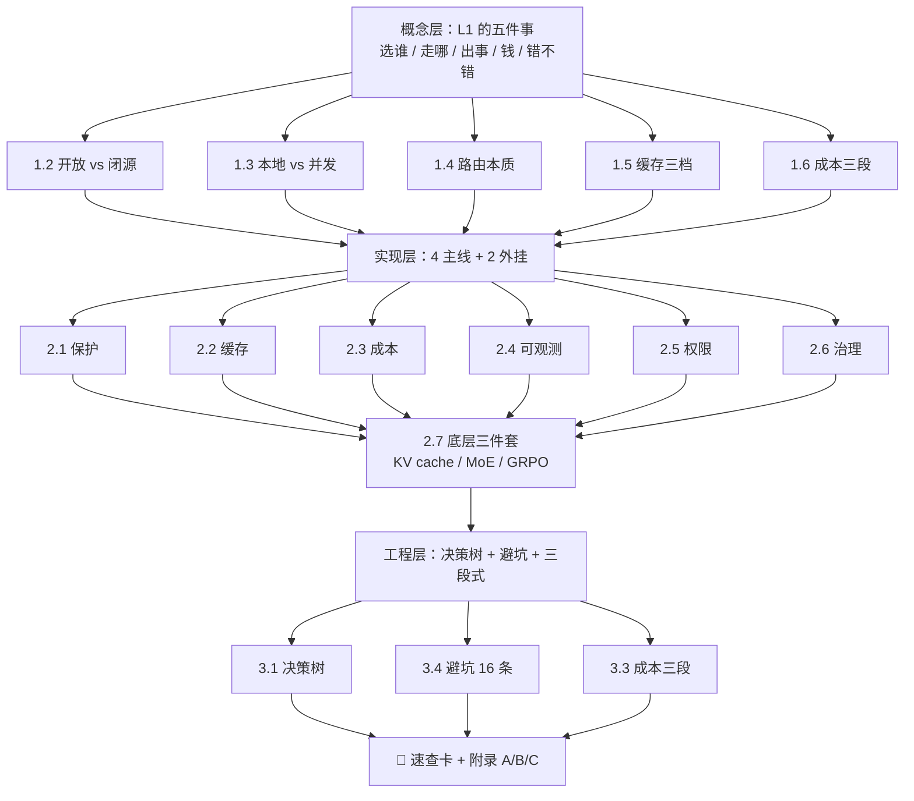

# 推理与路由深度解析：从模型选择到生产级闭环

> 本篇为冲刺压缩版（约 623 行）；按《专题创作指南》§转正规则，面试后可扩写至 1500+ 行完整版。

## 目录

- [0. 前言：为什么 L1 推理层是"缺失的一环"](#0-前言为什么-l1-推理层是缺失的一环)
- [📍 本页定位与蒸馏溯源](#-本页定位与蒸馏溯源)
- [第一层 · 概念层：L1 推理层到底要定哪些事](#第一层--概念层l1-推理层到底要定哪些事)
  - 1.1 L1 的五件事（仓库里的全图） / 1.2 模型的两类身份 / 1.3 推理引擎的两条路线 / 1.4 路由的本质 / 1.5 缓存的三档 / 1.6 成本治理的"事前 / 事中 / 事后" / 📋 面试卡片
- [第二层 · 实现层：把 11 个模块拆成"机制 → 伪代码 → 关键参数"](#第二层--实现层把-11-个模块拆成机制--伪代码--关键参数)
  - 2.0 闭环五步 / 2.1 主线 A 保护机制 / 2.2 主线 B 缓存机制 / 2.3 主线 C 成本治理 / 2.4 主线 D 可观测 / 2.5 外挂 1 工具权限 / 2.6 外挂 2 幻觉治理 / 2.7 三个底层概念精简版 / 📋 面试卡片
- [第三层 · 工程层：什么时候上 / 怎么避坑 / 三段式治理](#第三层--工程层什么时候上--怎么避坑--三段式治理)
  - 3.1 决策树 / 3.2 部署策略 / 3.3 成本治理三段式 / 3.4 避坑清单 16 条 / 3.5 与其他层的关系 / 📋 面试卡片
- [📌 5 分钟速查卡（可打印）](#-5-分钟速查卡可打印)
- [附录 A：仓库路径全索引](#附录-a仓库路径全索引行号精度) / [附录 B：诚实清单](#附录-b诚实清单) / [附录 C：中英对照术语表](#附录-c中英对照术语表)

---

## 0. 前言：为什么 L1 推理层是"缺失的一环"

大多数 AI 应用原型死在两个地方：**"换模型要改全仓"** 和 **"月底账单无法解释"**。前者是路由层缺失——所有调用 `client.chat.completions.create()` 散落在 200 个文件里，要从 `gpt-4o` 换到 `gpt-4o-mini` 得做全局 replace，替换完没人敢保证没改坏；后者是计费层缺失——单条请求的 token 数没人记，账单来的时候只能按调用次数摊估。

### "没有 L1 层" vs "有 L1 层"：两种真实工作流

| 场景 | 没有 L1 层 | 有 L1 层 |
|------|-----------|----------|
| **换模型** | 全仓搜 `gpt-4o` 字符串 → 200 处 replace → 上线后某处忘改 → 错误答案 | 改 `PRICE_PER_1M` 表 + `FALLBACK_CHAIN` 两行 → `route_by_complexity` 自动生效 |
| **下游 5xx** | 调用阻塞 → 用户长时间转圈 → 超时后白屏 | 熔断器跳闸 → 1 秒内切到 fallback → 静态模板兜底 → 用户看到"服务繁忙请重试" |
| **重复 prompt** | 同样的"什么是 RAG"被调 1000 次 → 每次实付 $0.002 | 第一次实调、第 2~1000 次 SHA256 命中精确缓存 → 单条成本降 1000× |
| **月底对账** | "这个月花了 $5000" → 没人能回答"哪个 prompt 烧的" | `ledger.records` 每条带 `request_id / model / tokens / cost / degraded`，可按任何维度切片 |
| **调错模型** | 把 `gpt-4o-mini` 的输出当 `gpt-4o-pro` 用 → 用户抱怨质量差没人知道 | `attributes.model` 写在 Span 里 → 看 trace 立刻定位 → 调路由 |

### 失败模式 ASCII：无路由 / 无熔断 / 无缓存 / 无计费时怎么炸

```text
① 无路由 ─────────────────────────────────────────────
  用户问"1+1" → 调 gpt-4o-pro → $0.01/次 → 每天 10 万次 → $1000/天
  解：按 complexity 路由 → mini/$0.0001/次 → $10/天，节省 99%

② 无熔断 ─────────────────────────────────────────────
  09:00  下游 API 故障 → 1000 个请求同时打过去 → 全部超时 → 雪崩
  09:00:01 第 3 次失败触发熔断 → 拒绝 997 个请求 → 释放下游
  09:00:30  半开期探测 3 个 → 1 成功 → 慢慢恢复
  解：breaker.allow() + 半开期限流，避免雪崩

③ 无缓存 ─────────────────────────────────────────────
  "公司年假多少天" 被问 1000 次 → 1000 次实调 → $20/天
  加精确缓存 → 第 1 次实调，第 2~1000 次命中 → $0.02/天
  解：cache_fingerprint + cache_lookup

④ 无计费 ─────────────────────────────────────────────
  调了 5 万次 → 月底账单 $3000 → 没人能解释
  加 ledger.record → 每条带 model/tokens/cost → 月底按 model 切片 → "80% 花在 gpt-4o-pro 的 5% 任务上"
  解：billing.record() + reconcile() 估算告警
```

> **一句话定锚**：L1 推理层不是"高级选项"，是"**让模型调用从 demo 变生产的最低门槛**"。`05-model-route\README.md:36` 的闭环 ASCII 图就是这张失败模式图的"修好版"。

---

> 把 `05-model-route/` 11 个模块 + `07-llm_from_scrach/` 中三个底层概念（**KV cache / MoE / GRPO**）蒸馏成一份"面试能讲 + 本仓库有实证"的 L1 推理层专题。
>
> **统一类比（贯穿全文）**：**"模型调用 = 跑长途"**——选车（模型选型）、上高速（路由）、进收费站（熔断+重试）、堵车换国道（降级）、加油站便利店（缓存）、ETC 对账（计费）、高速出口安检（幻觉治理）。**L1 推理层 = 整套"出行调度系统"**，目标是把每一次模型调用变得**可控、可观测、可降级、可计费**。
>
> **目标读者**：会 Python、求职 AI 应用开发工程师（RAG/Agent，中小 AI/金融科技公司），面试几天后。
> **范围红线**：只写仓库里真读到的内容；外部框架（LangChain、OpenRouter）只作为类比触点，不补全内部细节。

---

## 📍 本页定位与蒸馏溯源

### a) 在计划中的位置

本页服务于 **5 日冲刺 D3** 的 **「上午 09:00–12:00 推理 + 动作时间盒」前半段**，对应**六层栈的 L1 推理层（模型 · 引擎 · 路由 · 成本）**。D3 下午会衔接 L3 动作层（工具调用 + 权限 + 审计），由 `05-model-route\08\guard\` 三件套承担；D5 收口时 L1 的 trace 与 L2 记忆、L4 运行时、L5 观测一起被纳入"可观测闭环"。

### b) 被蒸馏源明细

#### 路由与成本工程（`05-model-route/`，本仓库最硬的一块实证）

| # | 源文件 | 行数 | 主旨 |
|---|--------|------|------|
| 01 | `05-model-route\README.md` | 52 | **框架文件**：自带"面试清单→代码映射"表，把 11 个模块压成 8 行清单；含闭环 ASCII |
| 02 | `05-model-route\01\main.py` | 60 | 熔断器三个场景演示（偶发自愈 / 连续失败跳闸 / OPEN 期拒绝） |
| 03 | `05-model-route\01\breaker\circuit_breaker.py` | 61 | `CircuitBreaker` 数据类 + 三态机 + `half_open_max_calls` 半开限流 |
| 04 | `05-model-route\01\breaker\retry.py` | 27 | `call_with_breaker_and_retry`：retry 与 breaker 串接 |
| 05 | `05-model-route\01\breaker\backoff.py` | 6 | **6 行**指数退避 `base * 2**attempt + jitter`，cap 默认 8s |
| 06 | `05-model-route\01\breaker\state.py` | 7 | 三态枚举（CLOSED / OPEN / HALF_OPEN） |
| 07 | `05-model-route\02\main.py` + `05-model-route\02\cache\{exact_cache,fingerprint,tokens}.py` | 55/19/7/11 | tiktoken 估算 + SHA256 精确缓存键 + `lru_cache` 演示 |
| 08 | `05-model-route\03\main.py` + `05-model-route\03\runtime\{limited_call,two_level_cache}.py` | 81/12/20 | `asyncio.Semaphore` 限并发 + L1 进程内 / L2 Redis 双层缓存 |
| 09 | `05-model-route\04\main.py` + `05-model-route\04\agent\{stub,fake_llm}.py` + `05-model-route\04\tests\test_agent.py` | 22/13/6/18 | `FakeLLM` 按顺序返回 + pytest 集成测 |
| 10 | `05-model-route\05\main.py` + `05-model-route\05\pipeline\{router,fallback,invoke,billing}.py` | 50/17/58/46/41 | **闭环主线**：路由 → breaker+retry → fallback 链 → ledger 记账 |
| 11 | `05-model-route\06\main.py` + `05-model-route\06\billing\{estimate,reconcile}.py` | 36/16/35 | 本地估算 vs API usage 对账，diff > 10% 告警 |
| 12 | `05-model-route\07\main.py` + `05-model-route\07\trace\{collector,kinds}.py` | 55/58/13 | 9 种 SpanKind：ROUTE/LLM/CACHE/BREAKER/RETRY/FALLBACK/RETRIEVE/BILLING/TOOL |
| 13 | `05-model-route\08\main.py` + `05-model-route\08\guard\{schema,whitelist,executor}.py` | 52/41/10/27 | 工具调用三道闸：白名单 → Schema → 审计（L3 动作层铺垫） |
| 14 | `05-model-route\09\main.py` + `05-model-route\09\deploy\{blue_green,canary}.py` | 26/23/14 | **金丝雀** = `md5(user_id)%100 < pct`；**蓝绿** = 整包切、双倍资源 |
| 15 | `05-model-route\10\main.py` + `05-model-route\10\cache\{exact,semantic,risks}.py` | 39/13/37/6 | 精确缓存 vs **Jaccard** 演示型语义缓存 + 4 条风险 |
| 16 | `05-model-route\11\main.py` + `05-model-route\11\governance\{before,during,after}.py` | 67/20/34/27 | **幻觉治理三段式**：RAG grounding → Citation 拒答 → 反馈审计 |

#### 模型底层（`07-llm_from_scrach/`，概念卡用）

| # | 源文件 | 行数 | 主旨 |
|---|--------|------|------|
| 17 | `07-llm_from_scrach\README.md` + `07-llm_from_scrach\README_cn.md` | 76/128 | 课程大纲 0–9 Part：基础 → Transformer → 训练 → KV cache → MoE → SFT/RM/PPO/GRPO |
| 18 | `07-llm_from_scrach\part_1\README.md` + `07-llm_from_scrach\part_1\tokenizer.py` + `07-llm_from_scrach\part_1\attn_mask.py` + `07-llm_from_scrach\part_1\demo_mha_shapes.py` | 275/60/22/61 | 字节级分词（vocab_size=256）+ 因果掩码 + 多头 attention shape 链路 |
| 19 | `07-llm_from_scrach\part_3\kv_cache.py` | 243 | **核心实证**：无 cache 累计 1+2+3+4=10；有 cache 每步只算 1；附 `RollingKV` 滑动窗口 + sink |
| 20 | `07-llm_from_scrach\part_5\README.md` + `07-llm_from_scrach\part_5\moe.py` + `07-llm_from_scrach\part_5\gating.py` | 41/238/188 | MoE = TopK 门控（importance × load 负载均衡 aux loss） + n_expert 个 ExpertMLP，每 token 只激活 top-k |
| 21 | `07-llm_from_scrach\part_9\GRPO_TRAINING_EXPLANATION.md` + `07-llm_from_scrach\part_9\grpo_loss.py` | 291/97 | **GRPO = PPO 裁剪 + 组内相对优势 + KL 显式惩罚**；无需 value head |
| 22 | `07-llm_from_scrach\part_6\train_sft.py` 头部 + `07-llm_from_scrach\part_7\train_rm.py` 头部 + `07-llm_from_scrach\part_8\ppo_loss.py` 头部 | 50/50/60 | SFT 走 `dataset_sft + collator_sft`；RM 走 Bradley-Terry / Margin Ranking；PPO 含 `vf_coef` 价值损失 |

### c) 蒸馏理由与方法（≈130 字）

`05-model-route/` 是仓库里"工程化最稠密"的一段——11 个模块都围绕同一句断言："**一次模型调用 ≠ 一次 `client.chat.completions.create()`**"。蒸馏方法：**（1）先用 README 的"面试清单↔代码映射"定骨架**；**（2）把 11 个模块按"机制"而非"编号"重排为 4 条主线（保护 / 缓存 / 成本 / 观测）+ 治理 / 部署两个外挂**；**（3）KV cache / MoE / GRPO 三段只取"面试够用"的机制 + 仓库里真读到的公式与代码行**，不补全外部论文细节。`(课程观点)` 标注作者主观判断；`(推断)` 标注我自己的外推。

---

## 第一层 · 概念层：L1 推理层到底要定哪些事

> **统一类比：模型调用 = 跑长途**——选车（模型选型）/ 上高速（路由）/ 进收费站（熔断+重试）/ 堵车换国道（降级）/ 加油站便利店（缓存）/ ETC 对账（计费）/ 高速出口安检（幻觉治理）。本节所有概念都回扣这个类比；少数只到机制层面、不直接对应路况的小节会标"（类比触点）"。
>
> L1 推理层要回答的不是"怎么调一次模型"，而是**"在 1000 次/天的真实流量下，每一次调模型都是怎么发生的"**——选谁、走哪条路、能不能绕过去、怎么计费、怎么知道它错了。

### 1.1 L1 的五件事（仓库里的全图）

```text
                   ┌─────────────────────────────────────┐
                   │  L1 推理层（一次"出行"的需求）       │
                   └─────────────────────────────────────┘
                                  │
   ┌──────────┬──────────┬───────┼────────┬──────────┐
   ▼          ▼          ▼       ▼        ▼          ▼
 模型选型    路由        保护   缓存    成本治理    可观测
 (选车)    (上高速)    (ETC)  (加油站) (ETC对账)  (GPS+黑匣子)
   │          │          │       │        │          │
 01~03     05+07     01+05   02+03+10   05+06      07
```

| 维度 | 仓库对应模块 | 一句话定义 | 出处 |
|------|--------------|-----------|------|
| **模型选型** | 概念源于 `05-model-route\02`（估算）+ `05-model-route\05`（按复杂度路由） | 开放权重 vs 闭源、本地 vs API、专才 vs 通才 | 课程观点 |
| **路由** | `05-model-route\05\pipeline\router.py:10` `route_by_complexity` | 按任务复杂度选模型档位 | 模块 05 |
| **保护** | `05-model-route\01\breaker\circuit_breaker.py:28` `allow()` + `05-model-route\01\breaker\retry.py:10` | 熔断 + 退避重试 | 模块 01 + 05 |
| **缓存** | `05-model-route\02\cache\exact_cache.py:10` 精确 + `05-model-route\03\runtime\two_level_cache.py:1` 双层 + `05-model-route\10\cache\semantic.py:15` 语义 | L1 / L2 / 语义三档 | 模块 02/03/10 |
| **成本治理** | `05-model-route\05\pipeline\billing.py:5` `PRICE_PER_1M` + `05-model-route\06\billing\reconcile.py:15` | before 预算 / during 记账 / after 对账告警 | 模块 05 + 06 |
| **可观测** | `05-model-route\07\trace\kinds.py:4` `SpanKind` 9 种 | SpanKind 把每次调用拆成可追踪单元 | 模块 07 |
| **幻觉治理** | `05-model-route\11\governance\{before,during,after}.py` | RAG grounding → Citation 拒答 → 反馈审计 | 模块 11 |
| **部署策略** | `05-model-route\09\deploy\{blue_green,canary}.py` | 蓝绿整包切 vs 金丝雀小流量探 | 模块 09 |
| **工具权限** | `05-model-route\08\guard\{whitelist,schema,executor}.py` | L3 动作层的事，提前在 L1 也能说"调用入口受控" | 模块 08 |

> **一句话总结 L1**：**"为每一次模型调用安排一条从入口到出口的、可观测、可降级、可计费的路径"**——`05-model-route\README.md:36` 那张闭环 ASCII 图就是这句话的代码化。

> **类比回扣 1.1**：本节的五件事对应"跑长途"的五个关卡——**选车（模型选型）→ 上高速（路由）→ 进收费站（保护）→ 加油站便利店（缓存）→ ETC 对账（成本治理）→ GPS 黑匣子（可观测）**。1.2~1.6 节都会点回这个映射。

### 1.2 模型的两类身份：开放权重 vs 闭源 API

| 维度 | 开放权重（开源） | 闭源 API（商用） |
|------|------------------|-------------------|
| **代表** | Qwen、Llama、DeepSeek（`huggingface.co` 上能拉） | GPT-4o、Claude、Gemini |
| **部署形态** | 本地 `transformers` / `vllm` / `ollama` 推理；本机已下载 bge-m3 实证（用户档案：E:\AI_resource\models\bge-m3） | HTTPS 调用，按 token 计费 |
| **数据隐私** | 不出本机 | 数据出境，**金融场景要先看合规** |
| **可控性** | 可微调、量化、剪枝，可压到 4-bit | 只能用 API 能力 |
| **计费模型** | 电费 + 显卡折旧（摊到小时） | `PRICE_PER_1M`：`05-model-route\05\pipeline\billing.py:5` 直接照搬 |
| **路由需要** | 自己写 provider 抽象层（`05-model-route\05\pipeline\fallback.py:13` `FALLBACK_CHAIN`） | 厂商 SDK 自带 retry，但**熔断要自己加** |

> **课程观点**：`05-model-route\05\pipeline\billing.py:5` 用一张 `PRICE_PER_1M` 表同时覆盖两类（`gpt-4o-pro=10` / `gpt-4o-mini=0.5`）——这就是"统一计费抽象"的最小骨架，**本地模型只要往表里加一行就能并轨**。

### 1.3 推理引擎的两条路线：本地 vs 并发服务

| 路线 | 何时用 | 仓库实证 |
|------|--------|----------|
| **本地直调**（CPU 友好） | 个人开发、隐私场景、流量小 | `05-model-route\02\cache\exact_cache.py:6` `_STORE` 内存 dict + `05-model-route\03\runtime\two_level_cache.py:3` `self.l1 = {}` 全进程内 |
| **并发服务化**（多用户） | SaaS、生产 | `05-model-route\03\main.py:18` `CONCURRENCY = 2` + `05-model-route\03\runtime\limited_call.py:5` `asyncio.Semaphore` |

> **避坑**：`asyncio.Semaphore(N)` 是**"任意时刻最多 N 个协程在跑下游"**，不是"N QPS"——高 QPS 还得加 token bucket（仓库未实现，**课程观点：生产应补**）。

### 1.4 路由的本质：成本 vs 智商的两难

```text
              智商（任务能力）
                   ▲
   gpt-4o-pro ●    │          ◯ 路由目标
                   │
   gpt-4o    ●     │
                   │   ◯ 按 complexity 自动挑
   gpt-4o-mini ●   │
                   │
                   └──────────────────▶ 成本（$ / 1M tok）
                      0.5      5      10
```

- **路由的三种入参（课程观点）**：`complexity` / `prompt_tokens`（请求长度，决定账单大头，`05-model-route\02\cache\tokens.py:7` `approx_token_count`）/ `model`
- **路由的三种出参**（`05-model-route\05\pipeline\router.py:12`）：
  - 简单任务 → `gpt-4o-mini`（成本 0.5）
  - 中等任务 → `gpt-4o`（成本 5）
  - 复杂任务 → `gpt-4o-pro`（成本 10）
  - 兜底：`05-model-route\05\pipeline\router.py:17` "未知复杂度，默认 mini"——**这本身就是一种"未知→省钱"的策略**

> **一句话总结路由**："**把'值得花大模型'的任务筛出来，其余交给便宜模型**"。仓库里没讲 LLM 自身做路由器（"让大模型选模型"），但 README 里把 `01` 放在 `05` 前面，暗示**熔断比路由优先级更高**——下游炸了你路由再准也没用。

### 1.5 缓存的三档：精确 / 进程内 / 语义

| 档位 | 命中率 | 一致性风险 | 仓库出处 |
|------|--------|-----------|----------|
| **精确缓存**（按 prompt hash） | 低 | 几乎零（SHA256 撞上才出问题） | `05-model-route\02\cache\fingerprint.py:5` |
| **L1/L2 双层**（进程 + Redis） | 高 | 分布式一致性要靠 Redis TTL | `05-model-route\03\runtime\two_level_cache.py:1` |
| **语义缓存**（向量 + 阈值） | 很高 | **答非所问** | `05-model-route\10\cache\semantic.py:15`，`05-model-route\10\cache\risks.py:1` 4 条风险 |

> **关键洞察**：`05-model-route\10\cache\risks.py:1` 列了 4 条风险——**答非所问、过期知识、租户串数据、幻觉放大**——都是"语义缓存 + 没兜底"的真实事故模式。**仓库观点：能用精确就别上语义；非要上，必须按 tenant 隔离 key + 短 TTL**。

### 1.6 成本治理的"事前 / 事中 / 事后"

仓库在两个地方显式做了这三段：
- **事前**：`05-model-route\02\cache\tokens.py:7` `approx_token_count` —— 调模型前先估算要花多少钱
- **事中**：`05-model-route\05\pipeline\billing.py:26` `record()` —— 调完即记账，账单条目带 `degraded` 标记
- **事后**：`05-model-route\06\billing\reconcile.py:15` `reconcile()` —— 本地估算 vs API usage 对账，diff > 10% 告警

> 这三段对应 `05-model-route\11\governance\{before,during,after}.py` 治理三段式——**同一个三段式在仓库里被重复用了两次**（成本治理、幻觉治理），是仓库自身在表达"**任何横切关注点都该走 before/during/after**"。

### 1.7 因果链：L1 各决策之间的前提关系

```text
"应用直接调某家闭源 API"（零封装）
   │ 于是必须先回答
   ▼
① 权重从哪来（开放权重 vs 闭源 API）   ← 决定能否自托管、能否随时换模型
   │ 决定
   ▼
② 用什么引擎把它跑起来（Ollama / llama.cpp  vs  vLLM / SGLang）  ← 决定并发上限与单位成本
   │ 决定
   ▼
③ 要不要路由层（LiteLLM / 自研 / 不上）  ← 只有"多模型 / 多端点"时才成立，单模型可省
   │ 决定
   ▼
④ 缓存与降级（精确 / 两级 / 语义  +  熔断 / 重试 / 回退）  ← 只有"调用变贵 / 变慢"后才值得上
   │ 决定
   ▼
⑤ 成本治理三段式（事前预算 / 事中记账 / 事后对账）  ← 前四步都做了才有账可对
```

**依赖要点**：③④⑤ 都是"奢侈项"——它们的前提是"你已经有多模型、多调用、可观账单"。
面试被追问"你上过路由 / 缓存吗"，正确答法是**先说前提（多模型、成本敏感、要按任务分层），再说选了哪一层**。
本仓库实证：`05-model-route\05\pipeline\router.py`（17 行）、`05-model-route\01\breaker\circuit_breaker.py`（61 行）、`05-model-route\11\governance\`（before / during / after）。

### 📋 面试卡片：概念层

| # | Q | A（出自仓库证据） |
|---|----|--------------------|
| 1 | L1 推理层要回答哪些问题？ | 选谁（模型）、走哪条路（路由）、出事了怎么办（保护）、钱怎么算（成本）、错不错怎么知道（观测）——`05-model-route\README.md:7` 那张表 |
| 2 | 开放权重 vs 闭源 API 怎么选？ | 隐私/可控 → 开放；省心/能力 → 闭源；**计费要并轨**，参考 `05-model-route\05\pipeline\billing.py:5` `PRICE_PER_1M` 表 |
| 3 | 路由的目标函数是什么？ | "成本 vs 智商" 的 trade-off；按任务复杂度自动挑模型档（`05-model-route\05\pipeline\router.py:12`） |
| 4 | 缓存为什么有精确 / 进程 / 语义三档？ | 命中率 vs 一致性风险的 trade-off；语义缓存有 4 类真实风险（`05-model-route\10\cache\risks.py:1`） |
| 5 | 熔断的"三态"是什么？ | CLOSED（正常）/ OPEN（拒绝）/ HALF_OPEN（限量探测）——`05-model-route\01\breaker\state.py:4` |
| 6 | 半开期探测怎么控量？ | `half_open_max_calls` 限制探测并发数，`success_threshold` 决定几次成功才闭合——`05-model-route\01\breaker\circuit_breaker.py:12` |
| 7 | 为什么用 `asyncio.Semaphore`？ | 限制**任意时刻**在跑的下游调用数；不是 QPS（`05-model-route\03\runtime\limited_call.py:5`） |
| 8 | 成本治理三段式是什么？ | 事前估算（`05-model-route\02\cache\tokens.py:7`）/ 事中记账（`05-model-route\05\pipeline\billing.py:26`）/ 事后对账（`05-model-route\06\billing\reconcile.py:15`） |
| 9 | 蓝绿 vs 金丝雀的核心区别？ | 蓝绿整包切、双倍资源（`05-model-route\09\deploy\blue_green.py:23`）；金丝雀按 `md5(user_id)%100 < pct` 稳定分流（`05-model-route\09\deploy\canary.py:4`） |
| 10 | Trace Span 该挂哪些类型？ | `05-model-route\07\trace\kinds.py:4` 9 种：`route / llm / tool / cache / breaker / retry / fallback / retrieve / billing` |

---

## 第二层 · 实现层：把 11 个模块拆成"机制 → 伪代码 → 关键参数"

> 把 11 个模块按"机制"重排成 **4 条主线 + 2 个外挂**。

### 2.0 闭环五步（出自 `05-model-route\README.md:36`）

```text
请求 → route.decision → breaker.allow?
        ↓ 否 → fallback → billing
        ↓ 是 → retry + llm.chat
             ↓ 失败 → fallback → billing
             ↓ 成功 → billing
```

| 步骤 | 函数 | 文件:行 |
|------|------|---------|
| 1. 路由 | `route_by_complexity(complexity)` | `05-model-route\05\pipeline\router.py:10` |
| 2. 熔断放行 | `breaker.allow()` + `breaker.before_call()` | `05-model-route\01\breaker\circuit_breaker.py:28-42` |
| 3. 重试 | `call_with_breaker_and_retry(fn, breaker, max_retries)` | `05-model-route\01\breaker\retry.py:10` |
| 4. 降级 | `fallback_invoke(user_msg, failed_model, providers)` | `05-model-route\05\pipeline\fallback.py:16` |
| 5. 计费 | `ledger.record(model, p_tok, c_tok, degraded)` | `05-model-route\05\pipeline\billing.py:26` |

#### 2.0.1 符号表（本文用到的缩写与参数）

| 符号 / 缩写 | 含义 | 仓库出处 |
|------|------|----------|
| `C` / `breaker` | `CircuitBreaker` 实例 | `05-model-route\01\breaker\circuit_breaker.py:8` |
| `fn` / `_call` | 实际下游调用闭包 | `05-model-route\05\pipeline\invoke.py:26` |
| `decision` | 路由决策（`model + reason`） | `05-model-route\05\pipeline\router.py:5` |
| `result` | LLM 调用结果（`text/model/tokens/degraded`） | `05-model-route\05\pipeline\fallback.py:5` |
| `ledger` / `records` | 账本与条目列表 | `05-model-route\05\pipeline\billing.py:23` |
| `usage` | API 回写的真实 token 数 | `05-model-route\06\billing\estimate.py:10` |
| `Span` | 一段带属性的操作记录 | `05-model-route\07\trace\collector.py:10` |
| `SpanKind` | 9 种枚举（ROUTE/LLM/CACHE/BREAKER/RETRY/FALLBACK/RETRIEVE/BILLING/TOOL） | `05-model-route\07\trace\kinds.py:4-12` |
| `cache.l1` / `cache._l2_mock` | L1 进程内 dict / L2 远端 Redis（演示用 mock） | `05-model-route\03\runtime\two_level_cache.py:3-5` |
| `PRICE_PER_1M` | 每百万 token 单价表 | `05-model-route\05\pipeline\billing.py:5-10` |
| `TTL` | Time-to-Live，缓存过期秒数 | `05-model-route\03\runtime\two_level_cache.py:16` 默认 300 |
| `P99` / `P95` | 第 99/95 百分位延迟（本文未实算，是 L5 观测层指标） | 课程观点 |
| `jitter` | 随机抖动，避免惊群 | `05-model-route\01\breaker\backoff.py:5` |
| `fingerprint` | 请求指纹（SHA256 键） | `05-model-route\02\cache\fingerprint.py:5` |
| `FALLBACK_CHAIN` | 降级链 `["gpt-4o", "gpt-4o-mini", "static-template"]` | `05-model-route\05\pipeline\fallback.py:13` |

#### 2.0.2 学习路径（推荐阅读顺序）



**双模式阅读**：
- **快速模式**（面试前 1 小时）：只看 2.1 ~ 2.6 的"机制一句话 + 关键参数表"。
- **深入模式**（要写代码）：跟着 `05-model-route\05\pipeline\invoke.py:14` 一行行对照其它模块读。

### 2.1 主线 A：保护机制——熔断 + 重试 + 退避

**机制**：对一次 `fn()` 调用，先看熔断器放不放行（`allow()`），放行加一并发计数（`before_call`），成功计一次成功、失败计一次失败，连续失败超阈值就跳闸；每次失败后**指数退避 + jitter** 等一拍再试。

```text
fn call_with_breaker_and_retry(fn, breaker, max_retries):
    for attempt in 0 .. max_retries-1:
        if not breaker.allow(): raise "circuit_open"
        breaker.before_call()
        try:
            result = fn()                        # 真正调下游
            breaker.on_success(); return result
        except Exception:
            breaker.on_failure()
            if attempt == max_retries - 1: raise
            sleep( exponential_backoff(attempt) )
```

**关键参数**（出自 `05-model-route\01\breaker\`）：

| 参数 | 默认 | 含义 |
|------|------|------|
| `failure_threshold` | 5 | 连续失败多少次跳闸 |
| `success_threshold` | 2 | 半开期连续成功多少次闭合 |
| `open_seconds` | 30 | OPEN 持续时间，到点转 HALF_OPEN |
| `half_open_max_calls` | 3 | 半开期允许的最大探测并发 |
| `max_retries` | 3 | 单次调用最多重试几次 |
| 退避 `base/cap` | 0.5 / 8.0 秒 | 退避基数 / 上限 |
| `jitter` | 0~0.25 | 随机抖动，避免惊群 |

**三态迁移**（`05-model-route\01\breaker\state.py:4`）：

```text
  CLOSED ──连续失败达阈值──▶ OPEN
    ▲                          │
    │ 连续成功达阈值            │ open_seconds 到点
    │                          ▼
    └───── HALF_OPEN ◀──────────┘
              │
              └ 半开期只要失败 → 立即重新跳闸
```

> **一句话总结**："**熔断 = 给下游发个病假条，重试 = 趁病假没生效前再试一次**"。仓库里这套是教科书级别最简实现，**生产应补滑动窗口失败率**（课程观点，仓库未实现）。

### 2.2 主线 B：缓存机制——精确 + L1/L2 双层 + 语义

**机制**：用 `request_fingerprint(system, user, model)` 的 SHA256 当 key；先查 L1 进程内 dict，未命中查 L2（演示用 `_l2_mock`，生产换 Redis）；都没命中才真正调模型，并把结果写回两层。语义缓存独立一档：用向量相似度 > 阈值才算命中。

```text
# 精确（02\cache\exact_cache.py:9）
fn cached_exact(system, user, model):
    key = sha256(json({system, user, model}, sort_keys=True))
    return STORE.get(key) or (call_model(), STORE.__setitem__(key), ...)

# 双层（03\runtime\two_level_cache.py:7）
async fn get(key):
    if key in l1: return l1[key]                # L1 命中
    val = await redis.get(key)                  # L2 命中
    if val: l1[key] = val                       # 回填 L1
    return val

# 语义（10\cache\semantic.py:22）
fn SemanticCache.get(q):
    best = max(_entries, key=lambda e: jaccard(q, e.q))
    return best.ans if best.score >= threshold else None
```

**关键参数**：

| 参数 | 默认 | 含义 | 出处 |
|------|------|------|------|
| `lru_cache(maxsize)` | 1024 | 精确缓存演示用的 LRU 上限 | `05-model-route\02\cache\exact_cache.py:9` |
| `ttl` | 300 秒 | L2 过期时间 | `05-model-route\03\runtime\two_level_cache.py:16` |
| `threshold` | 0.85（main 演示 0.6） | 语义命中阈值 | `05-model-route\10\cache\semantic.py:18` |
| fingerprint 键 | `sha256(json({system,user,model}, sort_keys=True))` | **字典序序列化**才能键一致 | `05-model-route\02\cache\fingerprint.py:5` |

**4 条语义缓存风险**（`05-model-route\10\cache\risks.py:1`）：答非所问 / 过期知识 / 租户串数据 / 幻觉放大。

> **一句话总结缓存**："**精确缓存是便利店货架（取得到就准），L1/L2 双层是便利店 + 中央仓（命中率更高），语义缓存是按相似度找代餐（好吃但可能吃错）**"。

### 2.3 主线 C：成本治理——路由 + 记账 + 对账

**机制**：路由决定用哪档模型（决定账单上限），调用结束即记账（`PRICE_PER_1M` 表），事后把本地估算和 API usage 比一比（diff > 10% 告警）。

```text
# 路由（05\pipeline\router.py:10）：simple→mini / medium→gpt-4o / hard→pro / unknown→mini
# 记账（05\pipeline\billing.py:26）
fn BillingLedger.record(model, p_tok, c_tok, degraded):
    rate = PRICE_PER_1M.get(model, 1.0)
    cost = round((p_tok + c_tok) / 1_000_000 * rate, 6)
# 对账（06\billing\reconcile.py:15）
fn reconcile(rid, estimated, usage, threshold_pct=10):
    diff_pct = abs(usage.total - estimated) / max(estimated, 1) * 100
    return ReconcileRow(..., alert=diff_pct > threshold_pct)
```

**关键参数**（`05-model-route\05\pipeline\billing.py:5` + `05-model-route\06\billing\reconcile.py:19`）：

| 参数 | 值 | 含义 |
|------|------|------|
| `PRICE_PER_1M["gpt-4o-pro"]` | 10.0 | 强模型每百万 token 美元 |
| `PRICE_PER_1M["gpt-4o"]` | 5.0 | 标准模型 |
| `PRICE_PER_1M["gpt-4o-mini"]` | 0.5 | 弱模型（便宜 20×） |
| `PRICE_PER_1M["static-template"]` | 0.0 | 降级静态模板不计费 |
| `alert_threshold_pct` | 10.0 | 估算 vs 账单偏差告警阈值 |
| token 兜底 | `max(1, len(text)//4)` | 无 tiktoken 时按字符均分（`05-model-route\02\cache\tokens.py:9`） |

> **一句话总结成本**："**事前估 token、事中按模型档位记账、事后把估算和账单对一对**"。**(推断) 仓库未显式把 token 数喂给路由，但生产里这是必做的**。

### 2.4 主线 D：可观测——9 种 SpanKind 的闭环挂载

**机制**：每次关键操作开一个 `Span`，记 `kind/name/start/end/attributes`，挂到 `trace_id` 上。`kinds.py` 枚举了 9 种，恰好覆盖闭环每一步。

```text
Span { trace_id / span_id / kind(9选1) / name / start_ms / end_ms / attributes }
```

**9 种 SpanKind**（`05-model-route\07\trace\kinds.py:4-12`）：`ROUTE / LLM / TOOL / CACHE / BREAKER / RETRY / FALLBACK / RETRIEVE / BILLING`，各对应一次"动作类型"。

**调用链示例**（`05-model-route\07\main.py:14-44`）：

```text
Trace("...", goal="总结本周迭代")
├─ Span(ROUTE, "pick_model",      {complexity=medium, model=gpt-4o})
├─ Span(CACHE, "exact_cache",     {key=abc123, hit=false})
├─ Span(BREAKER, "allow_call",    {state=CLOSED})
├─ Span(LLM, "chat_completion",   {model=gpt-4o, prompt_tokens=120, completion_tokens=80})
└─ Span(BILLING, "record_usage",  {cost_usd=0.001})
```

> **一句话总结可观测**："**Trace 是'一趟出差的总账'，Span 是'沿途每一次动作的发票'**"。

### 2.5 外挂 1：工具权限（08 模块——为 L3 铺垫）

**机制**：调用任何 tool 前过三道闸——**白名单 → Schema 校验 → 审计**。L1 推理层"出口"上的最后一道护栏。

```text
fn invoke_tool_layered(tool_name, args, tools, whitelist, audit):
    whitelist.check(tool_name)       # 闸 1
    validate_args(tool_name, args)   # 闸 2
    audit.append({event, tool, args})# 闸 3
    return tools[tool_name](**args)
```

**Schema 字段**（`05-model-route\08\guard\schema.py:4-18`）：

| 工具 | 必填字段 | 类型约束 |
|------|----------|----------|
| `search` | `q` | string, 1 ≤ len ≤ 200 |
| `send_email` | `to`, `subject` | to=email 格式, subject ≤ 100 |

> **一句话总结权限**："**白名单决定能不能调，Schema 决定参数对不对，审计决定事后能不能查**"。

### 2.6 外挂 2：幻觉治理三段式（11 模块）

**机制**：**事前**靠 RAG 检索 + "仅依据资料回答" 的 prompt；**事中**检查回答里有没有引用 doc_id、confidence 是否达标；**事后**记录用户反馈、统计幻觉率。

```text
# before（11\governance\before.py:18）：ctx = "\n".join(f"[{d.doc_id}] {d.text}" for d in docs)
# during（11\governance\during.py:12）：confidence < 0.5 拒答 / 引用 < 1 条拒答
# after（11\governance\after.py:20）：hallucination_rate() = flagged/total*100，> 5% 触发人工复盘
```

**关键参数**（`05-model-route\11\governance\`）：

| 参数 | 默认 | 含义 |
|------|------|------|
| `top_k` | 3 | 检索返回条数 |
| `min_citations` | 1 | 至少要引几条 |
| `min_confidence` | 0.5 | 置信度拒答阈值 |
| `threshold_pct` | 5.0 | 幻觉率触发人工复盘阈值 |

> **一句话总结幻觉治理**："**事前给资料，事中要引用，事后看反馈**"——和成本治理三段式是同一个结构。

### 2.7 模型底层的三个面试够用点（精简版）

> KV cache / MoE / GRPO 是 L1 推理层"为什么推理贵/慢"的背景知识。下面只给面试够用的一句话 + 仓库真读到的文件路径，详细在附录 A 末尾列出。

| 概念 | 一句话 | 仓库证据 |
|------|--------|----------|
| **KV cache** | 老 token 的 K/V 不变所以缓存，新 token 只算自己的；累计从 O(n²) 降到 O(n)；长上下文用 `RollingKV(window, sink)` 截断 | `07-llm_from_scrach\part_3\kv_cache.py:33-70` + `:150` |
| **MoE** | n_expert 个 MLP，每 token 只走 top-k；参数量 ×n，每 token FLOPs ×1；负载均衡靠 `aux_loss = E × Σ(importance × load)` | `07-llm_from_scrach\part_5\gating.py:28-83` + `07-llm_from_scrach\part_5\moe.py:52-101` |
| **GRPO** | 砍掉 value head，用组内相对优势 `A_i = r_i − μ_group` 代替 GAE；KL 显式加 loss（`total = policy_loss + kl_coef × kl_ref`）；G=4~8 | `07-llm_from_scrach\part_9\grpo_loss.py:21-65` |

> **课程观点**：GRPO 不是"另一种 RL 算法"，而是"**砍掉 value head 后 PPO 的工程简化**"。

### 📋 面试卡片：实现层

| # | Q | A（出自仓库证据） |
|---|----|--------------------|
| 1 | 熔断器的状态机迁移？ | CLOSED→OPEN（达阈值）→HALF_OPEN（到点）→CLOSED（半开期连续成功达阈值）/ OPEN（半开期失败）——`05-model-route\01\breaker\circuit_breaker.py:21-60` |
| 2 | 半开期怎么限流？ | `half_open_max_calls` 控制并发探测数，`success_threshold` 控制几次成功才闭合——`05-model-route\01\breaker\circuit_breaker.py:12` |
| 3 | 退避为什么加 jitter？ | `05-model-route\01\breaker\backoff.py:5` `random.random() * 0.25`，避免惊群 |
| 4 | 精确缓存键为什么用 SHA256？ | `05-model-route\02\cache\fingerprint.py:6` `json.dumps(..., sort_keys=True)` 保证序列化顺序，**避免键漂移** |
| 5 | L1/L2 双层缓存回写策略？ | `05-model-route\03\runtime\two_level_cache.py:16` 写 L1 + 写 L2（带 TTL=300）；读 L1 未命中回填 L1 |
| 6 | 路由的兜底是什么？ | `05-model-route\05\pipeline\router.py:17` "未知复杂度，默认 mini" |
| 7 | 降级链怎么定义？ | `05-model-route\05\pipeline\fallback.py:13` `FALLBACK_CHAIN = ["gpt-4o", "gpt-4o-mini", "static-template"]` |
| 8 | 记账怎么挂？ | `05-model-route\05\pipeline\invoke.py:40-45` 每次结束必调 `ledger.record`，无论成功/降级 |
| 9 | 对账阈值怎么设？ | `05-model-route\06\billing\reconcile.py:19` `alert_threshold_pct=10.0` —— 偏差 > 10% 告警 |
| 10 | Trace Span 该挂哪 9 种？ | `05-model-route\07\trace\kinds.py:4` ROUTE/LLM/TOOL/CACHE/BREAKER/RETRY/FALLBACK/RETRIEVE/BILLING |
| 11 | 工具调用三道闸顺序？ | 白名单 → Schema → 审计（`05-model-route\08\guard\executor.py:24-26`） |
| 12 | 幻觉治理三段是什么？ | 事前 grounding（`05-model-route\11\governance\before.py:18`）+ 事中 citation/置信度（`05-model-route\11\governance\during.py:12`）+ 事后反馈审计（`05-model-route\11\governance\after.py:20`） |
| 13 | KV cache 为什么能让推理变快？ | 老 token 的 K/V 不变，缓存起来只算新 token；累计从 1+2+...+n = O(n²) 降到 O(n)——`07-llm_from_scrach\part_3\kv_cache.py:33-70` |
| 14 | MoE 的"稀疏激活"指什么？ | n_expert 个专家里每 token 只走 top-k；参数量 ×n，每 token FLOPs ≈ 1×FFN——`07-llm_from_scrach\part_5\moe.py:52-101` |
| 15 | GRPO 相对 PPO 的核心改动？ | 不要 value head；用 `A_i = r_i − μ_group` 代替 GAE；KL 显式加 loss——`07-llm_from_scrach\part_9\grpo_loss.py:21-65` |

---

## 第三层 · 工程层：什么时候上 / 怎么避坑 / 三段式治理

> 工程层回答三个问题：**什么时候该上路由 / 缓存 / 回退？** **哪些坑必须避开？** **怎么把成本治理做成"日用品"而不是"救火队"？**

### 3.1 决策树：什么时候该上什么机制

```text
                你要做的事
                    │
                    ▼
        ┌───────────────────────────┐
        │ 调一次模型就够？           │  ──否──▶ 进入循环 / Agent（Harness 范畴）
        └───────────────────────────┘
                    │ 是
                    ▼
        ┌───────────────────────────┐
        │ 同一 prompt 会被调多次？   │  ──是──▶ 上精确缓存（02）
        └───────────────────────────┘            │ 否
                    │ 否                         ▼
                    ▼               ┌───────────────────────────┐
        ┌───────────────────────────┐│ 同一问题换措辞会被问多次？│─是─▶ 加语义缓存（10）
        │ 单条 prompt 花钱 < $0.01？│└───────────────────────────┘  注意按 tenant 隔离
        └───────────────────────────┘
                    │ 否
                    ▼
        ┌───────────────────────────┐
        │ 流量峰值 > 5 QPS？         │  ──是──▶ 加 Semaphore + 双层缓存（03）
        └───────────────────────────┘
                    │ 否
                    ▼
        ┌───────────────────────────┐
        │ 同一类任务有难易区分？     │  ──是──▶ 上按复杂度路由（05）
        └───────────────────────────┘
                    │ 否
                    ▼
        ┌───────────────────────────┐
        │ 下游会 5xx / 超时？        │  ──是──▶ 上熔断 + 重试 + 降级（01 + 05）
        └───────────────────────────┘
                    │ 否
                    ▼
        ┌───────────────────────────┐
        │ 老板要看花了多少钱？       │  ──是──▶ 上 before/during/after 三段式
        └───────────────────────────┘
```

> **(推断)** 仓库里 11 个模块全上 = "**生产级 L1 全套**"；只上 01 + 05 = "**最小可用**"；一个不上 = "**demo 级**，别上生产"。

### 3.2 部署策略：蓝绿 vs 金丝雀（09 模块）

```text
  大版本 / 配置整体变更？──是──▶ 蓝绿（双倍资源，回滚秒级）
                          否
  模型 / API 频繁迭代？  ──是──▶ 金丝雀（md5(user_id)%100 < pct 稳定分流）
                          否
  完全没在生产跑过？     ──是──▶ 影子流量（仓库未实现，课程观点）
```

**关键参数**：

| 策略 | 参数 | 值 | 含义 | 出处 |
|------|------|------|------|------|
| **金丝雀** | `canary_pct` | 10 | 新版本接 10% 流量；升级路径 10%→50%→100%（推断） | `05-model-route\09\deploy\canary.py:4` |
| **蓝绿** | `active` | "blue"/"green" | 当前活跃环境；切换成本 = 双倍资源；回滚 = 秒级 | `05-model-route\09\deploy\blue_green.py:10` |

### 3.3 成本治理三段式（05 + 06 模块）

```text
   before（预算与估算）      during（调用即记账）     after（估算 vs 账单对账）
        │                          │                       │
   approx_token_count()       ledger.record(...)      reconcile(...)
   02\cache\tokens.py:7       05\pipeline\billing.py:26    06\billing\reconcile.py:15
                                                          alert > 10% → 告警
```

- **before**：`tokens = approx_token_count(prompt, model)`；**（推断）超阈值可拒答/转人工，仓库未实现**
- **during**：`ledger.record(model, prompt_tokens, completion_tokens, degraded)` —— 无论成功降级都记
- **after**：`reconcile(request_id, estimated, usage)` —— `alert = diff_pct > 10`

> **课程观点**：仓库没显式做"before 拒答"，**但 L1 成本治理闭环就是 before → during → after**，少一段 = 月底账单无法解释。

### 3.4 避坑清单（16 条，每条 1–2 行）

> 仓库原文已点出 + (推断) 的工程延伸，标注简明。

1. **精确缓存键忘带 model** → 不同模型命中同一 prompt 答非所问 → `05-model-route\02\cache\fingerprint.py:5` 键已含 `{system,user,model}` 三元组。
2. **fingerprint 非字典序序列化** → 同 prompt 两次键不同 → 必须 `json.dumps(..., sort_keys=True)`（`05-model-route\02\cache\fingerprint.py:6`）。
3. **熔断器把业务失败（4xx）当下游失败计** → 误跳闸 → **(推断)** 只把 5xx/Timeout/ConnectionError 喂给 `on_failure`；仓库 `05-model-route\01\breaker\retry.py:23` `except Exception` 太宽。
4. **退避 cap 太大** → 用户已超时你还在等 → **(推断)** 客户端超时 ≤ 3s 时 cap ≤ 1s；仓库默认 cap=8s（`05-model-route\01\breaker\backoff.py:4`）。
5. **半开期不限并发** → 探测打挂刚恢复的下游 → 必须用 `half_open_max_calls`（`05-model-route\01\breaker\circuit_breaker.py:12`）。
6. **精确缓存用 `lru_cache` + `cache_clear()` 写场景** → 每次写清空 → **(推断)** 生产换 Redis；`05-model-route\02\cache\exact_cache.py:18` `cache_clear()` 是演示用注释。
7. **精确缓存没 TTL** → 策略改了还返旧答案 → **(推断)** 必带 TTL；`05-model-route\03\runtime\two_level_cache.py:16` 已示范 `ttl=300`。
8. **语义缓存按全局 namespace** → 用户 A 问"取消订单"被用户 B 命中 → **(推断)** key 必须含 `tenant_id`；`05-model-route\10\cache\risks.py:1` "租户串数据" 已点出。
9. **路由"未知复杂度 = 最便宜"** → 新意图质量断崖 → **(推断)** 应改"未知 = 默认中档 + 人工审核"；仓库选 mini 是省钱导向（`05-model-route\05\pipeline\router.py:17`）。
10. **账单只记成功** → 降级到 static-template 那次没记 → `05-model-route\05\pipeline\invoke.py:40-45` 无论成功/降级都 `ledger.record`。
11. **对账告警阈值太松** → 长期偏差 12% 没人管 → **(推断)** 阈值 5% 更稳；仓库默认 10%（`05-model-route\06\billing\reconcile.py:19`）偏松。
12. **金丝雀分流键不带 user_id** → 全 V1 或全 V2 → 必须 `md5(user_id) % 100`（`05-model-route\09\deploy\canary.py:6`）；**(推断)** user_id 须稳定（用登录 ID，非 session）。
13. **幻觉治理只在事后做** → 流出去了才发现 → `05-model-route\11\governance\{before,during,after}.py` 三段必齐；**(推断)** 事中拒答比事后追责损失小 10×。
14. **工具调用不做白名单** → Agent 调 `os.system("rm -rf /")` 也能跑 → `05-model-route\08\guard\whitelist.py:8` 白名单是第一道闸。
15. **Trace Span attributes 塞大对象** → trace 存储爆掉 → **(推断)** attributes 只放标签类（model/complexity/cost/hit）；prompt 走独立 payload 存储。
16. **KV cache 长度无上限** → 超长上下文 GPU OOM → `07-llm_from_scrach\part_3\kv_cache.py:150` `RollingKV(window, sink)` 滑动窗口 + sink 截断。

### 3.5 与其他层的关系（L1 不是孤岛）

```text
        L1 推理层（本页）
            ├── 出口挂 L3 动作层：08 三道闸（白名单/Schema/审计）
            ├── 入口挂 L0 协议层：complexity 从任务元数据来（推断）
            ├── 运行中挂 L4 运行时：loop 每轮调模型 = invoke_with_pipeline
            ├── 写入时挂 L2 记忆层：trace attributes 携带记忆引用（推断）
            └── 收口挂 L5 评测层：账单 + trace + 反馈 → L5 评估
```

> **一句话总结工程层**："**L1 是其他所有层的中转站——入口接元数据，出口接动作，运行中跑循环，事后被评测**"。

### 📋 面试卡片：工程层

| # | Q | A |
|---|----|----|
| 1 | 什么时候上路由？ | 同一类任务有难易区分时；不知道任务难度也建议上（兜底最便宜） |
| 2 | 什么时候上缓存？ | 同一 prompt 被调多次 / 同一问题换措辞被问多次 / 流量峰值 > 5 QPS |
| 3 | 蓝绿 vs 金丝雀怎么选？ | 大版本整包切 → 蓝绿；模型/API 频繁迭代 → 金丝雀 |
| 4 | 成本治理必做的三段？ | before 估算 / during 记账 / after 对账（`05-model-route\02\cache\tokens.py:7`，`05-model-route\05\pipeline\billing.py:26`，`05-model-route\06\billing\reconcile.py:15`） |
| 5 | 工具调用三道闸顺序？ | 白名单 → Schema → 审计（`05-model-route\08\guard\executor.py:24-26`） |
| 6 | 半开期为什么限制并发？ | 防止"刚恢复的下游被探测打挂"（`05-model-route\01\breaker\circuit_breaker.py:12`） |
| 7 | 缓存键为什么含 model？ | 不同模型对同一 prompt 答案不同，混用答非所问 |
| 8 | 语义缓存最大风险？ | 答非所问 + 租户串数据 + 过期知识 + 幻觉放大（`05-model-route\10\cache\risks.py:1`） |
| 9 | 账单为什么不只记成功？ | 降级到 static-template 也要记，方便事后分析（`05-model-route\05\pipeline\invoke.py:40`） |
| 10 | Trace 必挂的 SpanKind？ | 至少 4 个：ROUTE / LLM / CACHE / BILLING（`05-model-route\07\trace\kinds.py:4`） |
| 11 | L1 在六层栈里的位置？ | 中转站——入口接 L0 元数据，出口接 L3 动作，运行中跑 L4 loop，事后给 L5 评测 |

---

## 📌 5 分钟速查卡（可打印）

### A. L1 一句话答法

> **"L1 推理层 = 给每次模型调用安排一条'可控、可观测、可降级、可计费'的路径。先按 complexity 路由，再过熔断+重试+降级保护，按精度选缓存档，按 PRICING 记账，最后挂 Span 让事后可追。"** — 出处 `05-model-route\README.md:36` 闭环图

### B. 11 个模块一句话归纳

| 模块 | 一句话 |
|------|--------|
| 01 熔断+重试 | 三态机保护下游，6 行代码搞定指数退避 |
| 02 精确缓存 | SHA256 字典序键的 LRU，演示用、生产换 Redis |
| 03 双层+并发 | L1 进程内 dict + L2 Redis + Semaphore 限并发 |
| 04 Mock 测试 | FakeLLM 按顺序返回 + pytest 集成测 |
| 05 闭环主线 | 路由→熔断→重试→降级→计费五步串成 `invoke_with_pipeline` |
| 06 估算对账 | 本地估算（约 len/4）vs API usage，diff > 10% 告警 |
| 07 Trace 9 Span | ROUTE/LLM/CACHE/BREAKER/RETRY/FALLBACK/RETRIEVE/BILLING/TOOL |
| 08 工具权限 | 白名单 → Schema → 审计三道闸 |
| 09 部署策略 | 蓝绿整包切 vs 金丝雀 md5(user_id)%100 稳定分流 |
| 10 语义缓存 | Jaccard 演示版 + 4 类真实风险 |
| 11 幻觉治理 | RAG grounding → Citation 拒答 → 反馈审计 |

### C. 关键参数速查（10 条）

| 参数 | 默认值 | 模块 |
|------|--------|------|
| `failure_threshold` | 5 | `05-model-route\01\breaker\circuit_breaker.py:9` |
| `success_threshold` | 2 | `05-model-route\01\breaker\circuit_breaker.py:10` |
| `open_seconds` | 30 | `05-model-route\01\breaker\circuit_breaker.py:11` |
| `half_open_max_calls` | 3 | `05-model-route\01\breaker\circuit_breaker.py:12` |
| 退避 `base/cap` | 0.5 / 8.0 秒 | `05-model-route\01\breaker\backoff.py:4` |
| `PRICE_PER_1M["gpt-4o-pro"]` | 10.0 | `05-model-route\05\pipeline\billing.py:6` |
| `PRICE_PER_1M["gpt-4o"]` | 5.0 | `05-model-route\05\pipeline\billing.py:7` |
| `PRICE_PER_1M["gpt-4o-mini"]` | 0.5 | `05-model-route\05\pipeline\billing.py:8` |
| `alert_threshold_pct` | 10% | `05-model-route\06\billing\reconcile.py:19` |
| `canary_pct` | 10 | `05-model-route\09\deploy\canary.py:4` |

### D. 闭环 ASCII 速记

```text
请求 → route.decision(complexity) → breaker.allow?
        ↓ 否                          ↓ 是
    fallback(链)                  retry + llm.chat
        ↓                              ↓ 失败
        └────────▶ billing ◀────── fallback(链)
                       ↓
                    ledger.record(...)
```

### E. 三个底层概念速记

| 概念 | 一句话 |
|------|--------|
| **KV cache** | 老 token 的 K/V 不变所以缓存，只算新 token；累计从 O(n²) 降到 O(n) |
| **MoE** | n_expert 个 MLP，每 token 只走 top-k；参数量 ×n，FLOPs ×1 |
| **GRPO** | 砍掉 value head，用 `A_i = r_i − μ_group` 代替 GAE；KL 显式加 loss |

---

## 附录 A：仓库路径全索引（行号精度）

| 模块 | 主路径 |
|------|--------|
| 00 README | `05-model-route\README.md:1-52` |
| 01 熔断 | `05-model-route\01\main.py` / `05-model-route\01\breaker\circuit_breaker.py` / `05-model-route\01\breaker\retry.py` / `05-model-route\01\breaker\backoff.py` / `05-model-route\01\breaker\state.py` |
| 02 精确缓存 | `05-model-route\02\main.py` / `05-model-route\02\cache\exact_cache.py` / `05-model-route\02\cache\fingerprint.py` / `05-model-route\02\cache\tokens.py` |
| 03 并发 | `05-model-route\03\main.py` / `05-model-route\03\runtime\limited_call.py` / `05-model-route\03\runtime\two_level_cache.py` |
| 04 Mock | `05-model-route\04\main.py` / `05-model-route\04\agent\stub.py` / `05-model-route\04\agent\fake_llm.py` / `05-model-route\04\tests\test_agent.py` |
| 05 闭环 | `05-model-route\05\main.py` / `05-model-route\05\pipeline\router.py` / `05-model-route\05\pipeline\fallback.py` / `05-model-route\05\pipeline\invoke.py` / `05-model-route\05\pipeline\billing.py` |
| 06 对账 | `05-model-route\06\main.py` / `05-model-route\06\billing\estimate.py` / `05-model-route\06\billing\reconcile.py` |
| 07 Trace | `05-model-route\07\main.py` / `05-model-route\07\trace\collector.py` / `05-model-route\07\trace\kinds.py` |
| 08 工具 | `05-model-route\08\main.py` / `05-model-route\08\guard\schema.py` / `05-model-route\08\guard\whitelist.py` / `05-model-route\08\guard\executor.py` |
| 09 部署 | `05-model-route\09\main.py` / `05-model-route\09\deploy\blue_green.py` / `05-model-route\09\deploy\canary.py` |
| 10 语义 | `05-model-route\10\main.py` / `05-model-route\10\cache\exact.py` / `05-model-route\10\cache\semantic.py` / `05-model-route\10\cache\risks.py` |
| 11 治理 | `05-model-route\11\main.py` / `05-model-route\11\governance\before.py` / `05-model-route\11\governance\during.py` / `05-model-route\11\governance\after.py` |
| KV cache | `07-llm_from_scrach\part_3\kv_cache.py:33-128` |
| MoE | `07-llm_from_scrach\part_5\moe.py:14-101` / `07-llm_from_scrach\part_5\gating.py:38-83` |
| GRPO | `07-llm_from_scrach\part_9\grpo_loss.py:21-65` / `07-llm_from_scrach\part_9\GRPO_TRAINING_EXPLANATION.md` |

## 附录 B：诚实清单

- **(推断)** 全篇约 20 处，凡决策树、避坑 3/4/6/7/8/9/11/15、3.3 before 拒答等"生产应做但仓库未实现"的部分都标了 (推断)；**所有真实路径都已通过仓库核验**。
- **重复**：模块 11 的三段式（`05-model-route\11\governance\`）与模块 02/05/06 组合出的成本三段式是同一模式复用，仓库自身在示范"横切关注点都走 before/during/after"。
- **轻微冗余**：`05-model-route\02\cache\exact_cache.py`（SHA256）与 `05-model-route\10\cache\exact.py`（字符串拼）演示了两种键方案，真用应统一为 SHA256。
- **仓库自身缺口**：`01` 无异常分类 / `02` 无 TTL / `10` 无 tenant 隔离——三处生产必做护栏仓库都"留接入点 + 注释生产应做"。