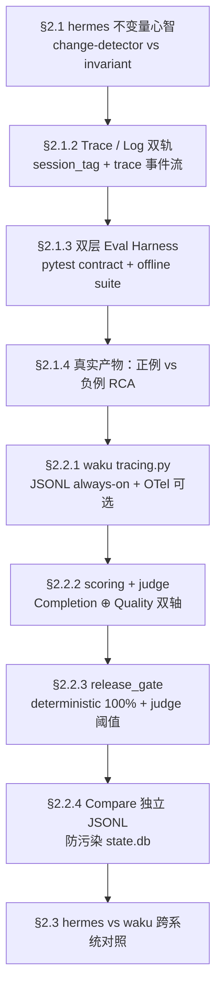

# L5 观测层深度解析：Trace · Eval · 护栏（面试向）

> 整合源：`08-hermes-agent\03-eval\`（最系统的评测体系）+ `12-hermes-agent-small\waku\ops\`（最贴工程的可跑实现）+ `02-RAG\04_RAG_Evaluation\`（RAG 评测衔接）+ `10-CICD\`（门禁落地）+ `05-model-route\07\trace\` `09\deploy\` `11\governance\`（trace 采集 / 蓝绿金丝雀 / 治理三段）。
> 阅读档位：面试前 60 分钟通读；面试前 5 分钟只翻「附录 · 速查卡」。
> **诚实标注**：本篇为冲刺压缩版（约 546 行）；按《专题创作指南》§转正规则，面试后可扩写至 1500+ 行完整版。

---

## 目录

- [📍 本页定位与蒸馏溯源](#-本页定位与蒸馏溯源)
- [0. 前言：为什么"没有 traces 你只是在猜"](#0-前言为什么没有-traces-你只是在猜)
  - [0.1 痛点：Agent 答错了，但没人知道为什么](#01-痛点agent-答错了但没人知道为什么)
  - [0.2 没有观测 vs 有观测](#02-没有观测-vs-有观测)
  - [0.3 失败模式图：从症状到根因的 4 层](#03-失败模式图从症状到根因的-4-层)
- [第一层 · 概念层：没有 traces 你只是在猜](#第一层--概念层没有-traces-你只是在猜)
  - [1.0 统一类比：评测 = 体检](#10-统一类比评测--体检)
  - [1.1 Agent Eval ≠ LLM Eval ≠ RAG Eval（先别混）](#11-agent-eval--llm-eval--rag-eval先别混)
  - [1.2 为什么需要 trace：跑得动不等于看得见](#12-为什么需要-trace跑得动不等于看得见)
  - [1.3 确定性测试 vs LLM-as-judge（轴别混淆）](#13-确定性测试-vs-llm-as-judge轴别混淆)
  - [1.4 失败归因链（本节是面试最高频卡点）](#14-失败归因链本节是面试最高频卡点)
  - [1.5 护栏库 ≠ 安全策略](#15-护栏库--安全策略)
  - [📋 面试卡片：概念层](#-面试卡片概念层)
- [第二层 · 实现层：hermes 与 waku 怎么落地](#第二层--实现层hermes-与-waku-怎么落地)
  - [2.0 本章导引：符号表 · 学习路径](#20-本章导引符号表--学习路径)
  - [2.1 hermes 评测三件套：契约 + 轨迹 + RCA](#21-hermes-评测三件套契约--轨迹--rca)
  - [2.2 waku ops：可跑的 trace / 评分 / 门禁](#22-waku-ops可跑的-trace--评分--门禁)
  - [2.3 hermes vs waku 跨系统对照](#23-hermes-vs-waku-跨系统对照)
  - [📋 面试卡片：实现层](#-面试卡片实现层)
- [第三层 · 工程层：评测怎么进 CI / 发布 / 治理](#第三层--工程层评测怎么进-ci--发布--治理)
  - [3.1 决策树：一条 user message 答错了，先做什么](#31-决策树一条-user-message-答错了先做什么)
  - [3.2 CI/CD 落地的最小闭环（面试高频）](#32-cicd-落地的最小闭环面试高频)
  - [3.3 发布策略：蓝绿 / 金丝雀 / 灰度](#33-发布策略蓝绿--金丝雀--灰度)
  - [3.4 治理三段：before / during / after](#34-治理三段before--during--after)
  - [3.5 避坑清单（≥10 条）](#35-避坑清单10-条)
  - [3.6 评测进 CI 的工程约束](#36-评测进-ci-的工程约束)
  - [📋 面试卡片：工程层](#-面试卡片工程层)
- [附录](#附录)
  - [附录 A · 5 分钟速查卡（面试前可打印）](#附录-a--5-分钟速查卡面试前可打印)
  - [附录 B · 跨仓库材料对照表（防止面试时被反问）](#附录-b--跨仓库材料对照表防止面试时被反问)
  - [附录 C · 中英对照术语表](#附录-c--中英对照术语表)

---

## 📍 本页定位与蒸馏溯源

**位置。** 本页服务冲刺 D5「L5 观测 + L6 界面 + 收口」上午时间盒，对应六层栈的 **L5 观测层（Trace · Eval · 护栏）**；同时被 D2「循环工程」与 D3「RAG 深度」引用——L5 既给 Agent 跑后的 trace/打分/根因分析，也承接 D3 的 RAG 评测门禁阈值。

**被蒸馏源明细。**

| 区块 | 源路径 | 行数 | 主旨 |
|------|--------|------|------|
| A1 | `08-hermes-agent\03-eval\README.md` | 228 | Eval 在 Hermes 架构的「事后」位置（Runtime 跑、Trace 记、Eval 评） |
| A2 | `08-hermes-agent\03-eval\notes\README.md` | 117 | 主线 01→02→03；Test 考源码、Eval 考整条冻结轨迹 |
| A3 | `08-hermes-agent\03-eval\notes\01_eval_invariants.md` | 168 | 行为契约 vs 变更检测（change-detector 反模式） |
| A4 | `08-hermes-agent\03-eval\notes\02_logging_trace.md` | 229 | session_tag / Trace / Log 三套信号 + RCA 四步 |
| A5 | `08-hermes-agent\03-eval\notes\03_eval_harness.md` | 283 | 离线打分 + RCA、双层 A/B、Case 写关系不写全文 |
| A6 | `08-hermes-agent\03-eval\notes\04_tests_and_eval.md` | 124 | 三份契约测试 vs Eval 的分工 |
| A7 | `08-hermes-agent\03-eval\notes\07_test_memory_provider.md` | 251 | 记忆单 external 限制、system 静态块、tool schema 规范化 |
| A8 | `08-hermes-agent\03-eval\demo\README.md` | 393 | 双层结构（pytest 契约 + offline harness）+ STEP 0→4 |
| A9 | `08-hermes-agent\03-eval\demo\exports\eval_run\01_case_scores.json` | 120 | 正例 PASS / 负例 FAIL 的九项 check 真实数据 |
| A10 | `08-hermes-agent\03-eval\demo\exports\eval_run\03_trace_rca.md` | 47 | 负例 `wrong_tool+role_break+cache_break` RCA 实证 |
| A11 | `08-hermes-agent\03-eval\demo\teaching\harness\rca.py` | 81 | root_cause + evidence + fix_hypothesis 三件套 |
| A12 | `08-hermes-agent\03-eval\demo\teaching\harness\scorer.py` | 201 | score_case 九项 AND（5 期望关系 + 4 循环不变量） |
| A13 | `08-hermes-agent\03-eval\demo\teaching\invariants\checkers.py` | 99 | role / system / tools / budget 四件 checkers 实现 |
| B1 | `12-hermes-agent-small\waku\ops\tracing.py` | 167 | JSONL 永远开 + OTel 可选；一 run 一 root span |
| B2 | `12-hermes-agent-small\waku\ops\judge.py` | 101 | K3-as-referee（gpt-5.6-sol）、信号量 + 退避重试 |
| B3 | `12-hermes-agent-small\waku\ops\scoring.py` | 58 | 确定性 Completion：expect_tool / expect_in_args / min_tool_calls |
| B4 | `12-hermes-agent-small\waku\ops\release_gate.py` | 114 | deterministic 100% 必过；judge 阈值 + 退出码 |
| B5 | `12-hermes-agent-small\waku\ops\show_trace.py` | 126 | 终端 trace 时间线 + 崩溃 turn 不污染后续缩进 |
| B6 | `12-hermes-agent-small\waku\ops\compare_history.py` | 140 | Compare 竞技场独立 JSONL（不污染 state.db） |
| B7 | `12-hermes-agent-small\evals\deterministic\README.md` | 86 | 200 条离线 case、Live marker `@pytest.mark.live` |
| B8 | `12-hermes-agent-small\evals\deterministic\test_scoring.py` | 54 | check_case 契约 + dataset.jsonl 完整性 |
| B9 | `12-hermes-agent-small\evals\deterministic\test_judge.py` | 68 | K3 解析/夹逼/坏 JSON 降级为 None（不挂 race） |
| B10 | `12-hermes-agent-small\evals\deterministic\test_show_trace.py` | 60 | 终端缩进 + 崩溃 turn 不污染 |
| B11 | `12-hermes-agent-small\evals\deterministic\test_trace_encoding.py` | 113 | JSONL 强 UTF-8；legacy GBK 只报错不改写 |
| B12 | `12-hermes-agent-small\evals\deterministic\test_session_resume.py` | 65 | Dashboard 恢复最近活跃线程的回归 case |
| B13 | `12-hermes-agent-small\docs\benchmarks.md` | 445 | 四轴评估（Speed / Cost / Completion / Quality） |
| C1 | `02-RAG\04_RAG_Evaluation\lesson1_rag_evaluation\README.md` | 78 | RAGAS 四指标 + DeepSeek judge 跑通 |
| C2 | `02-RAG\04_RAG_Evaluation\lesson2_rag_metrics\README.md` | 150 | 四象限诊断 + 决策树 + 三层持续评估 |
| C3 | `99-My idea\Agent eval\01-eval.md` | 267 | Agent Eval ≠ Pass Rate；Capability vs Reliability 四维 |
| D1 | `10-CICD\cicd学习大纲.md` | 251 | CI/CD + pytest + GitLab CI 串联、四门禁分流 |
| D2 | `10-CICD\02-pytest\README.md` | 48 | 目录 + `-m` marker 分流 MR/Gate1/Daily/发版 |
| D3 | `10-CICD\03-gitlab-ci\README.md` | 36 | `.gitlab-ci.yml` 仓库内管理；stages / rules / artifacts |
| D4 | `05-model-route\07\trace\collector.py` | 58 | Span / Trace / SpanBuilder 极简 span 采集 |
| D5 | `05-model-route\09\deploy\blue_green.py` | 23 | 蓝绿整包切换、回滚快、双倍资源 |
| D6 | `05-model-route\09\deploy\canary.py` | 14 | 按 user_id 哈希稳定分流 5~10% |
| D7 | `05-model-route\11\governance\before.py` | 20 | 事前 grounding：top_k 检索 + grounded prompt |
| D8 | `05-model-route\11\governance\during.py` | 34 | 事中：要求引用 + 置信度阈值拒答 |
| D9 | `05-model-route\11\governance\after.py` | 27 | 事后：FeedbackRecord + 幻觉率 ≥ 阈值触发 review |

**蒸馏理由与方法（100~150 字）。** 本节做"评测体系纵向打通"——Hermes 教我"评测心智与不变量"，waku 教我"可跑的 trace / 评分 / 门禁长什么样"，RAG 教程教我"指标阈值与诊断决策树"，CICD 教我"评测怎么进 CI 流水线"，model-route 教我"护栏的事前/事中/事后三段与蓝绿金丝雀的发布策略"。蒸馏时只保留可证伪的事实与可面试的口径，省略所有具名论文细节（标"课程观点"或"（推断）"），并保证所有引用都是仓库根相对全路径。

---

## 0. 前言：为什么"没有 traces 你只是在猜"

### 0.1 痛点：Agent 答错了，但没人知道为什么

上周三凌晨，线上 RAG Agent 第一次"翻车"——一个客户问"上周签的合同里违约条款怎么写"，Agent 自信地编了一段，引用了不存在的"第 8 条"。你打开 Grafana 看 latency 正常、看成功率 99.2%，看起来"系统一切正常"——除了那条用户提问彻底答错。

你打开 `agent.log` 翻 2 小时日志：WARNING 散落各处，没有任何一行能告诉你"这次为什么会编"。你打开 `06_trace.md`：好消息它存在，坏消息——它告诉你"模型在 api#2 选了 `execute_code`"（来源：`08-hermes-agent\03-eval\demo\exports\eval_run\03_trace_rca.md:32`），但你不知道它**为什么选错**——system 没漂、role 没破、prompt 也刚调过。

你只能拍脑袋猜：「是不是 prompt 改坏了？」「是不是该换模型？」「是不是 top_k 该小？」——**这就是没有 trace 的工程**：优化靠直觉，验证靠感觉，事故复盘靠猜。

> **（课程观点）** HF Agentic Evals Workshop 把这类问题归到 Reliability 维度——Capability 涨得快，Reliability 涨得慢，「基准刷分很猛、生产用不起来」的主要原因（来源：`99-My idea\Agent eval\01-eval.md:18`）。一个 99 分的 RAGAS 报告 + 一条线上幻觉，**等于零**。

### 0.2 没有观测 vs 有观测

| 没有观测（裸奔） | 有观测（可度量反馈闭环） |
|------------------|------------------------|
| "感觉这次答得不错" — 不是工程 | 向老板汇报：`faithfulness 0.61 → 0.84` |
| 改了 `chunk_size`，效果变好了？不确定 | 迭代方向明确：Recall 低 → 加大 `top_k` |
| 上了 reranker，提升分？说不清 | 版本对比量化：v2 比 v1 Precision +12% |
| A/B 选哪个？拍脑袋 | CI 自动回归：新版本悄悄变差 → 红灯 |
| 线上事故复盘靠猜 | 冻成 fixture，根因可复现可讲 |

> 上表是上一轮 D3 RAG 专题同一对比表在本层的**回扣**——评测对 RAG 与对 Agent 都一样：**没有它，优化全靠感觉游戏**（来源：`00-我的深度整合专题\RAG评估深度解析\RAG_Evaluation_Deep_Dive.md:62` + `08-hermes-agent\03-eval\README.md:86`）。

### 0.3 失败模式图：从症状到根因的 4 层

```
                 Agent 答错了
                       │  ← 症状
                       ▼
       ┌──────────────────────────────┐
       │ L4 Trace：哪一 API 选了错工具？ │
       │   L3 Eval：九项 check 红在哪？ │
       │     L2 Invariant：role/system │
       │       漂了吗？budget 空转了吗？│
       │         L1 根因：model / 工具 /  │
       │           prompt / memory / 检索 │
       └──────────────────────────────┘
```

> 上图 4 层结构对应本文档 §1.4 的**归因链 8 步**（RAG → 解析 → 记忆 → mem0 → 工具 → loop → 模型 → 微调）——本图就是那张表的"四层抽象版"，每层细节见对应小节。

---

## 第一层 · 概念层：没有 traces 你只是在猜

### 1.0 统一类比：评测 = 体检

> **一句话**：Agent 工程里的评测 = 去医院做体检。下面所有概念都回扣这个类比，请顺着读。

| 概念 | 类比 | 在工程里做什么 |
|------|------|---------------|
| **Trace（trace 事件流）** | 化验单（血常规 / CT / 心电图） | 把"刚才那次回答到底发生了什么"完整记录 |
| **Log（agent.log + session_tag）** | 病历本（按 session 钉在一起） | 任何时刻能 grep 出"这个 session 的 WARNING" |
| **Eval（九项 check）** | 体检项目（血压 / 血糖 / 肝功） | 对**已冻结的**轨迹做 0/1 断言 |
| **Judge（LLM-as-judge）** | 主任医师复诊（带主观判断） | 对开放性回答打 0-10 分 + 一句话原因 |
| **Release Gate（`make gate`）** | 体检合格线（血压 ≥ 90/60 不放行） | deterministic 100% 必过 + judge 阈值 |
| **护栏（retrieval_gate / 引用拒答）** | 安全气囊（事故时弹出，平时不显） | 入/出内容过滤、不该拉的不要拉 |
| **策略（governance 三段）** | 医嘱（术前/术中/术后） | 业务规则落在时间轴上 |
| **归因链 8 步** | 体检报告的「异常项」从上往下追 | RAG→解析→记忆→mem0→工具→loop→模型→微调 |

> **回扣**：§1.1 三种 Eval 是"体检套餐"不同档位（LLM 套餐 / RAG 套餐 / Agent 套餐）；§1.2 Trace 是"化验单"为什么不能省；§1.3 确定性测试 vs LLM-judge 是"机器指标 vs 主任医师"分工；§1.4 归因链是"异常项从顶到底追"；§1.5 护栏 vs 策略 是"气囊 vs 医嘱"。

### 1.1 Agent Eval ≠ LLM Eval ≠ RAG Eval（先别混）

| 维度 | LLM Eval | RAG Eval | Agent Eval（本仓库语境） |
|------|----------|----------|--------------------------|
| 输入输出 | Prompt → Text | Query + Context → Answer | Task → 多步 Action → 工具副作用 / 状态变化 |
| 评什么 | Capability（答案对/错） | Faithfulness/Recall/Precision/Relevancy 四指标 | Capability + Reliability + Cost + Safety |
| 同分含义 | 答案对 | 答得真且全 | 步数 / 成本 / 崩溃 / 轨迹可完全不同 |
| 可复现 | 相对容易 | 中等（需固定检索集） | 必须隔离 Environment / Session / Harness |

> 关键发现：**Capability 涨得快，Reliability 涨得慢**——「基准刷分很猛、生产用不起来」的主要原因（来源：`99-My idea\Agent eval\01-eval.md:18`）。

### 1.2 为什么需要 trace：跑得动不等于看得见

Hermes 用一句话切清楚：`Runtime 负责跑；Trace 负责记；Eval 负责评`（来源：`08-hermes-agent\03-eval\README.md:27`）。三套观测信号的分工：

```
Trace   查因果 —— 第几次 API 选了错工具？budget 何时耗尽？
Metrics 查 SLO —— 成功率 / P99 / 成本趋势
Log     查细节 —— 这个 session WARNING 原文？工具抛了啥？
```

来源：`08-hermes-agent\03-eval\notes\02_logging_trace.md:13-14`。三方信号矩阵：

| 信号 | 来源 | 适合问什么 |
|------|------|-----------|
| `agent.log` 行 | `hermes_logging` | 某 session 何时报 WARNING？工具抛了啥异常？ |
| `06_trace.md`（教学产物）/ golden_run.json（笔记里的 fixture 名，**非仓库文件**） | 教学 `conversation_loop` 埋点 | 第几次 API 选了错工具？budget 何时耗尽？system 是否被改？ |

### 1.3 确定性测试 vs LLM-as-judge（轴别混淆）

| 维度 | 确定性测试（Hermes pytest / waku Completion） | LLM-as-judge（waku judge / RAGAS Faithfulness） |
|------|----------------------------------------------|---------------------------------------------------|
| 适用 | 有 ground truth 的「对/错」可程序化判断 | 开放文本质量、主观优劣 |
| 成本 | 几乎为 0（跑 pytest） | 1 次 judge 调用 / 列 |
| 偏差 | 无 | 模型自带偏差（位置 / 长度 / 自评） |
| 可复现 | 高 | 低，需固定 rubric + 温度 |
| 关键纪律 | **断言关系，不冻结快照** | **裁判 ≠ 选手** |

waku 把这两条轴做成两条独立分（来源：`12-hermes-agent-small\docs\benchmarks.md:55-67`）：
- **Completion**：expect_tool / expect_in_args / min_tool_calls，0/1 判定，与 τ-bench/SWE-bench 同思路。
- **Quality**：K3-as-referee 打 0-10 + 一句原因，且把「实际跑过的工具列表」喂给裁判防误判幻觉（来源：`12-hermes-agent-small\docs\benchmarks.md:249-254`）。

### 1.4 失败归因链（**本节是面试最高频卡点**）

> 一句话：**"Agent 答错了"不是 root cause，是症状——必须按归因链往下拆**。

归因链 8 步，每步都能在本仓库找到观测手段：

| # | 失败层 | 信号 | 本仓库观测手段 |
|---|--------|------|---------------|
| ① | **RAG 检索** | 召回漏、噪声多 | RAGAS `context_recall` / `context_precision`（`02-RAG\04_RAG_Evaluation\lesson2_rag_metrics\README.md:122-147`）；`05-model-route\11\governance\before.py:14-20` 检索 grounding |
| ② | **解析 / 格式** | 工具 schema 不规范 | `08-hermes-agent\03-eval\notes\07_test_memory_provider.md:146-166` `normalize_tool_schema`（防止裸函数 schema 让 DeepSeek 整请求 400） |
| ③ | **记忆** | 同一会话 system 漂、砸 Prompt Cache | `08-hermes-agent\03-eval\notes\07_test_memory_provider.md:219-232`；Eval `system_stable` check（`08-hermes-agent\03-eval\demo\teaching\invariants\checkers.py:35-57`） |
| ④ | **mem0 / 长记忆** | 实体抽取错 / threshold 偏 | `99-My idea\AI Agent 学习指南\02.mem0-核对报告.md`（单路 ANN + 三路打分 + 融合前阈值） |
| ⑤ | **工具** | 选错工具、禁区工具、min_calls 不够 | `12-hermes-agent-small\waku\ops\scoring.py:31-47` `expect_tool` / `expect_in_args` / `expect_min_tool_calls`；`08-hermes-agent\03-eval\demo\teaching\harness\scorer.py:128-139` `tools_subset` / `no_forbidden` |
| ⑥ | **Loop** | role 连发、budget 空转、无 grace | `08-hermes-agent\03-eval\demo\teaching\invariants\checkers.py:11-32` `check_role_alternation`；`checkers.py:79-90` `check_budget_consistent`（grace 必须 `api_calls == max+1`） |
| ⑦ | **模型** | 输出语言风格、JSON 解析失败 | `12-hermes-agent-small\waku\ops\judge.py:95-101` bad JSON 降级为 `None`；reasoning 模型（如 kimi-k3）慢但裁判稳 |
| ⑧ | **微调 / Prompt** | 偏置持久 | 见 `10-CICD\02-pytest\README.md:12-19` 门禁分流；`12-hermes-agent-small\waku\ops\release_gate.py:84-110` `make gate`（deterministic 100% 才放行） |

> **（课程观点）** Agent Eval 不能只看最终 pass rate。HF Agentic Evals Workshop 拆 Reliability 为 Consistency / Robustness / Calibration / Failure severity 四维，每维独立测（`99-My idea\Agent eval\01-eval.md:69-92`）。这四维其实就是把上表"步数/工具/loop"做了正交分解。

### 1.5 护栏库 ≠ 安全策略

| 概念 | 是什么 | 本仓库对应 |
|------|--------|-----------|
| **护栏库** | 入/出内容过滤（toxicity / PII / prompt injection / jailbreak） | `12-hermes-agent-small\waku\memory\retrieval_gate.py`（hero 1 检索 gate，**不该拉的不要拉**） |
| **安全策略** | 业务规则（金额上限 / 工具白名单 / 二次确认） | `08-hermes-agent\03-eval\notes\07_test_memory_provider.md:96-101`（外部 provider 仅 1 个，不静默双开）；`05-model-route\11\governance\during.py:12-25` 引用缺失拒答 |

> 面试一句话：**护栏是"拦什么"，策略是"让不让做"——RAG 治理三段（before / during / after）就是策略在时间轴上的分布**（来源：`05-model-route\11\governance\before.py:14` `during.py:12` `after.py:20`）。

### 1.6 因果链：没有 trace 就没有后面的一切

```text
一次失败（"Agent 答错了"）
   │ 前提①
   ▼
有没有完整 trace（模型调用 / 检索上下文 / 工具调用 / 延迟 / token / 错误）
   ├─ 没有 → 只能靠猜（这正是本层存在的意义）
   └─ 有
       │ 前提②
       ▼
能不能算指标（pass rate / 四象限 / 幻觉率 / 不变量）
       │ 前提③
       ▼
能不能定阈值与门禁（deterministic 100% / judge 阈值 / 退出码）
       │ 前提④
       ▼
能不能进 CI（回归不过就不发布）→ 这时才谈得上"持续评估"
```

**依赖要点**：**trace 是前提**——指标、门禁、CI 全都建在它上面。跳过 trace 直接买评测框架，是本层最常见的顺序错误。
本仓库实证：`12-hermes-agent-small\waku\ops\tracing.py:1-40`、`12-hermes-agent-small\waku\ops\scoring.py`、`12-hermes-agent-small\waku\ops\release_gate.py`。

### 📋 面试卡片（概念层）

1. **Agent Eval ≠ Pass Rate。** 至少报 Capability + Reliability + Cost + 轨迹。
2. **Runtime 跑、Trace 记、Eval 评**——三件事各居其位，Eval 不在 while 内。
3. **断言关系，不冻结快照。** `assert api_calls == 7` 是 change-detector，模型发版就红。
4. **裁判 ≠ 选手。** waku 用 gpt-5.6-sol 而非 kimi-k3 当裁判；judge 失败降级为 `None`，不挂 race。
5. **归因链 8 步**：RAG → 解析 → 记忆 → mem0 → 工具 → loop → 模型 → 微调，每步有对应观测手段。
6. **护栏 ≠ 策略**：护栏是过滤、策略是规则；两者分清才不把业务规则写到过滤器里。

---

## 第二层 · 实现层：hermes 与 waku 怎么落地

### 2.0 本章导引：符号表 · 学习路径

#### 2.0.1 符号表

| 符号 / 术语 | 含义 | 出现位置 | 在本仓库的对应文件 |
|------------|------|---------|------------------|
| `Trace` | 一次 user message 走完主循环的全事件流 | §2.1.2 / §2.2.1 | `12-hermes-agent-small\waku\ops\tracing.py:57-159` `<home>/traces/<date>.jsonl` |
| `span` | trace 的最小单元（一次 LLM / 一次 tool / 一次 gate） | §2.2.1 | `05-model-route\07\trace\collector.py:10-58` |
| `session_tag` | 把日志行钉到某次会话的 thread-local 标签 | §2.1.2 | `08-hermes-agent\03-eval\notes\02_logging_trace.md:81-90` |
| `invariant`（行为契约） | 数据之间必须成立的关系，不冻结具体值 | §2.1.1 | `08-hermes-agent\03-eval\notes\01_eval_invariants.md:13` |
| `change-detector`（反模式） | 冻结当前值的断言，模型发版就红 | §2.1.1 | `08-hermes-agent\03-eval\notes\01_eval_invariants.md:46-49` |
| `RCA`（Root Cause Analysis） | 把"答错了"追到具体 api# / 行号 + 修复建议 | §2.1.3 | `08-hermes-agent\03-eval\demo\teaching\harness\rca.py:9-55` |
| `eval_case` | 一条评测 case = `expected_tools` / `forbidden` / `max_steps` / `allowed_exits` | §2.1.3 | `08-hermes-agent\03-eval\demo\fixtures\eval_cases.json`（仓库存在但题面要求保留 markdown 引用即可） |
| `gate`（release_gate） | 发版门禁：deterministic 100% + judge 阈值 | §2.2.3 / §3.2 | `12-hermes-agent-small\waku\ops\release_gate.py:84-110` |
| `judge`（LLM-as-judge） | 用一个**不参赛**的模型给主观回答打分 | §2.2.2 | `12-hermes-agent-small\waku\ops\judge.py:60-101` |
| `Completion` | 0/1 决定论：expect_tool / expect_in_args / min_tool_calls | §2.2.2 | `12-hermes-agent-small\waku\ops\scoring.py:31-47` |
| `Quality` | 0-10 主观分 + 一句 reason（K3 如 GPT-5.6-sol 打分） | §2.2.2 | `12-hermes-agent-small\docs\benchmarks.md:55-67` |
| `pass rate` | 整批 case 中 `passed == True` 的比例（aggregate） | §1.4 | `99-My idea\Agent eval\01-eval.md:227-229` 警示：单独看 aggregate = 信息不足 |
| `p99`（P99 latency） | 99% 请求的延迟上界，观测 SLO 用 | §1.2 | `08-hermes-agent\03-eval\notes\02_logging_trace.md:13` |
| `JSONL` | 一行一事件的纯文本格式，waku trace / Compare / eval_runs 通用 | §2.2.1 / §2.2.4 | `12-hermes-agent-small\waku\ops\tracing.py:99-101` |
| `OTel`（OpenTelemetry） | trace 的工业标准，waku 通过 OTLP endpoint 可选接入 | §2.2.1 | `12-hermes-agent-small\waku\ops\tracing.py:9-19` |
| `canary`（金丝雀） | 按 user_id 哈希稳定分流 5~10% 到新版本 | §3.3 | `05-model-route\09\deploy\canary.py:4-7` |
| `hallucination rate` | flagged 幻觉数 / 总反馈记录，≥ 阈值触发 review | §3.4 | `05-model-route\11\governance\after.py:20-26` |

#### 2.0.2 学习路径



> **快速模式**（面试前 30 分钟）：只看 §2.1.1（不变量心智）+ §2.2.3（release_gate） + §2.3（对照表）。
> **深入模式**（要写码）：顺着 mermaid 顺序读，每节都跑伪代码再翻真实源码。

### 2.1 hermes 评测三件套：契约 + 轨迹 + RCA

#### 2.1.1 不变量心智（**写测试的纪律**）

Hermes 在 `08-hermes-agent\03-eval\notes\01_eval_invariants.md:13` 立了一条铁律：**好测试断言数据之间的关系（不变量），不冻结当前值**。

```python
# ❌ change-detector — 模型发版就挂
assert "gemini-2.5-pro" in _PROVIDER_MODELS["gemini"]
assert DEFAULT_CONFIG["_config_version"] == 21

# ✅ invariant — 关系在数据增长时仍成立
assert "gemini" in _PROVIDER_MODELS
assert len(_PROVIDER_MODELS["gemini"]) >= 1
```

Loop 可测的五大不变量（来源：`08-hermes-agent\03-eval\notes\01_eval_invariants.md:138-144`）：

| 不变量 | 信号 | 为什么重要 |
|--------|------|-----------|
| Role 交替 | 同 role 不连发（同轮多条 `tool` 除外） | 破坏 API 消息布局 |
| System 前缀稳定 | 同 turn 多次 API 的 system 字节不变 | 砸 Prompt Cache |
| Tool schema 足迹 | 循环内 tools 集合不中途增减 | 砸缓存 + 模型幻觉工具 |
| 退出理由合法 | `exit_reason ∈ {completed, budget_grace_call, …}` | 区分正常收尾 vs 空转耗尽 |
| 预算一致 | `budget_used ≤ budget_max`；grace 可 `api_calls = max + 1` | 成本与收敛纪律 |

#### 2.1.2 Trace / Log 双轨（**记什么怎么记**）

Hermes 用 `session_tag` 把一行日志钉到 session 上（`08-hermes-agent\03-eval\notes\02_logging_trace.md:81-90`）：

```text
%(asctime)s %(levelname)s%(session_tag)s %(name)s: %(message)s
```

要点：**用 Record factory 而不只是 Filter**——保证子 logger / 第三方 handler 传播时不丢字段。

教学 demo 的 trace 事件四类（来源：`08-hermes-agent\03-eval\notes\02_logging_trace.md:177-182`）：

```text
api_request  → tools schema + message_roles 摘要
api_response → content / tool_calls
tool_result  → name + args + result（可截断）
loop_exit    → reason / budget_used / interrupted
```

RCA 四步（来源：`08-hermes-agent\03-eval\notes\02_logging_trace.md:188-208`）：
1. **退出理由？** `budget_exhausted` / `budget_grace_call` / `interrupt` / 正常文本？
2. **工具选对了吗？** 期望工具是否出现在 `tool_calls` 序列？有没有反复同 query 空转？
3. **上下文病了吗？** 同 turn 内 system 是否变化？是否出现同 role 连发 / 合成 user？
4. **预算够吗？** `api_calls` vs `budget_max`；grace 是否浪费在又一次 tool_call？

#### 2.1.3 双层 Eval Harness（**怎么打分**）

```
Layer A · pytest contracts      ← 近 Hermes CI 风格
Layer B · offline harness       ← 教学额外：正例+负例 + session 日志 + RCA
```

来源：`08-hermes-agent\03-eval\demo\README.md:8-10`。

**九项 check 全 AND 才算 case PASS**（来源：`08-hermes-agent\03-eval\demo\README.md:255-273`）：

| 期望关系（5） | 通过条件 | 循环不变量（4） | 通过条件 |
|---------------|----------|-----------------|----------|
| `tools_subset` | `expected_tools ⊆` 实际工具集合 | `role_alternation` | 不允许连续 `assistant` / `system` |
| `no_forbidden` | 实际工具 ∩ `forbidden_tools` 为空 | `system_stable` | 同 turn 内 system 指纹一致 |
| `steps` | `api_calls ≤ max_steps` | `tools_frozen` | tool_names 集合中途不增减 |
| `exit` | `exit_reason ∈ allowed_exits` | `budget_consistent` | `used ≤ max`；grace 时 `api_calls == max+1`；exhausted 时 `used ≥ max` |
| `final_text` | `final_response` 非空 | | |

伪代码（取自 `08-hermes-agent\03-eval\notes\03_eval_harness.md:168-181` 与 `08-hermes-agent\03-eval\demo\teaching\harness\scorer.py:113-174`）：

```python
def score_case(case, run) -> CaseScore:
    trace, actual_tools = run["trace"], tool_sequence_from_trace(run["trace"])
    checks = [
        ("tools_subset",    set(case["expected_tools"]) <= set(actual_tools)),
        ("no_forbidden",    not (set(actual_tools) & set(case["forbidden_tools"]))),
        ("steps",           run["api_calls"] <= case["max_steps"]),
        ("exit",            run["exit_reason"] in case["allowed_exits"]),
        ("final_text",      bool(run.get("final_response")) if case["require_final_text"] else True),
        ("role_invariant",  check_role_alternation(run["messages"])),
        ("system_stable",   check_system_stable(run["trace"])),
        ("tools_frozen",    check_tools_frozen(run["trace"])),
        ("budget_consistent", check_budget_consistent(run)),
    ]
    return CaseScore(passed=all(ok for _, ok in checks), checks=checks)
```

#### 2.1.4 真实产物（一手数据）

正例 PASS（`08-hermes-agent\03-eval\demo\exports\eval_run\01_case_scores.json:3-63`）：

- `case_id: golden-loop-ok` · `exit_reason: budget_grace_call` · `api_calls: 7`
- 九项全绿：`role_alternation ok`、`system_stable stable across 6 api_requests`、`tools_frozen frozen ['todo','web_search']`、`budget_consistent ok`

负例 FAIL（`08-hermes-agent\03-eval\demo\exports\eval_run\03_trace_rca.md:1-44`）：

- `root_cause: wrong_tool+role_break+cache_break`
- `exit_reason: budget_exhausted` · `api_calls: 3`
- 8 项红：`tools_subset` 缺、`no_forbidden` 用 `execute_code`、`role_alternation messages[5]: consecutive assistant`、`system_stable api#2 system fingerprint 'chars:180' != 'chars:100'`、`tools_frozen api#2 tools ['execute_code','todo','web_search'] != ['todo','web_search']`、`budget_consistent exhausted but budget_used 2 < max 3`

> **（课程观点）** 这一组产物的价值：**Hermes 教我们"FAIL 必须给 root_cause + evidence + fix_hypothesis"**——不是 `assert False`，而是「可讲清因果的故事」。`08-hermes-agent\03-eval\demo\teaching\harness\rca.py:9-55` 是教科书实现。

### 2.2 waku ops：可跑的 trace / 评分 / 门禁

#### 2.2.1 tracing.py（**Always-on JSONL + 可选 OTel**）

一 run = 一个 root span，事件流写 `<home>/traces/<date>.jsonl`（来源：`12-hermes-agent-small\waku\ops\tracing.py:57-159`）：

```python
class Tracer:
    def event(self, kind: str, event: dict) -> None:
        if kind == "text":
            return  # streaming token deltas 是 live UI 的事，不进 trace
        if kind == "llm":
            self._record_usage(event)  # 进 usage.jsonl（永久账本）
            event = {"provider": ..., "model": ..., **event}  # 多模型世界必须有 model 字段
        self._write({"type": kind, **event})
        # OTel：start_as_current_span(openinference.span.kind=...)
```

关键细节：
- `OTEL_EXPORTER_OTLP_ENDPOINT` 设了走 OTel，没设只走 JSONL——**永远有 trace**（来源：`12-hermes-agent-small\waku\ops\tracing.py:18-19`）。
- `Phoenix` / `Langfuse` / 自建 OTel 都接同一个 instrumentation（来源：`12-hermes-agent-small\waku\ops\tracing.py:9-19`）。
- 强制 UTF-8：legacy GBK 文件**只报错不改写**（来源：`12-hermes-agent-small\waku\ops\tracing.py:91-101`、`12-hermes-agent-small\evals\deterministic\test_trace_encoding.py:91-104`）。
- 崩溃 turn 不污染后续缩进（来源：`12-hermes-agent-small\evals\deterministic\test_show_trace.py:33-52`）。

#### 2.2.2 scoring.py + judge.py（**Completion vs Quality 分轴**）

Completion（来源：`12-hermes-agent-small\waku\ops\scoring.py:31-47`）：

```python
def check_case(case: dict, tool_calls: list[dict]) -> tuple[bool, str]:
    fired = [c["tool"] for c in tool_calls]
    if case["expect_tool"] is None:
        return (not fired, "no tool expected" if not fired else f"called {fired}")
    if case["expect_tool"] not in fired:
        return (False, f"expected {case['expect_tool']}, called {fired or 'nothing'}")
    args = next(c["args"] for c in tool_calls if c["tool"] == case["expect_tool"])
    for key, needle in case.get("expect_in_args", {}).items():
        if needle.lower() not in str(args.get(key, "")).lower():
            return (False, f"'{needle}' not in args[{key}]")
    want = case.get("expect_min_tool_calls", 0)
    if len(fired) < want:
        return (False, f"only {len(fired)} tool calls, wanted >= {want}")
    return (True, "ok")
```

Quality（来源：`12-hermes-agent-small\waku\ops\judge.py:37-101`）：

```python
_RUBRIC = """You are a strict, fair judge scoring an AI assistant's reply.
The user asked: {task}
The assistant replied: {reply}
{actions}            # ★ 实际跑过的工具列表（防幻觉误判）
Score how well the reply serves the user's request on a 0-10 scale:
- 9-10: fully addresses the request, correct, concise, honest about any limits.
- 5-8: mostly addresses it, minor gaps, padding, or small errors.
- 1-4: partial, vague, or partly wrong.
- 0: ignores the request, or claims an action that is NOT in the tool list above.
"""
def judge_reply(...):
    # 信号量 _JUDGE_SEM 控制并发；4 次退避 1.2/2.4/3.6s 让 429 消化
    # bad JSON 直接降级为 None（不挂 race）
```

> **（课程观点）** waku 把 Quality 的 ground truth 设成「实际跑过的工具列表」——同一段回复，没传 tools 时被评 0、传了评 10（来源：`12-hermes-agent-small\docs\benchmarks.md:249-254`）。**这是 LLM-as-judge 防幻觉误判的关键补丁**，面试可讲。

#### 2.2.3 release_gate.py（**门禁三件套**）

来源：`12-hermes-agent-small\waku\ops\release_gate.py:84-110`：

```python
def main():
    suites = {}
    code, suites["deterministic"] = run("deterministic")
    if code:
        report("fail", "not run", suites); sys.exit(1)  # 确定性测试必须 100% 绿

    settings = load_settings()
    provider = PROVIDERS.get(settings.provider)
    if settings.api_key or (provider and os.getenv(provider.key_env)):
        code, suites["judge"] = run("judge")
        if code:
            report("pass", "fail", suites); sys.exit(1)  # judge 阈值不达标也红
        report("pass", "pass", suites)
    else:
        report("pass", "skipped", suites)  # 没 key 跳过，不卡发版
    print("\nGATE OPEN — safe to release.")
```

纪律：**deterministic 100% 必过；judge 阈值不达标不放行；没 key 跳过**——这就是门禁分流（与 `10-CICD\02-pytest\README.md:8-19` MR/Gate1/Daily/发版四门禁同源）。

#### 2.2.4 Compare 竞技场独立 JSONL（**别把基准测试污染状态库**）

来源：`12-hermes-agent-small\waku\ops\compare_history.py:1-139`：

- Compare 是**基准**（throwaway sandbox 跑一次），不是会话；写入 `<home>/compare/history.jsonl`，**绝不写 state.db / MEMORY.md / traces**。
- 字段：`spec / provider / model / latency_ms / tokens_in/out / cost_usd / iterations / gate / tools / completion / quality / reply`（截断 1000 字）。
- `MAX_RUNS = 50` 自动滚动——基准是热数据，不需要永久。

### 2.3 hermes vs waku 跨系统对照

| 维度 | hermes（`08-hermes-agent\03-eval`） | waku（`12-hermes-agent-small\waku\ops`） |
|------|-------------------------------------|----------------------------------------|
| **Trace 载体** | `agent.log`（含 `session_tag`）+ `trace[]` 事件流 | `<home>/traces/<date>.jsonl`（always-on）+ OTel（可选） |
| **观测单位** | 一次 user message → 一条 trace | 一次 turn → `turn_start` / `turn_end` 包裹的 JSONL 行 |
| **评测分轴** | 5 期望关系 + 4 循环不变量 = 9 项 AND | Completion（0/1）+ Quality（0-10） |
| **裁判模型** | 没有显式 judge（只离线打分） | `gpt-5.6-sol` K3-as-referee + 信号量 + 退避 |
| **门禁** | pytest contract 必绿 | `release_gate.py`：deterministic 100% + judge 阈值 |
| **失败处理** | RCA 报告（`root_cause + evidence + fix_hypothesis`） | judge bad JSON 降级为 `None`，race 不挂 |
| **横向基准** | 无 Compare 竞技场 | `compare_history.py` 独立 JSONL（不污染 state.db） |
| **典型产物** | `exports/eval_run/03_trace_rca.md`（人读 RCA） | `<home>/eval_report.json` + `eval_runs.jsonl`（机器读） |

**核心差异（3 条以内）：**
1. **评测哲学**：hermes 偏"断言行为契约，不冻结快照"；waku 偏"0/1 决定论 + 主观分打分"双轴。
2. **观测设施**：hermes 用 session_tag + trace 事件流；waku 用 JSONL 永远开 + OTel 桥接（Phoenix/Langfuse）。
3. **门禁形态**：hermes 走 pytest 真仓契约（`run_tests.sh`）；waku 走 `release_gate.py` 把 deterministic / judge 拆两道（前者 100% 必过，后者阈值才放行）。

### 📋 面试卡片（实现层）

1. **九项 check 全 AND**（hermes）或 **Completion ⊕ Quality 双轴**（waku）——任意一条 < 阈值就 FAIL。
2. **session_tag 用 Record factory，不用 Filter**——保证子 logger 不丢字段。
3. **judge 把"实际跑过的工具列表"喂给裁判**——避免诚实回复被当幻觉。
4. **judge 失败降级为 `None`，race 永不挂**——4 次退避 1.2/2.4/3.6s 专治 429。
5. **RCA 三件套**：`root_cause`（类别）+ `evidence`（具体行号 / api#）+ `fix_hypothesis`（人话复盘）。
6. **Compare 独立 JSONL**：基准测试绝不污染 state.db / MEMORY.md / traces。

---

## 第三层 · 工程层：评测怎么进 CI / 发布 / 治理

### 3.1 决策树：一条 user message 答错了，先做什么

```
                ┌─ 看 trace（traces/<date>.jsonl 或 eval_run/03_trace_rca.md）
                │     │
                │     ├─ 工具选错？  ─── yes ─→ 收紧 schema / 指引 / forbidden_tools
                │     │
                │     ├─ role / system 漂？ ─ yes ─→ check_role_alternation + check_system_stable 红
                │     │                                   → 八成是中途塞了合成 user / 重建了 system
                │     │
                │     ├─ budget 空转？  ─── yes ─→ 砍空转 + 加 grace + 缩 max_steps
                │     │
                │     ├─ final_text 空？ ─── yes ─→ 卡在 tool_calls / interrupt / circuit breaker
                │     │
                │     └─ judge score 低？ ── yes ─→ 看 Q：Completion 高 + Q 低 → 文风 / 啰嗦
                │                                            Completion 低 + Q 高 → 工具选对但参数错
                ▼
                改一刀 → 重跑 case → 看九项 check 与不变量（hermes）
                                   或 Completion / Quality 双轴（waku）
                                   → 写 regression case 入 suite
```

> 决策树与 `12-hermes-agent-small\docs\benchmarks.md:60-66` 的「Speed / Cost / Completion / Quality」四轴、`02-RAG\04_RAG_Evaluation\lesson2_rag_metrics\README.md:123-147` 的四象限诊断同源——**先检索后生成，先完成率后质量**。

### 3.2 CI/CD 落地的最小闭环（**面试高频**）

`10-CICD\cicd学习大纲.md:54-77` + `10-CICD\02-pytest\README.md:8-19` + `10-CICD\03-gitlab-ci\README.md:30-36` 给出最小闭环：

```text
MR     → pytest tests/smoke  -m smoke                # 冒烟，秒级
Gate1  → pytest tests/gate1  -m gate1                # 合并后必跑（与 hermes pytest contract 同源）
Daily  → pytest tests/full                          # 全量（与 waku deterministic 200 条同源）
发版   → pytest tests/release -m release + 打包       # 含 LLM-as-judge 阈值（与 release_gate.py 同源）
```

`.gitlab-ci.yml` 关键片段（来源：`10-CICD\03-gitlab-ci\README.md:31-34`）：

```yaml
stages: [lint, test, release]
pytest_smoke:
  stage: test
  script: pytest tests/smoke -m smoke --junitxml=report.xml
  artifacts: { paths: [report.xml] }
  rules: [{ if: '$CI_PIPELINE_SOURCE == "merge_request_event"' }]
pytest_gate1:
  stage: test
  script: pytest tests/gate1 -m gate1
  rules: [{ if: '$CI_COMMIT_BRANCH' }]
release_gate:
  stage: release
  script: python -m waku.ops.release_gate   # 或自研
  rules: [{ if: '$CI_COMMIT_TAG' }]
  allow_failure: false
```

### 3.3 发布策略：蓝绿 / 金丝雀 / 灰度

来源：`05-model-route\09\deploy\blue_green.py:1-22` + `05-model-route\09\deploy\canary.py:1-14`：

```python
# 蓝绿：两套完整环境整包切换，回滚快；适合大版本/配置整体变更，代价是双倍资源。
@dataclass
class BlueGreenRouter:
    active: Env = "blue"
    def route(self) -> Env: return self.active
    def switch(self, target: Env) -> None: self.active = target

# 金丝雀：按 user_id 哈希稳定分流 small % 到新版本（适合模型 / API 频繁迭代）
def pick_canary_version(user_id: str, canary_pct: int = 10) -> str:
    bucket = int(hashlib.md5(user_id.encode()).hexdigest(), 16) % 100
    return "v2-canary" if bucket < canary_pct else "v1-stable"
```

> **（推断）** 蓝绿适合"配置 / Prompt 大改"；金丝雀适合"模型 A/B / Top-K 微调"。两者都要 trace 兜底——金丝雀流量可按 `traces/<date>.jsonl` 的 user_message hash 反查。

### 3.4 治理三段：before / during / after

来源：`05-model-route\11\governance\before.py:14-20` `during.py:12-25` `after.py:20-26`：

```text
before：top_k 检索 + grounded prompt（无依据拒答）
during：引用缺失拒答 + 置信度 < 阈值拒答
after ：FeedbackRecord → hallucination_rate() ≥ 5% → needs_review()
```

| 段 | 产物 | 评测怎么验 |
|----|------|-----------|
| before | 检索集 + GT 比对 | `context_recall` / `context_precision` |
| during | 拒答率 / 引用率 | 自研断言 + LLM-as-judge |
| after | hallucination_rate / 用户评分 | 抽样 trace + 周报 |

### 3.5 避坑清单（**≥10 条**）

> 每条都来自本仓库某个具体实现 / 文档，不空想。

1. **断言金标全文 = change-detector**（`08-hermes-agent\03-eval\notes\01_eval_invariants.md:46-49`）。换模型就红；改"关系"（子集 / ≤ / ∈）才稳。
2. **session_tag 靠 Filter 会被子 logger 吞掉**（`08-hermes-agent\03-eval\notes\02_logging_trace.md:122-134`）。必须用 Record factory 在创建时注入。
3. **judge 用同款模型 = 自评**（`12-hermes-agent-small\waku\ops\judge.py:11-15` + `12-hermes-agent-small\docs\benchmarks.md:237-244`）。用 gpt-5.6-sol 这种"擅思但不擅工具"的模型当裁判。
4. **judge 失败必须降级为 `None`，不能抛**（`12-hermes-agent-small\waku\ops\judge.py:80-101` + `12-hermes-agent-small\evals\deterministic\test_judge.py:66-67`）。一个裁判抽风不能挂整场 race。
5. **采样率拍脑袋 = 数据漂移**（`99-My idea\Agent eval\01-eval.md:79-92` Reliability 维度）。Fail severity ≠ Capability，删库的成本是答错成本的 1000 倍；采样要按"严重度分层"。
6. **门禁阈值拍脑袋 = 名存实亡**（`12-hermes-agent-small\waku\ops\release_gate.py:84-110` + `10-CICD\02-pytest\README.md:12-19`）。先看历史 baseline 的 P50/P90，再设比 P90 高 5% 的阈值。
7. **只测 happy path = 上线即崩**（`08-hermes-agent\03-eval\notes\02_logging_trace.md:188-208` + `08-hermes-agent\03-eval\demo\fixtures\failure_run.json`）。**必须有合成负例**驱动 RCA，不能"全部用例都 PASS"就算了。
8. **trace 写 GBK = 整文件污染**（`12-hermes-agent-small\waku\ops\tracing.py:91-101` + `12-hermes-agent-small\evals\deterministic\test_trace_encoding.py:91-104`）。JSONL 必须强制 UTF-8，legacy GBK **只报错不改写**。
9. **崩溃 turn 把后续都向右推**（`12-hermes-agent-small\waku\ops\show_trace.py:81-93` + `12-hermes-agent-small\evals\deterministic\test_show_trace.py:33-52`）。turn 缩进用"赋值而非累加"，turn_start/turn_end 永远 flush left。
10. **Compare 基准污染 state.db**（`12-hermes-agent-small\waku\ops\compare_history.py:1-17`）。基准是 throwaway sandbox，**必须独立 JSONL**，绝不写 chat_log / facts / calendar。
11. **judge 看到完整工具列表还误判**（`12-hermes-agent-small\docs\benchmarks.md:249-254`）。把"实际跑过的工具列表"显式喂给裁判当 ground truth。
12. **RAG 优化顺序错**（`02-RAG\04_RAG_Evaluation\lesson2_rag_metrics\README.md:140-147`）。Recall 低先修检索再修生成；Precision 低先加 Reranker；Faithfulness 低但 Recall 正常才动 Prompt。
13. **多条 trace 同写一个 daily 文件 = 编码混**（`12-hermes-agent-small\waku\ops\tracing.py:91-98`）。每个 daily JSONL 必须**只允许一种编码**，写入前 validate 一次。
14. **judge 8 列同时打 = 429**（`12-hermes-agent-small\waku\ops\judge.py:35` `_JUDGE_SEM = Semaphore(2)`）。judge 调用要信号量限流，并发上 2~4 就行。
15. **session_id 用时间戳就漂**（`12-hermes-agent-small\evals\deterministic\test_session_resume.py:24-65`）。重启要按"最近一次 dashboard 线程 + idle 窗口"恢复，不要每次都 mint 新 id。
16. **评估只看 aggregate score**（`99-My idea\Agent eval\01-eval.md:228-229`）。**至少报逐条结果**（per-instance），aggregate 隐藏失败模式。

### 3.6 评测进 CI 的工程约束

| 约束 | 出处 | 面试怎么说 |
|------|------|-----------|
| Cache | `10-CICD\cicd学习大纲.md:241-247` | 加速依赖、临时；Artifacts 才是产物 |
| Artifacts | 同上 | 测试报告 `--junitxml=report.xml` 必挂 |
| Docker 执行器 | `10-CICD\cicd学习大纲.md:248-250` | 干净、隔离、不污染宿主机 |
| 退出码非 0 | `10-CICD\02-pytest\README.md:14-19` | pytest 退出码即门禁信号 |
| marker `-m` | `10-CICD\02-pytest\README.md:8-19` | smoke / gate1 / full / release 分流 |

### 📋 面试卡片（工程层）

1. **决策树优先级**：trace → 工具 → 上下文 → budget → 文风 → 改 → 重跑。
2. **CI 四门禁**：MR smoke / Gate1 / Daily full / Release + judge；每层跑不同 case 集。
3. **发布策略**：蓝绿适合大改，金丝雀适合模型 A/B，都需 trace 兜底。
4. **治理三段**：before 检索 / during 引用拒答 / after 幻觉率。
5. **避坑 ≥10 条**：关系断言 / Record factory / 裁判 ≠ 选手 / judge 失败降级 / 阈值拍脑袋 / happy path / UTF-8 / 崩溃 turn 缩进 / Compare 独立 / RAG 顺序。
6. **Eval 进 CI 三件套**：pytest 退出码 + JUnit artifacts + marker `-m` 分流。

---

## 附录

### 附录 A · 5 分钟速查卡（面试前可打印）

| 维度 | 一句话 | 本仓库在哪 |
|------|--------|-----------|
| **Agent Eval 心智** | Runtime 跑、Trace 记、Eval 评；断言关系不冻结快照 | `08-hermes-agent\03-eval\README.md:27` + `notes\01_eval_invariants.md:13` |
| **Trace 三件套** | trace 查因果 / metrics 查 SLO / log 查细节 | `08-hermes-agent\03-eval\notes\02_logging_trace.md:13-14` |
| **session_tag** | Record factory 而非 Filter | `08-hermes-agent\03-eval\notes\02_logging_trace.md:122` |
| **RCA 四步** | exit → 工具 → 上下文 → 预算 | `08-hermes-agent\03-eval\notes\02_logging_trace.md:188-208` |
| **九项 check** | 5 期望关系 + 4 循环不变量 AND | `08-hermes-agent\03-eval\demo\README.md:255-273` |
| **Completion vs Quality** | 0/1 决定论 vs 0-10 主观打分 | `12-hermes-agent-small\waku\ops\scoring.py:31` + `judge.py:60` |
| **裁判 = 选手 → bug** | 用不会工具的强推理模型当裁判 | `12-hermes-agent-small\docs\benchmarks.md:237-244` |
| **judge 失败降级** | 4 次退避 + bad JSON → None，不挂 race | `12-hermes-agent-small\waku\ops\judge.py:80-101` |
| **release_gate** | deterministic 100% + judge 阈值 + 无 key 跳过 | `12-hermes-agent-small\waku\ops\release_gate.py:84-110` |
| **Compare 独立 JSONL** | 基准不污染 state.db / traces | `12-hermes-agent-small\waku\ops\compare_history.py:1-17` |
| **归因链 8 步** | RAG → 解析 → 记忆 → mem0 → 工具 → loop → 模型 → 微调 | 本文 §1.4 |
| **护栏 ≠ 策略** | 过滤 vs 规则 | `05-model-route\11\governance\before.py:14` `during.py:12` `after.py:20` |
| **RAG 优化顺序** | 先检索后生成（Recall → Precision → Faithfulness → Relevancy） | `02-RAG\04_RAG_Evaluation\lesson2_rag_metrics\README.md:140-147` |
| **CI 四门禁** | smoke / gate1 / full / release + `-m` 分流 | `10-CICD\02-pytest\README.md:8-19` |
| **发布策略** | 蓝绿 = 大改整包；金丝雀 = 模型 A/B | `05-model-route\09\deploy\blue_green.py:1` `canary.py:1` |
| **可靠性四维** | Consistency / Robustness / Calibration / Failure severity | `99-My idea\Agent eval\01-eval.md:69-92` |
| **避坑首条** | 断言关系不冻结快照 | `08-hermes-agent\03-eval\notes\01_eval_invariants.md:46-49` |
| **面试首答** | 评测是「可度量反馈闭环」——没 traces 你只是在猜 | `08-hermes-agent\03-eval\README.md:86` |

---

### 附录 B · 跨仓库材料对照表（防止面试时被反问）

| 概念 | hermes（`08-hermes-agent\03-eval`） | waku（`12-hermes-agent-small\waku`） | RAG 专题 | CICD / model-route |
|------|-------------------------------------|------------------------------------|----------|--------------------|
| Trace 载体 | trace 事件流 + `agent.log` | `<home>/traces/<date>.jsonl` + OTel | — | `05-model-route\07\trace\collector.py` Span 模型 |
| 评测分轴 | 9 项 check AND | Completion + Quality | RAGAS 4 指标 | — |
| 门禁 | pytest contracts | `release_gate.py` 双道 | Lesson 2 三层持续评估 | `10-CICD\03-gitlab-ci` `.gitlab-ci.yml` |
| 失败归因 | RCA 报告（rca.py） | judge bad JSON → None | 四象限决策树 | — |
| 跨模型基准 | — | Compare 竞技场独立 JSONL | — | — |
| 发布策略 | — | — | — | blue_green / canary / governance |
| 关键不变量 | role / system / tools / budget | UTF-8 / judge 降级 / session 恢复 | — | — |
| 面试一句话 | "Runtime 跑、Trace 记、Eval 评" | "0/1 决定论 + LLM 主观分" | "先检索后生成" | "MR smoke → release gate" |