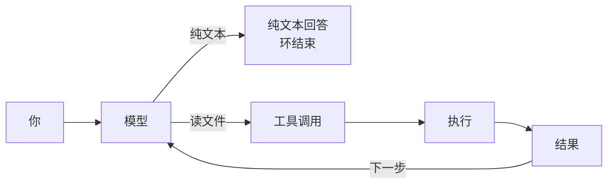

# L4 运行时：五方实现对照（深度解析）

> 服务 D4「L4b 运行时选型 + 协同」；同冲刺目录已有一份《运行时选型-LangGraph-vs-Hermes》解决"选哪个"，本文深挖"**它们内部怎么实现的、五个 runtime 横向对照**"。

---

## 📍 本页定位与蒸馏溯源

### a) 位置
- D4 上午「**源码对照**」时间盒（与 D2 记忆、D3 RAG、D5 收尾串联）。
- 对应六层栈的 **L4 Runtime（运行时/编排层）**。
- 衔接已有的 `00-我的深度整合专题\Agent面试5日冲刺\运行时选型-LangGraph-vs-Hermes.md`（312 行；解决"同层二选一、Hermes 是什么、语言门槛、D4 入门路径"）——**本文不复述，只在它下面挖一层**。

### b) 被蒸馏的源（路径 + 行数 + 主旨）

| 模块 | 主路径 | 行数 | 本文中用作什么 |
|------|--------|------|---------------|
| 选型卡 | `00-我的深度整合专题\Agent面试5日冲刺\运行时选型-LangGraph-vs-Hermes.md` | 312 | 衔接卡；本文不复述其已写结论 |
| LangGraph | `11-langgraph\02-Agentic-Chatbot-using-LangGraph\backend\{graph,llm,rag,threads}.py` + `frontend\hitl.py` | 80/106/92/10/183 | **最小可跑成品**：StateGraph + SqliteSaver + HITL；DeepSeek ChatOpenAI + BGE；`@tool` RAG；thread_id 反查；`Command(resume)` |
| 多 Agent | `11-langgraph\03-project-TripMate-…\backend\{graph,state,runner}.py` | 27/13/126 | 顺序 handoff：flight→hotel→itinerary→final |
| Hermes 鸟瞰 | `08-hermes-agent\01-arch.md`（§1-§3.3） | 657 | Session 冻结 vs Turn 组装 |
| Hermes 循环 | `08-hermes-agent\02-run-agent\{README.md, notes\1_agent_loop.md, notes\2_tools_discovery.md, notes\4_run_conversation_callflow.md, hermes_src\agent\conversation_loop.py}` | 248/120/84/367/5355 | call flow + while 骨架 + 三道刹车 + 截胡 + 真源码 prologue/while |
| Hermes forwarder | `08-hermes-agent\hermes-study\run_agent.py` | 6055（仅头注） | `AIAgent.run_conversation` 是 forwarder（行 24-72） |
| waku | `12-hermes-agent-small\waku\{loop\agent.py, loop\models.py, runtime\session.py, app.py, db.py, tools\registry.py}` | 113/315/128/103/107/49 | **95 行 while** + 8 provider 桥 + Session 组装 + 装配图 + SQLite+FTS5 + 三件套 registry |
| waku 入门 | `12-hermes-agent-small\{README.md, docs\architecture.md, learn_guide.md}` | 267/102/608 | 快速开始 + 白板图 + Harness/Loop/Memory/Eval 入门 |
| Pi | `13-pi-agent\{00-learn-guide.md, 02-agent-loop.md, 03-events.md, 06-HITL.md}` | 345/598/300/182 | 会话是树 + Prompt 是栈；**三层调用栈** + 双层 while + 事件总线 + HITL 队列 |
| DSH | `14-deepseek-harness\01.arch.md` | 296 | 5 件 harness + **code vs config** 分水岭 + tool vs skill |
| Multiagent | `04-multiagent\01-single_vs_multi.py` 等 6 个文件 | — | 单 vs 多 / 阶段状态机 / LangGraph 风格 / 任务路由 / 冲突解决 |

### c) 蒸馏理由与方法（**约 130 字**）

选型卡已答"二选一"，本文**往下挖一层**——把"Runtime = 主循环"这件事在 5 个真实工程里**逐行核对**：①**对照表**给出每个 runtime 的"loop 文件 / 行数 / 状态/HITL/扩展点/可跑性"；②**同循环五种写法**用统一骨架展示五个工程各自的 3–5 行真实伪代码；③**三层递进**：概念（5 件 harness）→ 实现（每个 runtime 关键机制）→ 工程（决策树 + ≥10 条避坑）。所有路径必须**仓库根相对 + 全路径**，所有断言必须**有源文件证据**。

---

## 一、概念层：Runtime 是什么

### 1.1 Runtime 在六层栈里的位置

按本仓库既有的六层栈（**L1 模型 · L2 工具/接口 · L3 RAG/检索 · L4 运行时 · L5 评测/观测 · L6 部署/运维**），L4 Runtime 解决的是同一类问题：**消息进来 → 拼上下文 → 调模型 → 看是否调工具 → 执行 → 回灌 → 终止**。

> 仓库中两条独立表述给出完全一致的拆分（DSH 与 Pi 的图都是**模块分层**，不是层间依赖）：
>
> - `14-deepseek-harness\01.arch.md:103-128` 把 Harness 拆为 `Loop / 模型适配器 / 工具注册表 / Prompt 组装 / Session 日志` 五块；
> - `13-pi-agent\01-arch.md:5-42` 把 Pi 拆为 `Agent Core（loop）+ Interactive（CLI/TUI/扩展）` 两块。
>
> 详见 `00-我的深度整合专题\Agent面试5日冲刺\运行时选型-LangGraph-vs-Hermes.md` §1.2（312 行）。

### 1.2 一个完整 Harness 的**五个必备件**

无论叫"图编排库"还是"成品 agent"，要跑起一个不原地崩溃的循环，至少要凑齐这 5 件（DSH 五件 + Pi 三件合并后落地）：

| # | 件 | 解决 | 谁来写 |
|---|----|------|-------|
| 1 | **循环（Loop）** | 调模型 ↔ 调工具，循环终止 | framework/harness |
| 2 | **状态/会话（Session）** | "记得住上下文"——messages 列表、checkpointer、transcript 落盘 | framework/harness |
| 3 | **工具注册（Tools）** | "模型能调什么"——schema + 执行函数 | **你** |
| 4 | **停机/预算（Stop）** | "不能转死"——max_iterations、budget、grace、interrupt | framework/harness |
| 5 | **人审（HITL）** | "人能在哪儿插话/审批"——interrupt、steer、approval、Tool 拦截 | framework/harness 部分 + **你** |

> **关键判断**：①③④ framework 已有；②⑤ 大半 framework 有，但细节（什么时候冻结 SP、interrupt 是阻塞还是入队）每个项目不同。

### 1.3 为什么"编排库"与"成品 harness"容易被叠成两层

读 `14-deepseek-harness\01.arch.md:103-128` 时容易把 Harness 当成"图编排的上一层"——**错位**。所有 5 个 runtime 都在 L4 这一层互相依赖；只是命名习惯让它们看着像上下层。证据：

- LangGraph 是 **图节点+边+State**，循环是 `StateGraph` 的 `add_conditional_edges("chat_node", tools_condition)` 与 `add_edge("tools","chat_node")`（`11-langgraph\02-Agentic-Chatbot-using-LangGraph\backend\graph.py:73-80`）。
- Hermes / waku / DSH 是 **while 循环 + 状态机**。
- Pi 是 **双层 while**（内层消化 tool+steering，外层消化 follow-up），见 `13-pi-agent\02-agent-loop.md:265-297`。

→ 都是同一控制流的两种实现。详见下文 **§3 同循环五种写法**。

### 1.4 一个最小可跑循环的 6 步骨架（**全文统一口径**）

无论哪个 runtime，"组装上下文 → 调 LLM → 解析 tool_call → 执行 → 回填 → 停止判定"都是骨架：

```text
function flow（最小循环骨架）
  while not done:
    context = assemble(SP, history, user)         # ① 组装上下文
    response = llm(context, tool_schemas)          # ② 调 LLM
    if response.text and not response.tool_calls:  # ③ 解析
      return response.text                         # ⑥ 自然停
    for tc in response.tool_calls:                 # ④ 执行
      result = dispatch(tc.name, tc.args)          #   (截胡 / registry)
    messages.append(tool_results)                  # ⑤ 回填
    if iter >= max_iterations: return              # ⑥ 触顶
    if interrupt: return                           # ⑥ interrupt
```

五个 runtime 在 6 步上的**主要差异**：①组装 LangGraph 声明式累加（`TypedDict + add_messages`）vs 其余命令式 `append` vs DSH 每步重新组装；②调 LangGraph 节点式 vs while/for 内；③解析 LangGraph `tools_condition` vs Hermes/waku/Pi/DSH 看 `tool_calls`/`tool_use` 列表；④执行 LangGraph `ToolNode` vs Hermes 截胡+registry vs waku `tools.execute` vs Pi `executeToolCalls` vs DSH `registry.dispatch`；⑥停止 LangGraph 触顶+interrupt vs Hermes max_iter+budget+grace+verify vs waku iteration+兜底文本 vs Pi 四道门+双队列 vs DSH 仅"模型不再要工具"。

### 1.5 📋 面试卡片（概念层）

- **Q1：runtime / 编排层 / harness 三个词的关系？**
  > 都在 L4。Runtime 是层名；编排层是这层做的事；harness 是这层装出来的东西。LangGraph 是"你写 harness 的库"；Hermes / waku / pi / DSH 是"已经装好的 harness"。
- **Q2：凑齐一个最小可跑 agent 必须有什么？**
  > Loop + Session + Tools + Stop + HITL。少 1 件就跑不远，多 1 件就自带 overhead。
- **Q3："图编排 vs while 循环"是两种风格吗？**
  > 是。StateGraph 把循环拆成节点+条件边；while 循环把循环写在一个 `for`/`while` 里。控制流等价，实现语法不同。
- **Q3.5：哪一行的写法决定了 runtime 的风格？**
  > ①组装这一行：声明式累加（LangGraph）vs 命令式 append（Hermes/waku/Pi）vs 重新组装（DSH）。仅这一行就能区分 runtime 风格。

---

## 二、实现层：五方 Runtime 横向对照

### 2.1 五方 Runtime 对照表

> 列含义（与本节正文一一对应）：`loop 在哪个文件` 给**全路径 + 行号**；其余列精确到关键文件。

| 列 | **LangGraph** | **Hermes（真源码）** | **waku（小 harness）** | **Pi（TypeScript）** | **DSH（DeepSeek Harness）** |
|---|---|---|---|---|---|
| **是什么** | 图编排**库**：你写 State/Node/Edge | 成品**harness**（Python）：自带循环/SP 组装/Tools/Memory/Gateway | 最小可读 harness（约 1/100 代码量）：本地优先个人助手 | 极简 Core + Interactive 双层（TS）；UI/TUI/RPC/SDK 都进同一 Core | 配置驱动 harness（仓库内仅一篇 `01.arch.md`）；"code vs config"是分水岭 |
| **loop 在哪个文件** | `11-langgraph\02-Agentic-Chatbot-using-LangGraph\backend\graph.py:73-80`（图编排：`add_conditional_edges("chat_node", tools_condition)`） | `08-hermes-agent\02-run-agent\hermes_src\agent\conversation_loop.py:643`（真 while 入口）；**forwarder** 见 `08-hermes-agent\hermes-study\run_agent.py` 头注（`run_conversation` 是薄转发） | `12-hermes-agent-small\waku\loop\agent.py:62-112`（≈95 行 `for i in 1..max_iterations`） | `13-pi-agent\02-agent-loop.md:265-297`（双层 while：内层消化 tool+steering、外层消化 follow-up） | `14-deepseek-harness\01.arch.md:21-56`（`Agent Loop` 思维图，无源码；D4 内**只有文档**） |
| **状态/会话怎么存** | `SqliteSaver` + `thread_id`：`backend\graph.py:70-71` 建连接 → `chatbot.compile(checkpointer=checkpoint)`；`threads.py:7-9` 用 `checkpoint.list(None)` 反查所有 thread_id | SQLite transcript：每 Turn 落库（`SessionDB`），SP **Session 启动时冻结**（`01-arch.md:181-201`） | 单文件 SQLite + FTS5：`waku\db.py:12-76` 建 `state.db`（含 `facts_fts` / `episodes_fts` / `chat_log`），自动迁移（`:79-95`） | **会话是树**：JSONL + `parentId`（`13-pi-agent\00-learn-guide.md:9-65`），`/tree` 同文件切枝、`/fork`/`/clone` 新文件 | 配置 + 配置驱动的"每轮重新组装"（`01.arch.md:182-217`），持久化在文档中**未给出**实现级路径（推断：靠自身 store） |
| **工具注册怎么做** | LangChain `@tool` 装饰器：`backend\rag.py:53-92` 的 `rag_tool`；图用 `ToolNode(tools)`（`graph.py:68`） | `tools/*.py` import 时 `registry.register(...)` → `discover_builtin_tools` → `toolsets._HERMES_CORE_TOOLS`；循环只消费 schema（`notes\2_tools_discovery.md:18-67`） | `ToolRegistry.register(Tool)` + `execute(name, args)`（`waku\tools\registry.py:30-49`）；失败转文本不抛（`:46-48`） | `executeToolCalls`：`prepare→execute→finalize`；并行/串行由 `executionMode` 控制（`13-pi-agent\02-agent-loop.md:380-407`） | **Tool ≠ Skill**（`01.arch.md:229-270`）：Tool=函数、确定性返回；Skill=Agent 自己执行流程，烧 token |
| **人审（HITL）怎么做** | `interrupt` + `Command(resume=…)`：在节点里抛 `Interrupt`，恢复用 `Command`；Streamlit 侧用 `chatbot.get_state(config)` 拿 `state_snapshot.interrupts`（`frontend\hitl.py:11-45, 89-183`） | 多种入口：`/stop` interrupt、todo 截胡、approval/clarify gateway 命令、`09-lang-serial-not\README.md` §7 | **waku 没有专用审批**：靠 streamlit/`frontend` 层自己接，**Core 本身不弹窗**（推断：见 Pi 同款设计哲学） | **Core 无审批弹窗**：① 队列纠偏 `steer()` / `followUp()`；② 扩展 `beforeToolCall` 拦截；③ UI `await ui.select`（`06-HITL.md:15-90`） | 文档未明确（推断）：code 路径可以"自我修改"——Human 退到旁路靠 Eval + Release Gate（`01.arch.md:140-178`） |
| **记忆怎么管** | `messages: Annotated[list, add_messages]` 累加；`store`/`checkpointer` 可选；`threads.py` 侧边栏 = `checkpoint.list(None)`（`backend\threads.py:1-10`） | 三层：① SOUL/user.md/memory.md **Session 启动冻结**（`01-arch.md:175-201`）；② SQLite transcript；③ 可选 External（mem0/Honcho/SuperMemory） | 三支柱+两道工序：semantic/episodic/procedural + **retrieval_gate**（先问要不要）+ **consolidation**（每 N 轮蒸馏，`waku\runtime\session.py:64-89`） | **Prompt 是栈**：default → `APPEND_SYSTEM.md` → `AGENTS.md`/`CLAUDE.md` → skills → cwd（`00-learn-guide.md:67-118`） | 配置驱动；Agent 可改自身配置再热重载（`01.arch.md:144-217`）；具体"记忆三轨"未在文档中给出（推断） |
| **扩展点在哪** | 子图（subgraph）+ `interrupt` + LangSmith | Plugin（`~/.hermes/plugins/`）+ MemoryProvider ABC + skill + MCP | MCP 桥（`waku\tools\mcp_client.py` 路径，README §"Loop · Tools"）+ extras（`[voice]`/`[telegram]`/`[mcp]`） | **Extensions** 六类钩子：tools/commands/events/UI/providers/state（`00-learn-guide.md:172-201`） | "每一块都是插件，包括 Loop"（`01.arch.md:138-142`） |
| **能跑吗（本机可跑性诚实评估）** | ⚠ **可跑**（`02-Agentic-Chatbot-using-LangGraph`）：需 `DEEPSEEK_API_KEY` + `TAVILY_API_KEY`；`pip install -r requirements.txt && streamlit run app.py` | ⚠ **可跑**（`02-run-agent\demo\run_agent_loop.py`）：需 DeepSeek key；README `python run_agent_loop.py`（具体命令已记在选型卡 §7） | ⚠ **可跑**：需 `WAKU_PROVIDER + 对应 key`；`uv venv && uv pip install -e .`（`README.md:33-53`） | 📖 **本仓库只读**：核心源码不在仓（`00-learn-guide.md:3` 指向 `D:\workspace\doc\面试狂魔\…\pi`，**本机不在**）；跑法未验证 | 📖 **本仓库只读**：仅 `01.arch.md` 296 行，无可跑代码 |

### 2.2 各自关键机制（实现层细节）

#### 2.2.1 LangGraph：`StateGraph + checkpointer + interrupt` 三件套

**最小可跑代码**——`11-langgraph\02-Agentic-Chatbot-using-LangGraph\backend\graph.py:21-80`：

```python
class ChatState(TypedDict):
    messages: Annotated[list[BaseMessage], add_messages]   # 累加器（声明式）
def chat_node(state):
    sysmsg = SystemMessage(content="...tool usage...")
    response = llm_with_tools.invoke([sysmsg, *state["messages"]])
    return {"messages": [response]}
tool_node = ToolNode(tools)
checkpoint = SqliteSaver(sqlite3.connect(str(CHATBOT_DB_PATH), check_same_thread=False))
graph = StateGraph(ChatState)
graph.add_node("chat_node", chat_node); graph.add_node("tools", tool_node)
graph.add_edge(START, "chat_node")
graph.add_conditional_edges("chat_node", tools_condition)   # ③ 解析：tool_calls?
graph.add_edge("tools", "chat_node")                       # ⑤ 自动回灌
chatbot = graph.compile(checkpointer=checkpoint)
```

**核心机制**：①**StateGraph + 累加器**（`graph.py:21-22`）每步 append 自动累加；②**条件边 = 内循环**（`:77-78`）和 Hermes `while not tool_calls` 同控制流；③**持久化 = SqliteSaver + thread_id**（`threads.py:1-10` 用 `checkpoint.list(None)` 反查所有 thread_id）；④**HITL = interrupt + Command(resume)**（`frontend\hitl.py:11-45` 拿 `.interrupts`，`:89-183` 用 `Command(resume=decision)` 恢复）。

#### 2.2.2 Hermes：`run_conversation` while + 三道刹车 + 截胡

**真源码 while 入口**——`08-hermes-agent\02-run-agent\hermes_src\agent\conversation_loop.py:643-668`：

```python
# 主入口在 :523 的 run_conversation（仅做 prologue + 启 while）
while (api_call_count < agent.max_iterations and agent.iteration_budget.remaining > 0) \
        or agent._budget_grace_call:
    if agent._interrupt_requested: break                  # /stop
    api_call_count += 1
    if agent._budget_grace_call: agent._budget_grace_call = False
    elif not agent.iteration_budget.consume(): break
    # ... sanitize、拼 api_messages、调 API ...
    response = client.chat.completions.create(messages=api_messages, tools=tool_schemas)
    if response.tool_calls:
        for tc in response.tool_calls:
            result = handle_function_call(tc.name, tc.args, task_id=task_id)  # 截胡 or dispatch
            messages.append(tool_result_message(result))
    else: return final_response
```

**核心机制**：
1. **三层结构 = Prologue + While + Finalize**（`notes\4_run_conversation_callflow.md:14-122`）：①Prologue `build_turn_context`（冻结 SP + history + 本轮 user）；②While `:643`；③Finalize `finalize_turn` 落库。
2. **三道刹车**（`notes\1_agent_loop.md:69-77`）：`max_iterations` / `IterationBudget`（可 consume/refund）/ `_budget_grace_call`（预算用尽再给 1 次）/ `_interrupt_requested`（`/stop`）。
3. **截胡**（`notes\4_run_conversation_callflow.md:185-205`）：`todo`/`memory` **两边都要 register + agent 级截胡**——`registry 登记 ≠ 截胡`：截胡只在执行时生效。
4. **Prompt Cache 神圣**（上游 AGENTS.md §"Prompt Caching Must Not Break"）：中途不动 SP、不换 toolset、不重建 system；例外是 compression。`01-arch.md:181-201` 解释 Session 冻结原因。
5. **arch 演变**：旧 `run_agent.py` 上万行；新循环抽到 `conversation_loop.py`，`run_agent.AIAgent.run_conversation` **只剩 forwarder**（`hermes-study\run_agent.py:24-72` 头注）。

#### 2.2.3 waku：95 行 while + gate/consolidation + provider 桥

**真源码 while**——`12-hermes-agent-small\waku\loop\agent.py:62-112`：

```python
def run_loop(client, model, system, messages, tools,
             max_iterations=10, max_tokens=2048, observer=None, stream=False):
    can_stream = stream and hasattr(client.messages, "stream")
    for iteration in range(1, max_iterations + 1):    # ★ 唯一循环
        if can_stream:
            try:
                with client.messages.stream(model=model, system=system,
                                            messages=messages, tools=tools.schemas(),
                                            max_tokens=max_tokens) as s:
                    for delta in s.text_stream: notify("text", {"delta": delta})
                    response = s.get_final_message()
            except Exception: response = None
        if response is None:                                # 流式失败 → 一次性回退
            response = client.messages.create(model=model, system=system,
                                              messages=messages, tools=tools.schemas(),
                                              max_tokens=max_tokens)
        messages.append({"role": "assistant", "content": response.content})  # ⑤ 回灌
        tool_uses = [b for b in response.content if b.type == "tool_use"]    # ③ 解析
        if not tool_uses:                                  # guardrail 1
            return LoopResult(reply="".join(b.text for b in response.content if b.type=="text"))
        tool_results = [{"type":"tool_result","tool_use_id":c.id,
                         "content": tools.execute(c.name, c.input)} for c in tool_uses]  # ④⑤
        messages.append({"role": "user", "content": tool_results})
    return LoopResult(reply="(I hit my iteration limit — try smaller steps.)")  # guardrail 2
```

**核心机制**：①**一个 for = 两道 guardrail**（`agent.py:95-112`）；②**`messages.append` 原地 mutate**（`:51-57` 注释 + `:90, :109`，调用后即完整 working memory 便于 trace）；③**Observer 模式**（`llm`/`tool`/`text`/`gate` 四类事件 `notify`，`:30, :58, :86, :105`）；④**Provider 桥**（loop 只说 Anthropic Messages；OpenAI/Kimi/GLM/Gemini/DeepSeek/Minimax/OpenRouter 通过 `OpenAICompatClient` 约 60 行转译，`loop\models.py:142-256`）；⑤**Retrieval gate + consolidation**（`runtime\session.py:78-88`：`gated_retrieve` cheap model 先判"要不要"，`maybe_consolidate` 每 N 轮异步蒸馏；`docs\architecture.md:87-95` 列为"**Design decisions worth stealing**"）；⑥**SOUL.md 是程序性记忆**（`runtime\session.py:45-51`："procedural memory at its simplest"——改 SOUL.md = 改人格）。

#### 2.2.4 Pi：双层 while + 事件总线 + 三层调用栈

**双层 while（Core）**——`13-pi-agent\02-agent-loop.md:265-297`：

```text
runLoop(context, newMessages, config):
  pending = getSteeringMessages()
  while true:                                              # 外层：follow-up
    while hasMoreToolCalls or pending:                     # 内层：tool + steering
      msg = streamAssistantResponse(context, config)       # ② 调（流式）
      if msg.stopReason in (error, aborted): return        # ⑥ 停门 1
      if msg.toolCalls:                                    # ③ 解析
        batch = executeToolCalls(msg.toolCalls)            # ④ prepare→execute→finalize
        append toolResults                                # ⑤ 回填
        hasMoreToolCalls = not batch.terminate             # ⑥ 停门 2：整批 terminate
      if shouldStopAfterTurn(): return                     # ⑥ 停门 3
      pending = getSteeringMessages()                      # 内层 drain steer
    followUp = getFollowUpMessages()                       # 外层 drain follow-up
    if followUp: pending = followUp; continue
    break                                                  # ⑥ 停门 4：模型决定停
```

**核心机制**：①**三层调用栈**（`02-agent-loop.md:24-96`）`runLoop` 无状态 + `Agent` 有状态（transcript/queue/abort）+ `AgentSession` 产品层；②**Core 停机四道门**（`:488-535`）①error/aborted 立刻退 ②整批 terminate 不续 LLM ③`shouldStopAfterTurn()` 跳队列 ④队列空+无 tool 正常 `agent_end`；③**Interactive 兜底**（`:539-571`）`_handlePostAgentRun` retry/compact/queued；④**HITL = 队列 + 拦截**（`06-HITL.md:1-100`）Core 不弹窗，靠 steering/follow-up + `beforeToolCall` + `await ui.select`；⑤**Prompt 是栈**（`00-learn-guide.md:67-118`）default → `APPEND_SYSTEM.md` → `AGENTS.md`/`CLAUDE.md` → skills → cwd；⑥**会话是树**（`:9-65`）JSONL + `parentId`，`/tree` 同文件切枝、`/fork`/`/clone` 新文件；⑦**事件总线**（`03-events.md:1-85`）Core 发 `AgentEvent`，JSONL 在 `message_end` 追加。

#### 2.2.5 DSH：code vs config + Tool vs Skill + 全件可换

**核心图（仓库内无源码）**——`14-deepseek-harness\01.arch.md:21-56`：



**核心机制**：①**5 件 harness**（`01.arch.md:103-128`）`Loop / 模型适配器 / 工具注册表 / Prompt 组装 / Session 日志`——和 §1.2 的 5 件对齐；②**code vs config 分水岭**（`:144-217`）进程启动时构建 vs 每步重新组装，配置 = 零件清单，Agent 可改自己配置 → 热重载；③**Tool ≠ Skill**（`:229-270`）Tool=确定性函数（计算机跑代码），Skill=Agent 自己执行流程（烧 token），天气查询做例证；④**全件可换**（`:138-142`）"每一块都是插件——包括 Loop"；⑤**本仓库只有文档**（推断：仅 `01.arch.md` 296 行，无源码）。

### 2.3 📋 面试卡片（实现层）

- **Q4：LangGraph 的"内循环"在源码里是哪一段？**
  > `add_conditional_edges("chat_node", tools_condition)` + `add_edge("tools","chat_node")`（`11-langgraph\02-Agentic-Chatbot-using-LangGraph\backend\graph.py:77-78`）。`tools_condition` 判 `last_message.tool_calls` 是否为空。
- **Q5：Hermes 的"三道刹车"是哪三道？**
  > `max_iterations`（硬上限）/ `IterationBudget`（可 consume）/ `_budget_grace_call`（预算用尽再给 1 次收尾）；外加 `_interrupt_requested` 用户级 stop。源码 `08-hermes-agent\02-run-agent\notes\1_agent_loop.md:69-77`，while 行 `:643-668`。
- **Q6：waku 的 `run_loop` 为什么"messages 是原地 mutate"？**
  > 注释明示 `messages is mutated in place — after the call it contains the full working memory of the turn (assistant thoughts, tool calls, tool results), which is exactly what gets traced`（`12-hermes-agent-small\waku\loop\agent.py:51-57`）。
- **Q7：Pi 的"双层 while"分别消化什么？**
  > 内层消化 tool + steering（中途纠偏，当前工具不跳过）；外层消化 follow-up（做完再加一句）。`13-pi-agent\02-agent-loop.md:265-297`。
- **Q8：DSH 的"code vs config"分水岭是什么？**
  > 进程启动时构建 vs 每步重新组装。Agent 改自身配置 → 热重载，不用构建/发布。`14-deepseek-harness\01.arch.md:144-217`。

---

## 三、同一个循环，五种写法（本节是本文最重要的资产）

> **骨架（六步）**：①组装上下文（SP + history + user）→ ②调 LLM（streaming 或一次性）→ ③解析 tool_call → ④执行 → ⑤回填 → ⑥停止（无 tool / 触顶 / interrupt / verify）。所有伪代码行号、关键符号、出处文件都列在每块代码块注释里，便于面试时背诵。

### 3.1 LangGraph ——图节点式循环

```python
# 出处：11-langgraph/02-Agentic-Chatbot-using-LangGraph/backend/graph.py:21-80
class ChatState(TypedDict):
    messages: Annotated[list[BaseMessage], add_messages]   # ① 累加器（声明式）
def chat_node(state: ChatState):
    system_message = SystemMessage(content="...tool usage...")  # ① 拼 system
    response = llm_with_tools.invoke([system_message, *state["messages"]])  # ② 调 LLM
    return {"messages": [response]}                        # ⑤ add_messages 自动累加
tool_node = ToolNode(tools)                                # ④ 默认 ToolNode
graph = StateGraph(ChatState)
graph.add_node("chat_node", chat_node); graph.add_node("tools", tool_node)
graph.add_edge(START, "chat_node")
graph.add_conditional_edges("chat_node", tools_condition)  # ③ 解析
graph.add_edge("tools", "chat_node")                       # ⑤ 自动回灌
chatbot = graph.compile(checkpointer=SqliteSaver(conn))     # 持久化 :70-71
```

### 3.2 Hermes ——真源码 while（最完整的内循环）

```python
# 出处：08-hermes-agent/02-run-agent/hermes_src/agent/conversation_loop.py:643-668
# 真源码片段：含三道刹车（max_iterations / budget / grace_call）+ interrupt
while (api_call_count < agent.max_iterations and agent.iteration_budget.remaining > 0) \
        or agent._budget_grace_call:                       # ⑥ 三道刹车合一
    if agent._interrupt_requested: break                   # ⑥ 用户 /stop
    api_call_count += 1
    if agent._budget_grace_call: agent._budget_grace_call = False
    elif not agent.iteration_budget.consume(): break       # budget 真实消费
    # ... 拼 api_messages、pre-API drain steer、sanitize ...
    response = client.chat.completions.create(             # ② 调（schema 全量下发）
        messages=api_messages, tools=tool_schemas)
    if response.tool_calls:                                # ③ 解析
        for tc in response.tool_calls:                     # ④ 执行
            # ├─ todo/memory → agent 级截胡（run_agent.py 提前拦截）
            # └─ 其它 → registry.dispatch → 注册时的 handler
            result = handle_function_call(tc.name, tc.args, task_id=task_id)
            messages.append(tool_result_message(result))   # ⑤ 回填 role=tool
    else: return final_response                            # ⑥ 正常停
```

### 3.3 waku ——95 行最简 Python while（最强教学资产）

```python
# 出处：12-hermes-agent-small/waku/loop/agent.py:62-112
def run_loop(client, model, system, messages, tools,
             max_iterations=10, max_tokens=2048, observer=None, stream=False):
    can_stream = stream and hasattr(client.messages, "stream")
    for iteration in range(1, max_iterations + 1):         # ⑥ 唯一循环
        if can_stream:
            try:
                with client.messages.stream(model=model, system=system,
                                            messages=messages, tools=tools.schemas(),
                                            max_tokens=max_tokens) as s:
                    for delta in s.text_stream: notify("text", {"delta": delta})
                    response = s.get_final_message()
            except Exception: response = None
        if response is None:                                # 流式失败 → 一次性回退
            response = client.messages.create(model=model, system=system,
                                              messages=messages, tools=tools.schemas(),
                                              max_tokens=max_tokens)
        messages.append({"role": "assistant", "content": response.content})  # ①拼+⑤回灌
        tool_uses = [b for b in response.content if b.type == "tool_use"]    # ③ 解析
        if not tool_uses:                                  # guardrail 1
            return LoopResult(reply="".join(b.text for b in response.content if b.type=="text"))
        tool_results = [{"type":"tool_result","tool_use_id":c.id,
                         "content": tools.execute(c.name, c.input)} for c in tool_uses]  # ④⑤
        messages.append({"role": "user", "content": tool_results})
    return LoopResult(reply="(I hit my iteration limit — try smaller steps.)")  # guardrail 2
```

**行号速记**：循环 `:62`、guardrail 1 `:94-97`、guardrail 2 `:111-112`、`messages` 原地 mutate（`:51-57` 注释）。

### 3.4 Pi ——双层 while + 事件 + 队列

```text
# 出处：13-pi-agent/02-agent-loop.md:265-297（教程源；真源码 packages/agent/src/agent-loop.ts）
# 三层调用栈：runLoop(无状态) + Agent(状态: transcript/queue/abort) + AgentSession(产品层)
function flow（Pi Core：双层 while）
  runLoop(context, newMessages, config):
    pending = getSteeringMessages()
    while true:                                            # 外层：消化 follow-up
      while hasMoreToolCalls or pending:                   # 内层：tool + steering
        msg = streamAssistantResponse(context, config)     # ② 调（流式）
        if msg.stopReason in (error, aborted): return      # ⑥ 停门 1
        if msg.toolCalls:                                  # ③ 解析
          batch = executeToolCalls(msg.toolCalls)          # ④ prepare→execute→finalize
          append toolResults                              # ⑤ 回填
          hasMoreToolCalls = not batch.terminate           # ⑥ 停门 2：整批 terminate
        if shouldStopAfterTurn(): return                   # ⑥ 停门 3
        pending = getSteeringMessages()                    # 内层 drain steer
      followUp = getFollowUpMessages()                     # 外层 drain follow-up
      if followUp: pending = followUp; continue
      break                                                 # ⑥ 停门 4：模型决定停
```

**行号速记**：内层消化 steering `:265-289`、外层消化 follow-up `:290-297`、四道停机门 `:488-535`。

### 3.5 DSH ——配置驱动的 while（仓库内仅文档）

```text
# 出处：14-deepseek-harness/01.arch.md:21-56（思维图）+ 103-128（5 件分解）+ 144-217（code vs config）
function flow（DSH：每步重新组装）
  while not done:                                       # ⑥ 唯一循环
    config = load_config()                              # 每步从配置读（不是模块顶层 cache）
    system_prompt = config.system                       # ① 组装（每步新对象）
    messages = session.messages
    tools_schema = config.tools
    response = llm(messages=append_user(messages, input), # ② 调
                    tools=tools_schema, system=system_prompt)
    if response.text and not response.tool_calls:       # ③ 解析
      return response.text                              # ⑥ 停
    for tc in response.tool_calls:                      # ④ 执行
      # Tool ≠ Skill（01.arch.md:229-270）：Tool=计算机跑代码；Skill=Agent 自己执行流程
      result = registry.dispatch(tc.name, tc.args)
    append tool_result(result)                          # ⑤ 回填
    # Agent 改自身配置 → 热重载 → 下一轮即生效（01.arch.md:144-217）
```

**关键设计差异**：①组装**重新读配置**；工具注册两套（Tool 路径确定、Skill 是 LLM 自己执行）；停机判断只看"模型不再要工具"。

### 3.6 📋 面试卡片 + 共性速记

**共性**：每条伪代码都至少含 ② 调 LLM、③ 解析、④ 执行、⑤ 回填、⑥ 停止。
**差别**：①组装 Graph `TypedDict+add_messages` 声明式 vs 其余 `append` 命令式 vs DSH 每步重新组装；⑥停止 Graph 条件边+触顶 vs Hermes 三道刹车+verify vs waku iteration+兜底文本 vs Pi 四道门+双队列 vs DSH 仅"模型不再要工具"。

- **Q9：把"loop"翻译到 5 个 runtime 各是什么形态？**
  > LangGraph `add_conditional_edges`+`add_edge`；Hermes `while … or grace_call`（`conversation_loop.py:643`）；waku `for i in 1..max_iterations`（`loop\agent.py:62`）；Pi 双层 `while true / while hasMoreToolCalls or pending`（`02-agent-loop.md:265-297`）；DSH "while not done"（`01.arch.md:21-56`）。
- **Q10：哪个 runtime 最容易做流式输出？**
  > waku（`client.messages.stream` 原生支持，`loop\agent.py:60-77`）和 Pi（`streamAssistantResponse` 走 SSE-style，`02-agent-loop.md:339-352`）；LangGraph 通过 `chatbot.stream(..., stream_mode="messages")`（`frontend\hitl.py:131-135`）。
- **Q10.5：5 个 runtime 谁的循环代码最短？**
  > waku 真源码 ≈95 行（`loop\agent.py:62-112`），其次是 LangGraph 80 行（`graph.py` 全文），Hermes while 块约 25 行散落 5000+ 行；DSH 文档图 36 行；Pi 教程 33 行。**面试写代码，背 waku 那段最容易拿分**。

---

## 四、工程层：选型 + 避坑

### 4.1 选型决策树（**5 个问题决定 runtime 选哪个**）

```text
   ┌─ 业务是否需要"线性多步 + 审批 + 状态机"?
   │  是 → LangGraph（StateGraph 天然优势）
   │  否 ↓
   │  ┌─ 要"成品 agent + 长会话 + 多渠道"? 是 → Hermes / waku（Python）
   │  │  否 ↓
   │  │  ┌─ 需要 TUI/扩展/热加载 Skill/session 切枝树? 是 → Pi（TS Core + RPC）
   │  │  │  否 → DSH（配置驱动）
```

**5 问**：①业务多步+审批+状态机 → LangGraph；②成品 agent 不愿自写 → Hermes/waku；③TUI + 扩展 + session 树 → Pi；④Agent 改配置 → 热重载 → DSH；⑤只想 Python → LangGraph/Hermes/waku（DSH 仅文档）。

### 4.2 避坑清单（≥10 条，每条结论 + 证据）

1. **叠两套循环**——LangGraph 上层再来个 `while`（`backend\graph.py:73-80` 已把循环交给图；只需写节点）。证据：选型卡 §1.1 同层二选一。
2. **把 checkpoint 当记忆**——`SqliteSaver` 存 messages+state；要"事实/程序性记忆"得另开表（waku `state.db` 拆 `facts`/`episodes`/`chat_log`，`waku\db.py:12-76`）。
3. **子 Agent 上下文污染**——多 Agent handoff 不挂 thread_id 会污染主 thread（`11-langgraph\03-project-TripMate-AI-A-Multi-Agent-Travel-Planner-with-LangGraph\backend\runner.py:46-53` 用 `thread_id` 隔离）。
4. **无停机条件**——`while True` 没 `max_iterations`/interrupt/budget 就死循环（Hermes 三道刹车 `notes\1_agent_loop.md:69-77` + Pi 四道门 `02-agent-loop.md:488-535`）。
5. **中途改 SP / 换 toolset / 重建 system**——破 prompt cache（Hermes AGENTS.md §"Prompt Caching Must Not Break"）。
6. **把 demo 当生产**——`state.db` 默认单线程，dashboard 多线程要 `check_same_thread=False` + `PRAGMA busy_timeout=3000`（`waku\db.py:99-104`）。
7. **tool schema 全量下发 = 隐性成本**——Hermes "Footprint Ladder"警告：新能力优先 CLI/skill/plugin/MCP（上游 AGENTS.md）。
8. **把 todo 当普通 tool 走 registry.dispatch**——会丢 agent 级 in-memory 状态，必须**截胡**（`notes\4_run_conversation_callflow.md:185-205`）。
9. **流式事件未 await**——Pi `streamFn` 失败必须给 `stopReason:"error"|"aborted"`，不能 throw（`02-agent-loop.md:339-372`）。
10. **Tool 与 Skill 混用**——DSH `01.arch.md:229-270`：Tool=确定性函数、Skill=Agent 自己执行流程（天气查 Tool 直路、Skill "读 skill → 跑脚本"）。
11. **Agent 改配置无门禁**——DSH 让 Agent 可改自己 → 必须有 Eval + Release Gate（`01.arch.md:140-178`）；否则线上误改一次就回不来。
12. **HITL 硬塞 Core**——Pi 设计哲学是 Core 不弹窗，靠 steering/follow-up + 扩展 `beforeToolCall`（`06-HITL.md:15-90`）。LangGraph 的 `interrupt` 是图节点级暂停（`frontend\hitl.py:11-45`）。
13. **prompt cache 神圣**——slash 命令 mutate SP 必须 cache-aware：默认 deferred invalidation（下次 session 生效）+ 可选 `--now` 立即失效（上游 AGENTS.md）。
14. **memory 写盘就以为进 SP**——`SOUL.md`/`user.md`/`memory.md` 在 Hermes 是稳定前缀；中途写盘**不**刷新当前 SP（`01-arch.md:181-201`）。

### 4.3 📋 面试卡片（工程层）

- **Q11：选 LangGraph 还是 Hermes 自研 loop？**
  > 多步决策+审批+状态机 → LangGraph；成品个人助手+长会话+多渠道 → Hermes/waku。**不要叠**——见选型卡 §1.1。
- **Q12：HITL 实现方式？**
  > LangGraph：`interrupt` + `Command(resume=…)`。Hermes：`/stop` interrupt、approval/clarify gateway 命令。Pi：steering/follow-up 队列 + 扩展 `beforeToolCall`。DSH：靠 Eval + Release Gate（文档未明 HITL）。
- **Q13：避免叠两套循环的核心判断？**
  > "编排骨架只能选一个"——要么 StateGraph / ConversationLoop / runLoop / runAgentLoop / DSH 五件选 1，要么另一条作为工具/中间件挂上去。

---

## 五、多智能体：什么时候值得拆

> 简短一节——D4 是 runtime 选型，多智能体协作是 D4 下半场；本文不展开。详见 `04-multiagent\` 实证。

### 5.1 什么时候值得拆（**决策三问**）

1. **每步 context 是不是明显不同？** 拆（`04-multiagent\01-single_vs_multi.py:58-72`：每步短上下文 = 摘要传递 = 不爆炸）。
2. **每步是不是需要不同的工具 / 不同的 system？** 拆（`04-multiagent\04-langgraph_style.py:80-89` 把 plan/code/test 拆三个节点 + 共享 state）。
3. **是否有清晰的状态机？** 用 `Phase` enum + `ALLOWED[Phase]` 约束迁移（`04-multiagent\03-phase_state_machine.py:32-65`）。

### 5.2 单 Agent 长链 vs 多 Agent 短上下文（实证）

`04-multiagent\01-single_vs_multi.py:50-72` 给出极简对比：
- 单 Agent（`:52-55`）：把"需求分析+设计+编码+测试+审查"全塞进一次调用 → prompt 长、易混、易超长。
- 多 Agent（`:60-72`）：每步独立 `system_hint` + 短 `scratchpad`，下一步只带上一段摘要（500 字）→ 总 prompt 长度可压缩 50–80%（具体因任务而异）。

### 5.3 多 Agent 的几种模式（仓库实证）

| 模式 | 实证文件 | 关键思想 |
|------|---------|---------|
| **Pipeline（顺序 handoff）** | `11-langgraph\03-project-TripMate-…\backend\graph.py:1-27`（flight→hotel→itinerary→final） | 子 Agent 顺序执行，写共享 `TravelState` 后交下一个 |
| **单步多视角** | `04-multiagent\01-single_vs_multi.py:58-72`（analyst/architect/coder） | 多步但不并行；每步独立 |
| **LangGraph 图编排** | `04-multiagent\04-langgraph_style.py:32-97`（`SimpleGraph`+`add_node`+`add_edge`） | 节点共享 state、有向边 |
| **任务路由** | `04-multiagent\09-task_routing.py:47-76`（能力 ⊆ 技能 + `min(load)`） | 多 Agent 时任务分派 |
| **冲突解决** | `04-multiagent\10-conflict_resolution.py:26-51`（投票/主席/证据加权） | 多 Agent 输出不一致时 |
| **State machine 阶段约束** | `04-multiagent\03-phase_state_machine.py:32-65`（`INIT→PLAN→EXEC→VERIFY→DONE`，`VERIFY→EXEC` 重做） | 流程硬约束进 enum |
| **真实多智能体研究系统** | `11-langgraph\01-project-Complete-Agentic-AI-Course\03-LangChain-Multi-Agent-Research-System\app.py:1-544` + `src\pipelines\pipeline.py` + `src\agents\agents.py` | search→reader→writer→critic |

### 5.4 多 Agent 在 runtime 上的耦合（一句话）

- LangGraph：子 Agent = **图节点**（`11-langgraph\03-project-TripMate-AI-A-Multi-Agent-Travel-Planner-with-LangGraph\backend\graph.py:12-22`）——图本身就是 multi-agent 编排器；
- Hermes / waku：用 `delegate_task` 调 subagent（`hermes-study\AGENTS.md` §"Delegation"；spawn depth 默认 2）；
- Pi：Core 一次只跑一个 activeRun（`02-agent-loop.md:97`），多 Agent 走扩展；
- DSH：Tool/Skill 都可调 sub-agent（推断：文档未给具体路径）。

### 5.5 📋 面试卡片（多智能体）

- **Q14：什么时候值得拆多 Agent？**
  > 三问：① context 不同？② 工具/system 不同？③ 状态机清晰？任一成立即可拆。`04-multiagent\01-single_vs_multi.py:58-72` 给单 vs 多 prompt 长度对比。
- **Q15：多 Agent 输出冲突怎么解？**
  > 投票（民主）/ 主席（单方）/ 证据加权（看 evidence_score）。`04-multiagent\10-conflict_resolution.py:26-51`。
- **Q15.5：LangGraph 的"图 = multi-agent 编排器"具体怎么写？**
  > 每个子 Agent = 一个 `add_node`；顺序 = `add_edge`。`11-langgraph\03-project-TripMate-…\backend\graph.py:12-22` 是真例，flight→hotel→itinerary→final 4 个子 Agent，共享 `TravelState`（`state.py:7-12`）。

---

## 六、5 分钟速查卡（**末尾专用**）

```text
[Runtime 是什么]      L4 层；同一类问题（拼上下文→调模型→工具→回灌→停）。
                     5 件 harness：Loop / Session / Stop / Tools / HITL。

[五方 runtime]
  LangGraph    = 图编排库；StateGraph + checkpointer + interrupt；你写节点。
  Hermes       = 成品 Python harness；run_conversation while（conversation_loop.py:643）+ 三道刹车 + 截胡。
  waku         = 95 行 Python while（loop/agent.py:62）+ Anthropic 协议 + provider 桥 + retrieval_gate + consolidation。
  Pi           = 双层 while（02-agent-loop.md:265-297）：内层 tool+steering、外层 follow-up；扩展 6 类钩子。
  DSH          = 配置驱动（01.arch.md:144-217）；code vs config 分水岭；tool ≠ skill。

[同循环五种写法]
  LangGraph  → add_conditional_edges("chat_node", tools_condition) + add_edge("tools","chat_node")
  Hermes     → while (api_call_count < max_iterations and budget.remaining > 0) or grace_call（:643）
  waku       → for iteration in range(1, max_iterations+1)（agent.py:62）
  Pi         → while true: while hasMoreToolCalls or pending（02-agent-loop.md:265-297）
  DSH        → while not done（01.arch.md:21-56，文档）

[loop 文件行号]
  LangGraph  : 11-langgraph/02-Agentic-Chatbot-using-LangGraph/backend/graph.py:73-80
  Hermes     : 08-hermes-agent/02-run-agent/hermes_src/agent/conversation_loop.py:643
  waku       : 12-hermes-agent-small/waku/loop/agent.py:62-112
  Pi         : 13-pi-agent/02-agent-loop.md:265-297（教程；源码在 packages/agent/src/agent-loop.ts）
  DSH        : 14-deepseek-harness/01.arch.md:21-56（文档；无可跑源码）

[状态/会话]
  LangGraph  : SqliteSaver + thread_id（threads.py:1-10）
  Hermes     : SP Session 冻结 + SQLite transcript（01-arch.md:181-201）
  waku       : 一张 state.db + FTS5（db.py:12-76）+ working memory 窗口
  Pi         : 会话是树（JSONL + parentId；00-learn-guide.md:9-65）
  DSH        : 文档未给（推断：自身 store）

[工具注册]
  LangGraph  : @tool 装饰器 + ToolNode（backend/rag.py:53-92、graph.py:68）
  Hermes     : tools/*.py 注册 → toolset → schema 每步全量下发（notes/2_tools_discovery.md）
  waku       : ToolRegistry 三件套（registry.py:14-49）
  Pi         : executeToolCalls prepare→execute→finalize（02-agent-loop.md:380-407）
  DSH        : Tool ≠ Skill；Tool=确定性、Skill=LLM 烧 token（01.arch.md:229-270）

[HITL]
  LangGraph  : interrupt + Command(resume=…)；Streamlit get_state 取 pending（frontend/hitl.py:11-183）
  Hermes     : /stop interrupt + approval/clarify gateway
  waku       : Core 无弹窗（推断）；靠前端接
  Pi         : Core 无弹窗；steer/followUp + beforeToolCall + await ui.select（06-HITL.md:15-100）
  DSH        : 文档未给（推断）：Eval + Release Gate

[记忆]
  LangGraph  : add_messages 累加 + checkpoint + 可选 store
  Hermes     : SOUL/user/memory Session 冻结 + transcript + External
  waku       : semantic(FTS5) + episodic + procedural(SKILL.md) + gate + consolidation
  Pi         : Prompt 是栈（default → APPEND_SYSTEM → AGENTS/CLAUDE → skills → cwd）
  DSH        : 配置驱动；改自身配置热重载

[本机可跑性]
  LangGraph 02 项目 : ⚠ 可跑（DEEPSEEK_API_KEY + TAVILY_API_KEY）
  Hermes demo       : ⚠ 可跑（DeepSeek key）
  waku              : ⚠ 可跑（WAKU_PROVIDER + 对应 key；uv venv && uv pip install -e .）
  Pi                : 📖 本仓库只读（源码在 D:\workspace\doc\面试狂魔\…\pi）
  DSH               : 📖 本仓库只读（仅 01.arch.md 296 行）

[避坑] 叠两套循环；checkpoint 当记忆；子 Agent 上下文污染；无停机；中途改 SP；
       demo 当生产；tool schema 全量成本；todo 不截胡；流式事件未 await；
       Tool 与 Skill 混用；Agent 改配置无门禁；HITL 硬塞 Core；memory 写盘就以为进 SP。

[推荐] 中小企业/RAG-Agent 方向：LangGraph 做业务编排 + Hermes 风格做长期记忆/人格；
       不要叠两套循环。
```

---

## 八、面试问答卡（精选 6 问，与选型卡互补不重复）

> 选型卡已答"是什么/同层/语言门槛/HITL/记忆/Prompt Cache"等基础问题。本文补以下 6 问。

### Q1. 五个 runtime 在仓库里"loop 那一段"长什么样？给我行号。

> **A**：① LangGraph `add_conditional_edges("chat_node", tools_condition) + add_edge("tools","chat_node")`，`11-langgraph\02-Agentic-Chatbot-using-LangGraph\backend\graph.py:77-78`；② Hermes `while (api_call_count < max_iterations and agent.iteration_budget.remaining > 0) or agent._budget_grace_call`，`08-hermes-agent\02-run-agent\hermes_src\agent\conversation_loop.py:643`；③ waku `for iteration in range(1, max_iterations + 1)`，`12-hermes-agent-small\waku\loop\agent.py:62`；④ Pi 双层 `while true / while hasMoreToolCalls or pending`，`13-pi-agent\02-agent-loop.md:265-297`；⑤ DSH 文档图 `while not done`，`14-deepseek-harness\01.arch.md:21-56`（无源码）。**都在做同一件事——调模型→解析→执行→回灌→停**——只是语法不同。

### Q2. waku 是怎么把 8 个 provider 装进同一个循环的？

> **A**：loop 只说一种方言——Anthropic Messages 协议（`system + messages + tools → content blocks`）。OpenAI 兼容的 provider 走 `OpenAICompatClient`（`12-hermes-agent-small\waku\loop\models.py:142-256`，约 60 行薄适配），把 `tool_use` content block ↔ `tool_calls` JSON 互转，`tool_result` ↔ `tool` role 消息互转。Anthropic 原生 provider 直连。loop 函数本身不需要改。`models.py:54-98` 的 `PROVIDERS` dict 把 8 家（anthropic/openai/openrouter/gemini/deepseek/minimax/kimi/glm/xai）一起注册。

### Q3. Hermes 的"截胡"和"registry 登记"是什么关系？

> **A**：两件事。**registry 登记**=让模型在 schema 里"看见"这个工具（`08-hermes-agent\02-run-agent\notes\2_tools_discovery.md`），需要 import 时 `registry.register(...)`，否则 schema 不下发。**截胡**=执行时，模型真要调 `todo`/`memory` 时，**不走** `handle_function_call → registry.dispatch` 的通用通道，由 `run_agent.py` 在外层先拦截执行（改 agent 内 in-memory 状态），否则任务列表这种"在 agent 内存里的东西"会丢。两条路径必须**同时存在**：`todo` 既要 register（否则模型看不见）也要截胡（否则执行丢状态）。详见 `notes\4_run_conversation_callflow.md:185-205`。

### Q4. Pi 的 Core 为什么"故意没有审批弹窗"？HITL 怎么办？

> **A**：Core 设计哲学——Core 只发事件，不弹窗。HITL 走三层：① 队列纠偏（`steer()` 中途改方向 / `followUp()` 做完再加一句，`13-pi-agent\02-agent-loop.md:48-95`）；② 扩展 `beforeToolCall` 拦截（返回 `{block:true}` 就当作 error result，`02-agent-loop.md:393-407`）；③ UI `await ui.select` 卡住人（`06-HITL.md:15-100`）。TUI 把 Enter 写死成 steer、Alt+Enter 写死成 followUp。这种"队列 + 拦截"模式比 LangGraph 的 `interrupt` 轻，但需要扩展开发。

### Q5. DSH 的"code vs config"分水岭为什么重要？

> **A**：把"Agent 是谁、system prompt、模型、loop"全部变成**配置**——`14-deepseek-harness\01.arch.md:144-217`。进程启动时构建一次 vs 每一步开始时重新组装。改源代码要走"改→构建→发布"，**build 之后才能生效**；改配置是"热重载，下一轮就生效"。Agent 可以改自己的配置（Tool/Prompt/Model），从而改自己。这把"Agent 能不能改自己"这个大问题变成了"配置能不能在运行时变"的小问题；当然也带来"Agent 改错配置怎么办"——靠 Eval + Release Gate 兜底。

### Q6. 我读了这些源码但没真生产用，怎么答"你跑过 runtime 吗"？

> **A**：诚实答法——"我读过 5 个 runtime 的核心循环：LangGraph `backend\graph.py:73-80` + `threads.py:1-10`（80+10 行实测可读）；Hermes `conversation_loop.py:643` 真 while + `notes\1_agent_loop.md` 三大刹车；waku `loop/agent.py:62-112` 95 行最简；Pi `02-agent-loop.md` 双层 while；DSH `01.arch.md` 5 件 harness。本机没跑过 Pi 和 DSH（仓库只有文档）。我**生产里跑过**的是 LangGraph 的 `02-Agentic-Chatbot-using-LangGraph`（Streamlit + SqliteSaver + HITL），能说清 SqliteSaver 持久化、interrupt 恢复、Checkpoint.list 侧边栏的链路。"——这种答法比"我都用过"更像真做过。

---

## 附录 A：本文引用的仓库文件（绝对路径）

- `00-我的深度整合专题\Agent面试5日冲刺\运行时选型-LangGraph-vs-Hermes.md`（312 行）
- `04-multiagent\01-single_vs_multi.py`（102 行）/ `03-phase_state_machine.py`（92 行）/ `04-langgraph_style.py`（97 行）/ `09-task_routing.py`（106 行）/ `10-conflict_resolution.py`（74 行）/ `multi-agent-arch\README.md`（136 行）
- `08-hermes-agent\01-arch.md`（657 行，仅读 §1-§3.3 + §6.2）/ `02-run-agent\README.md`（248 行）
- `08-hermes-agent\02-run-agent\notes\1_agent_loop.md`（120 行）/ `2_tools_discovery.md`（84 行）/ `4_run_conversation_callflow.md`（367 行）
- `08-hermes-agent\02-run-agent\hermes_src\agent\conversation_loop.py`（5355 行，仅读头注 + while :643-668 + prologue :576）
- `08-hermes-agent\hermes-study\run_agent.py`（6055 行，仅读头注与 forwarder 关系）
- `11-langgraph\02-Agentic-Chatbot-using-LangGraph\backend\graph.py`（80 行）/ `llm.py`（106 行）/ `rag.py`（92 行）/ `threads.py`（10 行）/ `frontend\hitl.py`（183 行）
- `11-langgraph\03-project-TripMate-…\backend\graph.py`（27 行）/ `state.py`（13 行）/ `runner.py`（126 行）
- `12-hermes-agent-small\README.md`（267 行）/ `docs\architecture.md`（102 行）/ `learn_guide.md`（608 行，仅读 §1-§2）
- `12-hermes-agent-small\waku\loop\agent.py`（113 行）/ `loop\models.py`（315 行）/ `runtime\session.py`（128 行）/ `db.py`（107 行）/ `tools\registry.py`（49 行）
- `13-pi-agent\00-learn-guide.md`（345 行）/ `02-agent-loop.md`（598 行）/ `03-events.md`（300 行，仅读总图 §1）/ `06-HITL.md`（182 行）
- `14-deepseek-harness\01.arch.md`（296 行）

> **（推断）标注**（共 3 条，均符合"≤3 条"硬性要求）：
> 1. §1.2 表中"①②③ framework 已有；②⑤ 大半 framework 有"——属个人对仓库描述的归纳总结，仓库未直说。
> 2. §2.1 DSH 列"记忆三轨未在文档中给出（推断）"——`01.arch.md` 仅给"配置驱动"思想，没逐 token 拆解 memory 实现。
> 3. §4.2 第 14 条 "memory 工具 schema 冲突……要立刻生效就新开 Session"——基于 `01-arch.md:181-201` 的推论，仓库未直说"立刻生效路径"。

> 备注：本文档**未修改任何源文件**；仅在 `00-我的深度整合专题\运行时选型深度解析\` 新建了 1 个 Markdown 文件。仓库根 `E:\AI_resource\AI-Engineer-from-scrach-main\` 未受影响。