# Agent 长期记忆（以 Mem0 为例）

如果你希望 Agent 能跨对话记住：关于你的事、关于它自己的事、以及它从世界里学到的东西，就需要一套 **Agent 记忆系统**。本文介绍长期记忆是什么，再拆一套常见实现：**Mem0**——它用哪些存储拼出完整长期记忆、写入（ingestion）和检索（retrieval）怎么走、以及全程用本地模型时该怎么选模型。删除单条记忆的细节不在本文范围。

## 目录

1. [长期记忆 ≠ 会话记忆](#1-长期记忆--会话记忆)
2. [Mem0 用的三套存储](#2-mem0-用的三套存储)
   - [2.1 主记忆](#21-主记忆main-memory向量库)
   - [2.2 实体库](#22-实体库entity-store--entity-memory)
   - [2.3 SQLite](#23-sqlitemem0-存储架构的账本不是第三种记忆)
3. [写入（Ingestion）](#3-写入ingestion)
   - [3.1 程序性记忆](#31-方式一程序性记忆procedural-memory)
   - [3.2 infer = false](#32-方式二infer--false)
   - [3.3 infer = true](#33-方式三infer--true本文重点)
   - [3.3.1 整轮 messages 怎么抽](#331-infertrue整轮-messages-怎么抽)
   - [3.3.2 抽取的 sys prompt 长什么样](#332-抽取的-sys-prompt-长什么样)
   - [3.4 加载近期上下文](#34-加载近期上下文load-recent-context)
   - [3.5 入库](#35-入库)
4. [检索（Retrieval）](#4-检索retrieval)
   - [4.0 记忆如何进入一个 turn](#40-记忆如何进入一个-turn)
   - [4.1 输入参数](#41-输入参数)
   - [4.2 管线](#42-管线)
   - [4.3 两种 rerank：内部分数融合 vs 外部重排模型](#43-两种-rerank内部分数融合-vs-外部重排模型)
5. [全程本地、开源模型怎么选](#5-全程本地开源模型怎么选)
   - [5.1 抽取](#51-抽取extraction)
   - [5.2 Embedding](#52-embedding)
   - [5.2.1 本地检索实用模型](#521-本地检索实用模型)
   - [5.3 微调](#53-微调)
   - [5.4 本地跑的前置依赖：spaCy](#54-本地跑的前置依赖spacy)
6. [收束](#6-收束)

## 1. 长期记忆 ≠ 会话记忆

先分清：Agent 的 **长文 / 长期记忆（long-form / long-term memory）** 和 **会话记忆（conversational memory）** 不是一回事。

LLM 是 **无状态** 机器：你发一条 prompt，它处理完给出补全；你再发下一条，它 **不记得** 上一条 prompt 或上一条补全。若要助手记得自己刚才说过什么，你必须把 **整段对话历史** 和当前 prompt 一起送回去。这就是会话记忆。

```text
function flow
  LLM 无状态: 每次调用独立，第 2 次看不到第 1 次
```

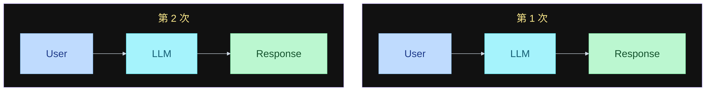

两次调用之间 **没有连线**：LLM 不持有上一轮的 prompt 或补全。

Agent scaffold / harness 会替你管这段上下文：你发一条消息 → harness 用 LLM 处理 → 拿到回复 → 把 **你的消息和回复都追加** 进它状态里的 history → 再有新消息时，把新消息接在后面，**整段再发给 LLM**。这样你在对话前半提到的事，后半还能被记住。

```text
function flow
  本轮: user message → Agent(stateful) → response
  history: message 1 .. n，结束后追加 new message + agent response
```

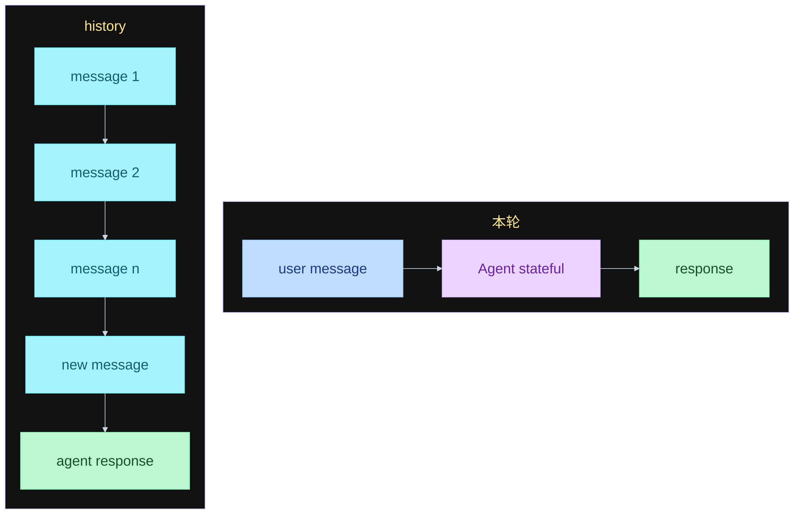

状态就是这份 `history`，在 Agent / harness 里，不在 LLM 里。本轮结束后把 new message 和 agent response 追加进去；下一轮再带整段发给 LLM。不画回边。

但这只在 **同一段会话上下文** 里有效。你新开一段对话再发消息，Agent **不会** 记得另一段会话里的事——那些内容在另一份 context 里。

要做长期记忆，就要在会话旁边再挂一个 **外部服务**：从你做过的 **每一段** 对话里存东西；Agent **每一轮** 去查这份长期记忆，用它已经知道的、关于你和关于它自己的事实来回答。这份存储 **独立于** 会话记忆。

```text
function flow
  会话记忆: 每轮把 user + assistant 追加进 history，整段再发给 LLM
  长期记忆: 独立于会话的外部存储，每轮检索，跨会话持久
```

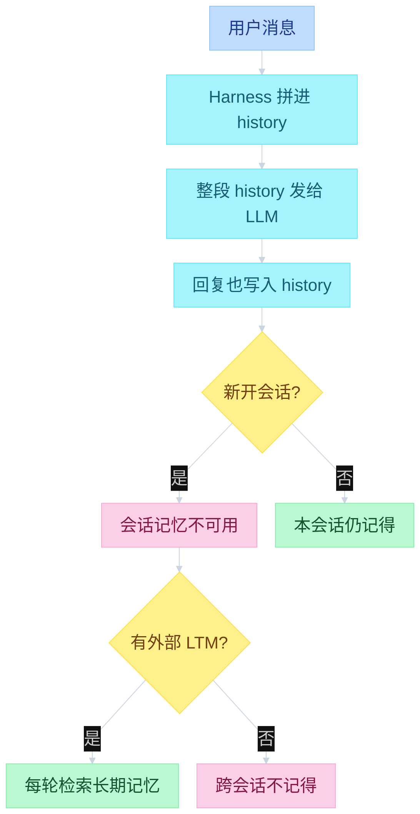

长期记忆要生效，必须 **放在会话外面**：不要和 session 写在同一个文件、同一套 store 里；要 **跨 session 持久**，也就是和你存 sessions 的地方分开。

这也意味着：若记忆是 **以用户为中心** 的，同一份记忆可以给 **多个 Agent** 用。例如你自己的口味、正在做的项目，可以在 ChatGPT、Claude、Pi 等不同 Agent 之间共享。

理想情况下，你要给 Agent **探索自己记忆的工具**；或者至少在 **每一轮 Agent turn** 上自动做写入和检索——至少也要在 **每段对话结束之后** 做一次。

---

## 2. Mem0 用的三套存储

Mem0 主要用 **三套 store**。先看总览：Main 是记忆正文 + 元数据；Entity 也是向量库，实体 **linked** 回 Main；SQLite 只做 log 和最近 10 条。实体链到 Main 写在节点上，不绕回 Mem0。

两个实现细节先记住（源码 `main.py`）：

- **实体库不是另一套独立服务**，它是 **同一个向量库 provider 的第二个 collection**，而且是 **懒加载**——第一次用到实体时才创建（L513-514、L559-580）。默认向量库是 **Qdrant**。
- **SQLite 恒定存在**：`Memory` 初始化时无条件创建，默认落在 `~/.mem0/history.db`（L500；`configs/base.py` 的 `history_db_path`）。

```text
function flow
  Mem0 → Stores
    Main memory: Vector DB + Memories/metadata
    Entity memory: Vector DB + Entity linked → Main
    SQLite: log + latest 10 messages
```

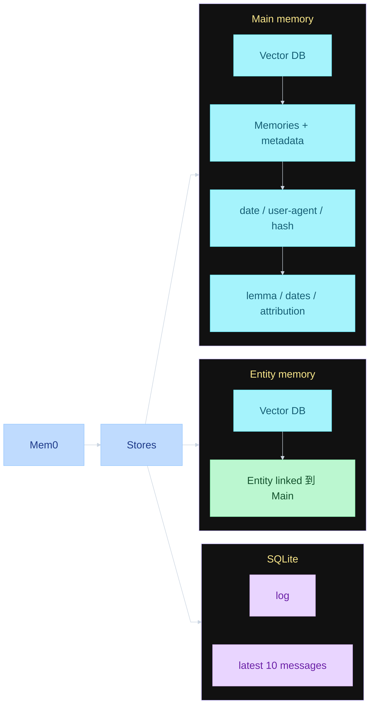

### 2.1 主记忆（Main memory，向量库）

所有记忆正文都存在这里：短段落或短句，再加上元数据。记忆本身也在这套 **向量库** 里。

例子：`用户更喜欢素食餐厅`。

元数据大致包括：

- **创建日期**；以及创建 / 更新时间（`created_at` / `updated_at`）
- **归属**：属于用户还是属于 Agent（`user_id` / `agent_id`，外加 `attributed_to`）。用户侧例如「更喜欢素食餐厅」；Agent 侧例如学到时事、或学会某种新流程
- **记忆正文的 hash**：只用于 **去重**（`hash`，正文的 md5）
- **词形还原（lemmatized）版本**：主要给后面的 **关键词检索** 用（`text_lemmatized`）
- **过期日期**（`expiration_date`）
- **谁创建的这条记忆**（attribution，`actor_id` + `role`）：若有多个 Agent，记下是哪一个写进去的

这就是主记忆店：向量 store。

### 2.2 实体库（Entity store / entity memory）

Mem0 会从主记忆里抽出实体——地点、专有名词、人名等——存进 **另一套向量库**。库里每个点是一个实体；实体的元数据链到 **一条或多条** 主记忆。

**抽取用的是 spaCy，不是 LLM。** 这件事由 `mem0/utils/entity_extraction.py` 完成：spaCy 模型 `en_core_web_sm` 负责，产出四类实体 `PROPER` / `QUOTED` / `TOPIC` / `IDENTIFIER`（专有名词、引号内文本、名词短语、技术标识符）。spaCy 没装或模型加载失败时，`extract_entities` 直接返回空列表——**实体库这条链路会静默失效**，检索退化成「语义 + BM25」。装法见 5.4。

**复用条件**：写入时先按归一化文本精确匹配已有实体；匹配不到再做语义检索，**只有相似度 ≥ 0.95 才复用**该实体点，并把新记忆 id 追加进它的 `linked_memory_ids`；否则新建一个实体点（`main.py` L605-650）。

例子：主记忆是「我在巴黎最喜欢的街区是蒙马特（Montmartre）」→ 实体可以是「巴黎的蒙马特」。你之后问巴黎相关的问题，会先检索到 Paris 这个实体，再看到链到该实体的全部记忆，其中就包括「最喜欢的街区是蒙马特」。

```text
function flow
  写入: 我在巴黎最喜欢的街区是蒙马特 → 抽出实体 → Paris → 链回这条主记忆
```

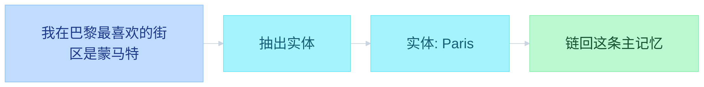

```text
function flow
  检索: 问巴黎 → 命中实体 Paris → 带回链上的这条主记忆
```

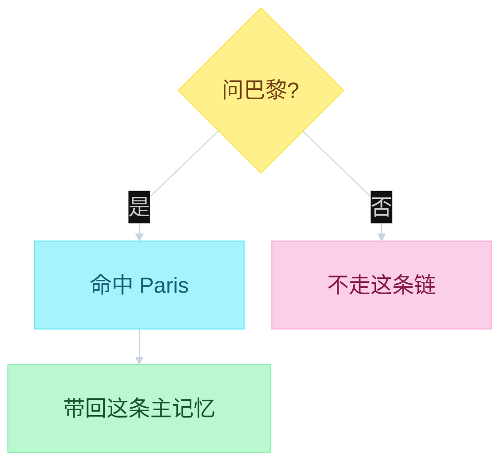

一个实体可以挂多条主记忆；问到该实体时，链上的记忆一起被看见。

⚠️ **但「一起被看见」不等于「实体库负责召回」**：检索时候选池 **只由主向量库的 ANN 产生**，实体库只给 **已经在池里** 的记忆加分（`main.py` L1677、L1733）。只挂在某实体上、又没被语义检索命中的记忆，**永远浮不上来**。机制细节见 4.2 第 5 点。

### 2.3 SQLite（Mem0 存储架构的账本，不是第三种记忆）

这一节说的是 **Mem0 三套 store 里的第三块**，不是另一种记忆类型。前两块才是记忆正文：主记忆向量库、实体向量库。SQLite 是它们旁边的 **本地账本**，干两件并列的事，彼此没有先后：

1. **变更日志**：主记忆 / 实体库里每次增、改、删，都留一条流水。向量库负责「现在有什么、怎么搜」；日志负责「曾经改过什么」。对账、回放、查一条记忆怎么来的，看这份历史。
2. **最近 10 条消息**：每次写入 pipeline 被触发，把送进去的消息写入 SQLite，**只留最新 10 条**。抽记忆的 LLM 会读这 10 条，用来消解代词、接上话头。例如新消息是 `it is great` / `he's really good at this`，单独看不知道 `it` / `he` 指谁；带上前几轮，才敢写成「用户更喜欢素食餐厅」这种记忆。

一句话：**日志记向量库怎么变；最近 10 条给抽取器看此刻在聊什么。** 两者都不是长期记忆正文，正文和检索仍走前面两套向量库。

对应到源码，SQLite 里就是两张表（`mem0/memory/storage.py`）：

| 表 | 字段 | 用途 |
|---|---|---|
| `history` | `id, memory_id, old_memory, new_memory, event, created_at, updated_at, is_deleted, actor_id, role` | 变更日志 |
| `messages` | `id, session_scope, role, content, name, created_at` | 最近消息 |

两个细节：

- **10 条是硬编码**，而且按 `session_scope`（由 user_id / agent_id / run_id 拼出的作用域）分片：写入后立刻 `DELETE … ORDER BY created_at DESC LIMIT 10`，超出的直接删掉（`storage.py` L279-291）。读取走 `get_last_messages(scope, limit=10)`，返回按时间升序（`main.py` L920）。
- **没抽到记忆也会存**：抽取返回空列表时依然调用 `save_messages`（`main.py` L988、L1042）。所以这 10 条反映的是「最近喂过什么」，不是「最近存了什么记忆」。

```text
function flow
  主记忆: 短句记忆 + 元数据（日期 / 用户或 Agent / hash / lemma / 过期 / 创建者）
  实体库: 实体向量点 → 实体向量库；同时实体数据链到主库
  SQLite: 变更日志、最近 10 条消息（两件并列，无先后）
```

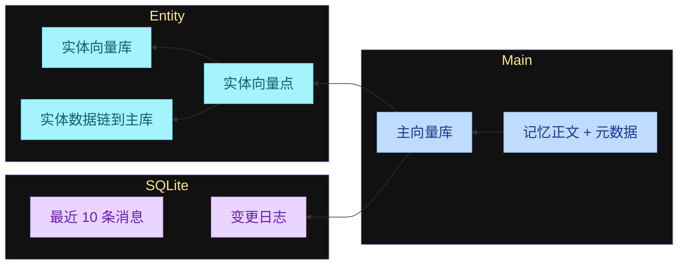

---

## 3. 写入（Ingestion）

写入在 Agent **想存新记忆** 时跑，并且是在 **每一轮 Agent turn 之后** 执行：你让 Agent 做事，它做完这一轮（继续任务或收尾），把这一轮产生的消息送进这条 pipeline。输入就是 **messages**。

消息变成库里的记忆，主要有 **三种** 方式。

### 3.1 方式一：程序性记忆（procedural memory）

吃进一批消息，**总结** Agent 做的过程 / 动作，方便以后检索并复现同一套流程。适合：Agent 刚做完一件事，你希望它精确记得用了哪些 tool call、拿到了什么结果。

触发条件很硬：`add()` 必须**同时**传 `agent_id` 和 `memory_type="procedural_memory"`，否则直接抛校验错误（`main.py` L831-853）。流程是：`PROCEDURAL_MEMORY_SYSTEM_PROMPT` + 本批 messages + 固定尾句「Create procedural memory of the above conversation.」→ 一次 LLM 调用 → **只落一条**记忆（`main.py` L1993-2036）。它走 `_create_memory` 直存，**不经过实体链接**——procedural 记忆不会在实体库里留点。

这条现在不太常用——直接从对话记录里抽一条 **skill**，通常更好。

### 3.2 方式二：`infer = false`

把送进 pipeline 的输入消息 **直接 embed，原样写入数据库**，存的就是消息本身。三个细节（`main.py` L880-914）：

- `role == "system"` 的消息**跳过**
- 消息带 `name` 字段时，会写成该条记忆的 `actor_id`
- **无 LLM、无 hash 去重、无实体链接**——纯粹的「存原文」

### 3.3 方式三：`infer = true`（本文重点）

触发 **LLM 抽取 pipeline**，这是给长期 Agent 做记忆更精细、更进阶的做法。

一个 turn 里往往既有对话，也有 tool call。它们不是两种写入方式，而是 **同一份输入**：turn 结束后，把从 user 到 final answer 的整段 messages 一次性交给 `infer=true`。LLM 从整段里抽短句事实；tool 过程**不会**再单独跑一遍 procedural。

### 3.3.1 `infer=true`：整轮 messages 怎么抽

假设这一轮结束后，送进管线的内容是：

```text
user 消息
  → assistant（可能带 tool_calls）
  → tool 结果
  → …再几轮 loop…
  → assistant final answer
```

中间 loop 写在节点上，不连回起点。

```text
function flow
  输入: 整轮 turn 的 messages（含 tool），不是只抽 user 一句
```

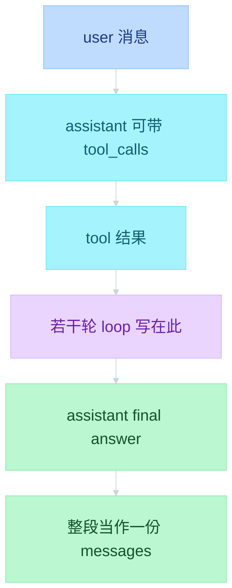

`infer=true` 吃的是上面那份 `PACK`，不是三种方式各存一次。

⚠️ **但 `PACK` 不等于「整轮所有消息」**：真正进抽取的是 `parse_messages()` 的输出，它只保留 **system / user / assistant 的文本 content**（源码 `mem0/memory/utils.py`）：

- `content is None` 的消息（assistant 带 `tool_calls`、没有文本）→ **丢弃**
- `role == "tool"` 的消息（工具返回值）→ **没有对应分支，完全不进**
- system 消息会以 `system: …` 前缀拼进去

也就是说：**tool 调用与 tool 结果根本不参与抽取**，只有对话文本参与。这一点常被解读文章写反。

```text
function flow
  messages 进抽取前先过 parse_messages:
    system / user / assistant 有文本 content → 拼成 "role: content" 一行
    content = None（assistant 带 tool_calls）→ 丢
    role = tool（工具结果）→ 丢
```

```text
function flow
  infer=true: 整段 messages → 加载抽取上下文 → LLM 吐 JSON → 主记忆
  主记忆落库后: 抽实体进实体库；SQLite 记近 10 条和变更日志
```

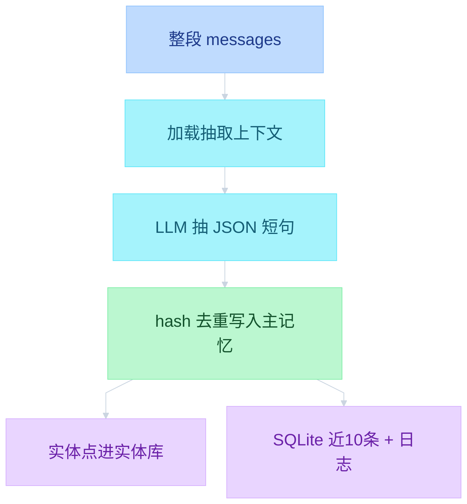

上下文里会拼：抽取器角色、用户摘要、这份 messages、主库里的相关记忆、SQLite 最近 10 条、对话日期和当前日期。**其中「用户摘要」和「对话日期」在开源版是空的 / 等于今天，详见 3.3.2。**

设好 `infer = true` 并把输入消息送进写入管线之后：

### 3.3.2 抽取的 sys prompt 长什么样

`infer=true` 只做 **一次 LLM 调用**，两段 prompt 拼起来：

| 段 | 内容 | 官方位置 |
|---|---|---|
| system | `ADDITIVE_EXTRACTION_PROMPT` | `mem0/configs/prompts.py` L468-946（**33,699 字符**） |
| user | `generate_additive_extraction_prompt(...)` 拼出的 7 段 | 同文件 L1016 |

调用时带 `response_format={"type": "json_object"}`，强制 JSON 输出（`main.py` L956-962）。

**先纠正一个常见误解**：网上多数解读引用的是老版 `FACT_RETRIEVAL_PROMPT`（"Personal Information Organizer"，输出 `{"facts": [...]}`）+ `DEFAULT_UPDATE_MEMORY_PROMPT`（ADD / UPDATE / DELETE / NONE 四操作）。这两个 prompt **仍留在 prompts.py 里**（L15-61、L176-325），但 **当前 `main.py` 里零引用**——现在的开源版只有「ADD 一种操作」。

#### system prompt 的骨架（43 个小节）

```text
function flow
  # ROLE                         Memory Extractor，唯一操作 = ADD
  # INPUTS
    ## New Messages / ## Summary / ## Recently Extracted Memories
    ## Existing Memories / ## Last k Messages
    ## Observation Date / ## Current Date / ## Optional Inputs
  # GUIDELINES
    ## What to Extract
      ### Casual Topics Are Still Extractable
      ### Extract Incidental Facts, Not Just Requests
      ### Shared Photos and Images
    ## Memory Quality Standards
      ### Contextually Rich, Not Atomic
      ### Clean Factual Statements
      ### Self-Contained
      ### Concise but Complete (15-80 words, up to 100)
      ### Temporally Grounded
      ### Numerically Precise
      ### Preserve Specific Details — Never Generalize
      ### Meaning-Preserving
    ## Integrity Rules
    ## Memory Linking
  # EXAMPLES                     Example 1/2/3/5/6/7/8/9/10/11/12（官方文件没有 Example 4）
  # CRITICAL: Exhaustive Extraction Checklist
  # OUTPUT FORMAT
    ## Structure / ## Fields / ## Rules
```

三条硬规则（原文要点）：

- **只做 ADD**：`Your sole operation is ADD`——不输出 UPDATE / DELETE
- **要「上下文丰富」，不要原子化**：`Contextually Rich, Not Atomic`、`Self-Contained`、`Concise but Complete (15-80 words, up to 100)`——抽出来的是完整事实句，不是碎词
- **必须穷尽**：`CRITICAL: Exhaustive Extraction Checklist` 要求逐条扫完所有消息；10+ 轮对话通常应抽出 5-15 条，少于 3 条基本就是漏抽

#### 输出契约（原文）

```json
{
  "memory": [
    {"id": "0", "text": "First extracted memory", "attributed_to": "user",
     "linked_memory_ids": ["uuid-of-related-existing-memory"]}
  ]
}
```

| 字段 | 必填 | 说明 |
|---|---|---|
| `id` | ✅ | 字符串序号，从 `"0"` 开始 |
| `text` | ✅ | 自包含事实句，15-80 词 |
| `attributed_to` | ✅ | `"user"` 或 `"assistant"` |
| `linked_memory_ids` | 可选 | 关联的既有记忆 id（`## Memory Linking` 段规定何时链） |

#### user prompt 模板（7 段）

```markdown
## Summary                      ← 用户画像摘要
## Last k Messages              ← SQLite 最近 10 条
## Recently Extracted Memories  ← 本轮已抽过的（去重参照）
## Existing Memories            ← 主库相关记忆 [{"id","text"},...]
## New Messages                 ← 本轮 messages（"role: content"，单条截断 300 字符）
## Observation Date             ← 事件发生日
## Current Date                 ← 今天
## Custom Instructions          ← 可选
## Language Requirement         ← 可选
# Output:
```

#### OSS 实际填了哪些段

`add()` 只传了四个参数（`main.py` L948-953）：

| 段 | OSS 是否填 | 说明 |
|---|---|---|
| Summary | ❌ 空 | 平台版字段 |
| Last k Messages | ✅ | SQLite 最近 10 条 |
| Recently Extracted Memories | ❌ 空 | 平台版字段 |
| Existing Memories | ✅ | 主库 `top_k=10` 检索结果，id 被映射成 `"0".."9"` |
| New Messages | ✅ | `parse_messages` 输出 |
| Observation Date | ⚠️ = 今天 | 没传 `timestamp`，缺省即今天 |
| Current Date | ✅ | 今天（UTC） |
| Custom Instructions | ✅ | `prompt` 参数或 `custom_instructions` 配置 |

所以「用户摘要」和「本轮已抽」在开源版是**空标题段**；prompt 里 Example 7 讲的「历史观测日期」在开源版也拿不到（见 3.4 第 6 点）。

> 全文 33,699 字符不在此处复制。要逐字读，按 `prompts.py` L468-946 取。

### 3.4 加载近期上下文（load recent context）

抽取由 LLM 完成：把这些消息交给 LLM，让它吐一份 **结构化 JSON**，里面是抽出来的全部记忆。为此 LLM 需要非常具体的 prompt，以及关于用户、关于当前在谈什么的上下文，才能抽出相关记忆。

Prompt / 上下文里有：

1. **角色**：memory extractor
2. **用户摘要（user summary）** —— ⚠️ 开源版**不填**（平台版字段）
3. **本次输入的 messages**
4. **相关记忆（relevant memories）**：把 messages **展平（flatten）成一根字符串**，对这批消息做 embedding，再在已有库里搜与之相关的记忆，把命中的相关记忆也拼进 context。相关记忆来自 **主向量库**。条数是 **`top_k=10`**（注意：不是检索那一步的 60）；传进 prompt 前会把 UUID **映射成 `"0"`～`"9"` 整数**，避免 LLM 编造 id（`main.py` L925-938）
5. **最近 n 条消息**，理想是 **最近 10 条**，来自前面说的 **SQLite**。每次触发这条 pipeline，都会把该消息写入 SQLite，并且 **只保留最新 10 条**。用途是消解代词：新消息里若有 `it is great`、`he's really good at this`，没有前几句就不知道 `it` / `he` 指谁
6. **对话日期** 和 **当前日期** —— ⚠️ 开源版**两个都等于今天（UTC）**：`add()` 的 `timestamp` 参数在 OSS **直接抛错**（`main.py` L817-818），而 L948-953 又没传日期，`_resolve_dates` 的缺省就是今天。所以 prompt 里 Example 7 的「历史观测日期」能力在开源版是**失效**的

然后 prompt 导出那份 JSON，作为要导入系统的记忆。

例子：抽到 `用户更喜欢素食餐厅`。

### 3.5 入库

这条记忆写入主记忆 store，带上：

- 添加或更新的日期
- 来自用户还是 Agent
- **hash（md5），并与已有记忆做去重**。这里是 **hash 去重**，只对 **措辞完全相同** 的记忆有效。⚠️ 范围要注意：比对的只是 **本次检索出来的 top-10 条已有记忆** 的 hash + **本批内已出现过的 hash**，**不是全库扫描**（`main.py` L1005-1024）
- **词形还原版本**：整句 lemmatize，和记忆正文一起存，供之后关键词检索（`text_lemmatized`）
- **`attributed_to`**：这条记忆是「关于用户」还是「关于 Agent」，由抽取 LLM 直接给出
- **`linked_memory_ids`**：这条记忆关联到哪些已有记忆（V3 新增的「记忆互联」，由 prompt 的 `## Memory Linking` 段决定）

⚠️ **两个 V3 变化要记住**：

- **写入只有 ADD**：批量写 `history` 时 `event` 恒为 `"ADD"`、`old_memory` 为 `None`（`main.py` L1065-1075）。老版那套 ADD / UPDATE / DELETE / NONE 四操作已经被移出调用链，**「更新」现在靠 LLM 在抽取阶段做语义去重**，不再单独调一次 LLM 做决策。
- **整条管线是批量的**：源码里写着 `# === V3 PHASED BATCH PIPELINE ===`（`main.py` L916），分 Phase 0-7——收集上下文 → 一次 LLM 抽取 → 批量 embed → hash 去重 → 批量写向量库 → 批量写 history → 批量抽实体并链接。不是逐条处理。

同时写入 **SQLite**，用来跟踪最近送进 pipeline 的消息。

最关键的一步是 **基于 LLM 的抽取**。可以用很小的模型。开源版默认 `provider="openai"` 但**不指定模型**；官方 LLM reranker 的默认才是 **`gpt-5-mini`** 这一档。你也可以用很小的开源模型在自己机器上免费跑，因为任务直白、简单。本地模型推荐见文末。

```text
function flow
  本轮消息
    → procedural: 总结过程 / tool call（现多被抽 skill 替代）
    → infer=false: 直接 embed 入库
    → infer=true: 加载上下文 → LLM 抽 JSON → hash 去重 + lemma 入库
  抽取上下文 = 角色 + 用户摘要 + 本批消息 + 主库相关记忆 + SQLite 最近 10 条 + 日期
  OSS 实际: 用户摘要为空、两个日期都=今天（见 3.3.2）
```

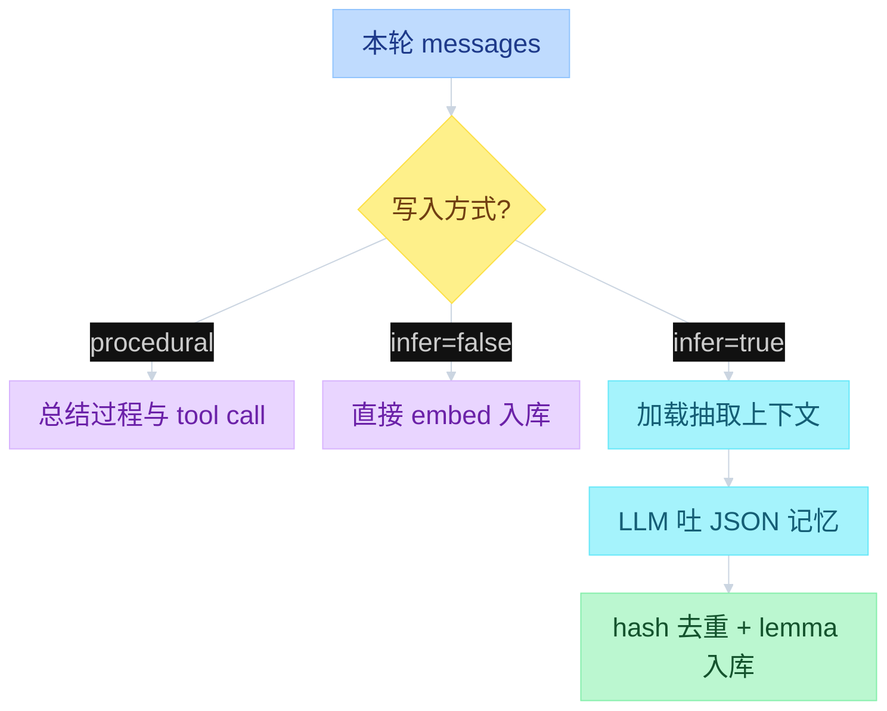

---

## 4. 检索（Retrieval）

检索 = 针对当前话题拿出 **相关记忆**。有两个时机，**后面的检索管线相同**，差别只在谁触发 Memory search。

### 4.0 记忆如何进入一个 turn

Retrieval lifecycle：记忆怎样进入 **一个 Agent turn**。四步一样，两种入口。

```text
function flow
  Explicit tool call: Agent 自己调 search memory
  Automatic retrieval: 用户一发消息就自动搜
  四步: User query → Memory search → Relevant context → LLM response
```


上图对应 **Explicit tool call**：① 用户提问后，Agent 决定调记忆工具，② 才是 Memory search。

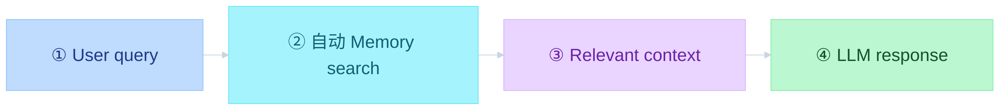

上图对应 **Automatic retrieval**：① 用户消息本身当 query，harness 自动搜，③ 拼进 context，④ 再交给 LLM。② 的内部怎么出池、打分，见 4.2。

### 4.1 输入参数

- **query**：在谈什么。若是用户消息，用户消息本身就是 query。这一步可以做 **query rewriting**，对管线很有用。**Mem0 默认不做**，要在 **harness 侧** 自己加
- **top K**：一次检索要多少条记忆，例如 10
- **threshold**：能进「相关记忆」列表的 **最低分数**
- **identity（身份，不是 ID）**：这些记忆是关于 **Agent**、关于 **用户**，还是关于 **这一次 run**。Agent 记忆可以是它从世界学到的东西、或某些办事流程；用户记忆是偏好、过往经历等

落到 API 上有一条硬约束：`search()` 的 `filters` **必须至少带 `user_id` / `agent_id` / `run_id` 之一**，否则直接报错；而且这些 id 只能写在 `filters` 里，**不能**像 `add()` 那样当顶层参数传（`main.py` L800-802、L1379）。

### 4.2 管线

1. **embed query**：必须用 **和建向量库时同一个 embedding 系统 / 同一个 embedding 模型**。可以用开源模型在本地跑。Mem0 默认用闭源模型；你也可以全程本地、开源 embedding。
2. 在主向量库里检索 **语义相近** 的记忆，用 **ANN（近似最近邻）**。
3. **候选池大于 top K**，因为后面要 **重排（re-ranking）**，池子越大重排越好，再从大池里选出真正的 top K。实际召回条数是 **`topK × 4` 和 `60` 取较大者**。top K = 10 时，向量检索实际拿出 **60** 条。**候选池只由这一路语义检索产生**：关键词匹配和实体加分都只在这 60 条上打分，**不能往池子里再加新记忆**（`main.py` L1648、L1677）。
4. **关键词匹配分（keyword matching score）**：query 先做词形还原；记忆元数据里已经存了 lemma（`text_lemmatized`）。比的是 **词重叠**，算法是 **BM25**，最后用 **logistic sigmoid** 映射成 **0～1**：`1 / (1 + exp(-steepness × (raw − midpoint)))`。中点与陡度按 **query 词数自适应**（`scoring.py` L16-53）：

   | query 词数 | midpoint | steepness |
   |---|---|---|
   | ≤3 | 5.0 | 0.7 |
   | ≤6 | 7.0 | 0.6 |
   | ≤9 | 9.0 | 0.5 |
   | ≤15 | 10.0 | 0.5 |
   | >15 | 12.0 | 0.5 |

   ⚠️ 这一路**依赖向量库实现 `keyword_search`**：默认的 Qdrant 用原生 **BM25 sparse 命名向量**（`using="bm25"`，输入就是 `text_lemmatized`）；没实现的库会打 warning 并**关闭 hybrid**，此时这一路整体缺席（`main.py` L543-550、`vector_stores/qdrant.py` L454-484）。
5. **实体加分（entity boost）**：先从 query 抽实体（去重后**最多 8 个**）→ 批量 embed → 在实体库里搜（`top_k=500`、4 线程并发）→ **只保留相似度 ≥ 0.5 的实体命中** → 命中的实体带着链到它们的记忆 → **只对已经在初始 60 条（初始 top K 池）里的记忆生效**，给额外分。公式（`main.py` L1733+）：

   ```text
   num_linked          = max(链到该实体的记忆条数, 1)
   memory_count_weight = 1 / (1 + 0.001 × (num_linked − 1)²)
   boost               = 实体相似度 × 0.5 × memory_count_weight
   同一条记忆取所有实体的最大值
   ```

   要点：链到该实体的记忆 **越少，分越高**（上限 0.5）：

   | 该实体挂了几条记忆 | `memory_count_weight` | boost 上限 |
   |---|---|---|
   | 1 | 1.000 | 0.500 |
   | 10 | 0.925 | 0.462 |
   | 50 | 0.294 | 0.147 |
   | 100 | 0.093 | 0.046 |
   | 1000 | 0.001 | 0.0005 |

   实体是 Paris 且挂了 1000 条 → 加分几乎为 0；只挂 2 条 → 更可能和当前要检索的东西相关，分会更高、更靠近 0.5。
6. **三路相加，除以「当前激活信号的满分」**。向量分 0～1 + 关键词分 0～1 + 实体分 0～0.5。⚠️ **除数不是固定 2.5，而是自适应**（`scoring.py` L78-84）：

   | 激活的信号 | `max_possible` |
   |---|---|
   | 只有语义 | 1.0 |
   | 语义 + BM25 | 2.0 |
   | 语义 + BM25 + 实体 | **2.5** |
   | 语义 + 实体（无 BM25） | 1.5 |

   `combined = min((语义 + BM25 + 实体) / max_possible, 1.0)`，再按这个分取真正的 **top K** 返回。
7. **threshold 卡的是「语义分」，而且卡在融合之前**：`if semantic_score < threshold: continue`（默认 `threshold=0.1`）。一条记忆语义分低于阈值，**BM25 和实体加分再高也会被直接丢掉**（`scoring.py` L111）。
8. 调试用 `search(..., explain=True)`：每条结果会带 `score_details`（`semantic_score` / `bm25_score` / `entity_boost` / `max_possible_score` / `final_score`），三路打分一眼可查。

检索比写入更绕：三条分加在一起，才排出这条 query 最相关的记忆。形态像 RAG，但召回只有语义一路。

再强调：送进这条 pipeline 的 query 可以是任意内容，通常就是你塞进来的那串。pipeline **不一定带 query rewriting**。想检索更好，建议在 harness 侧加一层：用户一问，先用 **小 LLM** 改写成更好的 query，再检索。

这是一套 **RAG**：先召回、再打分、再截断。但 **不是**「语义检索 ∥ 关键词检索 → cross-rank」。

关键词 / 实体 **不能往池子里加新记忆**。只有 ANN 语义检索负责出池；BM25 和实体加分是在 **同一池上并行打分**，再和语义分做 fusion（cross-rank）。

```text
function flow
  embed query → search Vector DB (ANN)
    语义分 [0, 1]，topk = max(10×4, 60)
  池内并行:
    keyword matching: q→lemma + memory→lemma → BM25 [0, 1]
    entity boost: extract from q → search Entity DB → 只留池内 [0, 0.5]
  三路满分 1 + 1 + 0.5 = 2.5；除数 max_possible 自适应（1.0 / 1.5 / 2.0 / 2.5），threshold 先卡语义分
```

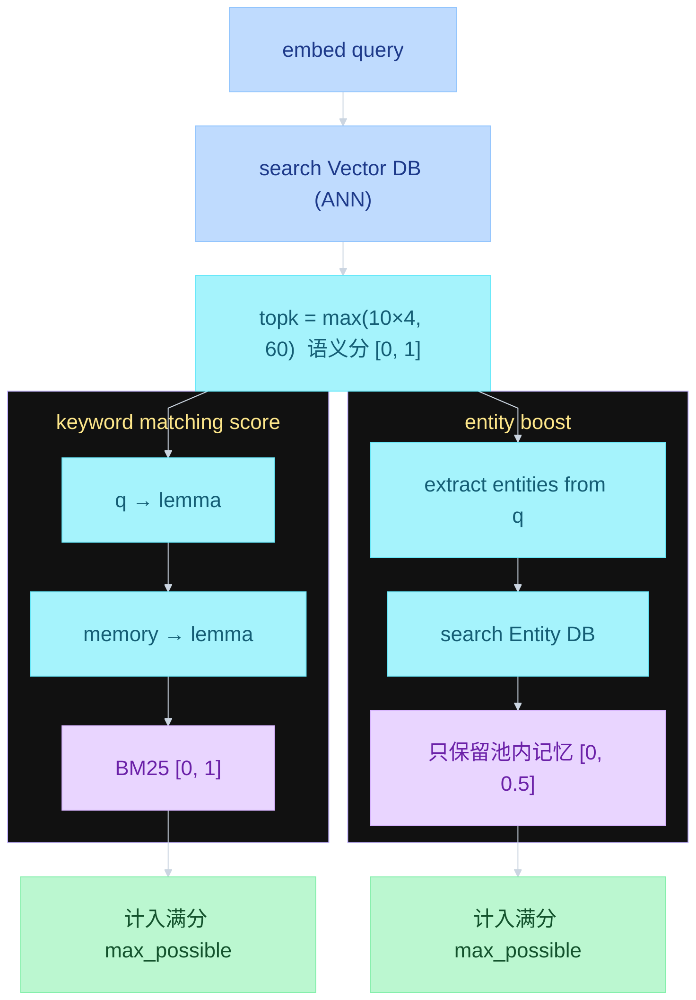

ANN 先出池；左边 BM25、右边实体加分只打这一池，不另开召回。三路各自计入 **自适应满分** `max_possible`（1.0 / 1.5 / 2.0 / 2.5），不三线汇进同一个框。Embedding 模型名单在 5.2.1 表格。

### 4.3 两种 rerank：内部分数融合 vs 外部重排模型

mem0 里「rerank」指两件不同的事，很容易混：

| | 内部三路融合 | 外部 reranker |
|---|---|---|
| 是什么 | 语义 + BM25 + 实体加分，加性融合后排序 | 用专门的 cross-encoder 模型对候选重排 |
| 触发 | **默认就开** | `search(..., rerank=True)` 且配置了 `reranker` |
| 代码 | `score_and_rank`（`main.py` L1692 调用） | `main.py` L1379 的 `search()` 内：`if rerank and self.reranker: self.reranker.rerank(query, original_memories, limit)` |
| 官方文档 | — | [reranker-search.mdx](https://github.com/mem0ai/mem0/blob/main/docs/open-source/features/reranker-search.mdx) |
| 失败行为 | — | 打 warning，**退回原始向量排序结果** |

所以 4.2 讲的那套三路打分是**内置**的；`rerank=True` 是在它之后**再加一层模型重排**，两者可以叠加。

外部 reranker 的 provider 与默认模型（官方文档）：

| provider | 默认模型 | 本地可跑 |
|---|---|---|
| `cohere` | `rerank-v3.5` | ❌ |
| `zero_entropy` | `zerank-1` | ❌ |
| `sentence_transformer` | `cross-encoder/ms-marco-MiniLM-L-6-v2` | ✅ |
| `huggingface` | `BAAI/bge-reranker-base` | ✅ |
| `llm_reranker` | `openai` / `gpt-5-mini` | 取决于 provider |

纯 CPU 环境只能用 `sentence_transformer` 或 `huggingface` 这两个本地 cross-encoder——官方文档明确写了「no API key, no network at inference time」。

配置方式：

```python
config = {
    "reranker": {
        "provider": "sentence_transformer",
        "config": {"model": "cross-encoder/ms-marco-MiniLM-L-6-v2", "device": "cpu", "max_length": 512},
    }
}
m = Memory.from_config(config)
m.search("我喜欢什么电影？", filters={"user_id": "alice"}, rerank=True)
```

⚠️ 没配置 `reranker` 时 `rerank=True` 是**空操作**（`main.py` L506-511 里 `self.reranker = None`）。

---

## 5. 全程本地、开源模型怎么选

以上就是 Mem0 工作方式里你需要知道的部分。若要用 **完全本地、开源** 把各阶段跑起来，可以到 Hugging Face 挑模型。

### 5.1 抽取（extraction）

这是最重要的环节之一，但任务相对简单，选 **小模型** 即可。

- 大约 **10 亿～120 亿参数（1B～12B）** 就够；不要低于 1B，除非你微调过
- 在 Hugging Face 勾 **Text Generation** 做筛选
- 例子：Llama、Qwen。实务上 **Qwen3 8B** 这一档比较合适，选该系列当时的最新版即可

### 5.2 Embedding

- 任务筛选勾 **Feature Extraction**，列表里大多是 embedding 模型，选你喜欢的
- 要看排名：对照 **口碑较好的 embedding 基准**（多语、英语、其它语言等都有）。例如你要偏医疗，就看医疗语境上表现更好的 embedding 榜

### 5.2.1 本地检索实用模型

下面这些 Open embedding models 给本地 retrieval 用。四条是 **备选**，不是一条流水线。`bge-m3` 的 dense + sparse 是模型自己的能力；Mem0 第 4 章仍是 ANN 语义出池，BM25 在池内打分。

| # | 模型 | 特点 |
|---|------|------|
| 01 | BAAI/bge-m3 | 多语 · dense + sparse |
| 02 | intfloat/e5-large-v2 | 英语检索强 |
| 03 | nomic-ai/nomic-embed-text-v1.5 | 长上下文 embedding |
| 04 | gte-Qwen2-1.5B-instruct | instruction-aware 检索 |

### 5.3 微调

长期做这件事，更稳的做法是 **微调自己的小模型**，效果更好，也更能本地跑。

```text
function flow
  抽取: Text Generation，约 1B~12B，例 Qwen3 8B（Mem0 云端常见 GPT-5 Mini 量级）
  向量: Feature Extraction，可对照各语言 / 领域 embedding 榜
  长期: 微调小模型，全程本地
```

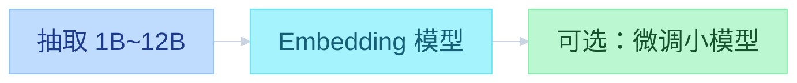

### 5.4 本地跑的前置依赖：spaCy

上面几节都默认「能跑起来」，但有一条**容易踩的硬依赖**：**spaCy 与模型 `en_core_web_sm`**。

`mem0/utils/spacy_models.py` 里，`get_nlp_full()`（实体抽取）和 `get_nlp_lemma()`（词形还原）**共用同一个模型加载器**。装不上时会静默降级：

| 缺什么 | 后果 |
|---|---|
| 实体抽取（`get_nlp_full`） | `extract_entities` 返回 `[]` → 实体库不写点、检索没有实体加分，`max_possible` 退到 1.0 或 2.0 |
| 词形还原（`get_nlp_lemma`） | `lemmatize_for_bm25` **原样返回原文** → `text_lemmatized` 退化成原文，BM25 匹配质量下降 |

安装（源码里给的两条路）：

```bash
pip install "mem0ai[nlp]"                      # 带 spaCy 依赖
python -m spacy download en_core_web_sm        # 手动装模型
```

源码会在首次使用时尝试自动下载 `en_core_web_sm`，但**离线环境或没有写权限时会失败**，所以本地部署建议提前装好。

顺带记一下官方支持的**本地** provider（`llms/configs.py` / `embeddings/configs.py`）：LLM 可选 `ollama` / `vllm` / `lmstudio` / `deepseek`；embedding 可选 `ollama` / `huggingface` / `fastembed` / `lmstudio`。

---

## 6. 收束

以上是 Agent 长期记忆的一份入门，实现用例是 **Mem0**。同类方案还有 **SuperMemory** 等，做法不同，可以对照着看。

---

## 附：核对基线与信源

本文的机制描述已对照官方开源实现逐条核对，基线为 `mem0ai/mem0` **main 分支 @ `dae67f74f5`（2026-09-04）**。逐条差异、源码行号与修改记录见同目录 **[02.mem0-核对报告.md](./02.mem0-核对报告.md)**。

| 文件 | 覆盖内容 |
|---|---|
| [`mem0/configs/prompts.py`](https://github.com/mem0ai/mem0/blob/main/mem0/configs/prompts.py) | 全部 prompt（`ADDITIVE_EXTRACTION_PROMPT` L468-946） |
| [`mem0/memory/main.py`](https://github.com/mem0ai/mem0/blob/main/mem0/memory/main.py) | 写入 / 检索主流程 |
| [`mem0/memory/storage.py`](https://github.com/mem0ai/mem0/blob/main/mem0/memory/storage.py) | SQLite 表结构与淘汰逻辑 |
| [`mem0/utils/scoring.py`](https://github.com/mem0ai/mem0/blob/main/mem0/utils/scoring.py) | 三路融合打分 |
| [`mem0/utils/entity_extraction.py`](https://github.com/mem0ai/mem0/blob/main/mem0/utils/entity_extraction.py) + [`spacy_models.py`](https://github.com/mem0ai/mem0/blob/main/mem0/utils/spacy_models.py) | 实体抽取 |
| [`mem0/vector_stores/qdrant.py`](https://github.com/mem0ai/mem0/blob/main/mem0/vector_stores/qdrant.py) | BM25 sparse 实现 |
| [`docs/open-source/features/reranker-search.mdx`](https://github.com/mem0ai/mem0/blob/main/docs/open-source/features/reranker-search.mdx) | 外部 reranker |

> 以上结论只对**开源版**负责；平台版（`platform/backend`）实现不同，未在核对范围。
